# 💻 Visão Geral da Plataforma 2.3.0

## Características da plataforma

A ArqSign é uma plataforma para assinaturas eletrônicas que funciona da seguinte forma: o usuário carrega o documento, escolhe os signatários, estabelece as assinaturas e realiza o envio aos envolvidos no processo de assinatura.

O usuário pode acessar os documentos enviados e recebidos para assinatura a qualquer hora, de qualquer lugar, em qualquer dispositivo – celular, computador, tablet – sem perder a segurança e a criptografia dos dados, conforme a LGPD (Lei Geral de Proteção de Dados).

A ArqSign conta com a implementação de API (Interface de Programação de Aplicações), permitindo que o usuário integre sua Assinatura Eletrônica e Digital de Documentos às soluções de sua empresa.

A principal funcionalidade da plataforma ArqSign é oferecer aos usuários a possibilidade de enviar, gerenciar, coletar e assinar documentos digitalmente, por meio de assinaturas eletrônicas ou certificados digitais.

O signatário, pode assinar os documentos através de e-mail, WhatsApp ou sua conta ArqSign caso tenha.


<mark style="color:blue;">**ASSINATURA ELETRÔNICA X ASSINATURA DIGITAL (ICP Brasil e Outros certificados digitais)**</mark>

<mark style="color:blue;">Assinatura eletrônica é aquela que não precisa de um certificado digital. É mais utilizada para assinar contratos e documentos entre entes privados (B2B, B2C).</mark>

<mark style="color:blue;">Assinatura digital é aquela que precisa de um certificado digital. É mais utilizada para emissão de notas fiscais e para transações com o governo.</mark>

<mark style="color:blue;">Na Plataforma Arqsign, ao configurar um fluxo de assinaturas você pode determinar qual tipo de assinatura deverá ser executada por destinatário escolhendo entre:</mark>

<mark style="color:blue;">a) Assinatura eletrônica: A ArqSign produz assinaturas eletrônicas avançadas com validade jurídica de acordo com MP 2.200-2 de 24/08/2001 e Lei 14.063 de 23/11/2020). Sempre que um signatário assina um documento de forma eletrônica a Arqsign aplica um certificado digital próprio da plataforma, capturando o Hash (identificação única) do arquivo, verificando a integridade do arquivo e anexando ao certificado a identificação do signatário.</mark>

<mark style="color:blue;">b) Assinatura digital – ICP-Brasil ou ICP Outros: A ArqSign produz assinaturas digitais qualificadas de acordo com MP 2.200-2 de 24/08/2001 e Lei 14.063 de 23/11/2020). Quando o usuário já possui um certificado digital e deseja utilizá-lo para realizar a assinatura por meio da ArqSign, este certificado é utilizado para verificar a integridade da assinatura e identificar o usuário como signatário no documento.</mark>


***

### Usuário e Signatário

Usuário é a pessoa que utiliza a Plataforma ArqSign para enviar, acompanhar fluxo, coletar assinaturas, acessar e gerir documentos. Um usuário tem que estar atrelado à uma conta ou quando ele também tem que assinar um documento ele se torna um signatário.

Na plataforma ArqSign um usuário pode ter os seguintes perfis:

* **Remetente de Documentos:** Usuário sem permissão de acesso às funcionalidades de gestão da plataforma. Seu acesso é focado no envio e gestão de seus documentos.
* **Administrador Global:** Usuários com permissão de acesso a todas as funcionalidades da plataforma inclusive gestão de pastas e usuários.

Signatário é uma pessoa física ou jurídica que participa do processo de assinatura (assina um documento). O signatário não precisa ter conta ou usuário na Plataforma ArqSign para assinar um documento.

***

### Site da plataforma ArqSign

O site da ArqSign ([https://arquivar.com.br/arqsign/](https://arquivar.com.br/arqsign/)) apresenta todas as informações e funcionalidades da plataforma, além das características dos planos de assinatura. Na homepage o usuário também terá acesso à página de login da plataforma e à criação de uma conta teste grátis.

<figure><figcaption>
Clique na imagem para ampliar.
</figcaption></figure>

***

### Suporte técnico e atendimento ao cliente

Para solicitar suporte ou atendimento, no menu inferior da página, clique em “Suporte”.

<figure>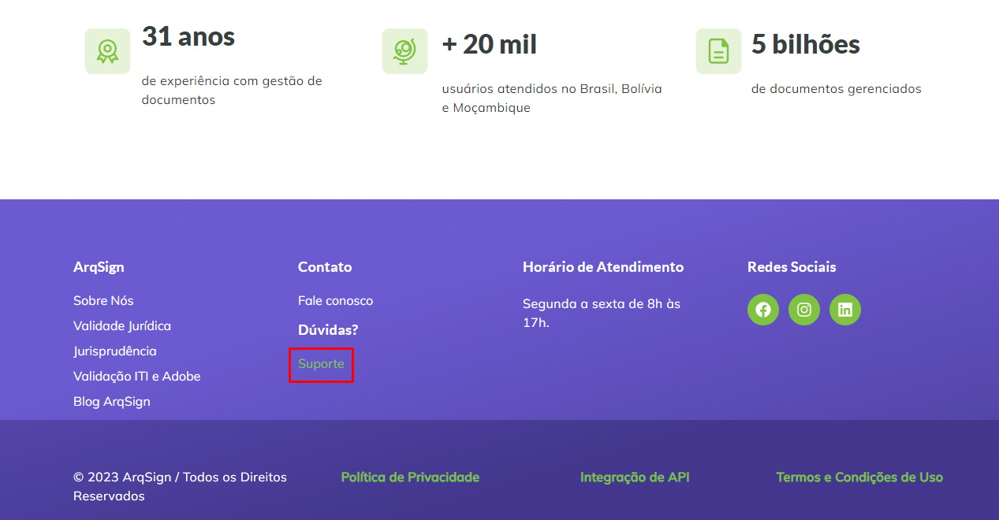<figcaption>
Clique na imagem para ampliar.
</figcaption></figure>

O usuário será direcionado para a Central de Ajuda da plataforma, onde poderá pesquisar entre os conteúdos postados a solução para a sua dúvida ou solicitar contato com a equipe de atendimento.

<figure>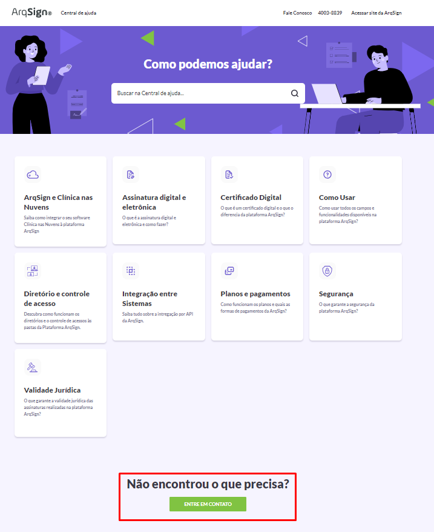<figcaption>
Clique na imagem para ampliar.
</figcaption></figure>

O contato com a equipe de atendimento poderá ser feito via WhatsApp, chat, e-mail (faleconosco@arqsign.com) ou telefone (4003-8839).

<figure>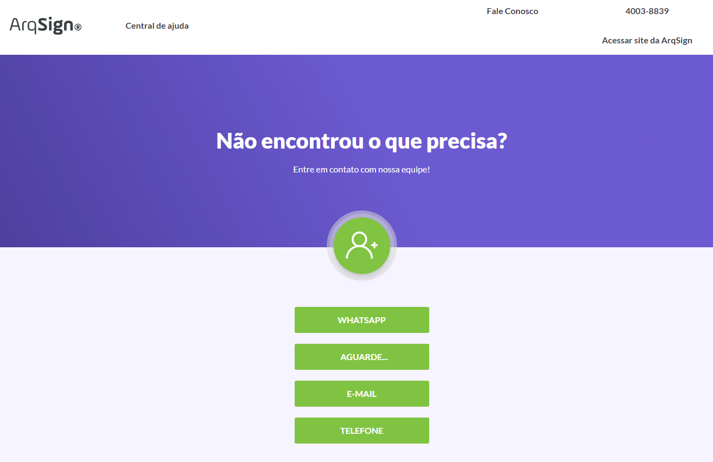<figcaption>
Clique na imagem para ampliar.
</figcaption></figure>

Depois de autenticado, o usuário poderá também contar com o menu de suporte na plataforma, localizado no canto inferior direito da tela.

<figure>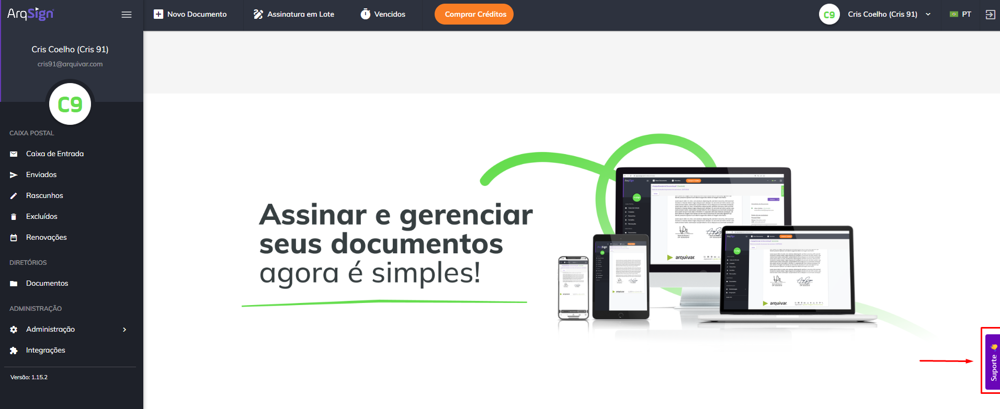<figcaption>
Clique na imagem para ampliar.
</figcaption></figure>

***

## Características dos planos de assinatura

### Plano gratuito

A conta de teste gratuito da Plataforma ArqSign oferece ao usuário quase todas as funcionalidades e recursos da conta paga, incluindo envio de documentos para assinatura com ou sem certificado digital, criação de pastas dedicadas para gestão de documentos, importação de certificado digital ICP-Brasil A1 e integração com outros sistemas. Durante um período de 15 dias o usuário poderá realizar cinco envios de documentos para assinatura de forma gratuita.


<mark style="color:orange;">**Na conta de teste grátis não é permitida a inclusão de outros usuários, ou seja, somente o proprietário pode acessar e gerenciar os documentos enviados e recebidos para assinatura.**</mark>

<mark style="color:orange;">**A criação de conta teste grátis é permitida a qualquer usuário que não possua e-mail cadastrado a outros testes grátis da plataforma ArqSign.**</mark>


#### Criação de Conta Teste Grátis

1\. Para criar uma conta teste grátis, na página inicial do site da plataforma ArqSign, clique em “Teste Grátis”.

<figure>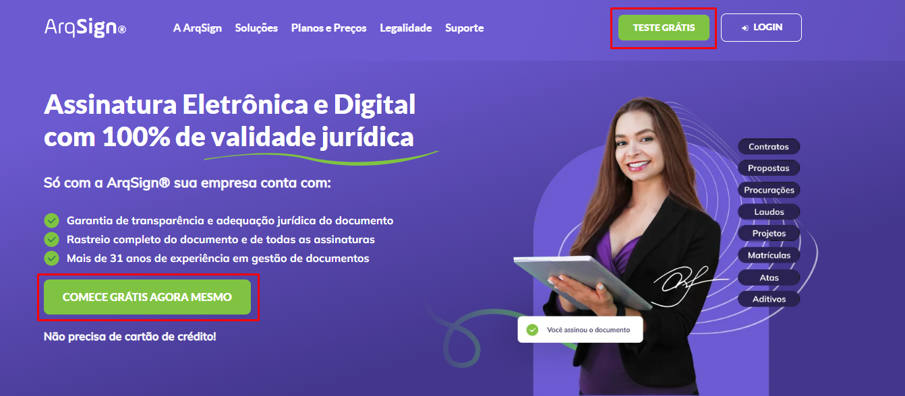<figcaption>
Clique na imagem para ampliar.
</figcaption></figure>

2\. O usuário será redirecionado para a página de login, onde deverá informar seu e-mail e clicar em “Avançar”.

<figure><figcaption>
Clique na imagem para ampliar.
</figcaption></figure>

3\. Depois, deverá informar os dados solicitados:

* **Nome completo:** Informe o nome completo
* **Telefone:** Número de telefone com DDD
* **Segmento:** Selecione o segmento que a empresa ou o profissional dono da conta atua.
* **Estou testando o ArqSign para:** Selecione o objetivo do teste que será feito da plataforma ArqSign.
* **Senha:** Crie uma senha obedecendo aos requisitos mínimos de segurança (mínimo de oito caracteres, contendo pelo menos uma letra maiúscula, uma letra minúscula, um número e um caractere especial)

<figure>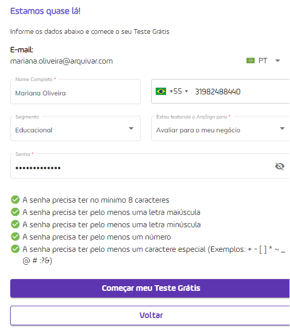<figcaption></figcaption></figure>

4\. Para concluir, clique em “Começar meu Teste Grátis”. Será exibida uma mensagem de confirmação de criação da conta. Para acessar a plataforma, clique no link indicado.

<figure>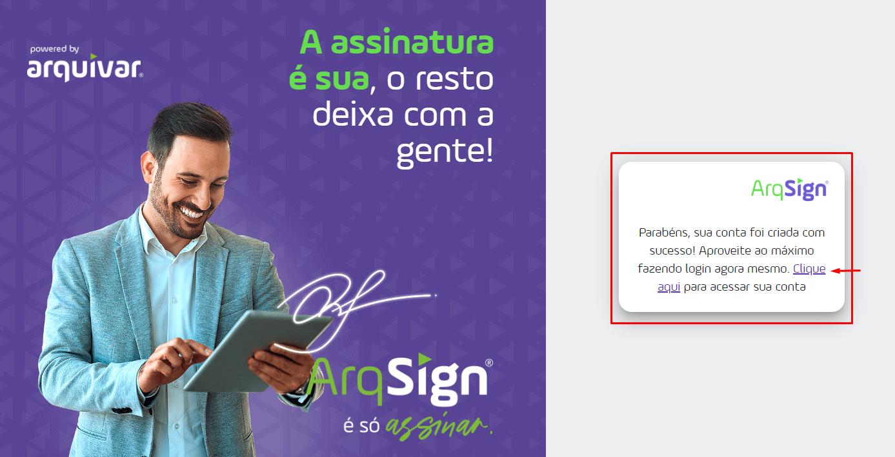<figcaption>
Clique na imagem para ampliar.
</figcaption></figure>

5\. O usuário receberá dois e-mails da plataforma. O primeiro apresentará orientações sobre a utilização do teste grátis.

<figure><figcaption>
Clique na imagem para ampliar.
</figcaption></figure>

6\. No segundo e-mail o usuário receberá o link para ativação da conta, no qual deverá clicar para realizar o primeiro acesso.

<figure>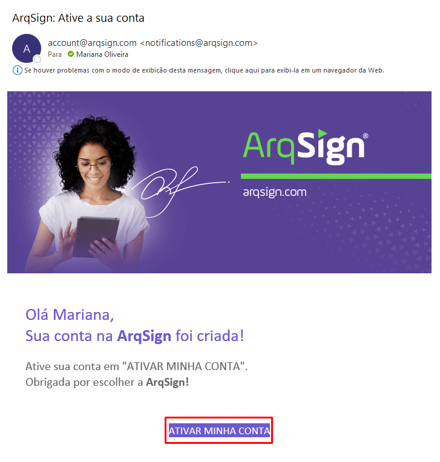<figcaption></figcaption></figure>

7\. O usuário será direcionado para a tela de login, na qual deverá informar a senha criada anteriormente, no momento do cadastro, e clicar em “Entrar” para realizar o primeiro acesso.

<figure><figcaption>
Clique na imagem para ampliar.
</figcaption></figure>


<mark style="color:orange;">**Ao término do período de 30 dias de teste ou após consumir os dez envios gratuitos, o usuário poderá continuar acessando a plataforma normalmente, mas para realizar novos envios deverá adquirir um plano pago (para realizar novos envios por e-mail) ou comprar créditos extras (para envios via WhatsApp e SMS).**</mark>


***

### Planos pagos

Ao contratar um plano ArqSign, você terá acesso a um número de envios de acordo com cada plano. Os envios contemplados no plano podem ser feitos por e-mail ou WhatsApp.

Para envio de fluxos via WhatsApp, é necessário que a conta tenha a disponibilidade de envios e de créditos para WhatsApp já que neste caso, é por meio de uma integração com o WhatsApp Oficial é feito o envio do fluxo. Para contratar créditos de WhatsApp, depois de autenticado na plataforma acesse o menu “Comprar Créditos”. A cobrança será por envio de mensagem. No envio de um fluxo são gastos por signatário duas mensagens (uma para envio do documento para assinatura e uma para envio do documento assinado ao final do processo).

Para envio de fluxos via e-mail é necessário que a conta tenha disponibilidade de envios, já que a própria Plataforma ArqSign executa o envio do fluxo. Caso os envios contemplados no plano do usuário se esgotem, ele também poderá adquirir créditos extras de envio por e-mail acessando o menu “Comprar Créditos”, depois de autenticado na plataforma.

Todos os planos pagos possuem as mesmas funcionalidades. A única diferença está no número de envios de cada pacote e a disponibilização entre planos anuais e mensais.

#### Cobrança dos planos pagos

A base de cobrança de cada plano é o serviço de envio de um fluxo para assinatura. Um envio de um fluxo, pode conter vários arquivos e assinaturas e ainda assim, será descontado apenas um envio do plano.

Para os planos mensais, você paga uma mensalidade ao contratar o plano e já começa a utilizar a ferramenta. Mensalmente no mesmo dia da compra haverá o faturamento da mensalidade automaticamente no mesmo cartão, a não ser que você desabilite a renovação automática.

Para os planos anuais há opção de aquisição em até 12 parcelas sem juros no cartão.

#### Comprando um plano

1\. Para adquirir um plano, na página inicial do site da ArqSign, clique em “Planos e Preços” no menu superior.

<figure>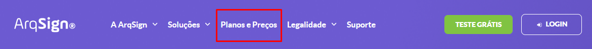<figcaption>
Clique na imagem para ampliar.
</figcaption></figure>

2\. Serão apresentadas as características e preços de cada um dos planos. Clique em “Começar Agora” no plano que deseja adquirir.

<figure>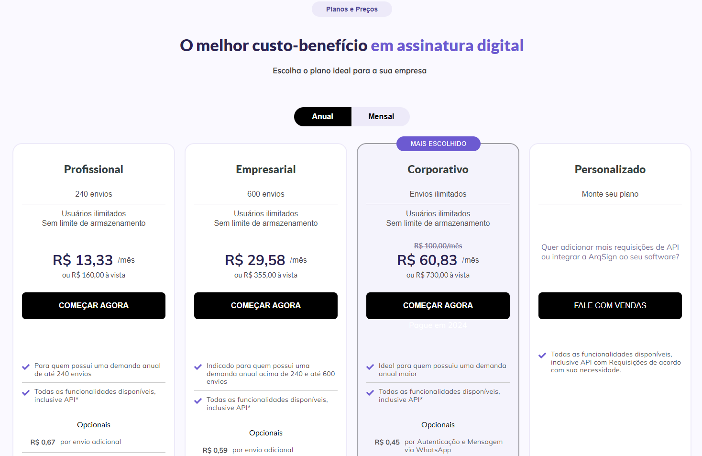<figcaption>
Clique na imagem para ampliar.
</figcaption></figure>

3\. O usuário será direcionado para a página de finalização de compra, na qual serão apresentadas as informações sobre o plano escolhido. Ele deverá inserir os dados de faturamento e de pagamento e clicar em “Finalizar a compra”.

<figure>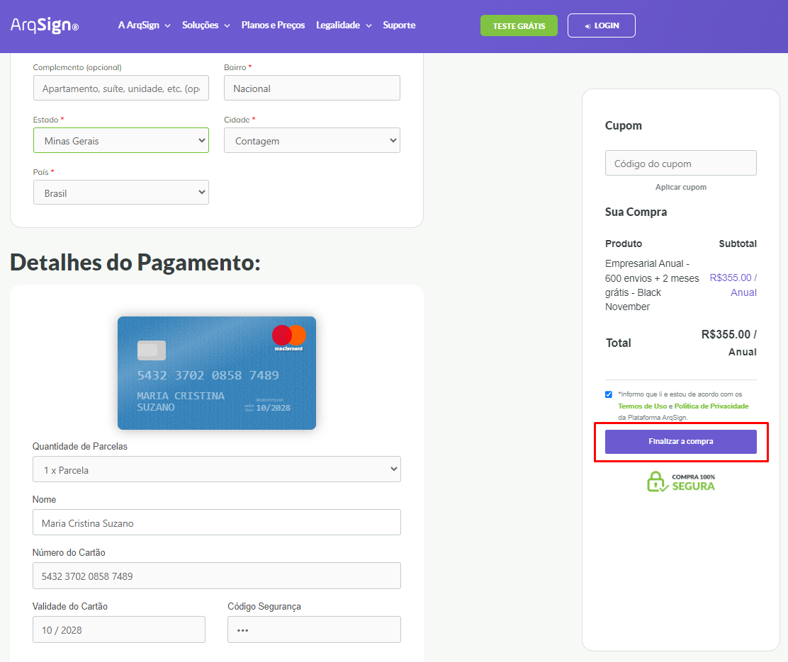<figcaption>
Clique na imagem para ampliar.
</figcaption></figure>

4\. Depois de feito o pagamento, o usuário receberá por e-mail o link para ativação da conta, no qual deverá clicar para realizar o primeiro acesso.

***

## Página de login (autenticação) na plataforma ArqSign

A página de login da plataforma ArqSign solicita o e-mail e senha cadastrados pelo usuário na criação de sua conta.

Caso ele ainda não possua conta, deve clicar no link “Cadastre-se aqui”.

<figure>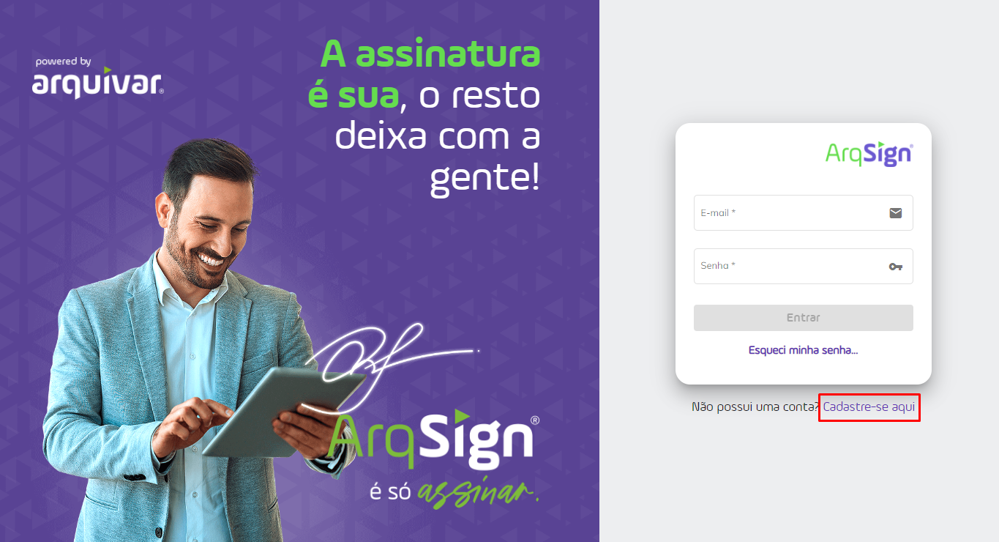<figcaption>
Clique na imagem para ampliar.
</figcaption></figure>

Será oferecido ao usuário a [criação de uma conta teste grátis](./#criacao-de-conta-teste-gratis). Para criar essa conta ele deverá informar seu e-mail e clicar em “Avançar”.

### Esqueci minha senha

Caso o usuário esqueça sua senha, basta clicar em “Esqueci minha senha”.

<figure>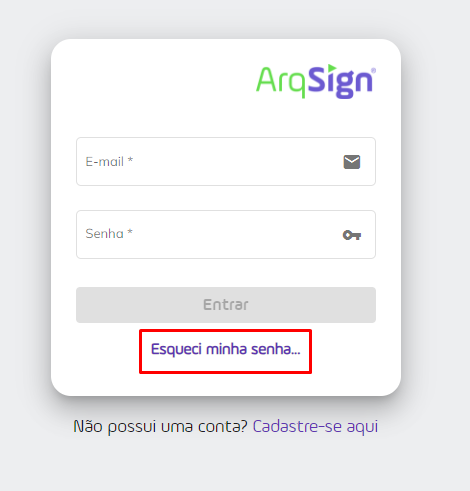<figcaption></figcaption></figure>

Na tela de recuperação de senha, o usuário deverá informar o mesmo e-mail utilizado para acesso à plataforma e clicar em “Recuperar”.

<figure><figcaption>
Clique na imagem para ampliar.
</figcaption></figure>

O usuário receberá por e-mail um link no qual deverá clicar para definir uma nova senha.

<figure>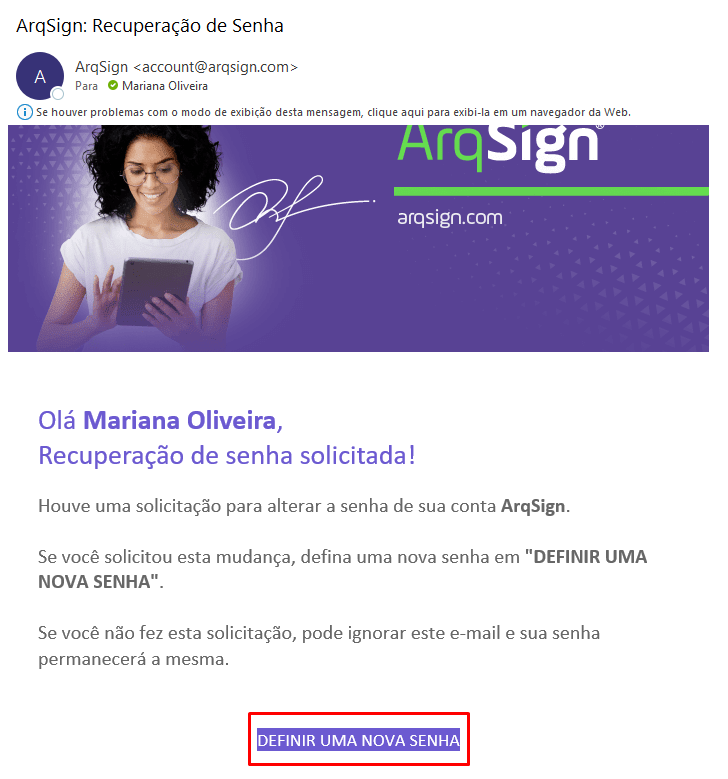<figcaption></figcaption></figure>

***

## Página inicial - Usuário logado

Ao acessar sua conta, a tela inicial do usuário apresentará no menu superior os seguintes botões:

**Novo Documento:** Clicando neste botão o usuário poderá cadastrar um documento que será enviado a signatários para assinatura.

**Assinatura em Lote:** Clicando neste botão o usuário poderá visualizar e assinar em lote todos os documentos que recebeu e estão pendentes de assinatura.

**Vencidos:** Clicando neste botão o usuário poderá visualizar todos os documentos que ele enviou a outras pessoas para assinatura, mas que não foram assinados no prazo e expiraram. Aqui ele poderá fazer o reenvio desses documentos.

**Comprar Agora / Alterar Plano:** Os botões “Comprar Agora” ou “Alterar Plano” serão exibidos para usuários que possuem uma conta de teste grátis ou para usuários que possuam plano pago expirado ou próximo da data de expiração. O botão “Comprar Agora” será exibido para usuários com a assinatura do plano expirada. O botão “Alterar Plano” será exibido para usuários com assinatura de plano pago com data de vencimento próxima (30 dias antes da expiração de planos anuais e 10 dias antes da expiração de planos mensais).

**Comprar Créditos:** Em contas que estão com o plano vigente será exibido o botão “Comprar Créditos”, no qual o usuário poderá adquirir créditos para envio de documentos por e-mail, WhatsApp e SMS, de acordo com o tipo de plano da conta.

**Perfil do usuário:** Clicando neste menu o usuário terá acesso a informações de sua conta.

**Idiomas:** A página inicial e a interface da plataforma serão apresentadas no idioma escolhido pelo usuário no momento do cadastro. Para alterar o idioma, clique no ícone de bandeira localizado canto superior direito da tela e escolha entre Português (Brasil), Espanhol e Inglês.

**Sair:** Utilizado para fazer o logout da plataforma.

<figure>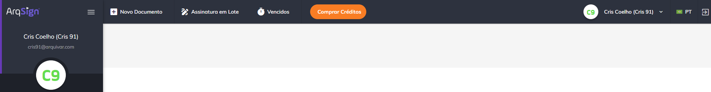<figcaption>
Clique na imagem para ampliar.
</figcaption></figure>

Do lado esquerdo da tela temos todos os menus disponíveis, separados por grupos. É importante destacar que esses menus serão apresentados conforme nível de permissão de cada usuário. 

**Caixa Postal:** Neste grupo estão concentrados os menus referentes ao processo de tramitação dos documentos. 

**Diretórios:** Neste grupo temos o menu Documentos. Ele é considerado um repositório de armazenamento dos documentos tramitados pela plataforma, ou seja, aqui são encontrados todos os documentos com processo de assinatura concluído. 

**Administração:** Neste grupo temos as configurações de conta, usuários e grupo de usuários.  

<figure>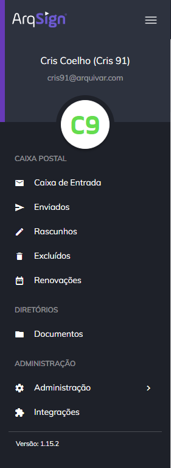<figcaption></figcaption></figure>

No canto inferior direito da tela o usuário encontrará o menu de Suporte, onde poderá acessar ao tutorial demonstrativo de como enviar e assinar um documento, acessar ao Perguntas Frequentes sobre o uso da plataforma, aprender a verificar a validade jurídica de um documento e acessar os conteúdos sobre as novidades da Plataforma.

<figure><figcaption>
Clique na imagem para ampliar.
</figcaption></figure>

<figure><figcaption>
Clique na imagem para ampliar.
</figcaption></figure>
