# 🟪 Conta

No menu Conta encontram-se as informações sobre a conta do usuário.

<figure>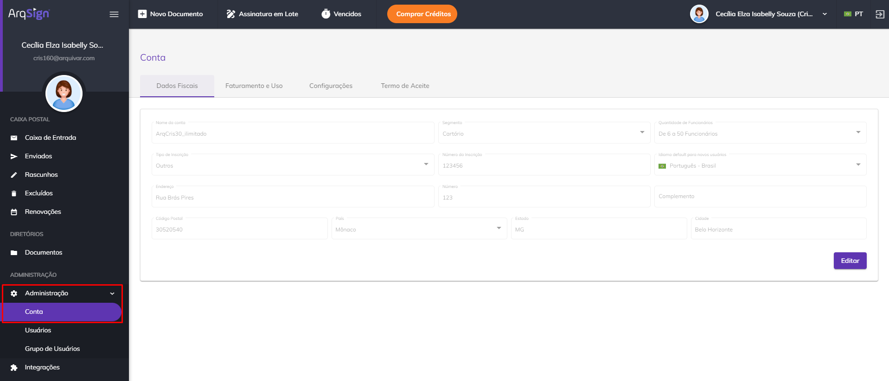<figcaption>
Clique na imagem para ampliar.
</figcaption></figure>

***

## Aba Dados Fiscais

Na aba Dados Fiscais são apresentadas as informações ficais e financeiras do usuário. Os dados informados ao se criar uma conta e adquirir um plano na plataforma ArgSign são apresentados nesta tela.   &#x20;

Caso a conta do usuário seja de um plano gratuito, as informações estarão em branco, mas poderão ser editadas clicando-se no botão “Editar”.

<figure>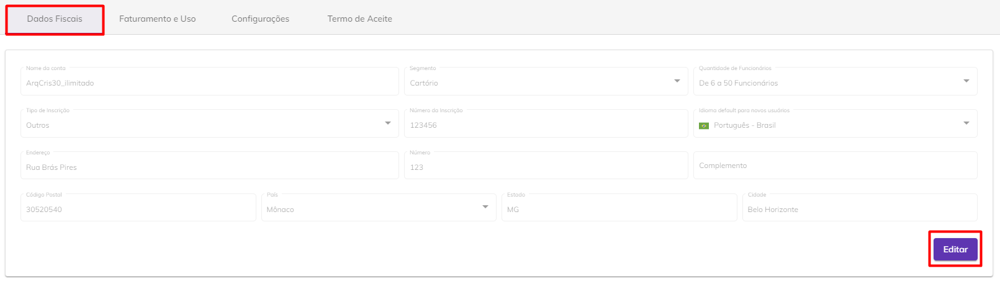<figcaption>
Clique na imagem para ampliar.
</figcaption></figure>

Nesta aba são apresentadas as seguintes informações do usuário:

* **Nome da conta:** Nome criado para a conta no momento do cadastro na plataforma. Pode ser, por exemplo, o nome do usuário ou da empresa proprietária da conta.
* **Segmento:** Segmento profissional em que o usuário ou empresa atua.
* **Quantidade de Funcionários:** Quantidade de funcionários que a empresa em que o usuário atua possui.
* **Tipo de Inscrição:** Tipo de inscrição da conta que pode ser CPF, CNPJ ou outros.
* **Número de inscrição:** Número de inscrição da conta que deve ser preenchido de acordo com a opção escolhida no campo “Tipo de Inscrição”.
* **Idioma default para novos usuários:** Idioma em que a plataforma será apresentada para novos usuários associados à conta, que pode ser Português, Inglês ou Espanhol. &#x20;
* **Endereço:** Endereço residencial ou comercial do usuário ou empresa.
* **Número:** Número da residência ou imóvel comercial.
* **Complemento:** Complemento do endereço.
* **Código Postal:** Código postal do endereço residencial ou comercial do usuário ou empresa.
* **País:** País do usuário ou empresa.
* **Estado:** Estado do usuário ou empresa.
* **Cidade:** Cidade do usuário ou empresa.

<figure>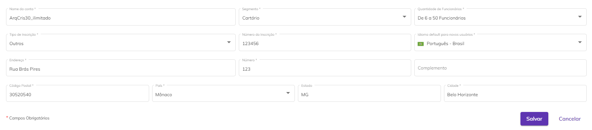<figcaption>
Clique na imagem para ampliar.
</figcaption></figure>

***

## Aba Faturamento e Uso

Na aba Faturamento e Uso é apresentado o histórico de compra da conta do usuário.

### Plano e Consumo

Na sub aba Plano e Consumo é apresentado o tipo de plano, o período de faturamento (anual ou mensal), a data de assinatura do plano e a data de vencimento da assinatura.

Por padrão ao criar uma conta a opção “**Renovação Automática**” será automaticamente habilitada. Para cancelar essa renovação, basta desmarcar essa opção.

<figure>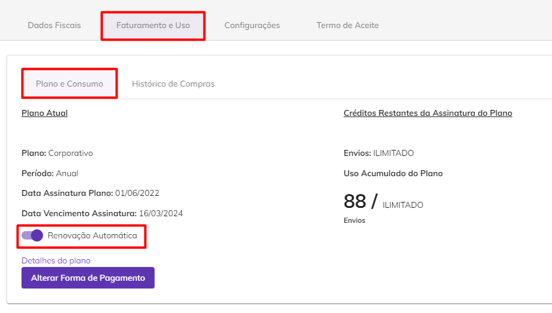<figcaption>
Clique na imagem para ampliar.
</figcaption></figure>


<mark style="color:blue;">Ao deixar habilitada a renovação automática, quando o plano vencer o sistema fará a renovação do pagamento de forma automática, utilizando o mesmo meio de pagamento da compra anterior. Se desabilitada a opção, será exibido o botão “Comprar Agora”, para que o usuário faça novamente a compra do mesmo plano ou de outro plano que desejar.</mark>


Para alterar a forma de pagamento do plano, clique em “**Alterar Forma de Pagamento**”. Será enviado um link para o e-mail ou telefone do usuário responsável pela conta com um link para que seja realizada essa alteração.

<figure>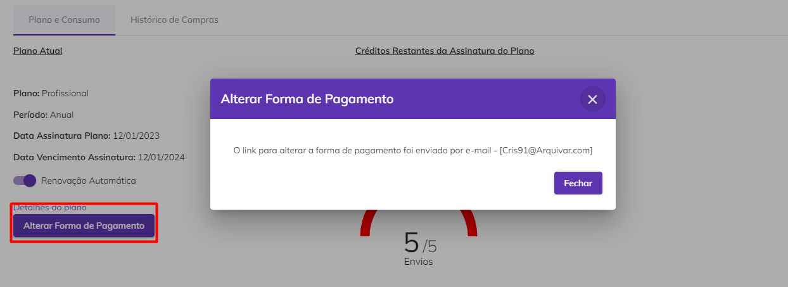<figcaption>
Clique na imagem para ampliar.
</figcaption></figure>

Ao clicar em “**Detalhes do Plano**” serão exibidos detalhes do plano atual do usuário, como tipo de plano, período de faturamento (mensal ou anual), valor pago no plano, descrição e quantidade dos itens aos quais o plano dá acesso, valores de créditos, créditos excedentes e data de validade do plano.

<figure>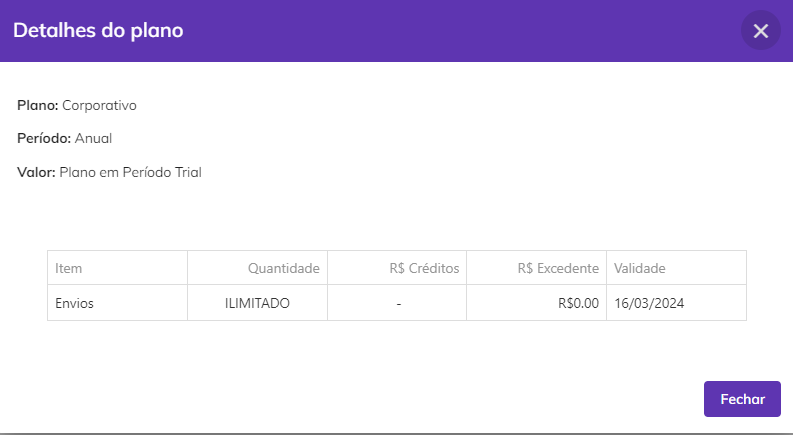<figcaption>
Clique na imagem para ampliar.
</figcaption></figure>

Nesta tela é possível visualizar também a quantidade de créditos restantes o usuário ainda possui para envio de documentos. Em “**Uso Acumulado do Plano**” o usuário pode visualizar a quantidade de envios de documentos à qual ele tem direito no plano contratado.

Em “**Créditos Restantes da Assinatura do Plano**” são apresentados os créditos que o usuário ainda possui no plano assinado. O usuário pode visualizar a quantidade de créditos que possui para envio de documentos via Whatsapp e e-mail e códigos de segurança via SMS.


<mark style="color:orange;">**Não é possível enviar documentos via SMS. Os créditos adquiridos para envio via SMS só podem ser usados para disparo de códigos de segurança. O código de segurança ou token é uma senha usada para dar acesso aos documentos enviados via e-mail ou Whatsapp e pode ser utilizada para acrescentar uma camada extra de segurança ao processo de assinatura eletrônica de documentos.**</mark>


Se o usuário tiver comprado créditos além daqueles já inclusos no plano clicando em “**Datas de expiração dos créditos extra**” será possível visualizar as datas em que os créditos comprados à parte do plano irão expirar.

<figure>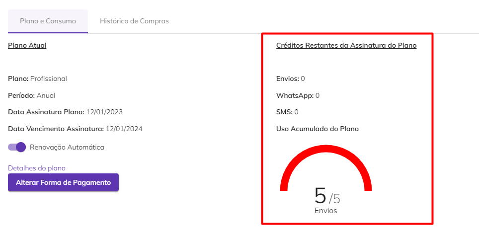<figcaption>
Clique na imagem para ampliar.
</figcaption></figure>


<mark style="color:orange;">**Quando o plano da assinatura da conta for ArqGED-ArqFlow, o sistema não exibe:**</mark>

* <mark style="color:orange;">**Os campos “Renovação Automática” e "Alterar forma de pagamento"**</mark>
* <mark style="color:orange;">**O botão "Comprar Créditos", tanto na tela quanto no topo.**</mark>&#x20;


### Histórico de Compras

Na aba Histórico de Compras é apresentada a descrição dos produtos já adquiridos pelo usuário, o período de vigência de cada um, o número de parcelas em que foi dividido o pagamento, o valor e status dessas parcelas.

<figure>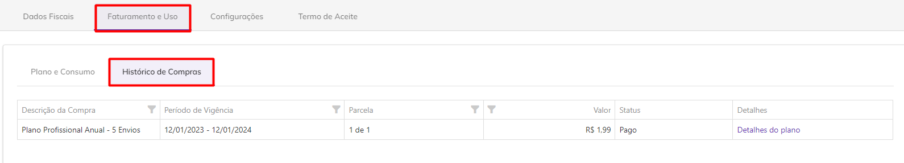<figcaption>
Clique na imagem para ampliar.
</figcaption></figure>

Ao clicar em “**Detalhes do plano**” é apresentada a descrição e quantidade detalhada dos itens que compõem o plano, os valores de créditos e valores excedentes (quando adquiridos) e a data de validade de cada um dos itens.

<figure>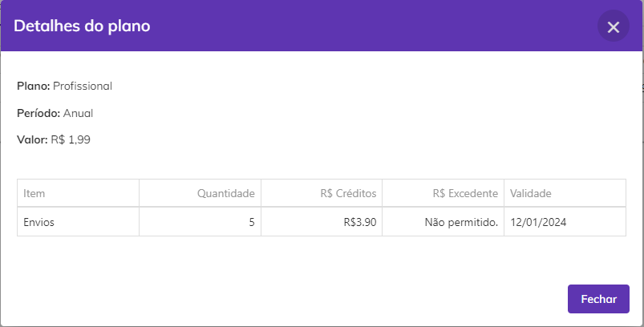<figcaption>
Clique na imagem para ampliar.
</figcaption></figure>

***

## Aba Configurações

### Documentos

Por default algumas configurações dessa aba são preenchidas automaticamente, mas é possível alterá-las clicando-se no botão “Editar”.

<figure><figcaption>
Clique na imagem para ampliar.
</figcaption></figure>

Os valores definidos aqui serão adotados como padrão para a configuração de envio e renovações de documentos e processos de assinatura feitos pelo usuário, mas podem ser alteradas em cada documento durante a sua criação na tela [Novo Documento > Adicionar Documentos e Destinatários > Configurações Avançadas. ](../../menu-superior/novo-documento.md#configuracoes-avancadas)

**Tempo padrão de \_\_\_\_ dias para expiração do documento, quando não assinado por um ou mais destinatários a partir da data de envio:** Nesse campo é definido o tempo padrão (em dias) que os usuários terão para assinar um documento até que ele expire e fique indisponível.

**Tempo padrão de \_\_\_\_ dias para aviso antes da data de expiração:** Nesse campo é definido quantos dias antes de um documento expirar os destinatários que ainda não tiverem assinado o documento deverão ser notificados sobre a sua expiração.

**Configuração padrão para lembretes recorrentes a serem enviados aos destinatários após a data de envio:** Ao marcar essa opção, a partir do momento do envio do documento até a data de seu vencimento, serão enviados lembretes aos destinatários a cada período de tempo determinado no campo “Tempo padrão de \_\_\_\_\_ dias para recorrência de lembrete aos destinatários sobre alguma ação pendente no documento”. Se a opção for desabilitada, o campo abaixo também será desabilitado automaticamente.

**Agrupar os documentos do processo em arquivo único:** Configuração de agrupamento dos documentos do processo em arquivo único. Essa opção estará, por padrão, desmarcada.

**Obrigar o signatário a ler os documentos antes de assinar:** Essa configuração obriga a leitura dos documentos do processo.  Essa opção estará, por padrão, desmarcada.

<figure><figcaption>
Clique na imagem para ampliar.
</figcaption></figure>

**Gerar QR Code de acesso do documento no Registro de Assinaturas:** Se habilitada essa opção, no Registro de Assinaturas de um documento assinado será apresentado um QR COde, por meio do qual a pessoa que está acessando conseguirá visualizar o documento assinado.

**Tempo padrão de \_\_\_\_\_ dias para expiração do link de acesso ao documento, após a conclusão da assinatura:** Nesse campo é definido o tempo padrão (em dias) que os usuários terão para acessar um documento depois de concluído o processo de assinaturas até que ele expire e fique indisponível.

**Anexar arquivo menor que 10MB ao e-mail enviado na finalização das assinaturas:** Se marcada essa opção, todo documento concluído cujo o arquivo do processo for de tamanho menor que 10MB será enviado aos destinatários como anexo no e-mail de notificação da conclusão do processo de assinatura.


<mark style="color:orange;">**Ao concluir o processo de assinaturas, o sistema enviará um link de acesso ao documento no corpo do e-mail para todos os destinatários.**</mark>


<figure><figcaption>
Clique na imagem para ampliar.
</figcaption></figure>

**Configuração padrão para lembretes recorrentes a serem enviados aos remetentes após a data de renovação agendada de um documento:** Se marcada essa opção, quando houver um documento concluído que possui renovação agendada, o sistema vai lembrar ao remetente do documento que ele está apto para ser renovado. Esse lembrete será enviado no período definido no campo “Tempo padrão de \_\_\_\_ dias para recorrência de lembretes aos remetentes sobre renovação de documento”. Se desabilitada essa opção, esse campo será também desabilitado.

<figure>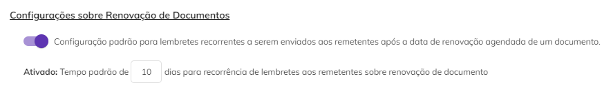<figcaption>
Clique na imagem para ampliar.
</figcaption></figure>

### Papel do Signatário

Nesta aba são criados os papéis de signatários. Os papéis de signatários serão apresentados ao usuário no momento da configuração dos destinatários / signatários na tela [Novo Documento > Adicionar Documentos e Destinatários > Adicionar Documentos > Destinatários.](../../menu-superior/novo-documento.md#b.-destinatarios)


<mark style="color:blue;">O papel do signatário é a função dele no contrato, seja como parte, pessoa contratada ou contratante, testemunha, representante legal etc.</mark>


Por padrão a plataforma apresenta os papéis “Contratada”, “Contratante”, “Fiador”, “Parte” e “Testemunha”.

<figure>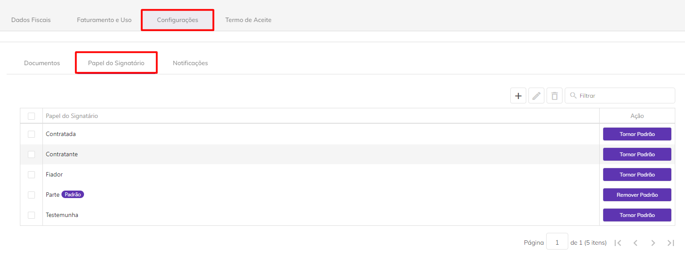<figcaption>
Clique na imagem para ampliar.
</figcaption></figure>

Para editar esses papéis, basta selecionar aquele que deseja editar e clicar no ícone “Editar”.

<figure>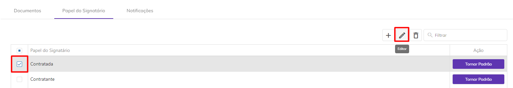<figcaption>
Clique na imagem para ampliar.
</figcaption></figure>

Será possível alterar o nome do papel e defini-lo como papel padrão.&#x20;


<mark style="color:orange;">**Papel padrão é aquele que será atribuído ao signatário caso o remetente do documento não defina um papel específico para ele no momento do cadastro do documento. Por default o sistema determina o papel "Parte" como padrão, mas essa escolha pode ser alterada pelo usuário remetente. Não é obrigatório determinar um papel padrão, mas caso seja preciso, somente um dos papéis pode ser o padrão.**</mark>


<figure><figcaption></figcaption></figure>

Para criar um novo papel, clique no ícone “Adicionar” e informe um nome para o papel. Se desejar torná-lo o papel padrão, assinale a opção “Definir este papel como padrão”. Para finalizar, clique em “Salvar”.

<figure>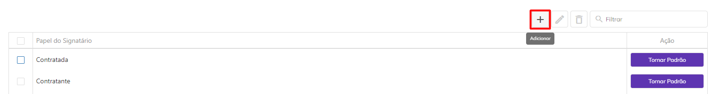<figcaption>
Clique na imagem para ampliar.
</figcaption></figure>

<figure>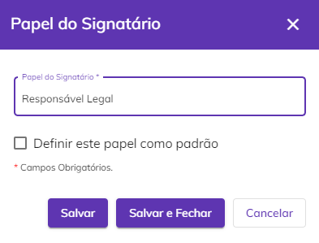<figcaption></figcaption></figure>

Para alterar o papel padrão clique “Remover Padrão” ou “Tornar Padrão”, de acordo com a necessidade.

<figure>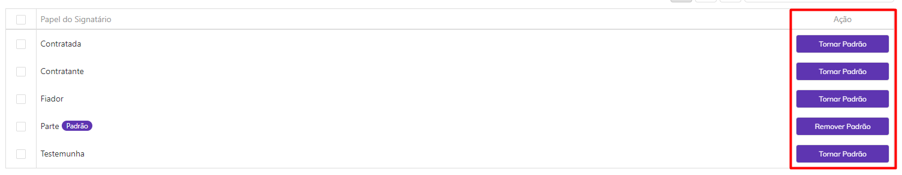<figcaption>
Clique na imagem para ampliar.
</figcaption></figure>

Para excluir um papel, clique no ícone “Excluir”. Também é possível localizar um tipo de papel utilizando a barra de pesquisa da tela. &#x20;

<figure>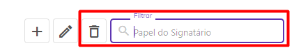<figcaption></figcaption></figure>

### Notificações

**Notificar ao atingir \_\_\_\_ % de uso dos itens da minha assinatura:** Ao preencher esse campo, o usuário será notificado pelo sistema quando o seu consumo do plano atingir determinada porcentagem. Essa configuração será desabilitada no plano com envios ilimitados.

**Notificar a cada \_\_\_\_\_ dias, a partir de \_\_\_\_\_ dias antes do vencimento da assinatura:** Ao preencher esses campos os administradores globais da conta serão notificados no período determinado quando a data de vencimento do plano estiver se aproximando do vencimento. Após o vencimento da assinatura, este tipo de notificação não será mais enviada.

<figure>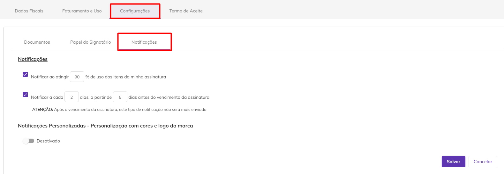<figcaption>
Clique na imagem para ampliar.
</figcaption></figure>

Se habilitado o campo “**Notificações Personalizadas - Personalização com cores e logo da marca**” será possível inserir um banner e definir as cores de destaque das notificações enviadas aos destinatários por e-mail e Whatsapp.

<figure>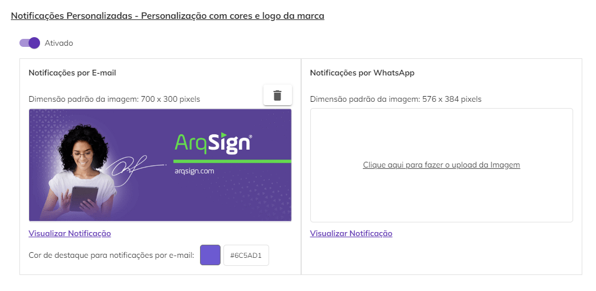<figcaption>
Clique na imagem para ampliar.
</figcaption></figure>


<mark style="color:orange;">**Atente-se à dimensão padrão da imagem para o banner. Imagens fora dos tamanhos especificados não serão aceitas.**</mark>



Clicando no ícone “Excluir imagem” o banner será excluído.

Clicando em “Visualizar Notificação” será possível ver como será apresentado ao destinatário o e-mail de notificação e a notificação via Whasapp.

<figure>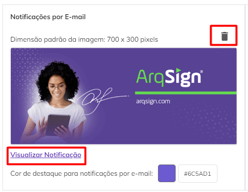<figcaption>
Clique na imagem para ampliar.
</figcaption></figure>

<figure>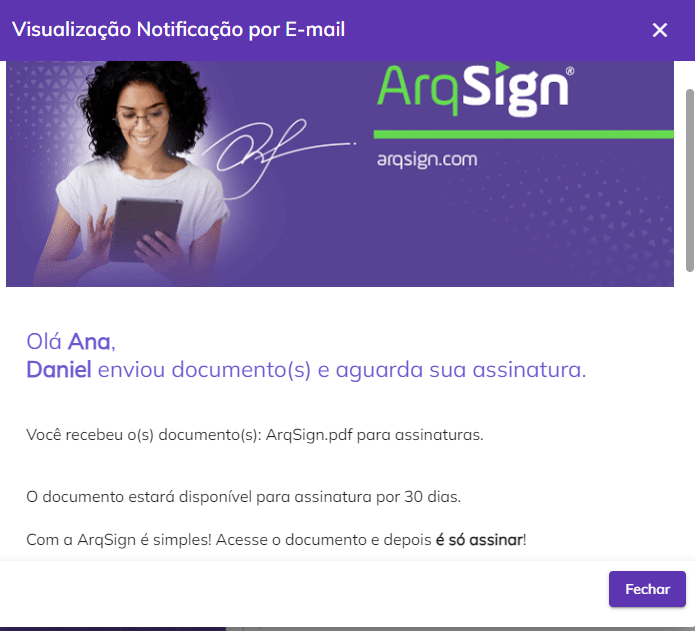<figcaption></figcaption></figure>


<mark style="color:orange;">**Caso estes campos não sejam preenchidos, o sistema enviará o banner e utilizará as cores padrão da plataforma ArqSign.**</mark>


***

## Aba Termo de Aceite

### Termo

Nesta aba o usuário pode inserir ou editar o Termo de aceite para Assinatura Eletrônica que é apresentado aos signatários no momento da assinatura de um documento. O objetivo desse termo é assegurar que os signatários aceitaram assinar o documento eletronicamente.

A plataforma apresenta o termo padrão, mas caso o usuário deseje editar ou substituir esse texto, pode fazê-lo clicando em “Editar”.

<figure>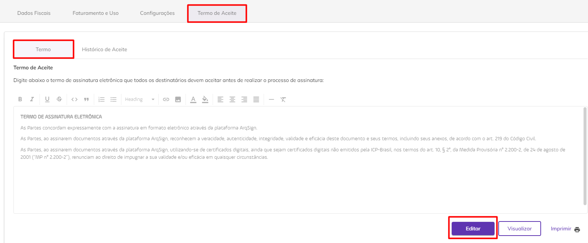<figcaption>
Clique na imagem para ampliar.
</figcaption></figure>

Ele poderá também alterar a formatação e cores do texto utilizando a barra de ferramentas de edição.

<figure>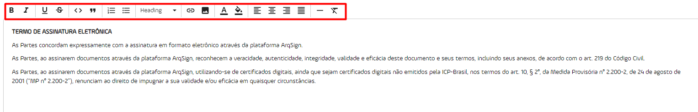<figcaption>
Clique na imagem para ampliar.
</figcaption></figure>

Ao clicar em “Visualizar” o Termo é exibido da forma que será apresentado aos signatários. O usuário poderá imprimir o texto clicando em “Imprimir”.

<figure>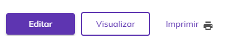<figcaption></figcaption></figure>

### Histórico de Aceite

Nesta aba são apresentadas todos os Aceites ao Termo de Assinatura Eletrônica realizados por signatários, ou seja, toda vez que um signatário aceitar o Termo de Aceite apresentado a ele, essa ação será registrada e poderá ser consultada nesta tela.

* **Data do Aceite:** Nesta coluna é apresentada a data em que o signatário aceitou o Termo de Assinatura Eletrônica.
* **Nome:** Nome do signatário que realizou o aceite.
* **E-mail/Telefone:** Contato do signatário por meio do qual ele recebeu o link para acesso ao documento para assinatura e realizou o aceite.
* **Versão do Termo:** Esta coluna mostra a versão do Termo de Assinatura Eletrônica aceita pelo usuário. Cada vez que o Termo é editado ou substituído, o sistema atribui a ele uma nova versão.
* **IP:** Essa coluna apresenta o IP da máquina utilizada pelo signatário no momento do aceite do Termo de Assinatura Eletrônica.
* **Geolocalização:** Essa coluna apresenta a geolocalização da máquina do signatário no momento em que ele realizou o aceite ao Termo de Assinatura Eletrônica.
* **Visualizar Termo:** Ao clicar neste botão é exibida a versão do termo que foi aceita pelo signatário.

<figure>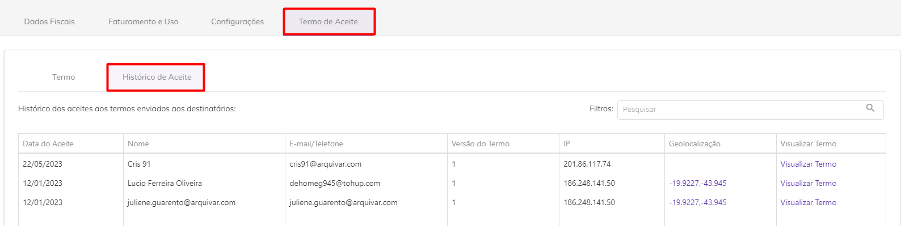<figcaption>
Clique na imagem para ampliar.
</figcaption></figure>

<figure>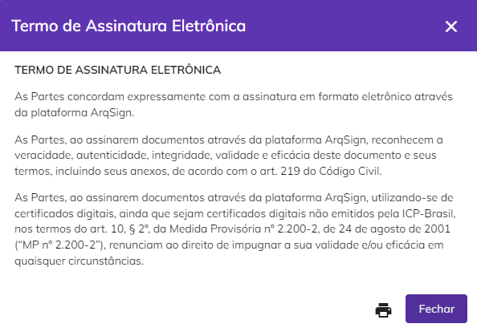<figcaption>
Clique na imagem para ampliar.
</figcaption></figure>
