# 🟪 Usuários

No menu Usuários são apresentados todos os usuários que participam da conta do usuário logado.&#x20;

Os usuários administradores globais podem convidar outras pessoas para que participem da conta e realizem ações na plataforma.&#x20;

A quantidade de usuários que podem ser convidados varia de acordo com o plano contratado. No plano gratuito, só é possível que um usuário acesse a conta.&#x20;

Nos planos pagos, podem ser criados quantos usuários forem necessários (ilimitados).&#x20;

<figure><figcaption>
Clique na imagem para ampliar.
</figcaption></figure>

Após a inserção de um novo usuário pelo Administrador Global, o convidado recebe por e-mail o convite para ingressar na conta. Se já tiver cadastro na plataforma, deverá informar apenas sua senha. Caso ainda não tenha, deverá informar o nome e criar uma senha para realizar o primeiro acesso.

<figure>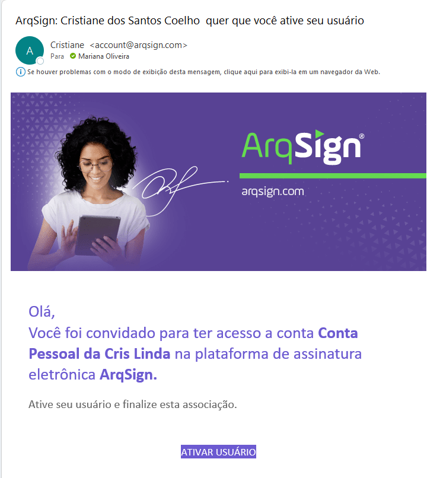<figcaption>
Clique na imagem para ampliar.
</figcaption></figure>

<figure><figcaption>
Clique na imagem para ampliar.
</figcaption></figure>

<figure>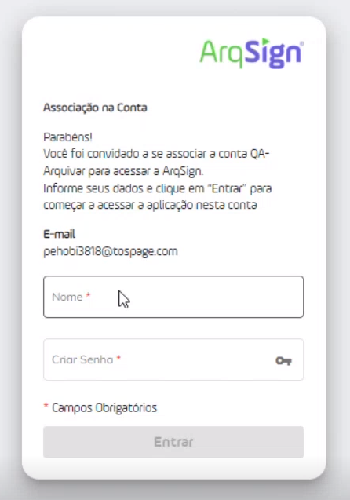<figcaption>
Clique na imagem para ampliar.
</figcaption></figure>

***

## Colunas da tela principal – Usuários

<figure>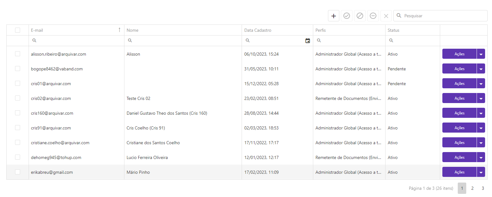<figcaption>
Clique na imagem para ampliar.
</figcaption></figure>

**E-mail:** Mostra o e-mail dos usuários associados ou convidados para a conta.

**Nome:** Apresenta os nomes dos usuários. Para usuários com status “Pendente” não é exibido o nome porque ainda não realizaram o cadastro na plataforma

**Data Cadastro:** Mostra a data e hora em que o usuário foi cadastrado na conta.

**Perfis:** Mostra os perfis atribuídos ao usuário, que podem ser Administrador Global (acesso a todas as funcionalidades) e Remetente de Documentos (envia e assina documentos). Um mesmo usuário pode ter os dois perfis.

**Status:** Apresenta o status do usuário, que pode ser “Ativo” (já está cadastrado na conta), “Pendente” (ainda não aceitou o convite para ingressar na conta), “Bloqueado” ou "Inativo". (usuário que não faz mais parte da conta).


<mark style="color:blue;">**DIFERENÇA ENTRE USUÁRIO BLOQUEADO X INATIVO:**</mark>&#x20;

<mark style="color:blue;">Ao</mark> <mark style="color:blue;"></mark><mark style="color:blue;">**bloquear um usuário**</mark> <mark style="color:blue;"></mark><mark style="color:blue;">seu acesso à conta é impedido. Os documentos que são de sua responsabilidade permanecem com ele e quando ocorre o desbloqueio o usuário continuará tendo acesso a eles normalmente. Essa funcionalidade é útil em casos de ausência temporária de um funcionário, por exemplo.</mark>

<mark style="color:blue;">Ao</mark> <mark style="color:blue;"></mark><mark style="color:blue;">**inativar um usuário**</mark> <mark style="color:blue;"></mark><mark style="color:blue;">o seu acesso à conta é impedido e os documentos que são de sua responsabilidade podem permanecer com ele ou serem transferidos para outro proprietário. Se ocorrer a ativação desse usuário novamente e os documentos tiverem sido transferidos, ele perderá o acesso aos arquivos. Se não tiverem sido, ele continuará tendo acesso a eles normalmente. Essa funcionalidade é útil em casos de desligamento de um funcionário, por exemplo.</mark>  &#x20;


***

## Ações da tela – Usuários

As ações da tela de Usuários podem se acessadas por meio dos botões superiores, da coluna ações à direita ou clicando-se sobre qualquer informação do usuário no grid da tela principal.

<figure>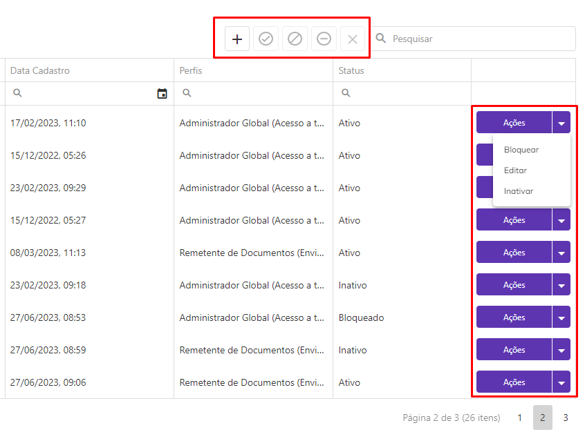<figcaption>
Clique na imagem para ampliar.
</figcaption></figure>

 

<figure>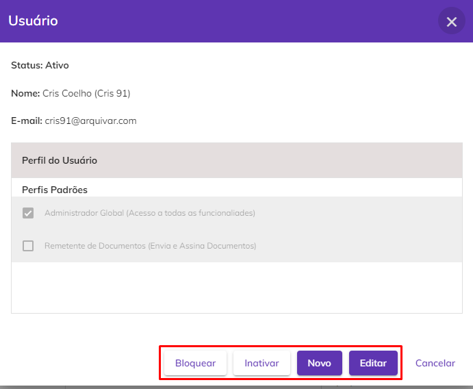<figcaption>
Clique na imagem para ampliar.
</figcaption></figure>

**Novo:** Para convidar um novo usuário para ingressar na conta, clique em “Novo”. Por padrão o usuário ficará com status “Pendente” até que aceite o convite para ingressar na conta.

O usuário deve informar o e-mail do usuário e definir o tipo de perfil que será atribuído a ele, que pode ser Administrador Global (acesso a todas as funcionalidades), Remetente de Documentos (envia e assina documentos) ou ambos.

<figure>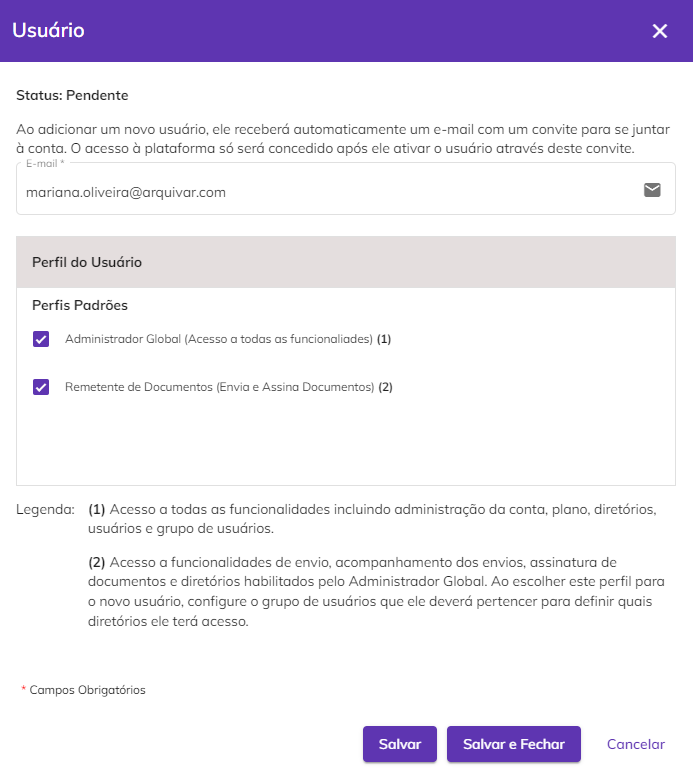<figcaption></figcaption></figure>

Se o usuário convidado tiver o perfil somente de Remetente de Documentos, será preciso definir também o Grupo de Usuários ao qual o convidado será associado. Esse grupo de usuários determinará a quais pastas do diretório o novo membro da conta terá acesso e deverá ter sido anteriormente criado no menu [Administração > Grupo de Usuários](grupo-de-usuarios.md). Também é possível criar um grupo clicando em “Novo Grupo”.

<figure>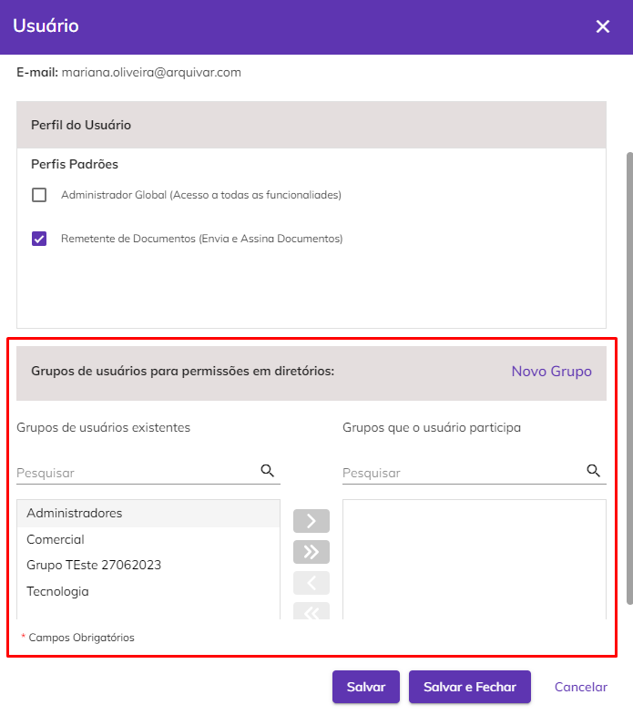<figcaption>
Clique na imagem para ampliar.
</figcaption></figure>


<mark style="color:orange;">**A definição de grupo não é solicitada para usuários criados com perfil de Administrador Global porque estes usuários têm acesso a todas as pastas de**</mark> [<mark style="color:blue;">**Documentos do Diretório**</mark>](../../diretorios/documentos/)<mark style="color:orange;">**, não sendo preciso, portanto, fazer essa restrição.**</mark>


**Ativar:** Podem ser ativados apenas usuários com status “Bloqueado” ou “Inativo”. Ao ativar os usuários bloqueados ou inativos eles terão acesso novamente à conta.

<figure>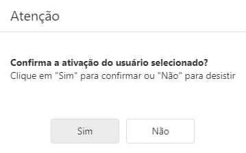<figcaption>
Clique na imagem para ampliar.
</figcaption></figure>

**Bloquear:** Podem ser bloqueados apenas usuários com status “Ativo”. Usuários bloqueados perdem a propriedade de todos os documentos.

<figure><figcaption>
Clique na imagem para ampliar.
</figcaption></figure>

**Editar:** Utilizado para editar as informações do usuário.

**Inativar:** Podem ser inativados apenas usuários com status “Ativo”. Ao inativar um usuário, será preciso definir se os documentos enviados por aquele usuário que será inativado serão transferidos de responsabilidade para outro membro da conta ou se será feita a inativação sem transferência.

Se for escolhida a opção “Inativar sem Transferir” o usuário apesar de inativo continuará como proprietário dos documentos.

<figure>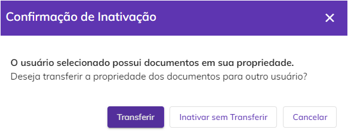<figcaption>
Clique na imagem para ampliar.
</figcaption></figure>

Se for escolhida a opção “Transferir” será preciso informar quem será o novo proprietário dos documentos e se serão transferidos todos os documentos ou somente aqueles em processo de assinatura ou com renovação agendada.

<figure>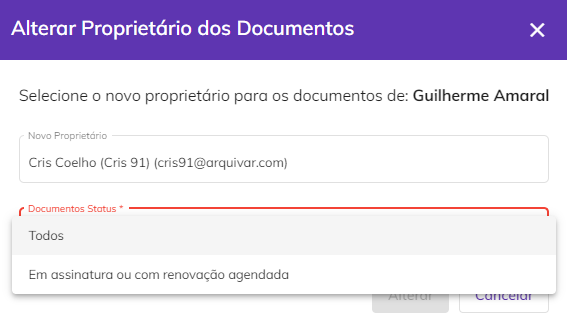<figcaption>
Clique na imagem para ampliar.
</figcaption></figure>

**Excluir:** Só podem ser excluídos da conta aqueles usuários com status “Pendente”, ou seja, que foram convidados, mas ainda não ingressaram na conta.

<figure>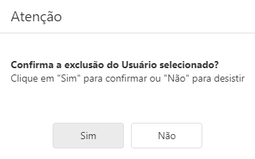<figcaption>
Clique na imagem para ampliar.
</figcaption></figure>

**Filtrar:** É possível pesquisar um usuário utilizando os filtros disponíveis na barra de pesquisa superior.

<figure>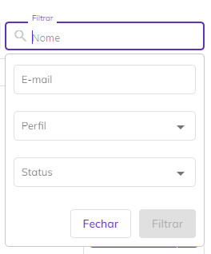<figcaption></figcaption></figure>
