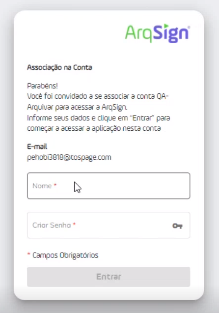
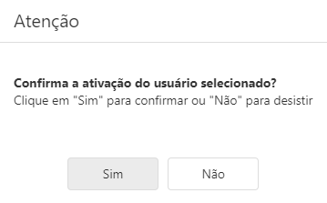
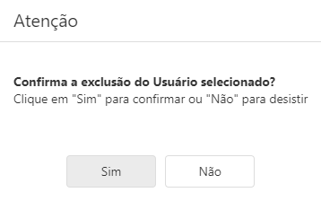
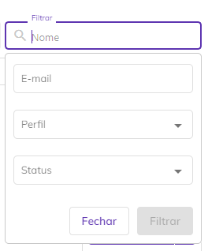

# 🟪 Usuários

No menu Usuários são apresentados todos os usuários que participam da conta do usuário logado.&#x20;

Os usuários administradores globais podem convidar outras pessoas para que participem da conta e realizem ações na plataforma.&#x20;

A quantidade de usuários que podem ser convidados varia de acordo com o plano contratado. No plano gratuito, só é possível que um usuário acesse a conta.&#x20;

Nos planos pagos, podem ser criados quantos usuários forem necessários (ilimitados).&#x20;

<figure><figcaption></figcaption></figure>

Após a inserção de um novo usuário pelo Administrador Global, o convidado recebe por e-mail o convite para ingressar na conta. Se já tiver cadastro na plataforma, deverá informar apenas sua senha. Caso ainda não tenha, deverá informar o nome e criar uma senha para realizar o primeiro acesso.

<figure><figcaption>
Clique na imagem para ampliar.
</figcaption></figure>

<figure><figcaption>
Clique na imagem para ampliar.
</figcaption></figure>

<figure><figcaption>
Clique na imagem para ampliar.
</figcaption></figure>

***

## Colunas da tela principal – Usuários

<figure><figcaption>
Clique na imagem para ampliar.
</figcaption></figure>

**E-mail:** Mostra o e-mail dos usuários associados ou convidados para a conta.

**Nome:** Apresenta os nomes dos usuários. Para usuários com status “Pendente” não é exibido o nome porque ainda não realizaram o cadastro na plataforma

**Data Cadastro:** Mostra a data e hora em que o usuário foi cadastrado na conta.

**Perfis:** Mostra os perfis atribuídos ao usuário, que podem ser Administrador Global (acesso a todas as funcionalidades) e Remetente de Processos (envia e assina documentos). Um mesmo usuário pode ter os dois perfis.

**Status:** Apresenta o status do usuário, que pode ser “Ativo” (já está cadastrado na conta), “Pendente” (ainda não aceitou o convite para ingressar na conta), “Bloqueado” ou "Inativo". (usuário que não faz mais parte da conta).


<mark style="color:blue;">**DIFERENÇA ENTRE USUÁRIO BLOQUEADO X INATIVO:**</mark>&#x20;

<mark style="color:blue;">Ao</mark> <mark style="color:blue;"></mark><mark style="color:blue;">**bloquear um usuário**</mark> <mark style="color:blue;"></mark><mark style="color:blue;">seu acesso à conta é impedido. Os processos que são de sua responsabilidade permanecem com ele e quando ocorre o desbloqueio o usuário continuará tendo acesso a eles normalmente. Essa funcionalidade é útil em casos de ausência temporária de um funcionário, por exemplo.</mark>

<mark style="color:blue;">Ao</mark> <mark style="color:blue;"></mark><mark style="color:blue;">**inativar um usuário**</mark> <mark style="color:blue;"></mark><mark style="color:blue;">o seu acesso à conta é impedido e os processos que são de sua responsabilidade podem permanecer com ele ou serem transferidos para outro proprietário. Se ocorrer a ativação desse usuário novamente e os documentos tiverem sido transferidos, ele perderá o acesso aos arquivos. Se não tiverem sido, ele continuará tendo acesso a eles normalmente. Essa funcionalidade é útil em casos de desligamento de um funcionário, por exemplo.</mark>  &#x20;


***

## Ações da tela – Usuários

As ações da tela de Usuários podem se acessadas por meio dos botões superiores, da coluna ações à direita ou clicando-se sobre qualquer informação do usuário no grid da tela principal.

<figure><figcaption>
Clique na imagem para ampliar.
</figcaption></figure> <figure><figcaption>
Clique na imagem para ampliar.
</figcaption></figure>

**Novo:** Para convidar um novo usuário para ingressar na conta, clique em “Novo”. Por padrão o usuário ficará com status “Pendente” até que aceite o convite para ingressar na conta.

O usuário deve informar o e-mail do usuário e definir o tipo de perfil que será atribuído a ele, que pode ser Administrador Global (acesso a todas as funcionalidades), Remetente de Processos (envia e assina Processos) ou ambos.

<figure><figcaption>
Clique na imagem para ampliar.
</figcaption></figure>

Se o usuário convidado tiver o perfil somente de Remetente de Processos, será preciso definir também o Grupo de Usuários ao qual o convidado será associado. Esse grupo de usuários determinará a quais pastas do diretório o novo membro da conta terá acesso e deverá ter sido anteriormente criado no menu [Administração > Grupo de Usuários](grupo-de-usuarios.md). Também é possível criar um grupo clicando em “Novo Grupo”.

<figure><figcaption>
Clique na imagem para ampliar
</figcaption></figure>


<mark style="color:orange;">**A definição de grupo não é solicitada para usuários criados com perfil de Administrador Global porque estes usuários têm acesso a todas as**</mark> [<mark style="color:blue;">**Pastas da conta**</mark>](../../processos/documentos/)<mark style="color:orange;">**, não sendo preciso, portanto, fazer essa restrição.**</mark>


**Ativar:** Podem ser ativados apenas usuários com status “Bloqueado” ou “Inativo”. Ao ativar os usuários bloqueados ou inativos eles terão acesso novamente à conta.

<figure><figcaption>
Clique na imagem para ampliar.
</figcaption></figure>

**Bloquear:** Podem ser bloqueados apenas usuários com status “Ativo”. Usuários bloqueados perdem a propriedade de todos os documentos.

<figure><figcaption>
Clique na imagem para ampliar.
</figcaption></figure>

**Editar:** Utilizado para editar as informações do usuário.

**Inativar:** Podem ser inativados apenas usuários com status “Ativo”. Ao inativar um usuário, será preciso definir se os processos enviados por aquele usuário que será inativado serão transferidos de responsabilidade para outro membro da conta ou se será feita a inativação sem transferência.

Se for escolhida a opção “Inativar sem Transferir” o usuário apesar de inativo continuará como proprietário dos documentos.

<figure><figcaption></figcaption></figure>

Se for escolhida a opção “Transferir” será preciso informar quem será o novo proprietário dos processos e se serão transferidos todos os documentos ou somente aqueles em processo de assinatura ou com renovação agendada.

<figure><figcaption></figcaption></figure>

**Excluir:** Só podem ser excluídos da conta aqueles usuários com status “Pendente”, ou seja, que foram convidados, mas ainda não ingressaram na conta.

<figure><figcaption>
Clique na imagem para ampliar.
</figcaption></figure>

**Filtrar:** É possível pesquisar um usuário utilizando os filtros disponíveis na barra de pesquisa superior.

<figure><figcaption></figcaption></figure>

## 🗪 Perguntas e Respostas Frequentes

Como inativar um usuário e alterar a propriedade de seus Processos?

Ao inativar um usuário, pode ser necessário alterar a propriedade dos Processos deste usuário para que outra pessoa siga com a gestão dos mesmos.&#x20;

Você poderá executar esta ação se for Administrador Global.&#x20;

Para isso siga os seguintes passos:&#x20;

1. Acesse o menu “Administração” -> Usuários;&#x20;
2. Selecione o usuário que deseja inativar;&#x20;
3. Clique em Ações;&#x20;
4. Clique em inativar;&#x20;
5. Se o usuário que está sendo inativado não possuir solicitação de transferência de Processos com status “Solicitado” ou “Em Processo” e tiver enviado algum Processo que esteja com status “Aguardando” ou “Em Processo” ou “Concluído” o sistema apresentará mensagem informando que o usuário que está sendo inativado possui Processos como proprietário, solicitando a confirmação de alterar a propriedade dos Processos do usuário, em questão;&#x20;
6. Escolha a opção “Transferir”;&#x20;
7. Selecione um novo proprietário;&#x20;
8. Selecione quais Processos devem ser transferidos;&#x20;
9. Clique em Alterar;&#x20;
10. A transferência será executada em até 24 horas;&#x20;
11. Para consultar o andamento das solicitações de transferências acesse: “Meu perfil”-> “Solicitações”.

O que é um usuário?

Usuário é a pessoa que utiliza a Plataforma ArqSign para enviar, acompanhar fluxo, coletar assinaturas, acessar e gerir Processos. Um usuário tem que estar atrelado à uma conta ou quando ele também tem que assinar um documento ele se torna um signatário.

Na plataforma ArqSign um usuário pode ter os seguintes Perfis:

a) Remetente de Processos – Usuário sem permissão de acesso às funcionalidades de gestão da plataforma. Seu acesso é focado no envio e gestão de seus Processos.

b) Administrador Global – Usuários com permissão de acesso a todas as funcionalidades da plataforma inclusive gestão de pastas e usuários.

Como cadastrar um usuário?

Acesse o menu de [Administração > Usuários](usuarios.md) e clique no botão com sinal de +.

Insira o e-mail do novo usuário;

Defina o perfil do usuário escolhendo entre:

a) Administrador Global (acesso a todas as funcionalidades – envio, recebimento, assinatura de documentos, criação e definição de acesso para usuários e diretórios, compra de adicionais, alteração de plano)

ou

b) Remetente de Processos (apenas envia e assina Processos).

Clique em Salvar.

Ao incluir o usuário, será enviado uma mensagem de confirmação no e-mail informado para conclusão do cadastro.

Ao criar um usuário com o perfil Remetente de Processos, o ideal é já definir a que grupo de usuários esse usuário pertence. Saiba mais sobre Grupo de Usuários [clicando aqui.](grupo-de-usuarios.md)

Como trocar o e-mail/usuário responsável pelos envios na plataforma ArqSign?

Se deseja alterar o e-mail do usuário que realiza os envios, será necessário cadastrar um novo usuário com o e-mail desejado. Siga os passos abaixo:&#x20;

**1) Cadastrar um novo usuário**&#x20;

Siga as instruções detalhadas neste link: [Como cadastrar um usuário](https://manual.arquivar.com/manual-arqsign/perguntas-frequentes/como-usar#como-cadastrar-um-usuario).&#x20;

**2) Transferir Processos do usuário antigo (opcional)**&#x20;

Se precisar transferir os Processos do usuário do e-mail antigo para o novo, siga este procedimento:&#x20;

1. Faça login com um usuário que tenha perfil de **Administrador Global**.&#x20;
2. Acesse: **Administração > Usuários.**&#x20;
3. Encontre o usuário atual que deseja substituir.&#x20;
4. Na caixa **AÇÕES**, clique na seta para baixo e selecione **Inativar**.&#x20;
5. Na janela de confirmação, escolha uma das opções:&#x20;

* **Transferir**: Os Processos do usuário antigo serão movidos para o novo usuário.&#x20;
* **Inativar sem transferir**: O usuário será inativado, mas seus Processos permanecerão na conta.&#x20;
* **Cancelar**: Interrompe a ação sem realizar alterações.

Se você **não possui integração com o parceiro Clínica nas Nuvens**, o processo termina aqui. Caso contrário, continue com as instruções abaixo.

**3) Atualizar ID do usuário na integração com Clínica nas Nuvens**

Se sua conta está integrada com o **Clínica nas Nuvens**, será necessário atualizar o ID do usuário. Siga os passos:

1. Acesse **Menu Integrações > API > Download de IDs de Usuário**s.

2) Baixe a planilha e copie o ID do novo usuário.

3. No **Clínica nas Nuvens**, vá até **Configurações > Minha Empresa > Integrações > Assinatura Digital.**

4) No campo **ID usuário**, substitua o ID antigo pelo novo ID copiado.

5. Clique em **SALVAR**.

Agora, o novo **usuário/e-mail** está configurado para enviar e receber mensagens via **Clínica nas Nuvens**.

Como transferir Processos de um usuário para outro?

Se precisar transferir os Processos de um usuário para outro, siga os seguintes passos:

1. Faça login com um usuário que tenha perfil de **Administrador Global**.
2. Acesse: **Administração > Usuários.**
3. Encontre o usuário proprietário dos Processos que deseja transferir.
4. Na caixa **AÇÕES**, clique na seta para baixo e selecione **Inativar**.
5. Na janela de confirmação, escolha uma das opções:
6.
   * **Transferir**: Os Processos do usuário antigo serão movidos para o novo usuário.
   * **Inativar sem transferir**: O usuário será inativado, mas seus Processos permanecerão na conta.
   * **Cancelar**: Interrompe a ação sem realizar alterações.

