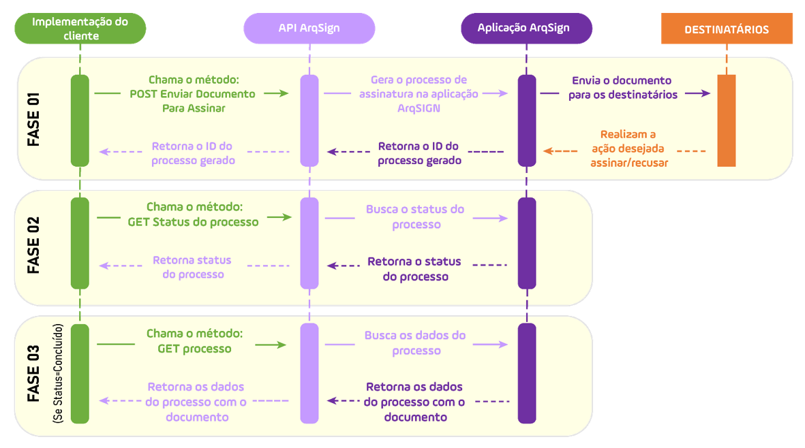

# 🔳 Fluxo ideal considerando alguns métodos disponíveis

As funções fundamentais de uma API compreendem a obtenção, o envio, a alteração e a exclusão de informações. Isso ocorre quando um aplicativo de cliente ou parceiro envia uma solicitação ao aplicativo ArqSign, que por sua vez gera uma resposta.

Abaixo mostramos um fluxo ideal para implementação de três métodos dos disponíveis:

<figure><figcaption>
Clique na imagem para ampliar.
</figcaption></figure>

**FASE 01:** A aplicação do cliente chama o método [<mark style="background-color:blue;">**POST**</mark>**/api/v2/processo/enviar-documento-para-assinar**](metodos-disponiveis-na-api/1.-processo/1.1.post-api-v2-processo-enviar-documento-para-assinar.md) para enviar um documento a ser assinado. Com a resposta de sucesso, a API retornará o ID do processo gerado e você deve guardá-lo para usar este ID como parâmetro nos outros métodos.

**FASE 02:** A aplicação do cliente chama o método [<mark style="background-color:blue;">**GET**</mark>**/api/v1/processo/{idProcesso}/status-do-processo**](metodos-disponiveis-na-api/1.-processo/1.4.get-api-v1-processo-idprocesso-status-do-processo.md) para monitorar o status do processo gerado na Fase 01. Aconselhamos chamar este método no máximo 1x ao dia, não é necessário chamá-lo o tempo todo, uma vez que o status de um processo somente será concluído após a assinatura do documento por todos os signatários.

**FASE 03:** Assim que o processo estiver com o status “Concluído”, você pode passar para a fase 03, quando chamará o método [<mark style="background-color:blue;">**GET**</mark>**/api/v2/processo/{idProcesso}**](metodos-disponiveis-na-api/1.-processo/1.2.get-api-v2-processo-idprocesso.md) para obter os dados completos do processo e o arquivo assinado.
