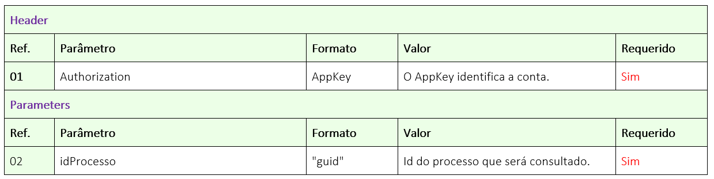

# ✔️ 1.4.GET/api/v1/processo/{idProcesso}/status-do-processo

O objetivo deste método é permitir que o usuário busque o status de um processo de assinatura, para que evite buscar o processo como um todo pelo método “GET/api/v1/processo/{idprocesso}” antes que este esteja com status “Concluído”.

Neste método o usuário irá nos enviar o ID do Processo, e nós retornaremos um JSON com o nome e status atual do mesmo.

## Requisição

<figure><figcaption><p>Clique na imagem para ampliar.</p></figcaption></figure>

### Detalhamento do Header e Parameters

**Ref. 01:** “AppKey” é a chave de autorização para se autenticar na API. Esta chave deve ser válida e estar vinculada a uma conta ArqSign ativa.

**Ref. 02:** “idProcesso” - Para se obter o status do processo, deve ser enviado como parâmetro o Id do Processo de assinatura na plataforma ArqSign. Este ID a API devolve como retorno de sucesso, após a chamada do método: [<mark style="background-color:green;">**POST**</mark>**/api/v2/processo/enviar-documento-para-assinar.**](1.1.post-api-v2-processo-enviar-documento-para-assinar.md)

***

## Validações gerais

O sistema verifica se a AppKey existe, é válida e o status da conta está ativo.

## **Retorno validações**

### Erro: 400 - Bad Request&#x20;

Este erro é retornado quando não for possível interpretar a requisição e/ou o servidor tenta processar a solicitação, mas algum parâmetro da solicitação não é válido, por exemplo, um recurso formatado incorretamente ou uma tentativa de requisição com dados faltantes. As informações sobre a solicitação são fornecidas no corpo da resposta e incluem um código de erro e uma mensagem de erro.&#x20;

1. **Item obrigatório:** Esta mensagem é exibida no singular ou plural quando um ou mais itens obrigatórios não tiver sido enviado na chamada da API.&#x20;
2. **Formato incorreto:** Esta mensagem é exibida no singular ou plural quando um ou mais itens estiverem sido enviados com formato incorreto.&#x20;
3. **Ids inexistente:** Esta mensagem é exibida no singular ou plural quando um ou mais Id enviado não existir.&#x20;
4. **Documento excluído:** Esta mensagem será exibida quando o documento retornar estive excluído logicamente.&#x20;
5. **Algum parâmetro está incorreto ou é inexistente:** Esta mensagem é exibida quando a chamada é feita com algum parâmetro escrito errado ou quando é enviado uma informação que não existe no método.&#x20;

### **Erro: 401 – Unauthorized**&#x20;

Este erro é retornado quando a chave de autenticação da API ArqSign está incorreta ou não foi informada corretamente. &#x20;

### Erro: 404 - Not Found&#x20;

Este erro é retornado quando o recurso solicitado ou o endpoint não foi localizado.&#x20;

### Erro: 422 - Unprocessable&#x20;

Este erro é retornado quando a requisição foi recebida com sucesso, porém contém parâmetros inválidos. &#x20;

### Erro: 500 - Server Error&#x20;

Este erro é retornado quando:&#x20;

* Ocorre um erro interno no servidor,&#x20;
* Ocorre uma falha na plataforma ArqSign,&#x20;
* Formato do JSON incorreto.

## Retorno de sucesso&#x20;

Status 200 - Success

O sistema deve retornar o status do processo no idioma do usuário remetente (IdResponsável).&#x20;

<figure><figcaption></figcaption></figure>

**nomeProcesso**&#x20;

O sistema retorna o nome do processo.&#x20;

**status**&#x20;

O sistema retorna o status do processo.&#x20;

**idStatus**&#x20;

O sistema retorna o id do status do processo. &#x20;

**expirado**&#x20;

O sistema retorna se o processo está expirado ou não.&#x20;

1 = true ou 0 = False&#x20;


&#x20;Somente processos com status Aguardando ou Em processo possuem o parâmetro expirado = true.


## Retorno - Exemplo Body

```json
{ 
    "nomeProcesso": "string", 
    "status": "string", 
    "idStatus": "tinyint", 
    "expirado":"bit" 
} 
```
