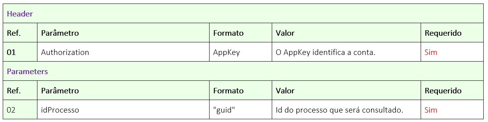

# ✔️ 1.4.GET/api/v1/processo/{idProcesso}/status-do-processo

O objetivo deste método é permitir que o usuário busque o status de um processo de assinatura, para que evite buscar o processo como um todo pelo método “GET/api/v1/processo/{idprocesso}” antes que este esteja com status “Concluído”.

Neste método o usuário irá nos enviar o ID do Processo, e nós retornaremos um JSON com o nome e status atual do mesmo.

## Requisição

<figure><figcaption>
Clique na imagem para ampliar.
</figcaption></figure>

### Detalhamento do Header e Parameters

**Ref. 01:** “AppKey” é a chave de autorização para se autenticar na API. Esta chave deve ser válida e estar vinculada a uma conta ArqSign ativa.

**Ref. 02:** “idProcesso” - Para se obter o status do processo, deve ser enviado como parâmetro o Id do Processo de assinatura na plataforma ArqSign. Este ID a API devolve como retorno de sucesso, após a chamada do método: [<mark style="background-color:green;">**POST**</mark>**/api/v2/processo/enviar-documento-para-assinar.**](1.1.post-api-v2-processo-enviar-documento-para-assinar.md)

***

## Retorno

<figure><figcaption>
Clique na imagem para ampliar.
</figcaption></figure>

### Detalhamento do Retorno

**Ref. 01 - Código 201:** Como retorno de sucesso, a aplicação retornará o código 201 juntamente com o nome e o status do processo.

Status do processo:&#x20;

1. Criado
2. Aguardando
3. Em processo
4. Concluído
5. Cancelado


O serviço "**/api/v1/processo/{idprocesso}"** retorna os dados do processo e no objeto **"signatarios.dadosAssinatura"** há informações da assinatura de cada signatário.

Caso esteja "**null"** significa que o signatário **não assinou** ainda.&#x20;

Então <mark style="color:red;">**null = Pendente**</mark>

Se tiver dados da assinatura, significa que o signatário assinou.&#x20;

Então **presença de dados = Assinad**<mark style="color:green;">**o**</mark>


**Ref. 02 - Código 400:** _Mensagem de Item obrigatório:_ Esta mensagem será exibida no singular ou plural quando um ou mais itens obrigatórios não tiver sido enviado na chamada da API.

**Ref. 03 - Código 400:** _Mensagem de formato incorreto:_ Esta mensagem será exibida no singular ou plural quando um ou mais itens estiverem sido enviados com formato incorreto.

**Ref. 04 - Código 400:** _Mensagem de Ids inexistente:_ Esta mensagem será exibida no singular ou plural quando um ou mais Id enviado não existir.

**Ref. 05 - Código 400:** _Mensagem de Documento excluído:_ Esta mensagem será exibida quando o processo em questão tiver sido excluído logicamente.

**Ref. 06 - Código 400:** _Mensagem de parâmetro incorreto ou inexistente:_ Quando a chamada é feita com algum parâmetro escrito errado ou parâmetro que não existe no método.

**Ref. 07 - Código 401:** _Mensagem de usuário da API não autorizado:_ AppKey inválida ou não localizada.
