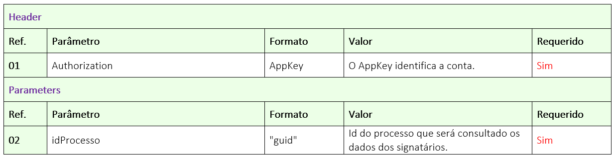

# ✔️ 1.5.GET/api/v1/processo/{idprocesso}/dados-signatarios

O objetivo deste método é permitir que o usuário busque os dados dos signatários que possuem ação de assinar eletronicamente em um processo de assinatura.

Neste método o usuário irá nos enviar o ID do Processo, e nós retornaremos um JSON completo com as informações do processo e dos signatários.

## Requisição

<figure><figcaption><p>Clique na imagem para ampliar.</p></figcaption></figure>

### Detalhamento do Header e Parameters

**Ref. 01:** “AppKey” é a chave de autorização para se autenticar na API. Esta chave deve ser válida e estar vinculada a uma conta ArqSign ativa.

**Ref. 02:** “idProcesso” - Para se obter o status do processo deve ser enviado como parâmetro o ID do processo de assinatura na plataforma ArqSign. Este ID a API devolve como retorno de sucesso, após a chamada do método: [<mark style="background-color:green;">**POST**</mark>**/api/v2/processo/enviar-documento-para-assinar**.](1.1.post-api-v2-processo-enviar-documento-para-assinar.md)

Outra forma de obter o ID do processo e por meio da plataforma ArqSign, na opção “Histórico” do documento disponível nas caixas de [Entrada](../../../../../caixa-postal/caixa-de-entrada.md), [Enviados](../../../../../caixa-postal/enviados.md) e [Excluídos](../../../../../caixa-postal/excluidos.md).&#x20;

***

## Validações Gerais

O sistema deve verificar se a AppKey existe, é válida e a conta está com status ativo.

## Retorno validações

### Erro: 400 - Bad Request

Este erro é retornado quando não for possível interpretar a requisição e/ou o servidor tenta processar a solicitação, mas algum parâmetro da solicitação não é válido, por exemplo, um recurso formatado incorretamente ou uma tentativa de requisição com dados faltantes. As informações sobre a solicitação são fornecidas no corpo da resposta e incluem um código de erro e uma mensagem de erro.&#x20;

&#x20;

1. **Item obrigatório:** Esta mensagem é exibida no singular ou plural quando um ou mais itens obrigatórios não tiver sido enviado na chamada da API.&#x20;
2. **Formato incorreto:** Esta mensagem é exibida no singular ou plural quando um ou mais itens estiverem sido enviados com formato incorreto.&#x20;
3. **Ids inexistente:** Esta mensagem é exibida no singular ou plural quando um ou mais Id enviado não existir.&#x20;
4. **Documento excluído:** Esta mensagem será exibida quando o documento retornar estive excluído logicamente.&#x20;
5. **Algum parâmetro está incorreto ou é inexistente:** Esta mensagem é exibida quando a chamada é feita com algum parâmetro escrito errado ou quando é enviado uma informação que não existe no método.

### Erro: 401 – Unauthorized&#x20;

Este erro é retornado quando a chave de autenticação da API ArqSign está incorreta ou não foi informada corretamente. &#x20;

### Erro: 404 - Not Found&#x20;

Este erro é retornado quando o recurso solicitado ou o endpoint não foi localizado.&#x20;

### Erro: 422 - Unprocessable&#x20;

Este erro é retornado quando a requisição foi recebida com sucesso, porém contém parâmetros inválidos. &#x20;

### Erro: 500  - Server Error&#x20;

Este erro é retornado quando:&#x20;

* Ocorre um erro interno no servidor,&#x20;
* Ocorre uma falha na plataforma ArqSign,&#x20;
* Formato do JSON incorreto. &#x20;

## Retorno de sucesso

Status 200 - Success&#x20;

O sistema retorna os dados dos signatários do processo com ação de **Assinar Online**.&#x20;

<figure><figcaption></figcaption></figure>

#### **nomeProcesso**&#x20;

O sistema retorna o nome do processo.&#x20;

#### **status**&#x20;

O sistema retorna o status do processo.&#x20;

#### **idStatus**&#x20;

O sistema retorna o id do status do processo.&#x20;

#### **dataConclusao**&#x20;

O sistema retorna a data de conclusão do processo, se houver&#x20;

#### **dataCancelamento**&#x20;

O sistema retorna a data de cancelamento do processo, se houver&#x20;

#### **usuarioCancelamento**&#x20;

O sistema retorna o nome do usuário quem cancelou o processo, se houver&#x20;

#### **dataExpiracao**&#x20;

O sistema retorna a data de expiração do processo, conforme a configuração e a data de envio/reenvio do documento. &#x20;

Se **dataReenvio** for igual a null, então  **dataExpiracao = dataEnvio + ExpiracaoDias**&#x20;

Se **dataReenvio** for diferente de null, então  **dataExpiracao = dataReenvio + expiracaoDias**&#x20;

#### **signatários**&#x20;

Nesta parte do JSON, o sistema retorna os dados dos signatários do processo.&#x20;

> **ordem**&#x20;
>
> O sistema retorna a ordem de assinatura do signatário.&#x20;

> **idProcessoDestinatario**&#x20;
>
> O sistema retorna o id do processo destinatário.&#x20;

> **nome**
>
> O sistema retorna nome do signatário.&#x20;

> **idTipoAssinatura**&#x20;
>
> O sistema retorna o tipo de assinatura do signatário.&#x20;
>
> 1 - Assinatura Eletrônica&#x20;
>
> 3 - Certificado Digital - ICP Brasil&#x20;
>
> 4 - Certificado Digital - Outros&#x20;

> **idFormaEnvioProcesso**&#x20;
>
> O sistema retorna a forma de envio do processo para o signatário.&#x20;
>
> 1 - E-mail&#x20;
>
> 2 - Whatsapp&#x20;

> **email**&#x20;
>
> O sistema retorna e-mail do signatário o qual o processo foi enviado.&#x20;

> **telefone**&#x20;
>
> O sistema retorna o telefone do signatário para o qual o processo foi enviado.&#x20;

> **papelSignatario**&#x20;
>
> 1. **pessoaFisica**&#x20;
>
> O sistema retorna os papeis do signatário como pessoa física, se houver.&#x20;
>
> 2. **pessoaJuridica**
>
> O sistema retorna os papeis do signatário como pessoa jurídica, se houver.&#x20;

> **tipoAcao**
>
> O sistema retorna o tipo de ação do signatário no processo. &#x20;

> **idTipoAcao**
>
> O sistema retorna o id do tipo de ação do signatário no processo. &#x20;

> **idMeioEnvioCodigoSeguranca**&#x20;
>
> O sistema retorna o id do meio de envio do código de segurança, se houver.&#x20;
>
> 1- SMS (Somente Brasil)&#x20;
>
> 2 - Whatsapp&#x20;
>
> 3 - Email&#x20;
>
> 4 - Não enviar&#x20;

> **emailSeguranca**&#x20;
>
> O sistema retorna o email que o código de segurança foi enviado.&#x20;

> **telefoneSeguranca**&#x20;
>
> O sistema retorna o telefone que o código de segurança foi enviado.&#x20;

> **permitirReenviarCodigo**&#x20;
>
> O sistema retorna a informação se permite o reenvio do código de segurança. &#x20;
>
> 1 = true ou 0 = False&#x20;

> **falhaEnvio**&#x20;
>
> O sistema retorna a informação se houve falha no envio do processo.  &#x20;
>
> 1= true ou 0 = false. &#x20;

> **falhaEnvioCodigoSeguranca**&#x20;
>
> O sistema retorna a informação se houve falha no envio do código de segurança.  &#x20;
>
> 1= true ou 0 = false. &#x20;

> **assinado**&#x20;
>
> O sistema retorna a informação se o signatário assinou os documentos. &#x20;
>
> 1 = true ou 0 = False.&#x20;

> **dataAssinatura**&#x20;
>
> O sistema retorna a data da assinatura, se houver.&#x20;

> **assinaturaRecusada**&#x20;
>
> O sistema retorna a informação se a assinatura foi recusada ou não.&#x20;
>
> 1= true ou 0 = False&#x20;

> **motivoRecusa**&#x20;
>
> O sistema retorna o motivo da recusa, se houver. &#x20;

> **anexos**&#x20;
>
> O sistema retorna os dados dos anexos dos signatários, se houver.&#x20;
>
> 1. **id**
>
> O sistema retorna o id do anexo do signatário. &#x20;
>
> 2. **anexoDocumentoNome**&#x20;
>
> O sistema retorna o **nome do signatários + nome configuração + o nome anexo do signatário (com a extensão).** &#x20;

### Exemplo de JSON de Retorno

**Exemplo Body**

```json
{ 
    "nomeProcesso": "string", 
    "status": "string", 
    "idStatus": "tinyint", 
    "dataConclusao": "datetime", 
    "dataCancelamento": "datetime", 
    "usuarioCancelamento": "string", 
    "dataExpiracao": "datetime", 
    "signatarios": [ 
        { 
            "ordem": "tinyint", 
            "IdProcessoDestinatario": "guid", 
            "nome": "string", 
            "idTipoAssinatura": "tinyint", 
            "IdFormaEnvioProcesso": "bit", 
            "email": "string", 
            "telefone": "string", 
            "papelSignatario": { 
                "pessoaFisica": [ 
                    "varchar(50)", 
                    "varchar(50)", 
                    "varchar(50)" 
                ], 
                "pessoaJuridica": [ 
                    "varchar(50)" 
                ] 
            }, 
            "tipoAcao": "string", 
            "idTipoAcao": "tinyint", 
            "IdMeioEnvioCodigoSeguranca": "bit", 
            "emailSeguranca": "string", 
            "telefoneSeguranca": "string", 
            "permitirReenviarCodigo": "bit", 
            "falhaEnvio": "bit", 
            "falhaEnvioCodigoSeguranca": "bit", 
            "assinado": "bit", 
            "dataAssinatura": "datetime"    
            "assinaturaRecusada": "bit", 
            "motivoRecusa": "string",   
            "anexos": [ 
                { 
                    "id": "guid", 
                    "anexoDocumentoNome": "string" 
                } 
            ] 
        } 
    ] 
} 
```
