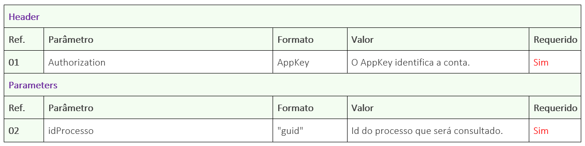
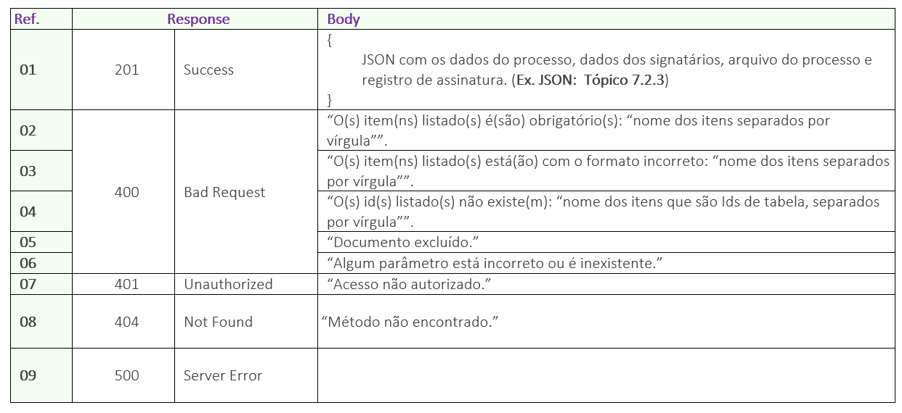

# ✔️ GET/api/v1/processo/{idprocesso}


<mark style="color:red;">Este método possui uma versão atualizada disponível para uso.</mark>&#x20;

<mark style="color:red;">Se você vai utilizar o método pela primeira vez, o ideal é iniciar utilizando a versão mais recente, disponível em</mark> [<mark style="color:red;">**GET/api/v2/processo/{idProcesso}**</mark>](get-api-v2-processo-idprocesso.md)<mark style="color:red;">**.**</mark>

<mark style="color:red;">Para aqueles que já utilizam o método na versão 1, a funcionalidade permanece a mesma, o que ocorre agora é que esta versão não contará com novas funcionalidades. Cabe ao cliente avaliar o uso e definir por manter a utilização da versão 1 ou migrar para a versão 2.</mark>


Para evitar que o método retorne documentos ainda não assinados ou em processo de assinatura, utilize o método de buscar o status do processo para checar se o processo em questão se encontra com o status “Concluído”.

Neste método o usuário irá nos enviar o ID do Processo, e nós retornaremos um JSON completo com as informações do processo.


<mark style="color:orange;">Importante ressaltar que esta versão do serviço não busca processos com mais de um documento</mark> <mark style="color:orange;"></mark><mark style="color:orange;">**sem agrupamento**</mark><mark style="color:orange;">. Para buscar processos com mais de um documento sem agrupamento, é preciso utilizar a</mark> <mark style="color:orange;"></mark><mark style="color:orange;">**versão 2**</mark> <mark style="color:orange;"></mark><mark style="color:orange;">do serviço:</mark> <mark style="color:orange;"></mark> [<mark style="color:orange;">**GET/api/v2/processo/{idProcesso}**</mark>](get-api-v2-processo-idprocesso.md)


## Requisição

<figure><figcaption><p>Clique na imagem para ampliar.</p></figcaption></figure>

### Detalhamento do Header e Parameters

**Ref. 01:** “AppKey” é a chave de autorização para se autenticar na API. Esta chave deve ser válida e estar vinculada a uma conta ArqSIGN ativa.

**Ref. 02:** “idProcesso” - Para se obter os dados do processo, deve ser enviado como parâmetro o Id do Processo de assinatura na plataforma ArqSIGN. Este ID a API devolve como retorno de sucesso, após a chamada do método: [<mark style="background-color:green;">**POST**</mark>**​/api​/v1​/processo​/enviar-documento-para-assinar**](post-api-v1-processo-enviar-documento-para-assinar.md)**.**

***

## Retorno​

<figure><figcaption><p>Clique na imagem para ampliar.</p></figcaption></figure>

### Detalhamento do Retorno

**Ref. 01 - Código 201:** Como retorno de sucesso, a aplicação retornará o código 201 juntamente com os dados completos do processo no formato JSON.

**Ref. 02 - Código 400:** _Mensagem de item obrigatório:_ Esta mensagem será exibida no singular ou plural quando um ou mais itens obrigatórios não tiver sido enviado na chamada da API.

**Ref. 03 - Código 400:** _Mensagem de formato incorreto:_ Esta mensagem será exibida no singular ou plural quando um ou mais itens estiverem sido enviados com formato incorreto.

**Ref. 04 - Código 400:** _Mensagem de Ids inexistente:_ Esta mensagem será exibida no singular ou plural quando um ou mais Id enviado não existir.

**Ref. 05 - Código 400:** _Mensagem de documento excluído:_ Esta mensagem será exibida quando o processo em questão tiver sido excluído logicamente.

**Ref. 06 - Código 400:** _Mensagem de parâmetro está incorreto ou é inexistente:_ Quando a chamada é feita com algum parâmetro escrito errado ou parâmetro que não existe no método.

**Ref. 07 - Código 401:** _Mensagem de usuário da API não autorizado:_ AppKey inválida ou não localizada.

### Exemplo de JSON de Retorno <a href="#toc112750310" id="toc112750310"></a>

**Exemplo Body**

```
{  
    "nomeProcesso": "string",
    "idResponsavel": "guid",
    "nomeResponsavel": "string",
    "idPasta": "guid",
    "caminhoDaPasta": "string",
    "status": "string", 
    "dataCadastro": "datetime", 
    "dataEnvio": "datetime", 
    "dataConclusao": "datetime", 
    "dataRenovacao": "datetime",
    "dataCancelamento": "datetime",
    "usuarioCancelamento": "string",
    "dataReenvio":  "datetime", 
    "dataExpiracao": "datetime",
    "expiracaoDias": "smallint",
    "avisoExpiracaoDias": "smallint",
    "lembrete":"true", 
    "frequenciaLembrete": "smallint",
    "signatarios": 
    [
        {
            "ordem":"tinyint",
            "id": "guid",
            "nome": "string",
            "email": "string",
            "telefone": "string",
            "aguardandoEnvio":"string",
            "falhaEnvio":"string",  
            "tipoAcao": "string", 
            "copiaEnviada": "string", 
            "remetente": "string", 
            "assinaturaRecusada": "string", 
            "motivoRecusa": "string",      
            "seguranca":
            {
                "codigoSeguranca": "string",
                "codigoSegurancaEmail": "string",
                "codigoSegurancaTelefone": "string"       
            },        
            "dadosAssinatura":   
            {    
"tipoAssinatura": "string", 
                "dataAssinatura": "datetime", 
                "ip": "string",
                "geoLocalizacao": "string",                
                "dadosCertificado": 
                {
                    "nome": "string",
                    "emissor": "string",
                    "validadeInicio": "string",
                    "validadeFim": "string"
                },            
                "dadoPessoaFisica": 
                {
                    "tipoDocumentoPF": "string",
                    "documetoPF": "string",
                    "nomePF": "string"

                },                
                "dadoPessoaJuridica": 
                {
                    "tipoDocumentoPJ": "string",
                    "documetoPJ": "string",
                    "nomePJ": "string"
                },            
                "anexos":
                [
                    {
                        "id": "guid",
                        "nome": "string"
                    }
                ]                
            }
        }
    ],    
    "documento":
    {
        "nomeComExtensao": "string",
        "contentType": "string",
        "documento":"string base64"
    },
    "registroAssinaturas":
    {
        "nome": "string",
        "arquivo": "string base64" 
    }
}
```

