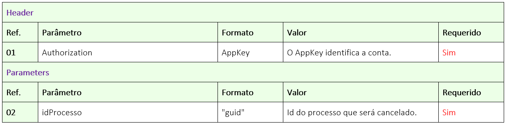
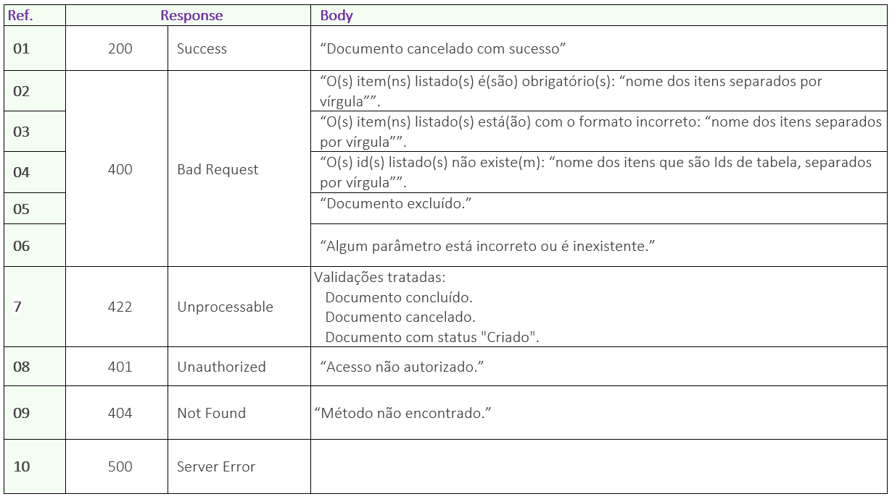

# ✔️ PATCH/api/v1/processo/{idProcesso}/cancelar-processo

O objetivo deste método é permitir que o usuário cancele o processo de assinatura que esteja em andamento.

Neste método o usuário irá nos enviar o ID do Processo, e nós cancelaremos o processo informado.

## Requisição

<figure><figcaption>
Clique na imagem para ampliar.
</figcaption></figure>

***

## Retorno

<figure><figcaption>
Clique na imagem para ampliar.
</figcaption></figure>

### Detalhamento do Retorno

**Ref. 01 - Código 200:** Como retorno de sucesso, a aplicação retornará o código 200 juntamente com a mensagem de documento cancelado com sucesso.

**Ref. 02 - Código 400:** _Mensagem de item obrigatório:_ Esta mensagem será exibida no singular ou plural quando um ou mais itens obrigatórios não tiver sido enviado na chamada da API.

**Ref. 03 - Código 400:** _Mensagem de formato incorreto:_ Esta mensagem será exibida no singular ou plural quando um ou mais itens estiverem sido enviados com formato incorreto.

**Ref. 04 - Código 400:** _Mensagem de Ids inexistente:_ Esta mensagem será exibida no singular ou plural quando um ou mais Id enviado não existir.

**Ref. 05 - Código 400:** _Mensagem de documento excluído:_ Esta mensagem será exibida quando o processo em questão tiver sido excluído logicamente.

**Ref. 06 - Código 400:** _Mensagem de parâmetro está incorreto ou é inexistente_: Quando a chamada é feita com algum parâmetro escrito errado ou parâmetro que não existe no método.

**Ref. 07 - Código 422:** _Mensagem validações:_ Estas mensagens serão exibidas quando o usuário informar um  com status diferente de Aguardando ou Em processo.

**Ref. 08 - Código 401:** _Mensagem de usuário da API não autorizado:_ AppKey inválida ou não localizada.
