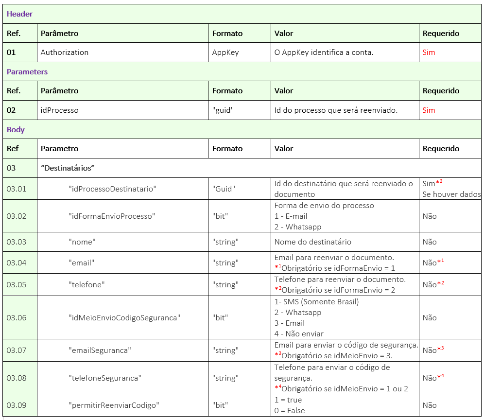
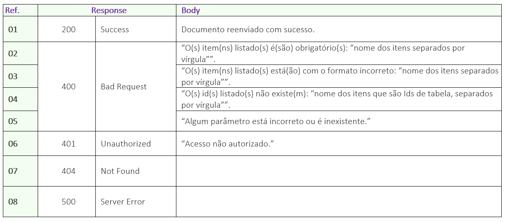

# ✔️ PATCH/api/v1/processo/{idProcesso}/reenviar-processo

O objetivo deste método é permitir que o usuário reenvie o processo para os destinatários pendentes de assinaturas na ordem atual.&#x20;

O usuário poderá informar para qual destinatário pendente de assinatura deseja reenviar o documento. Caso não informe os destinatários, o serviço reenvia o processo para todos os destinatários participantes do processo com ação de assinar eletronicamente e que estejam pendentes de assinaturas na ordem atual.

Além disso, o usuário poderá editar os destinatários pendentes de assinatura para os quais deseja reenviar o processo.

Neste método o usuário irá nos enviar o ID do Processo, e nós reenviaremos para os destinatários pendentes de assinatura na ordem de assinatura atual, conforme dados informados no JSON.

## Requisição

<figure><figcaption>
Clique na imagem para ampliar.
</figcaption></figure>

**Geral:** Os parâmetros não obrigatórios listados abaixo devem constar no JSON, e caso não seja necessário para o documento, enviar com o valor null na frente:

&#x20;    \-> Ref. 03: “Destinatarios” - Caso não informe os destinatários, o serviço reenvia o processo para todos os destinatários participantes do processo com ação de assinar online e que estejam pendentes de assinaturas na ordem atual.

&#x20;    \-> Ref. 03.02 “idFormaEnvioProcesso” - é  possível alterar a forma de entrega do documento, mas não é obrigatório.

&#x20;    \-> Ref. 03.03 “nome”

&#x20;    \-> Ref. 03.06 “idMeioEnvioCodigoSeguranca” - é  possível alterar a forma de entrega tanto do código de segurança, mas não é obrigatório.


<mark style="color:red;">**Não é permitido inserir código de  segurança para destinatários que não possuem essa configuração. É permitido apenas alterar a forma de entrega do código de segurança para os destinatários que já possuem essa configuração.**</mark>


&#x20;    \-> Ref. 03.09 “permitirReenviarCodigo”

### Detalhamento do Header, Parameters e Body

**Ref. 01:** “AppKey” é a chave de autorização para se autenticar na API. Esta chave deve ser válida e estar vinculada a uma conta ArqSign ativa.

**Ref. 02:** “idProcesso” - Para reenviar o processo, deve ser enviado como parâmetro o Id do Processo de assinatura na plataforma ArqSign. Este ID a API devolve como retorno de sucesso, após a chamada do método: [<mark style="background-color:green;">**POST​**</mark>**/api​/v1​/processo​/enviar-documento-para-assinar**](post-api-v1-processo-enviar-documento-para-assinar.md). Outra forma de obter o ID do processo e por meio da plataforma ArqSign, na opção “Histórico” do documento disponível nas caixas de [Entrada](../../../../caixa-postal/caixa-de-entrada.md), [Enviados](../../../../caixa-postal/enviados.md) e [Excluídos](../../../../caixa-postal/excluidos.md).&#x20;

**Ref. 03:** “Destinatarios” - nesta parte do JSON devem ser definidos os destinatários, os quais serão reenviado o documento, podendo ser alterados ou não.

**Ref. 03.01:** “idProcessoDestinatario” - neste campo deve ser enviado o Id do destinatário que será reenviado o documento.

**Ref. 03.04:** “email” - quando no JSON, o campo “idFormaEnvio” estiver com o valor 1 = E-mail, é necessário enviar neste campo a informação do email que o destinatário recebeu o documento ou o novo email será reenviado o documento .

**Ref. 03.05:** “telefone” - quando no JSON, o campo “idFormaEnvio” estiver com o valor 2 = WhatsApp, é necessário enviar neste campo a informação do telefone que o destinatário recebeu o documento ou o novo telefone será reenviado o documento .

**Ref. 03.07:** “emailSeguranca” - quando no JSON, o campo “idMeioEnvioCodigoSeguranca” estiver com o valor 3 = Email, é necessário enviar neste campo a informação do e-mail que o destinatário recebeu o documento ou o novo e-mail será reenviado o documento .

**Ref. 03.08:** “telefoneSeguranca” quando no JSON, o campo “idMeioEnvioCodigoSeguranca” estiver com o valor 1 = SMS  ou 2 = WhatsApp, é necessário enviar neste campo a informação do telefone que o destinatário recebeu o documento ou o novo telefone será reenviado o documento.

***

## Retorno

<figure><figcaption>
Clique na imagem para ampliar.
</figcaption></figure>

### Detalhamento do Retorno

**Ref. 01 - Código 200:** Como retorno de sucesso, a aplicação retornará o código 200 juntamente com a mensagem de documento reenviado com sucesso.

**Ref. 02 - Código 400:** _Mensagem de item obrigatório:_ Esta mensagem será exibida no singular ou plural quando um ou mais itens obrigatórios não tiver sido enviado na chamada da API.

**Ref. 03 - Código 400:** _Mensagem de formato incorreto:_ Esta mensagem será exibida no singular ou plural quando um ou mais itens estiverem sido enviados com formato incorreto.

**Ref. 04 - Código 400:** _Mensagem de Ids inexistentes_: Esta mensagem será exibida no singular ou plural quando um ou mais Id enviado não existir.

**Ref. 05 - Código 400:** _Mensagem de parâmetro está incorreto ou é inexistente:_ Quando a chamada é feita com algum parâmetro escrito errado ou parâmetro que não existe no método.

**Ref. 07 - Código 401:** _Mensagem de usuário da API não autorizado:_ AppKey inválida ou não localizada.
