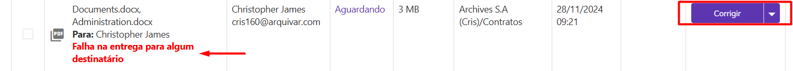

# ✔️ POST api/v1/usuarios/buscar-usuarios

Este serviço permite buscar dados dos **usuários** da conta.

## Requisição

&#x20;**Orientações:**

Quando campo requerido estiver como “Sim” = Sempre requerido

Quando campo requerido estiver como “Não” = Informação Opcional

Quando campo requerido estiver como “Talvez” = Em alguns casos ele será requerido. Para saber estes casos, consultar a descrição do tópico das validações específicas.

<figure><figcaption><p>Clique na imagem para ampliar</p></figcaption></figure>

### Exemplo Body Request

```json
{
   "ativos": "bit",//1 - true, 0 = false
   "usuarios": [
    "guid",
    "guid",
    "guid",
    "guid"
     ]
}
```

## Validações

### Validações especificas

**ativos**

> **Descrição:** Parâmetro informando se a busca deve retornar somente os usuários ativos ou não.
>
> **Formato:** Bit: 1 - True, 0 = False
>
> **Requerido: **<mark style="color:red;">**Sim, quando não for informado id de usuário no objeto “usuarios”**</mark>
>
> **Validação:**
>
> a- Quando for **enviado o valor 1 - true**, o sistema **retorna somente os usuários ativos da conta**, ordenado alfabeticamente pelo nome.
>
> b- Quando for **enviado o valor 0 - false ou não for enviado**, o sistema **retorna todos os usuários da conta (ativos, bloqueados, inativos)**, ordenado alfabeticamente pelo nome.
>
> c- É obrigatório informar o parâmetro **ativos** quando não informar id’s de usuários no objeto “**usuarios**”.
>
> d- Quando for informado id de usuário no objeto “**usuarios**”, o sistema desconsidera os dados do **parâmetro ativos**, se houver, retornando os dados dos usuários informados, ordenado alfabeticamente pelo nome.

**usuarios**

> **Descrição:** É opcional informar id’s de usurários para consultar.
>
> Caso o usuário **não informe id de usuário no JSON**, o sistema **retorna todos os usuários da conta**, conforme o **parâmetro ativos**, ordenado alfabeticamente.
>
> Caso o usuário **informe um ou mais id’s de usuário no JSON**, o sistema **retorna os dados dos usuários** informados, ordenado alfabeticamente.
>
> **Formato:** Guid
>
> **Requerido: **<mark style="color:blue;">**Não**</mark>
>
> **Validação:**
>
> a- Quando for informado id de usuário, o sistema valida se o **idUsuario** pertence a conta.
>
> **Obs.:** Se ao menos um usuário for da conta, o sistema retorna os dados desse usuário.

### Validações gerais

1- O usuário deve informar a  AppKey da conta que está buscando os dados dos usuários.

&#x20;2- Somente conta com status Ativo pode buscar dados dos usuários da conta via integração ArqSign.
