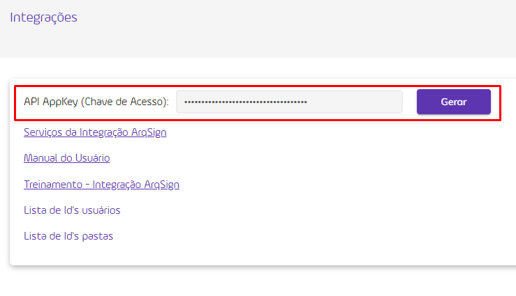

# 🔳 Requisitos para uso da API

1. [Acesse sua conta](../../../#pagina-de-login-autenticacao-na-plataforma-arqsign) ou crie uma [conta teste grátis](../../../#criacao-de-conta-teste-gratis) na Plataforma ArqSign. Depois de autenticado, clique no [menu Integrações e acesse sua API AppKey](../#api-key-chave-de-acesso), ID de usuário e ID de pasta.

<figure><figcaption></figcaption></figure>

2. Para testes, use a ferramenta Postman e para Authorization use o tipo AppKey.

<figure><figcaption>
Clique na imagem para ampliar.
</figcaption></figure>

#### Requisitos

* Ter uma conta na plataforma ArqSign ativa.
* Ter uma [chave de acesso a API válida](../#api-key-chave-de-acesso). Esta chave chamamos de AppKey.
* Para o método [<mark style="background-color:green;">**POST**</mark>**/api/v1/processo/enviar-documento-para-assinar**](broken-reference), será necessário ter em mãos:

&#x20;    _-> ID de um usuário da conta com status ativo: para ser responsável pelos documentos que serão enviados pela API._ &#x20;

&#x20;    _-> ID de pasta: onde o documento a ser gerado deve ser armazenado na plataforma._

* Para o método [<mark style="color:blue;background-color:green;">**POST**</mark><mark style="color:blue;">**/api/v2/processo/enviar-documento-para-assinar**</mark>](https://app.gitbook.com/o/Ai1YjbPQxIuvTaVzoZ4H/s/NkvKZtdmOiilgqExqFNO/\~/changes/52/administracao/integracoes/metodos-disponiveis-na-api-1/post-api-v2-processo-enviar-documento-para-assinar), será necessário:

&#x20;     _-> Conta com status ativo e com permissão de Integração ArqSign._

&#x20;     _-> A conta deve possuir créditos de Envios, SMS e/ou WhatsApp, conforme necessidade. Caso a conta não possua crédito, o sistema retorna com mensagem de "saldo de créditos de Envios ou WhatsApp ou SMS insuficientes._


<mark style="color:orange;">**A funcionalidade de**</mark> [<mark style="color:blue;">**Diretórios**</mark>](broken-reference) <mark style="color:orange;">**permitirá ao cliente ter várias pastas organizadoras dentro da plataforma.**</mark>

