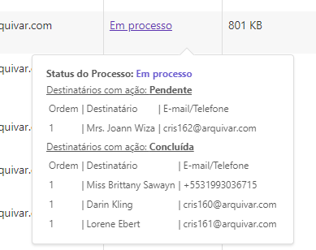
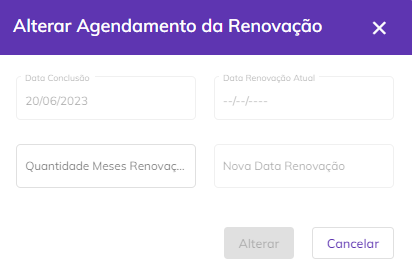
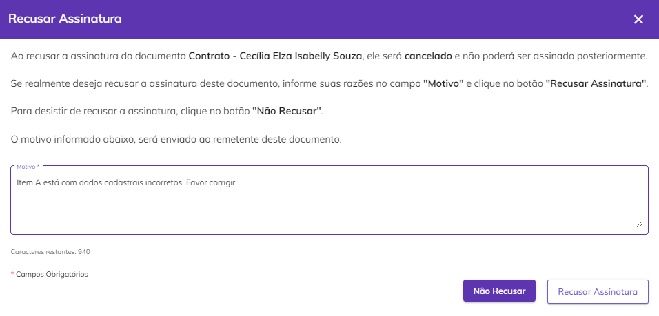

# ✉️ Caixa de Entrada

Na Caixa de Entrada são listados todos os processos nos quais o usuário participa como signatário, ou seja, como quem assina por meio da Plataforma ArqSign.

O signatário de um processo de assinatura pode ser também o remetente do processo e neste caso o processo será exibido tanto na Caixa de Entrada quanto no [menu Enviados](enviados.md).


<mark style="color:orange;">**Não serão exibidos na Caixa de Entrada processos que já tenham expirado, ou seja, cujo prazo para assinatura já tenha terminado.**</mark>


<figure><figcaption></figcaption></figure>

Ao clicar em um processo, será aberta a tela de visualização, que apresenta os documentos enviado, seus status e data de vencimento. No canto direito da tela são apresentadas informações dos signatários como dados pessoais, papel de signatário e status da assinatura.

<figure><figcaption>
Clique na imagem para ampliar.
</figcaption></figure>

***

## Colunas da tela principal - Caixa de Entrada

<figure><figcaption>
Clique na imagem para ampliar.
</figcaption></figure>

**Coluna Nome do Processo:** Nesta coluna são exibidos o nome do processo e o nome do signatário. Se houver mais de um signatário será mostrado o nome do primeiro e a quantidade de outras pessoas que deverão assinar.&#x20;

**Coluna Responsável:** Nesta coluna são apresentados o nome e e-mail de quem enviou o processo (remetente).

**Coluna Status:** Os status possíveis para um processo são: “Aguardando” (nenhum participante assinou até o momento), “Em processo” (um ou mais participantes já assinaram, mas ainda faltam assinaturas) e “Concluído” (todos os participantes já assinaram). Ao passar o mouse sobre o status são exibidas informações sobre quais signatários ainda estão com assinatura pendente e quais já concluíram, além dos dados desses signatários.

<figure><figcaption>
Clique na imagem para ampliar.
</figcaption></figure>

**Coluna Tamanho:** Nesta coluna é exibido o tamanho dos arquivos do processo.&#x20;

**Coluna Pasta:** Nesta coluna é exibida a pasta do diretório onde o processo está armazenado. Caso o usuário não tenha permissão de acesso à pasta, será exibido “Sem pasta”.

**Coluna Enviado:** Informações sobre a data e hora em que o processo foi enviado.

**Coluna Concluído:** Informações sobre a data e hora em que o processo de assinatura foi concluído. Caso ainda não tenha sido concluído esta coluna ficará em branco.

**Coluna Ações:** Esta coluna exibe botões de ação sobre o processo. Esses botões serão exibidos de acordo com o perfil do usuário. Será sempre exibida nesse botão a ação prioritária de execução, de acordo com o perfil do usuário e status do processo.

**Barra de filtro:** É possível localizar um ou mais processos utilizando-se os filtros disponíveis para busca. A busca pode ser feita pelo nome ou e-mail do responsável pelo envio, pelo nome de um dos signatários, pelo status do processo (na Caixa de Entrada só serão exibidos os processos com status “Concluído”, Aguardando” e “Em processo”), pela pasta onde o processo está armazenado ou pela data de conclusão das assinaturas.

<figure><figcaption></figcaption></figure>

***

## Ações individuais - Caixa de Entrada

<figure><figcaption>
Clique na imagem para ampliar.
</figcaption></figure>

#### **Assinar**

Disponível somente se o processo ainda não tiver sido assinado pelo signatário e seja a sua vez de assinar de acordo com a ordem estabelecida pelo remetente, se houver. Ao clicar neste botão o usuário é direcionado para a [tela de assinatura do documento](../menu-superior/assinatura-de-documentos.md).

#### **Histórico**

&#x20;Aqui é possível visualizar o histórico do processo de assinatura e seus documentos. Selecione o botão de eventos para visualizar detalhadamente os dados. Nesta tela também é possível baixar os arquivos originais do processo.

Com o botão de eventos posicionado para a direita, observamos os dados do processo na tela.

<figure><figcaption>
Clique na imagem para ampliar.
</figcaption></figure>

Com o botão de eventos posicionado para a esquerda, é possível visualizar os Id's e Hash's dos documentos, no caso de um **processo com mais de um documento não agrupados**.

<figure><figcaption>
Clique na imagem para ampliar.
</figcaption></figure>

#### **Alterar Pasta**

Esta opção só será exibida se o usuário tiver acesso à conta na qual o processo está armazenado. Ao clicar nesta opção ele poderá alterar a pasta do diretório onde o processo está armazenado.

<figure><figcaption></figcaption></figure>

#### **Alterar Proprietário**

Esta opção só será exibida se o usuário além de signatário for também o remetente do processo. Ao clicar nesta opção ele poderá alterar o proprietário do processo. Ao executar essa ação não será possível realizar outras atividades de gestão do processo.


&#x20;<mark style="color:orange;">**Só podem ser selecionados como novo proprietários usuários cadastrados na mesma conta do responsável.**</mark>&#x20;

<mark style="color:orange;">**O Administrador Global que não for o remetente do processo, poderá alterar a propriedade de processos concluídos que estão listados na funcionalidade**</mark> [<mark style="color:orange;">**Diretórios**</mark>](broken-reference) <mark style="color:orange;">**ou quando for inativar usuário que possui processos em sua propriedade.**</mark>


<figure><figcaption></figcaption></figure>

#### **Baixar Arquivo**

Quando processo possuir um documento ou é um compartilhamento de apenas um documento do processo, **o sistema faz&#x20;**_**download**_ do documento do **processo e do registro de assinaturas** em uma pasta.zip.

A pasta zip é nomeada com o nome do processo e o arquivo de registro de assinatura é nomeado como **NomeDocumento\_Registro** de assinatura.

<figure><figcaption>
Clique na imagem para ampliar.
</figcaption></figure>

Quando o processo **possuir mais de um documento**, o sistema exibe modal com os documentos do processo para o usuário selecionar quais documentos deseja baixar. Caso seja um compartilhamento, deve-se listar apenas os documentos que foram compartilhados.

<figure><figcaption>
Clique na imagem para ampliar.
</figcaption></figure>

O Registro de Assinaturas exibe todas as informações sobre as assinaturas eletrônicas e digitais realizadas durante o processo, como nome dos signatários, data e hora da assinatura, localização, IP de onde foi realizada, dados dos certificados digitais utilizados etc.

<figure><figcaption>
Clique na imagem para ampliar.
</figcaption></figure>

<figure><figcaption>
Clique na imagem para ampliar.
</figcaption></figure>

#### **Cancelar**

Esta opção só será exibida se o usuário além de signatário for também o remetente do processo. Ao clicar nesta opção o processo é cancelado e a sequência de assinaturas é interrompida. Essa opção não será exibida se o status do processo for “Concluído”.

#### **Compartilhar**

Essa opção permite que o usuário crie um link de acesso a um ou mais documentos do processo que poderá ser compartilhado com outras pessoas que não sejam participantes do processo de assinatura. Esse link pode ter prazo de validade determinado ou indeterminado e o usuário pode definir se deseja permitir que as pessoas que acessarem visualizem também os anexos enviados pelos signatários.

Quando o processo com mais de um documento não agrupados não possui compartilhamento de documentos, o sistema abre a _modal_ para o usuário selecionar os documentos do processo que deseja compartilhar.&#x20;

<figure><figcaption>
Clique na imagem para ampliar.
</figcaption></figure>

Quando o processo com mais de um documento possui compartilhamento de documentos, o sistema abre a modal com os links já compartilhados.

<figure><figcaption>
Clique na imagem para ampliar.
</figcaption></figure>

Ao expandir as ações do link de compartilhamento, é possível **visualizar** a tela de compartilhamento novamente ou e **excluir** o compartilhamento realizado.&#x20;

<figure><figcaption>
Clique na imagem para ampliar.
</figcaption></figure>

Ao compartilhar os documentos do processo, o usuário tem a possibilidade de enviá-los por e-mail clicando no botão "Enviar Link por e-mail".

<figure><figcaption>
Clique na imagem para ampliar.
</figcaption></figure>

Adicione no campo indicado todos os e-mails que devem receber a documentação compartilhada.&#x20;

<figure><figcaption>
Clique na imagem para ampliar.
</figcaption></figure>


<mark style="color:red;">Ao compartilhar documentos de um processo, é importante ressaltar que o destinatário do compartilhamento poderá visualizar apenas os documentos selecionados para compartilhamento e não todos os documentos que compõem o processo de assinatura.</mark>


#### Visualização de documentos compartilhados

Quando realizado o compartilhamento de apenas um documento de um processo com mais de um documento não agrupado, ao abrir o documento, será apresentado somente o documento compartilhado com o usuário.

Observe que são apresentados na lista apenas os dados dos signatários:

<figure><figcaption>
CLique na imagem para ampliar.
</figcaption></figure>

Quando realizado o compartilhamento de mais documentos do processo, é apresentado na lista, além dos dados dos signatários, os demais documentos do processo:

<figure><figcaption>
Clique na imagem para ampliar.
</figcaption></figure>

#### **Alterar Agendamento da Renovação**

&#x20;Esta opção só será exibida se o usuário além de signatário for também o remetente do processo. Utilizada para alterar ou incluir um prazo de renovação do processo estipulado anteriormente no menu [Novo Processo > Adicionar Documentos](../menu-superior/novo-processo.md#a.-adicionar-documentos).

<figure><figcaption>
Clique na imagem para ampliar.
</figcaption></figure>

#### **Recusar Assinatura**

Disponível somente se o processo ainda não tiver sido assinado pelo signatário e seja a sua vez de assinar de acordo com a ordem estabelecida pelo remetente, se houver. Utilizado quando por algum motivo o signatário não deseja assinar o processo. Neste caso ele deve inserir uma justificativa para a recusa e clicar em “Recusar Assinatura”.

<figure><figcaption>
Clique na imagem para ampliar.
</figcaption></figure>

#### **Reenviar**

Esta opção só será exibida se o usuário além de signatário for também o remetente do processo e se o processo estiver vencido, ou seja, o prazo de assinatura terminou antes que todos os signatários tenham assinado. Ao clicar neste botão serão exibidas as informações de ordem de envio para os destinatários, e-mail ou telefone para onde o processo foi enviado, código de segurança para acesso ao processo (se houver) e ícone “Editar”, que permite a edição das informações do destinatário.

<figure><figcaption></figcaption></figure>

#### **Renomear**

&#x20;Esta opção só será exibida se o usuário além de signatário for também o remetente do processo.&#x20;

Quando o processo possui apenas um documento, o sistema permite alterar o nome do processo:

<figure><figcaption>
Clique na imagem para ampliar.
</figcaption></figure>

Quando processo possui mais de um documento, o sistema permite alterar o nome do processo e o nome dos documentos do processo.

<figure><figcaption>
Clique na imagem para ampliar.
</figcaption></figure>

O campo “**Renomear documentos do processo**” é exibido, somente se o usuário logado for o remetente do processo e o processo possuir mais de um documento/arquivo.

Por padrão, este campo é exibido desmarcado e ao ser marcado, o sistema lista todos os documentos do processo habilitados para edição.

O usuário tem a possibilidade de mover os documentos, alterando a ordenação deles. Ao mover os documentos, o sistema atualiza a numeração na frente de cada documento.

**Excluir:** Utilizado para excluir o arquivo, que irá para a caixa [Excluídos](excluidos.md) .

<figure><figcaption></figcaption></figure>

***

## Ações em lote - Caixa de Entrada

É possível selecionar mais de um processo marcando-se os checkbox ao lado do nome do arquivo e executar ações em lote. As ações em lote só poderão ser executadas em processos em que o usuário for além de signatário o remetente do processo.

<figure><figcaption>
Clique na imagem para ampliar.
</figcaption></figure>

#### **Mover  Processo(s)**

Ao clicar neste ícone será possível alterar a pasta onde os processos selecionados estão armazenados. Só será possível executar essa ação em documentos em que o usuário for além de signatário o remetente do processo.

<figure><figcaption></figcaption></figure>

#### **Reenviar**

Ao clicar neste ícone será possível reenviar os documentos selecionados para os destinatários que ainda não assinaram. Só será possível executar essa ação em processos em que o usuário for além de signatário o remetente do processo e que não estejam com o status “Concluído”.

<figure><figcaption></figcaption></figure>

#### **Cancelar Envio**

Ao clicar neste ícone será possível cancelar o envio dos processos selecionados, interrompendo a sequência de assinatura. Só será possível executar essa ação em processos em que o usuário for além de signatário o remetente do processos e que não estejam com o status “Concluído”.

<figure><figcaption>
Clique na imagem para ampliar.
</figcaption></figure>

#### **Excluir**

Ao clicar neste ícone será possível excluir os processos selecionados. Só será possível executar essa ação em processos em que o usuário for além de signatário o remetente do processo e que estejam com o status “Concluído”.

<figure><figcaption></figcaption></figure>
