# 📩 Enviados

## Visualizar Processo

Na caixa Enviados são apresentados todos os documentos enviados pelo usuário para os signatários, inclusive aqueles em que ele mesmo é assinante.

<figure>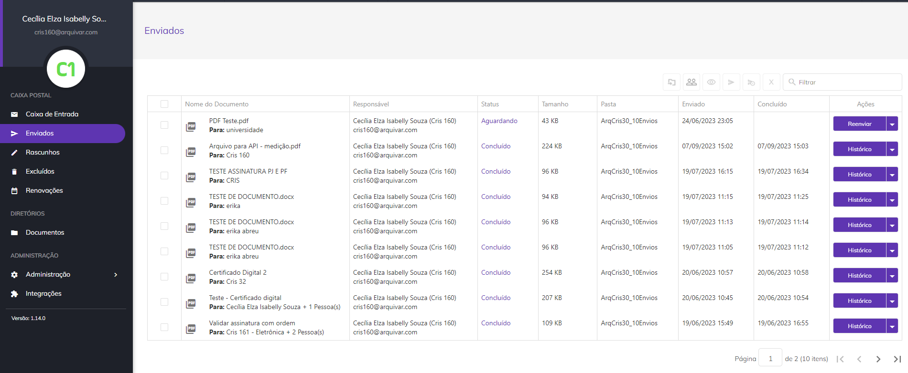<figcaption>
Clique na imagem para ampliar.
</figcaption></figure>

Ao clicar em um documento, será aberta a tela de visualização do documento, que apresenta o documento enviado, seus status e data de vencimento. No canto direito da tela são apresentadas informações dos signatários como dados pessoais, papel de signatário e status da assinatura.

<figure>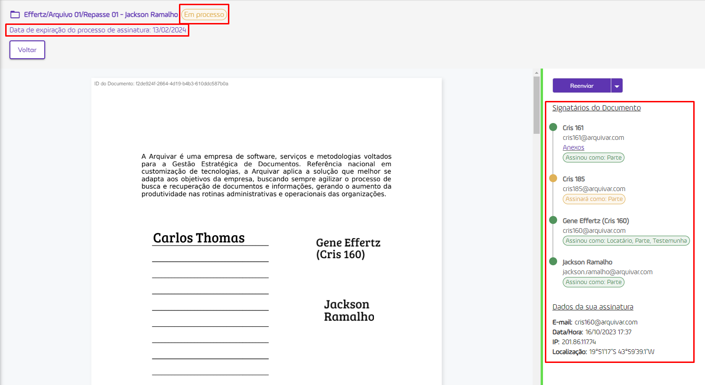<figcaption>
Clique na imagem para ampliar.
</figcaption></figure>

Quando o processo possuir mais de um documento não agrupados, o sistema lista os documentos, ordenados conforme ordem definida para os documentos do processo, permitindo a navegação nos documentos e apresentado na tela o documento selecionado pelo usuário.

#### Visão usuário logado

<figure><figcaption>
Clique para ampliar.
</figcaption></figure>

#### Visão usuário Não Logado

<figure><figcaption>
Clique na imagem para ampliar.
</figcaption></figure>

Por padrão, os dados do signatário são apresentados abertos na tela, basta fechar a lista e continuar com a navegação no documento.

## Colunas da tela principal - Enviados

<figure>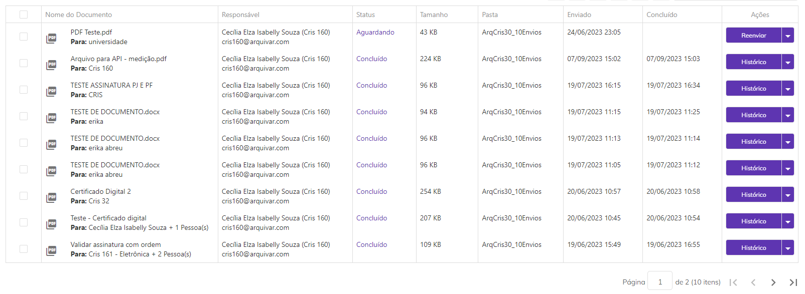<figcaption>
Clique na imagem para ampliar.
</figcaption></figure>

**Coluna Nome do Documento:** Nesta coluna são exibidos o nome do documento e o nome do signatário. Se houver mais de um signatário será mostrado o nome do primeiro e a quantidade de outras pessoas que deverão assinar.

**Coluna Responsável:** Nesta coluna são apresentados o nome e e-mail de quem enviou o documento (remetente). Na tela Enviados o único nome e e-mail apresentados serão os do próprio usuário.

**Coluna Status:** Os status possíveis para um documento são: “Aguardando” (nenhum participante assinou o documento até o momento), “Em processo” (um ou mais participantes já assinaram o documento, mas ainda faltam assinaturas), “Concluído” (todos os participantes já assinaram o documento) e “Cancelado” (o documento teve o envio cancelado e o processo de assinatura foi interrompido). Ao passar o mouse sobre o status são exibidas informações sobre quais signatários ainda estão com assinatura pendente e quais já concluíram, além dos dados desses signatários. Também é exibido o código de segurança enviado para os destinatários (se houver).

<figure>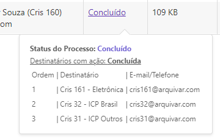<figcaption></figcaption></figure>

**Coluna Tamanho:** Nesta coluna é exibido o tamanho do arquivo do documento.&#x20;

**Coluna Pasta:** Nesta coluna é exibida a pasta do diretório onde o documento está armazenado. Caso o usuário não tenha permissão de acesso à pasta, será exibido “Sem pasta”.

**Coluna Enviado:** Informações sobre a data e hora em que o documento foi enviado.

**Coluna Concluído:** Informações sobre a data e hora em que o processo de assinatura do documento foi concluído. Caso ainda não tenha sido concluído esta coluna ficará em branco.

**Coluna Ações:** Esta coluna exibe botões de ação sobre o documento. Esses botões serão exibidos de acordo com o perfil do usuário. Será sempre exibida nesse botão a ação prioritária de execução, de acordo com o perfil do usuário e status do documento.

**Barra de filtro:** É possível localizar um ou mais documentos utilizando-se os filtros disponíveis para busca. A busca pode ser feita pelo nome ou e-mail do responsável pelo envio, pelo nome de um dos signatários, pelo status do documento (na caixa Enviados serão exibidos os documentos com status “Concluído”, Aguardando”, “Em processo” e “Cancelado”), pela pasta onde o documento está armazenado ou pela data de conclusão das assinaturas.

<figure>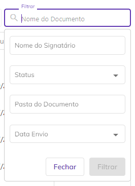<figcaption></figcaption></figure>

***

## Ações individuais - Enviados

<figure><figcaption>
Clique na imagem para ampliar.
</figcaption></figure>


<mark style="color:blue;">Importante ressaltar que as "Ações" apresentadas na tela dependem do "Status" do processo de assinatura.</mark>


#### **Reenviar**

É possível realizar o reenvio de documentos ainda não assinados  por todos os signatários. Para os casos de documentos com prazo de assinatura expirado e que não foram assinados por todos os signatários é exibida a mensagem “Vencido antes da conclusão das assinaturas”. Neste caso, é possível reenviar o documento somente para aqueles signatários que ainda não assinaram.&#x20;

Ao clicar em "reenviar" serão exibidas as informações de ordem de envio para os destinatários, e-mail ou telefone para onde o documento foi enviado, código de segurança para acesso ao documento (se houver).

<figure>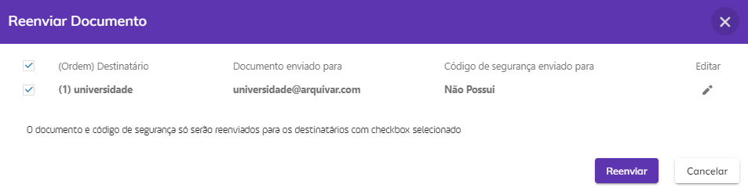<figcaption>
Clique na imagem para ampliar.
</figcaption></figure>

No ícone “Editar”, é possível realizar a edição das informações do destinatário, bem como as informações definidas para validação do documento nas[ **configurações do destinatário**](../menu-superior/novo-documento.md#informacoes-complementares-de-assinatura).

<figure><figcaption>
Clique na imagem para ampliar.
</figcaption></figure>


<mark style="color:blue;">Os dados de validação do documento só poderão ser editados nesta tela se configurados anteriormente. A "Edição" não permite a inclusão de dados para validação.</mark>


#### **Alterar Pasta**

Esta opção só será exibida se o usuário tiver acesso à pasta na qual o documento está armazenado. Ao clicar nesta opção ele poderá alterar a pasta do diretório onde o documento está armazenado.

<figure>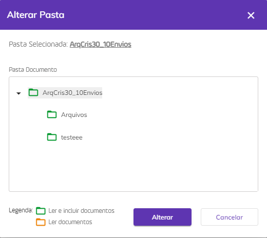<figcaption>
Clique na imagem para ampliar.
</figcaption></figure>

#### **Alterar Proprietário**

Ao clicar nesta opção o usuário poderá alterar o proprietário do documento. Ao executar essa ação não será possível realizar outras atividades de gestão do documento.


<mark style="color:orange;">**Só podem ser selecionados como novo proprietário usuários cadastrados na mesma conta do responsável.**</mark>


<figure>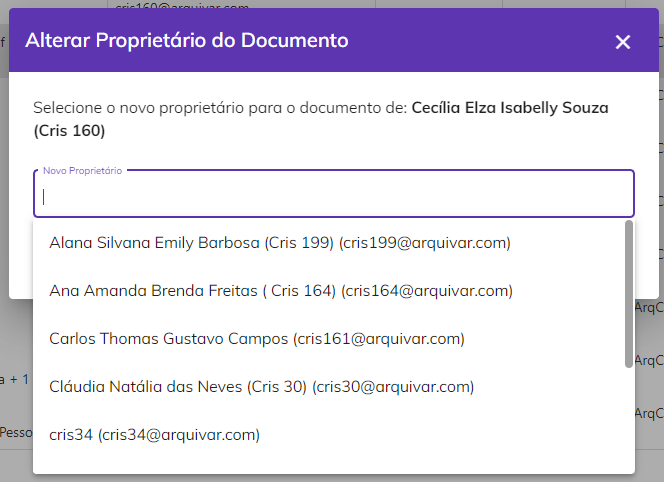<figcaption>
Clique na imagem para ampliar.
</figcaption></figure>

#### **Baixar Arquivo**

Quando processo possuir um documento ou é um compartilhamento de apenas um documento do processo, **o sistema faz&#x20;**_**download**_ do documento do **processo e do registro de assinaturas** em uma pasta.zip.

A pasta zip é nomeada com o nome do processo e o arquivo de registro de assinatura é nomeado como **NomeDocumento\_Registro** de assinatura.

<figure><figcaption>
Clique na imagem para ampliar.
</figcaption></figure>

Quando o processo **possuir mais de um documento**, o sistema exibe modal com os documentos do processo para o usuário selecionar quais documentos deseja baixar. Caso seja um compartilhamento, deve-se listar apenas os documentos que foram compartilhados.

<figure><figcaption>
Clique na imagem para ampliar.
</figcaption></figure>

O Registro de Assinaturas exibe todas as informações sobre as assinaturas eletrônicas e digitais realizadas durante o processo, como nome dos signatários, data e hora da assinatura, localização, IP de onde foi realizada, dados dos certificados digitais utilizados etc.

<figure><figcaption>
Clique na imagem para ampliar.
</figcaption></figure>

<figure><figcaption>
Clique na imagem para ampliar.
</figcaption></figure>

#### **Cancelar**

Ao clicar nesta opção o documento é cancelado e o processo de assinaturas é interrompido.

<figure>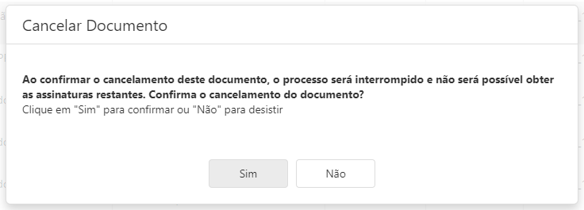<figcaption>
Clique na imagem para ampliar.
</figcaption></figure>

#### **Histórico**

Utilizado para visualizar informações sobre o documento e o histórico dos eventos relacionados a ele. Também é possível fazer o download dos arquivos originais do processo, antes das assinaturas concluídas. Essa opção só estará disponível para documentos com o status “Concluído”.

Com o botão de **eventos posicionado para a direita**, observamos os dados do processo na tela.

<figure><figcaption>
Clique na imagem para ampliar.
</figcaption></figure>

Com o botão de **eventos posicionado para a esquerda**, é possível visualizar os Id's e Hash's dos documentos, no caso de um **processo com mais de um documento não agrupados**.

<figure><figcaption>
Clique na imagem para ampliar.
</figcaption></figure>

#### **Alterar Renovação**

Esta opção só estará disponível caso o documento possua status “Concluído”. Ao clicar nesta opção é possível incluir ou alterar a data de renovação do documento, determinada anteriormente no campo “Agendar renovação \_\_\_ meses após a conclusão das assinaturas” marcada, na tela Novo Documento > Adicionar Documentos e Destinatários > Adicionar Documentos. Para incluir ou alterar a quantidade de meses de intervalo entre as renovações edite o campo “Quantidade Meses Renovação”.

<figure>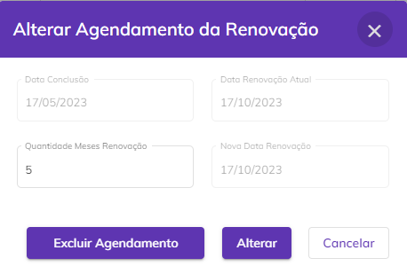<figcaption></figcaption></figure>

#### **Corrigir**

Será exibido esse botão quando a informação de contato (e-mail ou telefone) para envio do documento de um ou mais signatários estiver incorreta. Nesse caso será necessário corrigir a informação incorreta para que o sistema reenvie o documento. &#x20;

#### **Excluir**

Utilizado para excluir o fluxo. Os fluxos excluídos irão para a caixa [Excluídos](excluidos.md).

<figure>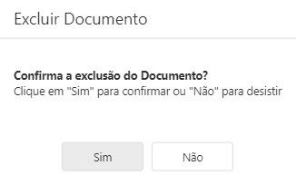<figcaption></figcaption></figure>

#### **Renomear**

Esta opção só será exibida se o usuário além de signatário for também o remetente do documento.&#x20;

Quando o processo possui apenas um documento, o sistema permite alterar o nome do processo:

<figure><figcaption>
Clique na imagem para ampliar.
</figcaption></figure>

Quando processo possui mais de um documento, o sistema permite alterar o nome do processo e o nome dos documentos do processo.

<figure><figcaption>
Clique na imagem para ampliar.
</figcaption></figure>

O campo “**Renomear documentos do processo**” é exibido, somente se o usuário logado for o remetente do processo e o processo possuir mais de um documento/arquivo.

Por padrão, este campo é exibido desmarcado e ao ser marcado, o sistema lista todos os documentos do processo habilitados para edição.

O usuário tem a possibilidade de mover os documentos, alterando a ordenação deles. Ao mover os documentos, o sistema atualiza a numeração na frente de cada documento.

#### **Compartilhar**

Essa opção permite que o usuário crie um link de acesso a um ou mais documento do processo que poderá ser compartilhado com outras pessoas que não sejam participantes do processo de assinatura. Esse link pode ter prazo de validade determinado ou indeterminado e o usuário pode definir se deseja permitir que as pessoas que acessarem visualizem também os anexos enviados pelos signatários.

Quando o processo com mais de um documento não agrupados não possui compartilhamento de documentos, o sistema abre a _modal_ para o usuário selecionar os documentos do processo que deseja compartilhar.&#x20;

<figure><figcaption>
Clique na imagem para ampliar.
</figcaption></figure>

Quando o processo com mais de um documento possui compartilhamento de documentos, o sistema abre a modal com os links já compartilhados.

<figure><figcaption>
Clique na imagem para ampliar.
</figcaption></figure>

Ao expandir as ações do link de compartilhamento, é possível **visualizar** a tela de compartilhamento novamente ou e **excluir** o compartilhamento realizado.&#x20;

<figure><figcaption>
Clique na imagem para ampliar.
</figcaption></figure>

Ao compartilhar os documentos do processo, o usuário tem a possibilidade de enviá-los por e-mail clicando no botão "Enviar Link por e-mail".

<figure><figcaption>
Clique na imagem para ampliar.
</figcaption></figure>

Adicione no campo indicado todos os e-mails que devem receber a documentação compartilhada.&#x20;

<figure><figcaption>
Clique na imagem para ampliar.
</figcaption></figure>


<mark style="color:red;">Ao compartilhar documentos de um processo, é importante ressaltar que o destinatário do compartilhamento poderá visualizar apenas os documentos selecionados para compartilhamento e não todos os documentos que compõem o processo de assinatura.</mark>


#### Visualização de documentos compartilhados

Quando realizado o compartilhamento de apenas um documento de um processo com mais de um documento não agrupado, ao abrir o documento, será apresentado somente o documento compartilhado com o usuário.

Observe que são apresentados na lista apenas os dados dos signatários:

<figure><figcaption>
CLique na imagem para ampliar.
</figcaption></figure>

Quando realizado o compartilhamento de mais documentos do processo, é apresentado na lista, além dos dados dos signatários, os demais documentos do processo:

<figure><figcaption>
Clique na imagem para ampliar.
</figcaption></figure>

***

## Ações em lote - Enviados

É possível selecionar mais de um documento marcando o _checkbox_ ao lado do nome do arquivo e selecionando um dos ícones de execução de ações em lote.

<figure><figcaption>
Clique na imagem para ampliar.
</figcaption></figure>

#### **Mover Processo (s)**

Ao clicar neste ícone será possível alterar a pasta onde os documentos selecionados estão armazenados. Não será possível executar essa ação em documentos com o status “Em andamento”.   &#x20;

<figure><figcaption></figcaption></figure>

#### **Alterar Proprietário**

&#x20;Ao clicar neste ícone será possível alterar a propriedade dos documentos selecionados, ou seja, as funções de administração do documento serão de outro usuário. Essa ação só poderá ser desfeita se o usuário que for definido como novo proprietário devolver a propriedade do documento ao proprietário original ou repassar para outro usuário. A alteração de proprietário de um documento em lote tem o prazo de 24 horas para ser realizada e para acompanhar o andamento o usuário deve acessar o menu [Meu Perfil > Aba Solicitações](../menu-superior/meu-perfil.md#aba-solicitacoes).&#x20;


<mark style="color:orange;">**Só podem ser selecionados como novo proprietários usuários cadastrados na mesma conta do responsável.**</mark>


<figure><figcaption></figcaption></figure>

#### **Visualizar Documento**

&#x20;Ao clicar neste ícone será possível visualizar o documento ou os documentos do processo de assinatura. Esta opção deve ser utilizada quando selecionando um processo por vez.

#### **Reenviar**

Ao clicar neste ícone será possível reenviar os documentos selecionados para os destinatários que ainda não assinaram. Só será possível executar essa ação em documentos que não estejam com o status “Concluído”.

<figure>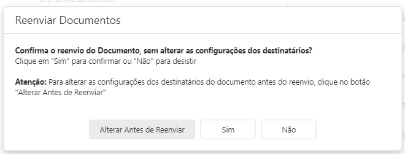<figcaption>
Clique na imagem para ampliar.
</figcaption></figure>

#### **Cancelar Envio**

Ao clicar neste ícone será possível cancelar o envio dos documentos selecionados, interrompendo os processos de assinatura. Só será possível executar essa ação em documentos que não estejam com o status “Concluído”.

<figure><figcaption></figcaption></figure>

<figure>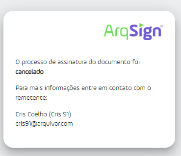<figcaption></figcaption></figure>

#### **Excluir**

Ao clicar neste ícone será possível excluir os documentos selecionados. Só será possível executar essa ação em documentos com o status “Concluído” ou “Cancelado”.

<figure>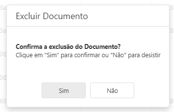<figcaption></figcaption></figure>

#### Falhas na entrega de emails

Quando houver falha de envio do processo, o sistema sinaliza o processo com a falha de envio.

<figure><figcaption></figcaption></figure>

Quando houver falha de envio do código de segurança para algum destinatário do processo, o sistema sinaliza o destinatário com a falha de envio do código de segurança.

<figure><figcaption></figcaption></figure>
