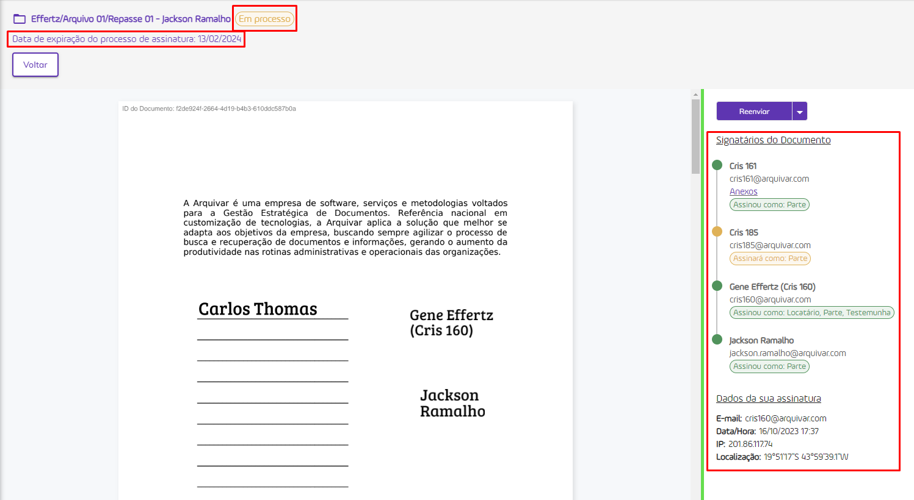
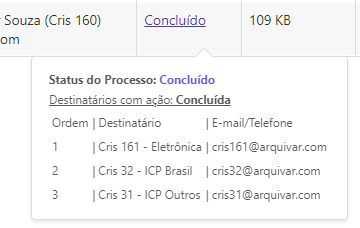
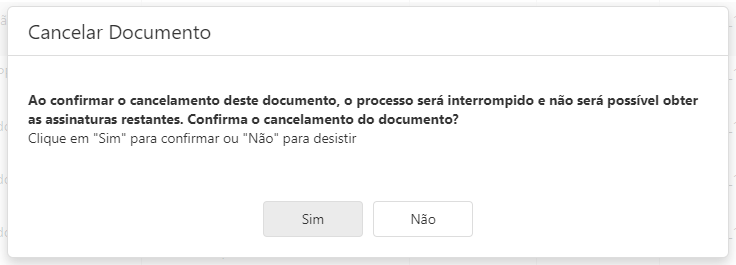
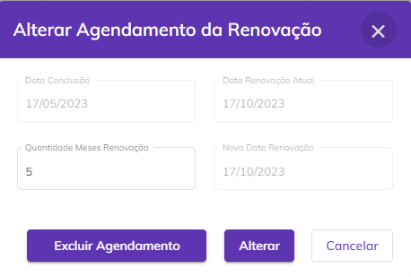
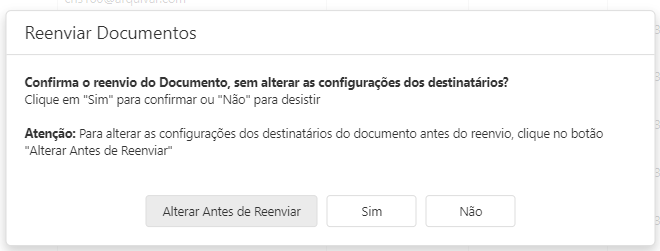
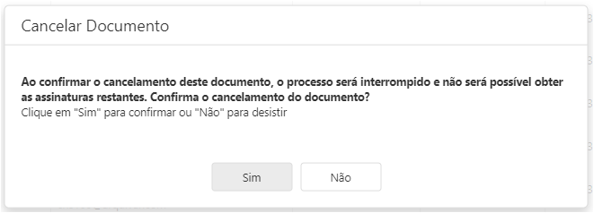

# 📩 Enviados

## Visualizar Processo

Na caixa Enviados são apresentados todos os processos enviados pelo usuário para os signatários, inclusive aqueles em que ele mesmo é assinante.

<figure><figcaption>
Clique na imagem para ampliar.
</figcaption></figure>

Ao clicar em um processo, será aberta a tela de visualização, que apresenta os arquivos enviados para assinatura, o status geral do processo e a data de vencimento. No canto direito da tela, são exibidas informações detalhadas dos signatários, como dados pessoais, papel atribuído no processo e status da assinatura.

<figure><figcaption>
Clique na imagem para ampliar.
</figcaption></figure>

Quando o processo contiver mais de um documento não agrupado, o sistema exibirá a lista desses documentos, ordenados conforme a ordem definida no processo. O usuário poderá navegar entre os documentos, sendo exibido na tela aquele que estiver selecionado.

#### Visão usuário logado

<figure><figcaption>
Clique para ampliar.
</figcaption></figure>

#### Visão usuário Não Logado

<figure><figcaption>
Clique na imagem para ampliar.
</figcaption></figure>

Por padrão, os dados do signatário são apresentados abertos na tela, basta fechar a lista e continuar com a navegação no documento.

## Colunas da tela principal - Enviados

<figure><figcaption>
Clique na imagem para ampliar.
</figcaption></figure>

**Coluna Nome do Processo:** Nesta coluna são exibidos o nome do processo e o nome do signatário. Se houver mais de um signatário será mostrado o nome do primeiro e a quantidade de outras pessoas que deverão assinar.

**Coluna Responsável:** Nesta coluna são apresentados o nome e e-mail de quem enviou o documento (remetente). Na tela Enviados o único nome e e-mail apresentados serão os do próprio usuário.

**Coluna Status:** Os status possíveis para um processo são: “Aguardando” (nenhum participante assinou o processo até o momento), “Em processo” (um ou mais participantes já assinaram o processo, mas ainda faltam assinaturas), “Concluído” (todos os participantes já assinaram o processo) e “Cancelado” (o processo teve o envio cancelado e o fluxo de assinatura foi interrompido). Ao passar o mouse sobre o status são exibidas informações sobre quais signatários ainda estão com assinatura pendente e quais já concluíram, além dos dados desses signatários. Também é exibido o código de segurança enviado para os destinatários (se houver).

<figure><figcaption></figcaption></figure>

**Coluna Tamanho:** Nesta coluna é exibido o tamanho do(s) arquivo(s) do processo.&#x20;

**Coluna Pasta:** Nesta coluna é exibida a pasta do diretório onde o(s) documento(s) do processo estão armazenados. Caso o usuário não tenha permissão de acesso à pasta, será exibido “Sem pasta”.

**Coluna Enviado:** Informações sobre a data e hora em que o processo foi enviado.

**Coluna Concluído:** Informações sobre a data e hora em que o processo de assinatura do documento foi concluído. Caso ainda não tenha sido concluído esta coluna ficará em branco.

**Coluna Ações:** Esta coluna exibe botões de ação sobre o processo. Esses botões serão exibidos de acordo com o perfil do usuário. Será sempre exibida nesse botão a ação prioritária de execução, de acordo com o perfil do usuário e status do processo.

**Barra de filtro:** É possível localizar um ou mais processo utilizando-se os filtros disponíveis para busca. A busca pode ser feita pelo nome ou e-mail do responsável pelo envio, pelo nome de um dos signatários, pelo status do processo (na caixa Enviados serão exibidos os processos com status “Concluído”, Aguardando”, “Em processo” e “Cancelado”), pela pasta onde o processo está armazenado ou pela data de conclusão das assinaturas.

<figure><figcaption></figcaption></figure>

***

## Ações individuais - Enviados

<figure><figcaption>
Clique na imagem para ampliar.
</figcaption></figure>


<mark style="color:blue;">Importante ressaltar que as "Ações" apresentadas na tela dependem do "Status" do processo de assinatura.</mark>


#### **Reenviar**

É possível realizar o reenvio de processos que ainda não foram assinados por todos os signatários. Nos casos em que o prazo de assinatura tenha expirado antes da conclusão por todos os participantes, o sistema exibirá a mensagem: “Vencido antes da conclusão das assinaturas”. Nessa situação, o reenvio será permitido apenas para os signatários que ainda não assinaram.

Ao clicar em "Reenviar", serão exibidas as informações de ordem de assinatura dos signatários, os canais utilizados para envio do processo (e-mail ou telefone) e, se configurado, o código de segurança necessário para acesso ao conteúdo.

<figure><figcaption></figcaption></figure>

No ícone “Editar”, é possível realizar a edição das informações do destinatário, bem como as informações definidas para validação do processo nas[ **configurações do destinatário**](../menu-superior/novo-processo.md#informacoes-complementares-de-assinatura).

<figure><figcaption>
Clique na imagem para ampliar.
</figcaption></figure>


<mark style="color:blue;">Os dados de validação do processo só poderão ser editados nesta tela se configurados anteriormente. A "Edição" não permite a inclusão de dados para validação.</mark>



<mark style="color:orange;">**Os processos de assinatura enviados através do ArqGED-ArqFlow só poderão ser reenviados por meio de uma nova ação no ArqGED-ArqFlow.**</mark>&#x20;

<mark style="color:orange;">**Dessa forma, na coluna Ações, não haverá a opção "Reenviar"**</mark>


<figure><figcaption>
Clique na imagem para ampliar
</figcaption></figure>

Também não haverá a opção "Reenviar" ao abrir o processo pela plataforma ArqSign.&#x20;

<figure><figcaption>
Clique na imagem para ampliar
</figcaption></figure>

#### **Alterar Pasta**

Esta opção só será exibida se o usuário tiver acesso à pasta na qual o documento está armazenado. Ao clicar nesta opção ele poderá alterar a pasta do diretório onde o documento está armazenado.

<figure><figcaption></figcaption></figure>

#### **Alterar Proprietário**

Ao clicar nesta opção, o usuário poderá alterar o responsável pelo processo. Após a execução dessa ação, não será possível realizar outras atividades de gestão relacionadas ao processo em questão.


<mark style="color:orange;">**Só podem ser selecionados como novo proprietário usuários cadastrados na mesma conta do responsável.**</mark>


<figure><figcaption></figcaption></figure>

#### **Baixar Arquivo**

Quando o processo **possuir apenas um documento**, ou quando for realizado o compartilhamento de um único documento do processo, o sistema fará o download do arquivo em uma pasta `.zip`.\
Essa pasta será nomeada com o nome do processo, e o arquivo de registro de assinaturas será nomeado como `NomeDocumento_Registro de assinatura`.

<figure><figcaption>
Clique na imagem para ampliar.
</figcaption></figure>

Quando o processo **possuir mais de um documento**, o sistema exibirá uma modal com a lista dos documentos vinculados ao processo, permitindo que o usuário selecione quais deseja baixar.\
Nos casos de compartilhamento, serão listados apenas os documentos efetivamente compartilhados, respeitando os critérios definidos no ato do envio.

<figure><figcaption>
Clique na imagem para ampliar.
</figcaption></figure>

O Registro de Assinaturas exibe todas as informações sobre as assinaturas eletrônicas e digitais realizadas durante o processo, como nome dos signatários, data e hora da assinatura, localização, IP de onde foi realizada, dados dos certificados digitais utilizados etc.

<figure><figcaption>
Clique na imagem para ampliar.
</figcaption></figure>

<figure><figcaption>
Clique na imagem para ampliar.
</figcaption></figure>

#### **Cancelar**

Ao clicar nesta opção, o processo é cancelado e as assinaturas em andamento são imediatamente interrompidas.

<figure><figcaption>
Clique na imagem para ampliar.
</figcaption></figure>

#### **Histórico**

Utilizado para visualizar informações detalhadas sobre o processo e o histórico de eventos relacionados. Também permite o download dos arquivos originais enviados, antes da conclusão das assinaturas. Esta opção estará disponível apenas para processos com o status “Concluído”.

Com o botão de **eventos posicionado para a direita**, observamos os dados do processo na tela.

<figure><figcaption>
Clique na imagem para ampliar.
</figcaption></figure>

Com o botão de **eventos posicionado à esquerda**, é possível visualizar os IDs e os hashes dos documentos, nos casos em que o **processo possui mais de um documento não agrupado.**

<figure><figcaption>
Clique na imagem para ampliar.
</figcaption></figure>

#### **Alterar Renovação**

Esta opção estará disponível apenas para processos com status “Concluído”. Ao acioná-la, é possível incluir ou alterar a data de renovação do processo, conforme definida previamente no campo “Agendar renovação \_\_\_ meses após a conclusão das assinaturas”, localizado na etapa Novo Processo > Adicionar Documentos e Destinatários > Adicionar Documentos.

Para modificar o intervalo entre renovações, edite o campo Quantidade Meses Renovação.

<figure><figcaption>
Clique na imagem para ampliar.
</figcaption></figure>

#### **Corrigir**

Será exibido esse botão quando a informação de contato (e-mail ou telefone) para envio do documento de um ou mais signatários estiver incorreta. Nesse caso será necessário corrigir a informação incorreta para que o sistema reenvie o documento. &#x20;

#### **Excluir**

Utilizado para excluir o processo. Os processos excluídos irão para a caixa [Excluídos](excluidos.md).

<figure><figcaption>
Clique na imagem para ampliar.
</figcaption></figure>

#### **Renomear**

Esta opção só será exibida se o usuário além de signatário for também o remetente do processo.&#x20;

Quando o processo possui apenas um documento, o sistema permite alterar o nome do processo:

<figure><figcaption>
Clique na imagem para ampliar.
</figcaption></figure>

Quando processo possui mais de um documento, o sistema permite alterar o nome do processo e o nome dos documentos do processo.

<figure><figcaption>
Clique na imagem para ampliar.
</figcaption></figure>

O campo “**Renomear documentos do processo**” é exibido, somente se o usuário logado for o remetente do processo e o processo possuir mais de um documento/arquivo.

Por padrão, este campo é exibido desmarcado e ao ser marcado, o sistema lista todos os documentos do processo habilitados para edição.

O usuário tem a possibilidade de mover os documentos, alterando a ordenação deles. Ao mover os documentos, o sistema atualiza a numeração na frente de cada documento.

#### **Compartilhar**

Essa opção permite que o usuário crie um link de acesso a um ou mais documento do processo que poderá ser compartilhado com outras pessoas que não sejam participantes do processo de assinatura. Esse link pode ter prazo de validade determinado ou indeterminado e o usuário pode definir se deseja permitir que as pessoas que acessarem visualizem também os anexos enviados pelos signatários.

Quando o processo com mais de um documento não agrupados não possui compartilhamento de documentos, o sistema abre a _modal_ para o usuário selecionar os documentos do processo que deseja compartilhar.&#x20;

<figure><figcaption>
Clique na imagem para ampliar.
</figcaption></figure>

Quando o processo com mais de um documento possui compartilhamento de documentos, o sistema abre a modal com os links já compartilhados.

<figure><figcaption>
Clique na imagem para ampliar.
</figcaption></figure>

Ao expandir as ações do link de compartilhamento, é possível **visualizar** a tela de compartilhamento novamente ou e **excluir** o compartilhamento realizado.&#x20;

<figure><figcaption>
Clique na imagem para ampliar.
</figcaption></figure>

Ao compartilhar os documentos do processo, o usuário tem a possibilidade de enviá-los por e-mail clicando no botão "Enviar Link por e-mail".

<figure><figcaption>
Clique na imagem para ampliar.
</figcaption></figure>

Adicione no campo indicado todos os e-mails que devem receber a documentação compartilhada.&#x20;

<figure><figcaption>
Clique na imagem para ampliar.
</figcaption></figure>


<mark style="color:red;">Ao compartilhar documentos de um processo, é importante ressaltar que o destinatário do compartilhamento poderá visualizar apenas os documentos selecionados para compartilhamento e não todos os documentos que compõem o processo de assinatura.</mark>


#### Visualização de documentos compartilhados

Quando for realizado o compartilhamento de **apenas um documento** de um processo que contém **mais de um documento não agrupado**, o sistema exibirá **somente o documento compartilhado** ao usuário que acessá-lo.\
Os demais documentos do processo não serão visíveis, preservando o acesso restrito ao conteúdo compartilhado.

Observe que são apresentados na lista apenas os dados dos signatários:

<figure><figcaption>
CLique na imagem para ampliar.
</figcaption></figure>

Quando realizado o compartilhamento de mais documentos do processo, é apresentado na lista, além dos dados dos signatários, os demais documentos do processo:

<figure><figcaption>
Clique na imagem para ampliar.
</figcaption></figure>

***

## Ações em lote - Enviados

É possível selecionar mais de um processo marcando o _checkbox_ ao lado do nome do arquivo e selecionando um dos ícones de execução de ações em lote.

<figure><figcaption>
Clique na imagem para ampliar.
</figcaption></figure>

#### **Mover Processo (s)**

Ao clicar neste ícone será possível alterar a pasta onde os processos selecionados estão armazenados. Não será possível executar essa ação em processos com o status “Em andamento”.

<figure><figcaption></figcaption></figure>

#### **Alterar Proprietário**

Ao clicar neste ícone, será possível **alterar a propriedade dos processos selecionados**, transferindo as funções de administração para outro usuário.\
Essa ação **só poderá ser revertida** caso o novo proprietário devolva a titularidade ao proprietário original ou a repasse para outro usuário.

A **alteração de proprietário em lote** possui um **prazo de até 24 horas** para ser concluída.\
O acompanhamento da solicitação pode ser feito acessando o menu **Meu Perfil > Aba Solicitações**.


<mark style="color:orange;">**Só podem ser selecionados como novo proprietários usuários cadastrados na mesma conta do responsável.**</mark>


<figure><figcaption></figcaption></figure>

#### **Visualizar Documento**

&#x20;Ao clicar neste ícone será possível visualizar o documento ou os documentos do processo de assinatura. Esta opção deve ser utilizada quando selecionando um processo por vez.

#### **Reenviar**

Ao clicar neste ícone será possível reenviar os processos selecionados para os destinatários que ainda não assinaram. Só será possível executar essa ação em processos que não estejam com o status “Concluído”.

<figure><figcaption>
Clique na imagem para ampliar.
</figcaption></figure>


<mark style="color:orange;">**Para ação de reenvio em lote o sistema não habilita o ícone de reenviar se ao menos um processo selecionado estiver marcado como "Enviado via ArqFlow".**</mark>


<figure><figcaption>
Clique na imagem para ampliar
</figcaption></figure>

#### **Cancelar Envio**

Ao clicar neste ícone, será possível **cancelar o envio dos processos selecionados**, interrompendo os respectivos fluxos de assinatura.\
Essa ação **só poderá ser realizada em processos que não estejam com o status “Concluído”**.

<figure><figcaption></figcaption></figure>

<figure><figcaption></figcaption></figure>

#### **Excluir**

Ao clicar neste ícone será possível excluir os processos selecionados. Só será possível executar essa ação em documentos com o status “Concluído” ou “Cancelado”.

<figure><figcaption>
Clique na imagem para ampliar
</figcaption></figure>

#### Falhas na entrega de emails

Quando houver falha de envio do processo, o sistema sinaliza o processo com a falha de envio.

Quando houver falha de envio do código de segurança para algum destinatário do processo, o sistema sinaliza o destinatário com a falha de envio do código de segurança.

<figure><figcaption>
Clique na imagem para ampliar
</figcaption></figure>

## 🗪 Perguntas e Respostas Frequentes

Como compartilhar um Processo assinado pela Plataforma ArqSign?

* Faça o login em sua conta ArqSign pelo link: [https://app.arqsign.com/auth/login](https://app.arqsign.com/auth/login);

- Clique em ‘Enviados’;

* Localize o Processo que deseja compartilhar;

- Essa opção permite que o usuário crie um link de acesso a um ou mais documentos do processo que poderá ser compartilhado com outras pessoas que não sejam participantes do processo de assinatura. Esse link pode ter prazo de validade determinado ou indeterminado e o usuário pode definir se deseja permitir que as pessoas que acessarem visualizem também os anexos enviados pelos signatários.

* Quando o Processo com mais de um documento não agrupados não possui compartilhamento de documentos, o sistema abre a modal para o usuário selecionar os documentos do Processo que deseja compartilhar.

- Quando o Processo com mais de um documento possui compartilhamento de documentos, o sistema abre a modal com os links já compartilhados.

* Ao expandir as ações do link de compartilhamento, é possível visualizar a tela de compartilhamento novamente ou e excluir o compartilhamento realizado.

- Ao compartilhar os documentos do processo, o usuário tem a possibilidade de enviá-los por e-mail clicando no botão "Enviar Link por e-mail".

* Adicione no campo indicado todos os e-mails que devem receber a documentação compartilhada.

Como alterar o proprietário de um Processo?

Se você é o remetente de um Processo com status “Aguardando”, “Em processo” ou “Concluído”, pode alterar o proprietário para outro usuário ativo da conta. Desta forma, as notificações automáticas referentes ao fluxo passarão a ser enviadas para o novo proprietário.

Para executar esta alteração siga o seguinte passo a passo:&#x20;

**Opção 1:**&#x20;

1. Localize o fluxo no menu Enviados;&#x20;
2. Clique na caixa suspensa localizada no canto direito;&#x20;
3. Clique em Alterar proprietário;&#x20;
4. Informe o novo proprietário e salve.

Caso seja transferido apenas um Processo o a alteração será realizada instantaneamente;&#x20;

Para dois Processos ou mais é necessário um prazo de 24h para a conclusão da solicitação de transferência. &#x20;

**Opção 2:**&#x20;

1. Ao inativar um usuário que possui Processos em sua conta é possível realizar a transferência desses Processos para um novo usuário responsável.&#x20;
2. Quando clicar em ‘Inativar’ um bloco de confirmação irá aparecer;&#x20;
3. No bloco, confirme que deseja transferir os Processos;&#x20;
4. Selecione o novo proprietário;&#x20;
5. E os Processos que deseja transferir por status: ‘Todos’ ou ‘Em assinatura ou com renovação agendada’;&#x20;
6. &#x20;Clique em ‘Alterar’;&#x20;
7. O usuário será inativado e os Processos serão transferidos em 24h;&#x20;
8. Ao inativar um usuário sem Processos na conta, não é necessário realizar esse procedimento;&#x20;
9. A transferência de Processos só pode ser executada para um usuário ativo.&#x20;
10. Para consultar o andamento das solicitações de transferências acesse: “Meu perfil” –> “Solicitações”.&#x20;

Caso você queira  transferir a propriedade dos Processos de um usuário que foi inativado, verifique o passo a passo em “Como inativar um usuário e alterar a propriedade de seus Processos?”

Como verificar o versionamento dos Processos salvos na plataforma?

A cada renovação de Processos através da ferramenta de renovação da Plataforma ArqSign, é feito um vínculo dos novos Processos aos anteriores.

Para acessar este recurso siga os seguintes passos:

1. Menu “Enviados”.
2. Localize o Processo que você deseja consultar.
3. No botão “Histórico”, clique no drop down.
4. Escolha a opção “Versionamento”.

Analise as informações.

Como cancelar processos enviados?

O cancelamento de um Processo ou fluxo pode ser feito enquanto ele ainda não foi concluído. Para isso siga o seguinte passo a passo:&#x20;

1. Acesse o menu de Enviados;
2. Localize o Processo que deseja cancelar;
3. Clique em Histórico;
4. Clique em Cancelar;
5. Confirme o cancelamento clicando em Sim.

Como editar, corrigir ou alterar o e-mail do signatário?

1. Acesse a caixa de enviados;
2. Localize o Processo que deseja editar, corrigir ou alterar o e-mail do signatário;&#x20;
3. Clique sobre o botão de Reenviar;
4. Clique em Editar;
5. Faça a alteração necessária;
6. Clique em Reenviar. &#x20;

Quando a data limite para assinatura do Processo estiver vencida, o reenvio é feito para todos os signatários pendentes de assinatura na ordem atual.&#x20;

Se a data limite para assinatura do Processo não estiver vencida o usuário poderá editar e reenviá-lo para um ou mais signatários pendentes de assinatura na ordem atual.&#x20;

[Clique aqui](https://youtu.be/1IMOZE11RaQ) e assista ao vídeo com o passo a passo.

Como reenviar um Processo?

1. Acesse a caixa de enviados;&#x20;
2. Localize o Processo que deseja reenviar;
3. Clique sobre o botão de Reenviar;
4. Clique sobre o botão Reenviar novamente.&#x20;

Um novo envio será feito somente para os signatários que ainda não assinaram o Processo.&#x20;

[Clique aqui ](https://youtu.be/K11hU-ZOWnk)e assista ao vídeo com o passo a passo.

