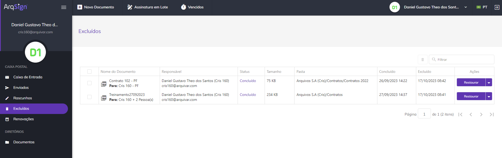
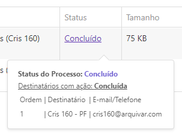
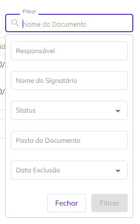
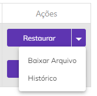
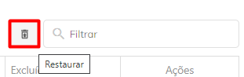

# 🗑️ Excluídos

No menu Excluídos são apresentados todos os documentos excluídos pelo usuário. Podem ser excluídos documentos já concluídos, cancelados ou apenas criados.


<mark style="color:orange;">**Não é possível visualizar o documento na tela Excluídos. Para ver o arquivo é necessário restaurar o documento e acessá-lo na sua caixa postal de origem, que pode ser a**</mark> [<mark style="color:blue;">**Caixa de Entrada**</mark>](caixa-de-entrada.md) <mark style="color:orange;">**ou a**</mark> [<mark style="color:blue;">**caixa Enviados**</mark>](enviados.md).


<figure><figcaption>
Clique na imagem para ampliar.
</figcaption></figure>

***

## Colunas da tela principal - Excluídos

<figure><figcaption>
Clique na imagem para ampliar.
</figcaption></figure>

**Coluna Nome do Documento:** Nesta coluna são exibidos o nome do documento e o nome do signatário. Se houver mais de um signatário será mostrado o nome do primeiro e a quantidade de outras pessoas que deverão assinar.&#x20;

**Coluna Responsável:** Nesta coluna são apresentados o nome e e-mail de quem enviou o documento (remetente). &#x20;

**Coluna Status:** Os status possíveis para um documento são: “Concluído” (todos os participantes já assinaram o documento), “Cancelado” (o documento teve o envio cancelado e o processo de assinatura foi interrompido) e “Criado” (o documento foi criado na plataforma, mas sua configuração e envio aos destinatários ainda não foram concluídos). Ao passar o mouse sobre o status são exibidas informações sobre quais signatários ainda estão com assinatura pendente e quais já concluíram, além dos dados desses signatários. Também é exibido o código de segurança enviado para os destinatários (se houver).&#x20;

<figure><figcaption>
Clique na imagem para ampliar.
</figcaption></figure>

**Coluna Tamanho:** Nesta coluna é exibido o tamanho do arquivo do documento.  &#x20;

**Coluna Pasta:** Nesta coluna é exibida a pasta do diretório onde o documento está armazenado. Caso o usuário não tenha permissão de acesso à pasta, será exibido “Sem pasta”.&#x20;

**Coluna Concluído:** Informações sobre a data e hora em que o processo de assinatura do documento foi concluído. Caso ainda não tenha sido concluído esta coluna ficará em branco.&#x20;

**Coluna Excluído:** Informações sobre a data e hora em que o documento foi excluído.&#x20;

**Coluna Ações:** Esta coluna exibe botões de ação sobre o documento. Será sempre exibida nesse botão a ação prioritária de execução, de acordo com o perfil do usuário e status do documento.&#x20;

**Barra de filtro:** É possível localizar um ou mais documentos utilizando-se os filtros disponíveis para busca. Na tela Excluídos a busca pode ser feita pelo nome do documento, pelo nome do responsável, pelos nomes dos signatários, pelo status do documento, pela pasta onde o documento está hospedado ou pela data de exclusão do documento.  &#x20;

<figure><figcaption></figcaption></figure>

***

## Ações individuais - Excluídos

<figure><figcaption>
Clique na imagem para ampliar.
</figcaption></figure>

#### **Restaurar**

Ao clicar nesta opção o documento retorna para a caixa postal na qual estava anteriormente à exclusão. Só podem ser restaurados documentos excluídos há menos de um ano.&#x20;


<mark style="color:blue;">**Documentos com o status “Concluído” retornarão para a Caixa de Entrada se o usuário for apenas participante do processo de assinatura ou para a caixa Enviados se ele for proprietário do documento.**</mark>  &#x20;

<mark style="color:blue;">**Documentos com o status “Cancelado” sempre retornarão para a caixa Enviados, já que são de propriedade do usuário.**</mark>&#x20;



<mark style="color:red;">**Documentos com o status “Criado” não podem ser restaurados.**</mark>


#### **Baixar Arquivo**

Quando processo possuir um documento ou é um compartilhamento de apenas um documento do processo, **o sistema faz **_**download**_ do documento do **processo e do registro de assinaturas** em uma pasta.zip.

A pasta zip é nomeada com o nome do processo e o arquivo de registro de assinatura é nomeado como **NomeDocumento\_Registro** de assinatura.

<figure><figcaption>
Clique na imagem para ampliar.
</figcaption></figure>

Quando o processo **possuir mais de um documento**, o sistema exibe modal com os documentos do processo para o usuário selecionar quais documentos deseja baixar. Caso seja um compartilhamento, deve-se listar apenas os documentos que foram compartilhados.

<figure><figcaption>
Clique na imagem para ampliar.
</figcaption></figure>

O Registro de Assinaturas exibe todas as informações sobre as assinaturas eletrônicas e digitais realizadas durante o processo, como nome dos signatários, data e hora da assinatura, localização, IP de onde foi realizada, dados dos certificados digitais utilizados etc.

<figure><figcaption>
Clique na imagem para ampliar.
</figcaption></figure>

<figure><figcaption>
Clique na imagem para ampliar.
</figcaption></figure>

#### **Histórico**

&#x20;Aqui é possível visualizar o histórico do processo de assinatura e seus documentos. Selecione o botão de eventos para visualizar detalhadamente os dados. Nesta tela também é possível baixar os arquivos originais do processo.

Com o botão de eventos posicionado para a direita, observamos os dados do processo na tela.

<figure><figcaption>
Clique na imagem para ampliar.
</figcaption></figure>

Com o botão de eventos posicionado para a esquerda, é possível visualizar os Id's e Hash's dos documentos, no caso de um **processo com mais de um documento não agrupados**.

<figure><figcaption>
Clique na imagem para ampliar.
</figcaption></figure>

***

## Ações em lote - Excluídos

É possível selecionar mais de um documento marcando-se os checkbox ao lado do nome do arquivo e executar ações em lote.&#x20;

**Restaurar:** Na tela Excluídos a única ação em lote possível é a de restaurar documentos, retornando-os para a caixa postal na qual estavam anteriormente à exclusão. Só podem ser restaurados documentos excluídos há menos de um ano.&#x20;


<mark style="color:blue;">**Documentos com o status “Concluído” retornarão para a Caixa de Entrada se o usuário for apenas participante do processo de assinatura ou para a caixa Enviados se ele for proprietário do documento.**</mark>  &#x20;

<mark style="color:blue;">**Documentos com o status “Cancelado” sempre retornarão para a caixa Enviados, já que são de propriedade do usuário.**</mark>&#x20;



<mark style="color:red;">**Documentos com o status “Criado” não podem ser restaurados.**</mark>


<figure><figcaption>
Clique na imagem para ampliar.
</figcaption></figure>
