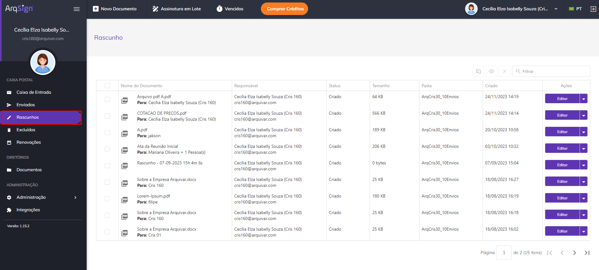
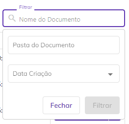
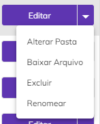
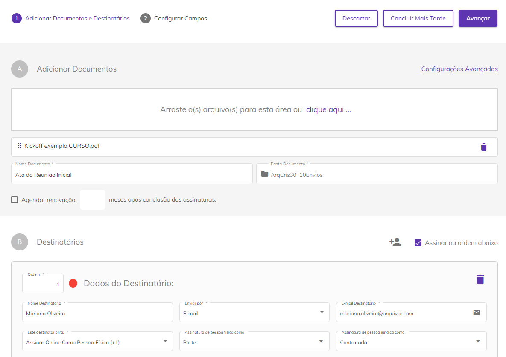
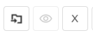

# ✏️ Rascunhos

No menu Rascunhos são exibidos todos os documentos que começaram a ser configurados para recolhimento das assinaturas na tela Novo Documento, mas que não tiveram essa configuração concluída e não foram enviados aos destinatários.


<mark style="color:orange;">**Para salvar um documento como Rascunho o usuário deve clicar em “Concluir Mais Tarde” no momento da criação do documento, na tela**</mark> [<mark style="color:blue;">**Novo Documento > Adicionar Documentos e Destinatários**</mark>](../menu-superior/novo-documento.md#a.-adicionar-documentos)<mark style="color:blue;">**.**</mark>


<figure><figcaption>
Clique na imagem para ampliar.
</figcaption></figure>

***

## Colunas da tela principal - Rascunhos

<figure><figcaption>
Clique na imagem para ampliar.
</figcaption></figure>

**Coluna Nome do Documento:** Nesta coluna são exibidos o nome do documento e o nome do signatário. Se houver mais de um signatário será mostrado o nome do primeiro e a quantidade de outras pessoas que deverão assinar.&#x20;

**Coluna Responsável:** Nesta coluna são apresentados o nome e e-mail de quem enviou o documento (remetente). Na tela Rascunhos o único nome e e-mail apresentados serão os do próprio usuário.&#x20;

**Coluna Status:** Na tela Rascunhos o único status possível para os documentos é “Criado”, ou seja, o documento foi cadastrado, mas ainda não foi finalizado para envio.&#x20;

**Coluna Tamanho:** Nesta coluna é exibido o tamanho do arquivo do documento.  &#x20;

**Coluna Pasta:** Nesta coluna é exibida a pasta do diretório onde o documento está armazenado.&#x20;

**Coluna Criado:** Informações sobre a data e hora em que o documento foi criado na plataforma. &#x20;

**Coluna Ações:** Esta coluna exibe botões de ação sobre o documento. Esses botões serão exibidos de acordo com o perfil do usuário. Será sempre exibida nesse botão a ação prioritária de execução, de acordo com o perfil do usuário e status do documento.&#x20;

**Barra de filtro:** É possível localizar um ou mais documentos utilizando-se os filtros disponíveis para busca. Na tela de Rascunhos a busca pode ser feita pelo nome do documento, pela pasta onde o documento está hospedado ou pela data de criação do documento na plataforma.

<figure><figcaption></figcaption></figure>

***

## Ações individuais - Rascunhos

<figure><figcaption>
Clique na imagem para ampliar.
</figcaption></figure>

#### **Editar**

Ao clicar nesta opção o usuário é encaminhado para a tela de cadastro do documento, onde deverá concluir a configuração do documento, incluir os destinatários e realizar as demais parametrizações necessárias para envio do arquivo e recolhimento das assinaturas.  &#x20;

<figure><figcaption>
Clique na imagem para ampliar.
</figcaption></figure>

#### **Alterar Pasta**

Ao clicar nesta opção o usuário poderá alterar a pasta do diretório onde o documento está armazenado. &#x20;

<figure><figcaption>
Clique na imagem para ampliar.
</figcaption></figure>

#### **Baixar Arquivo**

Quando processo possuir um documento ou é um compartilhamento de apenas um documento do processo, **o sistema faz **_**download**_ do documento do **processo e do registro de assinaturas** em uma pasta.zip.

A pasta zip é nomeada com o nome do processo e o arquivo de registro de assinatura é nomeado como **NomeDocumento\_Registro** de assinatura.

<figure><figcaption>
Clique na imagem para ampliar.
</figcaption></figure>

Quando o processo **possuir mais de um documento**, o sistema exibe modal com os documentos do processo para o usuário selecionar quais documentos deseja baixar. Caso seja um compartilhamento, deve-se listar apenas os documentos que foram compartilhados.

<figure><figcaption>
Clique na imagem para ampliar.
</figcaption></figure>

Ao realizar o download pelo Menu > Rascunhos, por padrão da plataforma, o Registro de Assinaturas que exibe todas as informações sobre as assinaturas eletrônicas e digitais, como nome dos signatários, data e hora da assinatura, localização, IP de onde foi realizada, dados dos certificados digitais utilizados etc., é gerado, porém, ele aparece sem os dados de assinatura, já que o envio do documento para assinatura não foi efetivado.

<figure><figcaption>
Clique na imagem para ampliar.
</figcaption></figure>

#### **Excluir**

Utilizado para excluir o arquivo, que irá para a [caixa Excluídos](excluidos.md).&#x20;

<figure><figcaption>
Clique na imagem para ampliar.
</figcaption></figure>

#### **Renomear**

Esta opção só será exibida se o usuário além de signatário for também o remetente do documento.&#x20;

Quando o processo possui apenas um documento, o sistema permite alterar o nome do processo:

<figure><figcaption>
Clique na imagem para ampliar.
</figcaption></figure>

Quando processo possui mais de um documento, o sistema permite alterar o nome do processo e o nome dos documentos do processo.

<figure><figcaption>
Clique na imagem para ampliar.
</figcaption></figure>

O campo “**Renomear documentos do processo**” é exibido, somente se o usuário logado for o remetente do processo e o processo possuir mais de um documento/arquivo.

Por padrão, este campo é exibido desmarcado e ao ser marcado, o sistema lista todos os documentos do processo habilitados para edição.

O usuário tem a possibilidade de mover os documentos, alterando a ordenação deles. Ao mover os documentos, o sistema atualiza a numeração na frente de cada documento.

***

## Ações em lote - Rascunhos

É possível selecionar mais de um documento marcando-se os checkbox ao lado do nome do arquivo e executar ações em lote.

<figure><figcaption>
Clique na imagem para ampliar.
</figcaption></figure>

#### **Mover Processo (s)**

Ao clicar neste ícone será possível alterar a pasta onde os documentos selecionados estão armazenados. &#x20;

<figure><figcaption>
Clique na imagem para ampliar.
</figcaption></figure>

#### **Visualizar Processo**

Após selecionar o documento e clicar neste ícone, o usuário terá acesso a tela de cadastro do documento e poderá visaulizar os dados do documento ou processo.

#### **Excluir**

Ao clicar neste ícone será possível excluir os documentos selecionados. &#x20;

<figure><figcaption>
Clique na imagem para ampliar.
</figcaption></figure>
