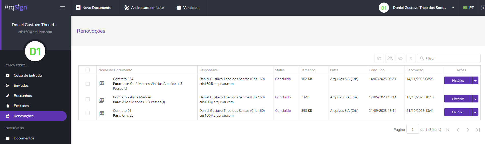
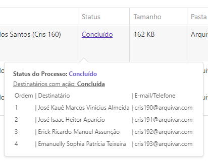
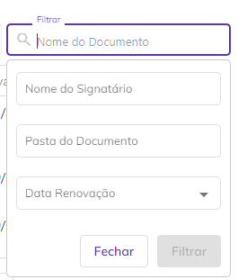
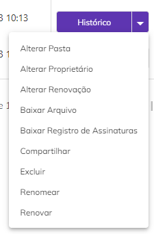
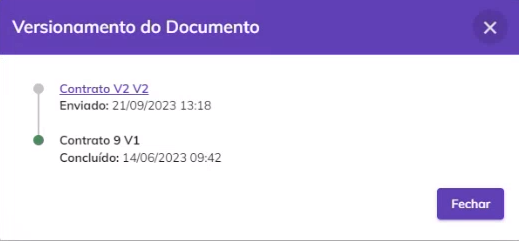
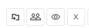

# 🗓️ Renovações

No menu Renovações são apresentados todos os documentos que foram cadastrados e enviados para assinatura com a opção “Agendar renovação \_\_\_ meses após a conclusão das assinaturas” marcada, na tela [Novo Documento > Adicionar Documentos e Destinatários > Adicionar Documentos](../menu-superior/novo-documento.md#a.-adicionar-documentos). Só podem ser exibidos nesta tela documentos com o status “Concluído”.

<figure><figcaption>
Clique na imagem para ampliar.
</figcaption></figure>

***

## Colunas da tela principal - Renovações

<figure><figcaption>
Clique na imagem para ampliar.
</figcaption></figure>

**Coluna Nome do Documento:** Nesta coluna são exibidos o nome do documento e o nome do signatário. Se houver mais de um signatário será mostrado o nome do primeiro e a quantidade de outras pessoas que deverão assinar.&#x20;

**Coluna Responsável:** Nesta coluna são apresentados o nome e e-mail de quem enviou o documento (remetente). Na tela Renovações o único nome e e-mail apresentados serão os do próprio usuário.&#x20;

**Coluna Status:** Na tela Renovações o único status possível para um documento é “Concluído” (todos os participantes já assinaram o documento). Ao passar o mouse sobre o status são exibidas informações sobre os signatários. Também é exibido o código de segurança enviado para os destinatários (se houver).&#x20;

<figure><figcaption>
Clique na imagem para ampliar.
</figcaption></figure>

**Coluna Tamanho:** Nesta coluna é exibido o tamanho do arquivo do documento.  &#x20;

**Coluna Pasta:** Nesta coluna é exibida a pasta do diretório onde o documento está armazenado. &#x20;

**Coluna Concluído:** Informações sobre a data e hora em que o processo de assinatura do documento foi concluído. &#x20;

**Coluna Renovação:** Esta coluna exibe a data e hora em que o documento deverá ser renovado, de acordo com a informação inserida no campo “Agendar renovação \_\_\_ meses após a conclusão das assinaturas” marcada, na tela [Novo Documento > Adicionar Documentos e Destinatários > Adicionar Documentos](../menu-superior/novo-documento.md#a.-adicionar-documentos). São exibidos tanto documentos que têm data futura de renovação quanto aqueles que já passaram do prazo, mas ainda não foram renovados.&#x20;

**Coluna Ações:** Esta coluna exibe botões de ação sobre o documento. Será sempre exibida nesse botão a ação prioritária de execução, de acordo com o perfil do usuário e status do documento.&#x20;

**Barra de filtro:** É possível localizar um ou mais documentos utilizando-se os filtros disponíveis para busca. Na tela Renovações a busca pode ser feita pelo nome do documento, pelo nome do responsável, pelos nomes dos signatários, pelo status do documento, pela pasta onde o documento está hospedado ou pela data de exclusão do documento.  &#x20;

<figure><figcaption>
Clique na imagem para ampliar.
</figcaption></figure>

***

## Ações individuais - Renovações

<figure><figcaption>
Clique na imagem para ampliar.
</figcaption></figure>

#### **Renovar**

Esta ação estará disponível caso o documento tenha alcançado a data e hora programados para sua programação no campo “Agendar renovação \_\_\_ meses após a conclusão das assinaturas” marcada, na tela [Novo Documento > Adicionar Documentos e Destinatários > Adicionar Documentos](../menu-superior/novo-documento.md#a.-adicionar-documentos). Ao clicar neste botão o usuário será direcionado para a tela “Adicionar documentos e destinatários” com as informações de destinatários preenchidas com as mesmas informações do fluxo anterior para que faça novamente a configuração e envio do novo documento para os destinatários.&#x20;


<mark style="color:orange;">**Mesmo depois de renovar o documento e enviá-lo aos destinatários, o documento será listado na tela Renovações até que todos os signatários concluam a assinatura.**</mark> &#x20;


#### **Alterar Pasta**

Ao clicar nesta opção ele poderá alterar a pasta do diretório onde o documento está armazenado. &#x20;

<figure><figcaption>
Clique na imagem para ampliar.
</figcaption></figure>

#### **Alterar Renovação**

Essa opção só estará disponível caso o documento ainda não tenha sido renovado. Ao clicar nesta opção será possível mudar a data renovação informando a quantidade de meses que deverá ter o intervalo de renovação do documento. Também é possível excluir a renovação clicando em “Excluir Agendamento”.

<figure><figcaption>
Clique na imagem para ampliar.
</figcaption></figure>

#### **Histórico**

&#x20;Aqui é possível visualizar o histórico do processo de assinatura e seus documentos. Selecione o botão de eventos para visualizar detalhadamente os dados. Nesta tela também é possível baixar os arquivos originais do processo.

Com o botão de eventos posicionado para a direita, observamos os dados do processo na tela.

<figure><figcaption>
Clique na imagem para ampliar.
</figcaption></figure>

Com o botão de eventos posicionado para a esquerda, é possível visualizar os Id's e Hash's dos documentos, no caso de um **processo com mais de um documento não agrupados**.

<figure><figcaption>
Clique na imagem para ampliar.
</figcaption></figure>

#### **Alterar Proprietário**

Ao clicar nesta opção ele poderá alterar o proprietário do documento. Ao executar essa ação não será possível realizar outras atividades de gestão do documento.&#x20;


<mark style="color:orange;">**Só podem ser selecionados como novo proprietários usuários cadastrados na mesma conta do responsável.**</mark>&#x20;


<figure><figcaption>
Clique na imagem para ampliar.
</figcaption></figure>

#### **Baixar Arquivo**

Quando processo possuir um documento ou é um compartilhamento de apenas um documento do processo, **o sistema faz&#x20;**_**download**_ do documento do **processo e do registro de assinaturas** em uma pasta.zip.

A pasta zip é nomeada com o nome do processo e o arquivo de registro de assinatura é nomeado como **NomeDocumento\_Registro** de assinatura.

<figure><figcaption>
Clique na imagem para ampliar.
</figcaption></figure>

Quando o processo **possuir mais de um documento**, o sistema exibe modal com os documentos do processo para o usuário selecionar quais documentos deseja baixar. Caso seja um compartilhamento, deve-se listar apenas os documentos que foram compartilhados.

<figure><figcaption>
Clique na imagem para ampliar.
</figcaption></figure>

O Registro de Assinaturas exibe todas as informações sobre as assinaturas eletrônicas e digitais realizadas durante o processo, como nome dos signatários, data e hora da assinatura, localização, IP de onde foi realizada, dados dos certificados digitais utilizados etc.

<figure><figcaption>
Clique na imagem para ampliar.
</figcaption></figure>

<figure><figcaption>
Clique na imagem para ampliar.
</figcaption></figure>

#### **Compartilhar**

Essa opção permite que o usuário crie um link de acesso a um ou mais documento do processo que poderá ser compartilhado com outras pessoas que não sejam participantes do processo de assinatura. Esse link pode ter prazo de validade determinado ou indeterminado e o usuário pode definir se deseja permitir que as pessoas que acessarem visualizem também os anexos enviados pelos signatários.

Quando o processo com mais de um documento não agrupados não possui compartilhamento de documentos, o sistema abre a _modal_ para o usuário selecionar os documentos do processo que deseja compartilhar.

<figure><figcaption>
Clique no ícone para ampliar.
</figcaption></figure>

Quando o processo com mais de um documento possui compartilhamento de documentos, o sistema abre a modal com os links já compartilhados.

<figure><figcaption>
Clique na imagem para ampliar.
</figcaption></figure>

Ao expandir as ações do link de compartilhamento, é possível **visualizar** a tela de compartilhamento novamente ou e **excluir** o compartilhamento realizado.

<figure><figcaption>
Clique na imagem para ampliar.
</figcaption></figure>

Ao compartilhar os documentos do processo, o usuário tem a possibilidade de enviá-los por e-mail clicando no botão "Enviar Link por e-mail".

<figure><figcaption>
Clique na imagem para ampliar.
</figcaption></figure>

Adicione no campo indicado todos os e-mails que devem receber a documentação compartilhada.

<figure><figcaption>
Clique na imagem para ampliar.
</figcaption></figure>


<mark style="color:red;">Ao compartilhar documentos de um processo, é importante ressaltar que o destinatário do compartilhamento poderá visualizar apenas os documentos selecionados para compartilhamento e não todos os documentos que compõem o processo de assinatura.</mark>


#### Visualização de documentos compartilhados

Quando realizado o compartilhamento de apenas um documento de um processo com mais de um documento não agrupado, ao abrir o documento, será apresentado somente o documento compartilhado com o usuário.

Observe que são apresentados na lista apenas os dados dos signatários:

<figure><figcaption>
Clique na imagem para ampliar.
</figcaption></figure>

Quando realizado o compartilhamento de mais documentos do processo, é apresentado na lista, além dos dados dos signatários, os demais documentos do processo:

<figure><figcaption>
Clique na imagem para ampliar.
</figcaption></figure>

**Excluir:** Utilizado para excluir o arquivo, que irá para a [caixa Excluídos](excluidos.md).&#x20;

<figure><figcaption></figcaption></figure>

**Renomear:** Esta opção só será exibida se o usuário além de signatário for também o remetente do documento.&#x20;

Quando o processo possui apenas um documento, o sistema permite alterar o nome do processo:

<figure><figcaption>
Clique na imagem para ampliar.
</figcaption></figure>

Quando processo possui mais de um documento, o sistema permite alterar o nome do processo e o nome dos documentos do processo.

<figure><figcaption>
Clique na imagem para ampliar.
</figcaption></figure>

O campo “**Renomear documentos do processo**” é exibido, somente se o usuário logado for o remetente do processo e o processo possuir mais de um documento/arquivo.

Por padrão, este campo é exibido desmarcado e ao ser marcado, o sistema lista todos os documentos do processo habilitados para edição.

O usuário tem a possibilidade de mover os documentos, alterando a ordenação deles. Ao mover os documentos, o sistema atualiza a numeração na frente de cada documento.

#### **Versionamento**

Essa opção permite ao usuário visualizar todas as versões do documento que já foram enviadas. Ao renovar um documento e ele ser concluído, ele deixa de ser exibido na tela Renovações, mas as informações sobre o seu envio podem ser vistas na tela Versionamento do Documento. &#x20;

<figure><figcaption>
Clique na imagem para ampliar.
</figcaption></figure>

***

## Ações em lote - Renovações

É possível selecionar mais de um documento marcando-se os checkbox ao lado do nome do arquivo e executar ações em lote.&#x20;

<figure><figcaption></figcaption></figure>

#### **Mover Processo (s)**

Ao clicar neste ícone será possível alterar a pasta onde os documentos selecionados estão armazenados. &#x20;

<figure><figcaption>
Clique na imagem para ampliar.
</figcaption></figure>

#### **Alterar Proprietário**

Ao clicar neste ícone será possível alterar a propriedade dos documentos selecionados, ou seja, as funções de administração do documento serão de outro usuário. Essa ação só poderá ser desfeita se o usuário que for definido como novo proprietário devolver a propriedade do documento ao proprietário original. A alteração de proprietário de um documento em lote tem o prazo de 24 horas para ser realizada e para acompanhar o andamento o usuário deve acessar o menu Meu Perfil > Aba Solicitações. &#x20;


<mark style="color:orange;">**Só podem ser selecionados como novo proprietários usuários cadastrados na mesma conta do responsável.**</mark>&#x20;


<figure><figcaption></figcaption></figure>

#### **Excluir**

Ao clicar neste ícone será possível excluir os documentos selecionados. Só será possível executar essa ação em documentos com o status “Concluído” ou “Cancelado”.&#x20;

<figure><figcaption></figcaption></figure>
