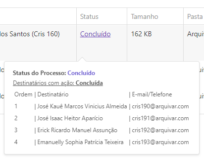
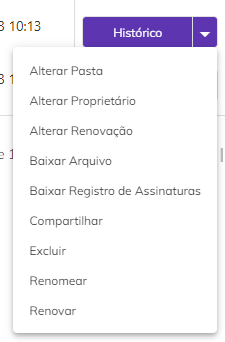
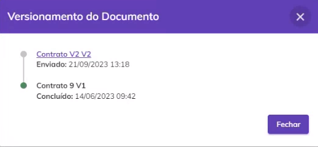

# 🗓️ Renovações

No menu Renovações são apresentados todos os processos que foram cadastrados e enviados para assinatura com a opção “Agendar renovação \_\_\_ meses após a conclusão das assinaturas” marcada, na tela [Novo Processo > Adicionar Documentos e Destinatários > Adicionar Documentos](../menu-superior/novo-processo.md#a.-adicionar-documentos). Só podem ser exibidos nesta tela processos com o status “Concluído”.

<figure><figcaption>
Clique na imagem para ampliar.
</figcaption></figure>

***

## Colunas da tela principal - Renovações

<figure><figcaption>
Clique na imagem para ampliar.
</figcaption></figure>

**Coluna Nome do Processo:** Nesta coluna são exibidos o nome do processo e o nome do signatário. Se houver mais de um signatário será mostrado o nome do primeiro e a quantidade de outras pessoas que deverão assinar.&#x20;

**Coluna Responsável:** Nesta coluna são apresentados o nome e e-mail de quem enviou o processo (remetente). Na tela Renovações o único nome e e-mail apresentados serão os do próprio usuário.&#x20;

**Coluna Status:** Na tela Renovações o único status possível para um processo é “Concluído” (todos os participantes já assinaram). Ao passar o mouse sobre o status são exibidas informações sobre os signatários. Também é exibido o código de segurança enviado para os destinatários (se houver).&#x20;

<figure><figcaption>
Clique na imagem para ampliar.
</figcaption></figure>

**Coluna Tamanho:** Nesta coluna é exibido o tamanho do(s) arquivo(s) presentes no processo.  &#x20;

**Coluna Pasta:** Nesta coluna é exibida a pasta do diretório onde os documentos do processo estão armazenados. &#x20;

**Coluna Concluído:** Informações sobre a data e hora em que o processo de assinatura do documento foi concluído. &#x20;

**Coluna Renovação:** Esta coluna exibe a data e hora em que o processo deverá ser renovado, de acordo com a informação inserida no campo “Agendar renovação \_\_\_ meses após a conclusão das assinaturas” marcada, na tela [Novo Processo > Adicionar Documentos e Destinatários > Adicionar Documentos](../menu-superior/novo-processo.md#a.-adicionar-documentos). São exibidos tanto processos que têm data futura de renovação quanto aqueles que já passaram do prazo, mas ainda não foram renovados.&#x20;

**Coluna Ações:** Esta coluna exibe botões de ação sobre o processo. Será sempre exibida nesse botão a ação prioritária de execução, de acordo com o perfil do usuário e status do processo.&#x20;

**Barra de filtro:** É possível localizar um ou mais processos utilizando-se os filtros disponíveis para busca. Na tela Renovações a busca pode ser feita pelo nome do processo, pelo nome do responsável, pelos nomes dos signatários, pelo status do processo, pela pasta onde o processo está hospedado ou pela data de exclusão do processo.  &#x20;

<figure><figcaption></figcaption></figure>

***

## Ações individuais - Renovações

<figure><figcaption>
Clique na imagem para ampliar.
</figcaption></figure>

#### **Renovar**

Esta ação estará disponível quando o processo atingir a data e hora programadas no campo “Agendar renovação \_\_\_ meses após a conclusão das assinaturas”, configurado na etapa [Novo Processo > Adicionar Documentos e Destinatários > Adicionar Documentos](../menu-superior/novo-processo.md#a.-adicionar-documentos-upload-de-arquivos). Ao clicar neste botão, o usuário será direcionado para a tela “Adicionar Documentos e Destinatários”, onde os dados dos destinatários estarão automaticamente preenchidos com as informações do processo anterior, permitindo que seja feita uma nova configuração e o reenvio do processo para assinatura.


<mark style="color:orange;">**Mesmo após a renovação do processo e seu reenvio aos destinatários, ele continuará sendo exibido na tela “Renovações” até que todos os signatários concluam as assinaturas.**</mark> &#x20;


#### **Alterar Pasta**

Ao clicar nesta opção ele poderá alterar a pasta do diretório onde o processo está armazenado.&#x20;

<figure><figcaption></figcaption></figure>

#### **Alterar Renovação**

Essa opção estará disponível apenas para processos que ainda não tenham sido renovados. Ao acioná-la, é possível alterar a data de renovação informando uma nova quantidade de meses para o intervalo entre renovações. Também é possível excluir o agendamento clicando em “Excluir Agendamento”.

<figure><figcaption>
Clique na imagem para ampliar.
</figcaption></figure>

#### **Histórico**

&#x20;Aqui é possível visualizar o histórico do processo de assinatura e seus documentos. Selecione o botão de eventos para visualizar detalhadamente os dados. Nesta tela também é possível baixar os arquivos originais do processo.

Com o botão de eventos posicionado para a direita, observamos os dados do processo na tela.

<figure><figcaption>
Clique na imagem para ampliar.
</figcaption></figure>

Com o botão de eventos posicionado para a esquerda, é possível visualizar os Id's e Hash's dos documentos, no caso de um **processo com mais de um documento não agrupados**.

<figure><figcaption>
Clique na imagem para ampliar.
</figcaption></figure>

#### **Alterar Proprietário**

Ao clicar nesta opção ele poderá alterar o proprietário do documento. Ao executar essa ação não será possível realizar outras atividades de gestão do documento.&#x20;


<mark style="color:orange;">**Só podem ser selecionados como novo proprietários usuários cadastrados na mesma conta do responsável.**</mark>&#x20;


<figure><figcaption></figcaption></figure>

#### **Baixar Arquivo**

Quando o processo **possuir apenas um documento**, ou quando for realizado o compartilhamento de um único documento do processo, o sistema fará o download do arquivo em uma pasta `.zip`. Essa pasta será nomeada com o nome do processo, e o arquivo de registro de assinaturas será nomeado como `NomeDocumento_Registro de assinatura`.

<figure><figcaption>
Clique na imagem para ampliar.
</figcaption></figure>

Quando o processo **possuir mais de um documento**, o sistema exibirá uma modal com a lista dos documentos vinculados ao processo, permitindo que o usuário selecione quais deseja baixar. Nos casos de compartilhamento, serão listados apenas os documentos efetivamente compartilhados, respeitando os critérios definidos no ato do envio.

<figure><figcaption>
Clique na imagem para ampliar.
</figcaption></figure>

O Registro de Assinaturas exibe todas as informações sobre as assinaturas eletrônicas e digitais realizadas durante o processo, como nome dos signatários, data e hora da assinatura, localização, IP de onde foi realizada, dados dos certificados digitais utilizados etc.

<figure><figcaption>
Clique na imagem para ampliar.
</figcaption></figure>

<figure><figcaption>
Clique na imagem para ampliar.
</figcaption></figure>

#### **Compartilhar**

Essa opção permite que o usuário gere um link de acesso a um ou mais documentos do processo, possibilitando o compartilhamento com pessoas que não participam diretamente do processo de assinatura. O link pode ter validade definida ou indeterminada, e o usuário pode escolher se deseja permitir a visualização dos anexos enviados pelos signatários.

Quando o processo possui mais de um documento não agrupado e ainda não há compartilhamento configurado, o sistema exibirá uma janela para que o usuário selecione quais documentos deseja compartilhar.

<figure><figcaption>
Clique no ícone para ampliar.
</figcaption></figure>

Quando o processo com mais de um documento possui compartilhamento de documentos, o sistema abre a modal com os links já compartilhados.

<figure><figcaption>
Clique na imagem para ampliar.
</figcaption></figure>

Ao expandir as ações do link de compartilhamento, é possível **visualizar** a tela de compartilhamento novamente ou e **excluir** o compartilhamento realizado.

<figure><figcaption>
Clique na imagem para ampliar.
</figcaption></figure>

Ao compartilhar os documentos do processo, o usuário tem a possibilidade de enviá-los por e-mail clicando no botão "Enviar Link por e-mail".

<figure><figcaption>
Clique na imagem para ampliar.
</figcaption></figure>

Adicione no campo indicado todos os e-mails que devem receber a documentação compartilhada.

<figure><figcaption>
Clique na imagem para ampliar.
</figcaption></figure>


<mark style="color:red;">**Ao compartilhar documentos de um processo, é importante ressaltar que o destinatário do compartilhamento poderá visualizar apenas os documentos selecionados para compartilhamento e não todos os documentos que compõem o processo de assinatura.**</mark>


#### Visualização de documentos compartilhados

Quando realizado o compartilhamento de apenas um documento de um processo com mais de um documento não agrupado, ao abrir o documento, será apresentado somente o documento compartilhado com o usuário.

Observe que são apresentados na lista apenas os dados dos signatários:

<figure><figcaption>
Clique na imagem para ampliar.
</figcaption></figure>

Quando realizado o compartilhamento de mais documentos do processo, é apresentado na lista, além dos dados dos signatários, os demais documentos do processo:

<figure><figcaption>
Clique na imagem para ampliar.
</figcaption></figure>

**Excluir:** Utilizado para excluir o arquivo, que irá para a [caixa Excluídos](excluidos.md).

<figure><figcaption></figcaption></figure>

**Renomear:** Esta opção só será exibida se o usuário além de signatário for também o remetente do processo.&#x20;

Quando o processo possui apenas um documento, o sistema permite alterar o nome do processo:

<figure><figcaption>
Clique na imagem para ampliar.
</figcaption></figure>

Quando processo possui mais de um documento, o sistema permite alterar o nome do processo e o nome dos documentos do processo.

<figure><figcaption>
Clique na imagem para ampliar.
</figcaption></figure>

O campo “**Renomear documentos do processo**” é exibido, somente se o usuário logado for o remetente do processo e o processo possuir mais de um documento/arquivo.

Por padrão, este campo é exibido desmarcado e ao ser marcado, o sistema lista todos os documentos do processo habilitados para edição.

O usuário tem a possibilidade de mover os documentos, alterando a ordenação deles. Ao mover os documentos, o sistema atualiza a numeração na frente de cada documento.

#### **Versionamento**

Essa opção permite ao usuário visualizar todas as versões do documento que já foram enviadas. Ao renovar um documento e ele ser concluído, ele deixa de ser exibido na tela Renovações, mas as informações sobre o seu envio podem ser vistas na tela Versionamento do Documento. &#x20;

<figure><figcaption>
Clique na imagem para ampliar.
</figcaption></figure>

***

## Ações em lote - Renovações

É possível selecionar mais de um processo marcando-se os checkbox ao lado do nome do arquivo e executar ações em lote.&#x20;

<figure><figcaption></figcaption></figure>

#### **Mover Processo (s)**

Ao clicar neste ícone será possível alterar a pasta onde os documentos selecionados estão armazenados. &#x20;

<figure><figcaption></figcaption></figure>

#### **Alterar Proprietário**

Ao clicar neste ícone, será possível transferir a propriedade dos processos selecionados, ou seja, as funções de administração desses processos passarão para outro usuário. Essa alteração só poderá ser revertida caso o novo proprietário devolva voluntariamente a titularidade ao proprietário original. A troca de proprietário em lote tem um prazo de até 24 horas para ser concluída. Para acompanhar o andamento da solicitação, o usuário deve acessar o menu _Meu Perfil_ > aba _Solicitações_.


<mark style="color:orange;">**Só podem ser selecionados como novo proprietários usuários cadastrados na mesma conta do responsável.**</mark>&#x20;


<figure><figcaption></figcaption></figure>

#### **Excluir**

Ao clicar neste ícone será possível excluir os documentos selecionados. Só será possível executar essa ação em documentos com o status “Concluído” ou “Cancelado”.&#x20;

<figure><figcaption></figcaption></figure>

## 🗪 Perguntas e Respostas Frequentes

Como ativar fluxo de renovação de Processos automaticamente?

Caso você tenha agendado a renovação de um Processo, assim que atingido o prazo para renovação, você pode acionar a renovação automática que um novo Processo será criado com as mesmas configurações de signatários que o original.

1. Clique em Renovações;
2. Selecione Processo concluído;
3. Clique em Renovar – A Plataforma automaticamente gera um novo Processo com todos os signatários do Processo original;
4. Faça upload do arquivo para renovação. O novo arquivo fica vinculado ao(s) arquivo(s) anterior(es) criando um versionamento de Processos.
5. Revise os signatários.
6. Configure as representações visuais;
7. Envie e Pronto!

Como alterar a renovação, vencimento de Processos ou controle de reajuste?

Após a conclusão de um Processo:

1. Clique em Enviados;
2. Selecione Processo concluído;
3. Clique em Histórico;
4. Clique em Alterar Renovação;
5. Defina o novo prazo em meses após a finalização das assinaturas;
6. Clique em Alterar.

Quando chegar a data definida para vencimento do Processo, renovação ou reajuste, a plataforma ArqSign enviará um e-mail ao proprietário do Processo informando que ele está pronto para renovação, reajuste etc.

