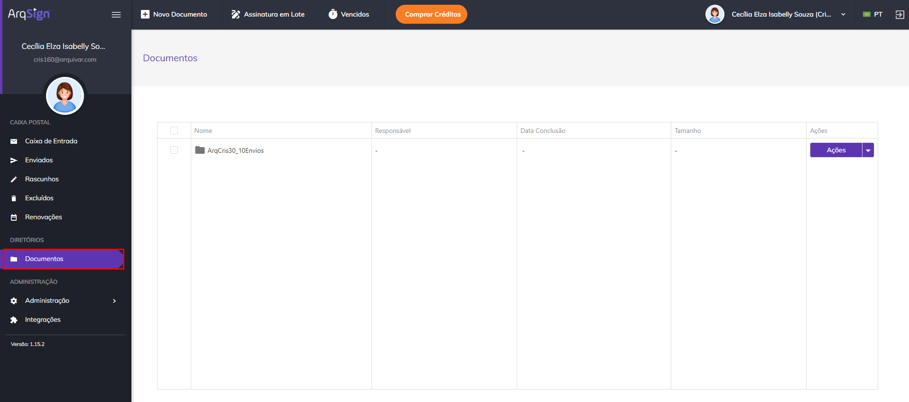
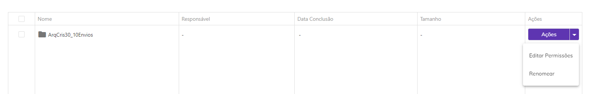
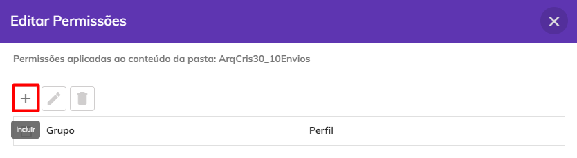
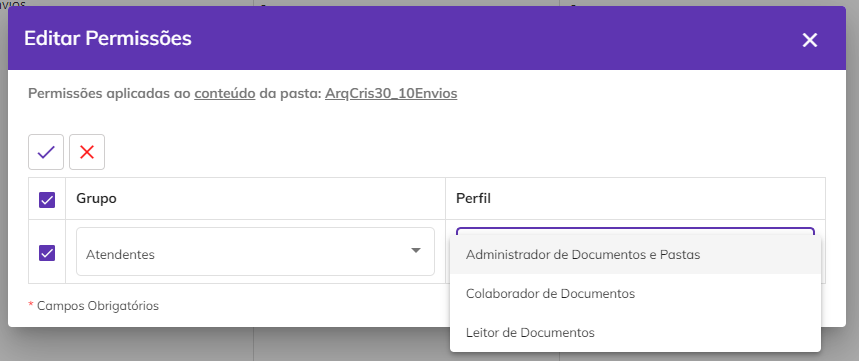
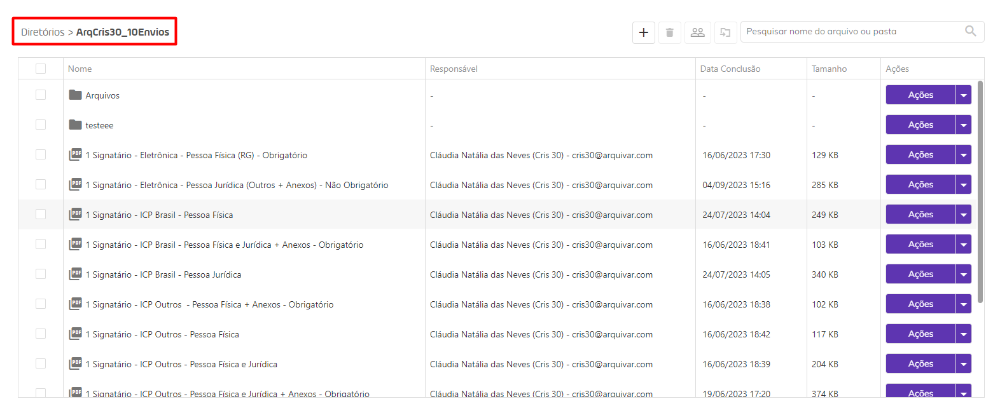
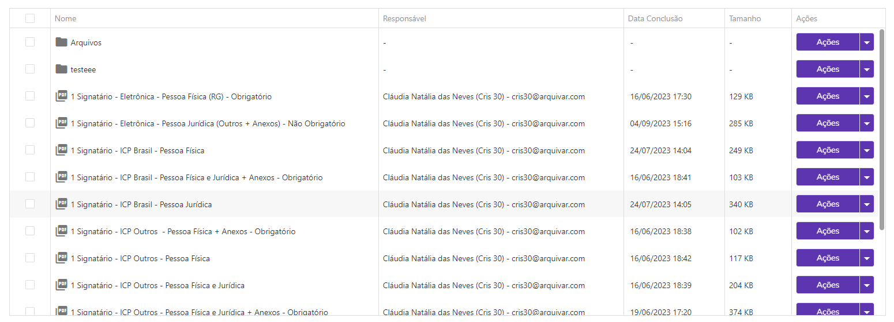
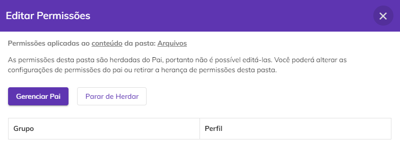
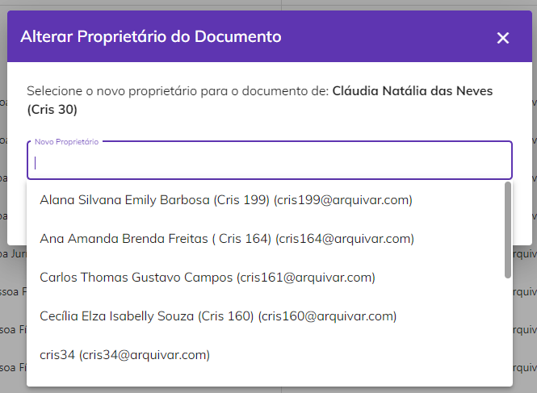
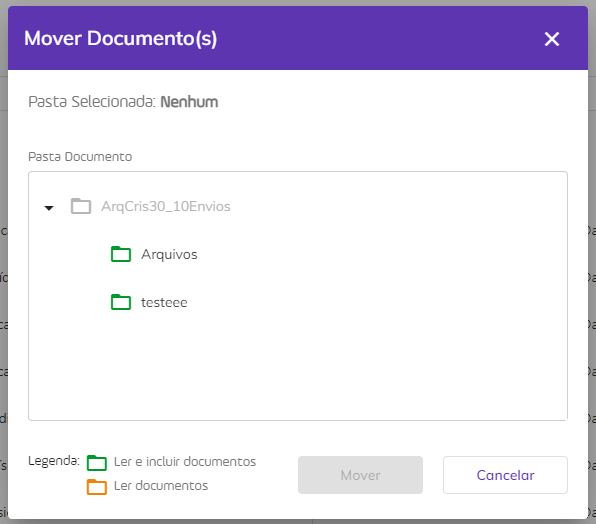
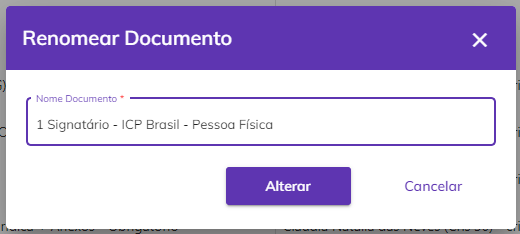

# 📁 Documentos

No menu Documentos ficam armazenados todos os documentos da conta do usuário que já foram concluídos, ou seja, foram enviados pelo usuário ou por algum dos membros que fazem parte da conta e já foram assinados por todos os signatários envolvidos no processo de assinatura. Neste menu é possível realizar o gerenciamento da armazenagem desses documentos.&#x20;

Ao clicar no menu é exibida a pasta raiz do diretório, na qual todos os documentos da conta serão hospedados. &#x20;

<figure><figcaption>
Clique na imagem para ampliar.
</figcaption></figure>

## Pasta Raiz de Diretórios&#x20;

A pasta raiz é criada automaticamente no momento da criação da conta do usuário e por padrão será nomeada com o mesmo nome da conta. Para renomeá-la, clique em “Renomear” na coluna “Ações”. &#x20;

<figure><figcaption>
Clique na imagem para ampliar.
</figcaption></figure>

### Acesso à pasta raiz de Diretórios&#x20;

O acesso à pasta raiz do diretório é concedido a usuários que tenham sido designados como administradores globais no menu [Administração > Usuários](../../administracao/administracao/usuarios.md). O acesso a outros usuários com perfil de remetente de documentos deve ser feito por grupo, ou seja, é preciso criar um [Grupo de Usuários](../../administracao/administracao/grupo-de-usuarios.md) e conceder o acesso ao grupo. Para isso, na coluna “Ações” clique em “Editar Permissões”. &#x20;


<mark style="color:blue;">**ADMINISTRADOR GLOBAL X REMETENTE DE DOCUMENTOS**</mark>

<mark style="color:blue;">O</mark> <mark style="color:blue;"></mark><mark style="color:blue;">**administrador globa**</mark><mark style="color:blue;">l, além de ter todas as permissões de um administrador de diretório, possui permissão de acesso a todas as funcionalidades da plataforma, inclusive gestão de usuários. É ele quem define quem serão os administradores de diretórios da conta. Geralmente o administrador global é o proprietário da conta e aqueles usuários que ele designar que poderão ter acesso total.</mark>

<mark style="color:blue;">O</mark> <mark style="color:blue;"></mark><mark style="color:blue;">**remetente de documentos**</mark> <mark style="color:blue;"></mark><mark style="color:blue;">é um usuário sem permissão de acesso às funcionalidades de gestão da plataforma.</mark>


<figure><figcaption>
Clique na imagem para ampliar.
</figcaption></figure>

Na tela “Editar Permissões” clique no ícone “Incluir”. &#x20;

<figure><figcaption></figcaption></figure>

No campo “Grupo” selecione o grupo ao qual será concedido o acesso e habilite permissão de leitura para todos no menu [Documentos > Ações > Editar permissões](./#acoes-individuais-subdiretorios).

No campo “Perfil” selecione o perfil que designa a permissão de acesso do usuário ou grupo a Diretórios. Os perfis de diretório podem ser:

* _Administrador de Documentos e Pastas:_ Um usuário ou grupo de usuários com este perfil de diretórios pode consultar e baixar conteúdo, incluir, mover, compartilhar e renomear documentos, excluir ou incluir novas pastas, além de poder mudar permissões de acesso.
* _Colaborador de Documentos:_ Um usuário ou grupo de usuários com este perfil de diretórios pode consultar e baixar conteúdo, incluir, mover, compartilhar e renomear documentos à pasta a que tem este perfil.  &#x20;
* _Leitor de Documentos:_ Um usuário ou grupo de usuários com este perfil de diretórios pode apenas consulta e baixar o conteúdo da pasta e documentos.

<figure><figcaption></figcaption></figure>

***

## Subdiretórios&#x20;

Ao clicar na pasta raiz são exibidos os subdiretórios, ou seja, subpastas criadas para organizar os documentos de acordo com a necessidade do usuário. Também podem ser apresentados documentos que não estão armazenados em nenhum desses subdiretórios.&#x20;

<figure><figcaption>
Clique na imagem para ampliar.
</figcaption></figure>

### Colunas da tela principal – Subdiretórios&#x20;

**Coluna Nome:** Nome da pasta ou arquivo.&#x20;

**Coluna Responsável:** Em caso de documentos avulsos serão apresentados o nome e e-mail do responsável pelo envio. No caso de pastas, o campo ficará em branco, já que uma pasta é composta por documentos que podem ter diferentes responsáveis.&#x20;

**Coluna Data Conclusão:** Apresenta a data e hora de conclusão do documento. No caso de pastas, o campo ficará em branco, já que uma pasta é composta por documentos que podem ter diferentes datas de conclusão.&#x20;

**Coluna Tamanho:** Apresenta o tamanho do documento. No caso de pastas, o campo ficará em branco, já que uma pasta é composta por documentos que podem ter diferentes tamanhos.&#x20;

<figure><figcaption>
Clique na imagem para ampliar.
</figcaption></figure>


<mark style="color:orange;">**Na aba Diretórios, processos enviados via ArqGED-ArqFlow estarão identificados com a marcação "Enviado via ArqFlow".**</mark>


<figure><figcaption>
Clique na imagem para ampliar
</figcaption></figure>

### Ações individuais – Subdiretórios&#x20;

**Editar Permissões:** Essa opção só estará disponível para pastas de documentos. As permissões dos subdiretórios são herdadas da pasta raiz de Diretórios, portanto não é possível editá-las. O usuário pode apenas alterar as configurações de permissões da pasta raiz ou retirar a herança de permissões desta pasta.&#x20;

<figure><figcaption></figcaption></figure>

**Alterar Proprietário:** Essa opção só estará disponível para documentos avulsos e se o usuário for o remetente do documento. Clicando nesta opção será possível atribuir um novo proprietário para o documento. Para isso, selecione o novo usuário proprietário e clique em “Alterar”. &#x20;

<figure><figcaption></figcaption></figure>

**Baixar Arquivo:** Essa opção só estará disponível para documentos avulsos. Clique nesta opção para fazer o download do documento assinado.&#x20;

**Compartilhar:** Essa opção só estará disponível para documentos avulsos. Essa opção permite que o usuário crie um link de acesso ao documento que poderá ser compartilhado com outras pessoas que não sejam participantes do processo de assinatura. Esse link pode ter prazo de validade determinado ou indeterminado e o usuário pode definir se deseja permitir que as pessoas que acessarem visualizem também os anexos enviados pelos signatários.&#x20;

<figure><figcaption>
Clique na imagem para ampliar.
</figcaption></figure>

**Mover:** Essa opção só estará disponível para documentos avulsos. Ao clicar nesta opção será possível alterar a pasta onde os documentos selecionados estão armazenados. Selecione a pasta para a qual os documentos serão movidos e clique em “Mover”.   &#x20;

<figure><figcaption></figcaption></figure>

**Renomear:** Opção disponível para documentos avulsos e pastas. Utilizada para renomear o documento ou pasta.&#x20;

<figure><figcaption></figcaption></figure>

### Ações em lote - Subdiretórios&#x20;

É possível selecionar mais de um documento marcando-se os checkbox ao lado do nome do arquivo e executar ações em lote.

**Incluir Pasta:** Utilizado para a criação de novas pastas no diretório. Ao clicar neste ícone, em “Incluir em” selecione a pasta “pai” da pasta que está sendo criada e informe o nome da pasta. &#x20;

**Mover Documentos:** Selecione os documentos que deseja movimentar e clique no ícone “Mover Documentos”. Depois, selecione a pasta para a qual os documentos serão movidos e clique em “Mover”.   &#x20;

**Excluir:** Utilizado para excluir documentos do diretório. Essa ação só pode ser realizada por administradores globais ou pelo proprietário do documento.&#x20;

**Alterar Proprietário:** Essa opção só estará disponível para documentos avulsos e se o usuário for o remetente do documento. Clicando nesta opção será possível atribuir um novo proprietário para o documento. Para isso, selecione o novo usuário proprietário e clique em “Alterar”. &#x20;

**Barra de Pesquisa:** É possível realizar a busca pelo nome do documento ou pasta utilizando a barra de pesquisa superior.

<figure><figcaption></figcaption></figure>

&#x20;
