# 🟪 Configuração de diretórios para clientes que já assinaram documentos

## Criação da estrutura de diretórios

### ETAPA 1 – Revisão das permissões dos usuários

O importante nesta etapa é garantir que somente usuários que podem ter acesso a todos os documentos que estão sendo enviados para assinatura na conta estejam com a permissão de Administrador Global.

Para isso acesse a tela [Administração > Usuários ](../../administracao/administracao/usuarios.md)e revise os perfis de usuários associados à conta, garantindo que estejam com o perfil de Remetente de Documentos (exceto o gestor da conta que deve possuir o perfil Administrador Global).

<figure>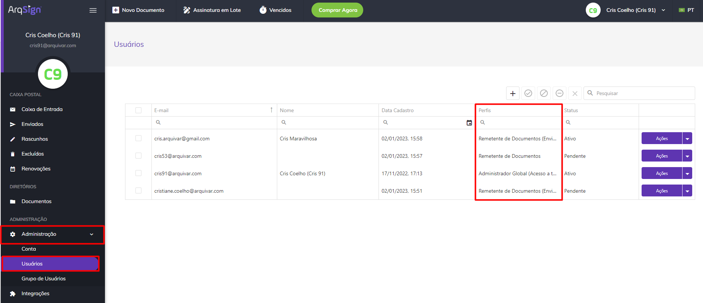<figcaption>
Clique na imagem para ampliar.
</figcaption></figure>


<mark style="color:orange;">**Somente usuários com perfil de Administrador Global poderão acessar todas as pastas do diretório.**</mark>


***

### ETAPA 2 – Criação das pastas setoriais

1\. Identifique quais setores farão uso da Plataforma ArqSign para envio de documentos para assinatura, e de acordo com estes setores e crie uma pasta para cada. Para isso, na tela [Documentos ](./)acesse a [pasta raiz](./#pasta-raiz-de-diretorios) e clique no ícone “Incluir Pasta”.

<figure>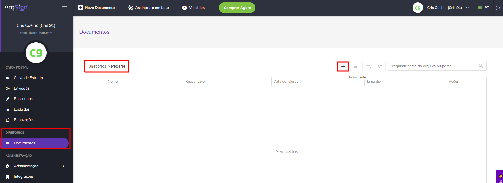<figcaption>
Clique na imagem para ampliar.
</figcaption></figure>

2\. Informe o nome do setor e clique em Salvar.

<figure>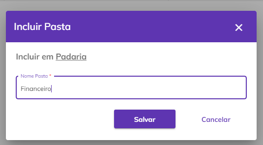<figcaption></figcaption></figure>

3\. Repita o processo até concluir a criação de todas as pastas necessárias.

<figure>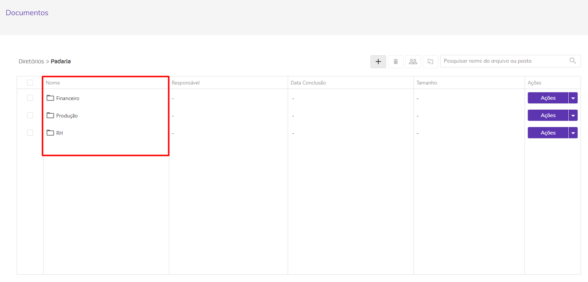<figcaption>
Clique na imagem para ampliar.
</figcaption></figure>


<mark style="color:orange;">**O Administrador Global deve realizar todas as configurações, ajustes de permissão, liberação de usuários e etc., antes do início de envio de documentos para assinatura.**</mark>


***

### ETAPA 3 – Movimentação dos documentos para as pastas

Acesse a [pasta raiz de Diretórios](./#pasta-raiz-de-diretorios), selecione todos os documentos que deseja mover para uma determinada pasta e clique no ícone “Mover”.

<figure>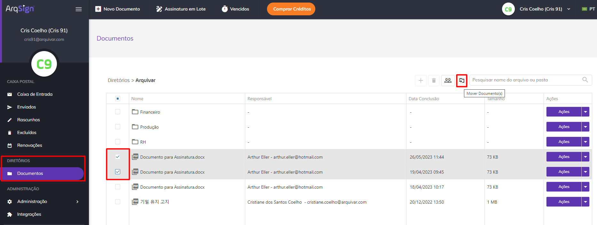<figcaption>
Clique na imagem para ampliar.
</figcaption></figure>

Selecione na lista a pasta para a qual deseja mover os documentos selecionados e clique em “Mover”.

<figure>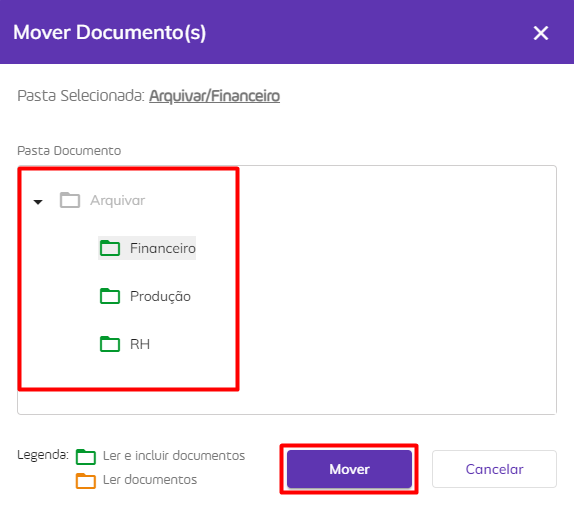<figcaption></figcaption></figure>

Repita o processo com todos os documentos avulsos que ainda estiverem na pasta raiz. O ideal é que todos os documentos sejam armazenados em alguma das pastas criadas, evitando a permanência de documentos avulsos na pasta raiz.

***

### ETAPA 4 - Criação de grupos por setores ou funcionais

Crie grupos de usuários separando-os por setores, funções ou mesclando entre os dois. Para isso, acesse a tela [Administração > Grupos de Usuários](../../administracao/administracao/grupo-de-usuarios.md).


<mark style="color:blue;">Estes grupos serão usados para atribuir permissões nas pastas, então a forma de criá-los irá depender de como deseja atribuir as permissões nas pastas. Nossa sugestão é mesclar o setor e a função, como por exemplo:</mark>

* <mark style="color:blue;">Comercial – Gerência</mark>
* <mark style="color:blue;">Comercial – Vendedores</mark>
* <mark style="color:blue;">Comercial - Outras funções com leitura</mark>


<figure>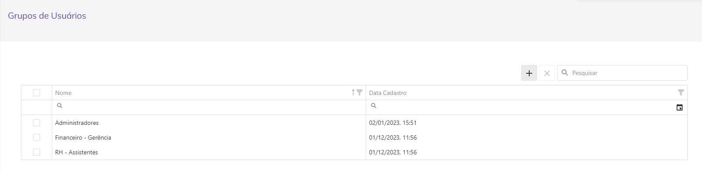<figcaption>
Clique na imagem para ampliar.
</figcaption></figure>

***

### ETAPA 5 - Inserção dos grupos criados na pasta raiz

Os grupos criados na etapa anterior, devem ser inseridos na [pasta raiz de Diretórios](./#pasta-raiz-de-diretorios) com permissão de "Leitor". Para isso, na pasta raiz clique em Ações > Editar Permissões.

<figure>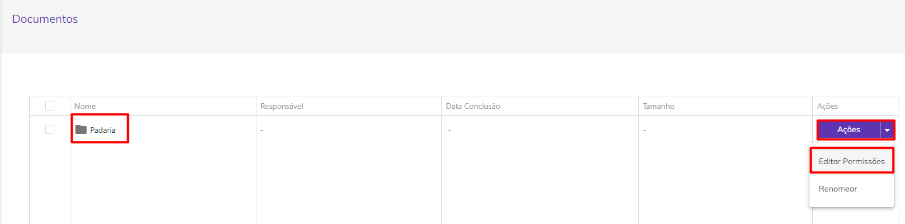<figcaption>
Clique na imagem para ampliar.
</figcaption></figure>

Clique no ícone “Incluir”.

<figure>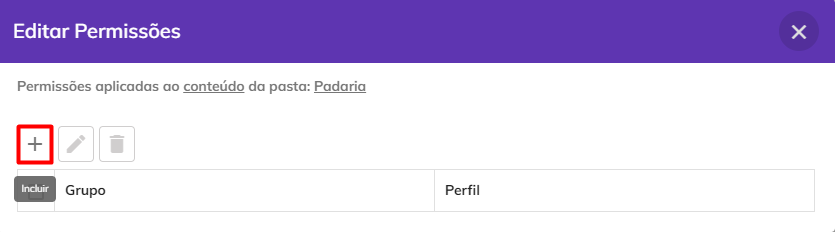<figcaption>
Clique na imagem para ampliar.
</figcaption></figure>

Selecione cada um dos grupos criados na etapa anterior e na coluna “Perfil” atribua o perfil de “Leitor de Documentos” para todos os grupos. Clique no ícone “Confirmar” para salvar as alterações.

<figure>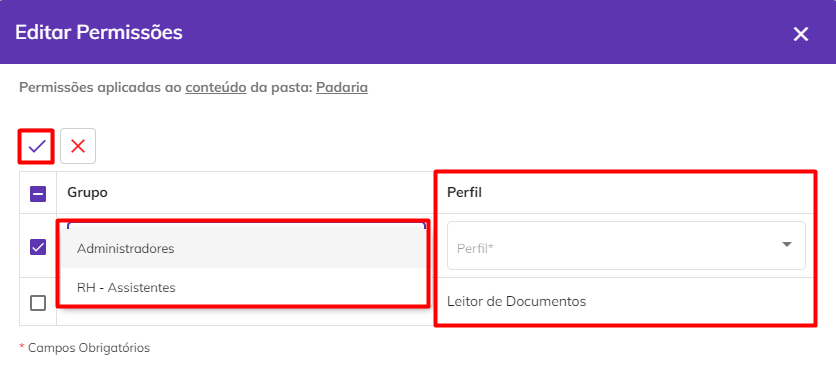<figcaption>
Clique na imagem para ampliar.
</figcaption></figure>

***

### ETAPA 6 - Ajuste das permissões das pastas setoriais

As permissões das pastas setoriais devem ser ajustadas para que o acesso seja realizado somente por pessoas do setor e para isso, será necessário:

**1. Parar de herdar a permissão da pasta raiz:** Na coluna “Ações” da pasta setorial desejada, clique em “Editar Permissões”. Clique em “Parar de Herdar”.

<figure>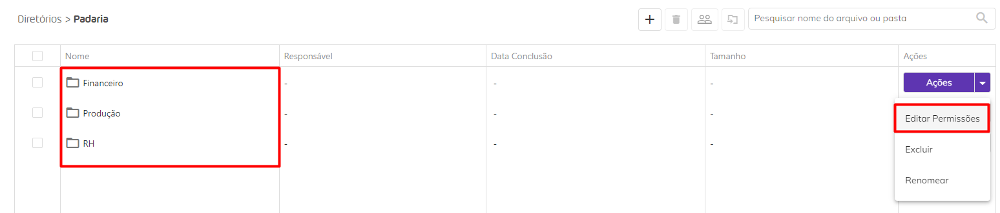<figcaption>
Clique na imagem para ampliar.
</figcaption></figure>

<figure>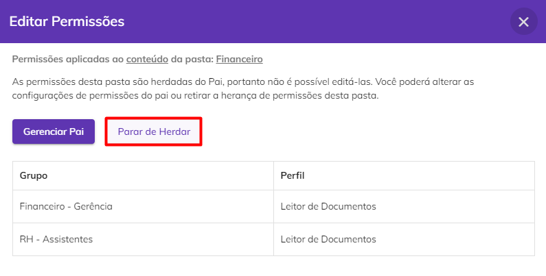<figcaption>
Clique na imagem para ampliar.
</figcaption></figure>

**2. Excluir os grupos de outros setores:** Selecione todos os outros grupos/setores que não devem ter acesso ao conteúdo da pasta selecionada e clique no ícone “Excluir”. Devem permanecer apenas os grupos que poderão ter acesso à pasta.

<figure>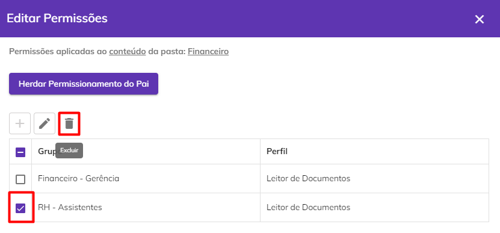<figcaption>
Clique na imagem para ampliar.
</figcaption></figure>

**3. Editar o perfil de acesso do setor em questão:** Ajuste as permissões dos grupos restantes selecionando-os e clicando no ícone “Editar”.

<figure>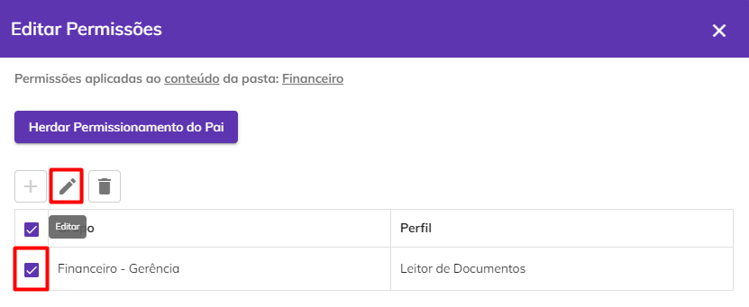<figcaption>
Clique na imagem para ampliar.
</figcaption></figure>

**4. Na coluna “Perfil”:** Defina se aquele grupo continuará apenas como “Leitor de Documentos” ou se será “Administrador de Documentos e Pastas” ou “Colaborador de Documentos”.

* _Administrador de Documentos e Pastas:_ Um usuário ou grupo de usuários com este perfil de diretórios pode consultar e baixar conteúdo, incluir, mover, compartilhar e renomear documentos, excluir ou incluir novas pastas, além de poder mudar permissões de acesso.
* _Colaborador de Documentos:_ Um usuário ou grupo de usuários com este perfil de diretórios pode consultar e baixar conteúdo, incluir, mover, compartilhar e renomear documentos à pasta a que tem este perfil.  &#x20;
* _Leitor de Documentos:_ Um usuário ou grupo de usuários com este perfil de diretórios pode apenas consulta e baixar o conteúdo da pasta e documentos.

<figure>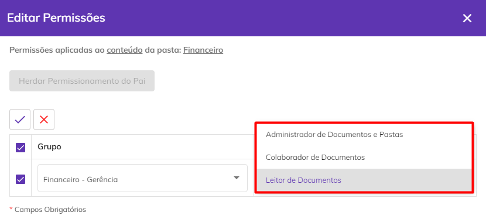<figcaption>
Clique na imagem para ampliar.
</figcaption></figure>


<mark style="color:orange;">**Este processo deve ser repetido para todas as demais pastas setoriais e subpastas que podem ser criadas dentro das pastas dos setores.**</mark>


***

## Permissões para Diretórios

Somente o Administrador Global da conta terá acesso ao menu de diretórios e por este motivo é tão importante cuidar para que somente pessoas sem restrições de acesso estejam com este perfil. Veja abaixo as diferenças entre as permissões concedidas a cada perfil:

<figure>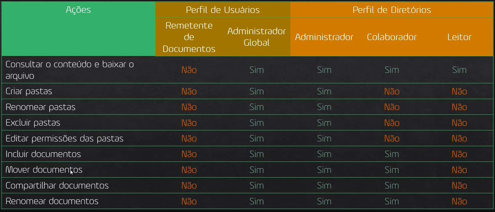<figcaption>
Clique na imagem para ampliar.
</figcaption></figure>


<mark style="color:orange;">**Todos os usuários devem ser associados a um grupo de permissão. Desta forma a plataforma deverá obrigar o usuário a salvar o documento em uma pasta setorial, evitando que os documentos sejam armazenados na pasta raiz.**</mark>


***

## Criação/Manutenção de Permissões por usuário

Criada a estrutura de diretórios e aplicadas as permissões, a manutenção na Plataforma se resume em incluir ou excluir usuários dos grupos para que acessem ou deixem de acessar determinada pasta.

Esta manutenção pode ser realizada na edição do usuário ou na edição de um grupo específico.

_Edição de um grupo específico:_ Acesse a tela [Administração > Grupo de Usuários](../../administracao/administracao/grupo-de-usuarios.md). Selecione o grupo desejado e inclua ou exclua usuários.

_Edição do usuário:_ Acesse a tela [Administração > Usuários](../../administracao/administracao/usuarios.md). Selecione o usuário que deseja editar e clique em “Editar”. Defina os grupos aos quais o usuário deve ter acesso e clique em “Salvar”.

***

## Regras Gerais de Diretórios

<strong>Pastas</strong>

1. Toda conta ao ser criada, automaticamente terá uma pasta raiz associada.
2. &#x20;A pasta raiz criada automaticamente pela plataforma recebe o nome da conta e pode ser renomeada posteriormente por seu Administrador Global.
3. &#x20;Para cada conta é permitida uma única pasta raiz. As demais pastas devem ser criadas obrigatoriamente dentro da pasta raiz.
4. &#x20; Os documentos exibidos em "Diretórios", são somente aqueles com status "Concluído" e que não esteja "Excluído", ou seja, se o documento estiver em processo de assinatura ele não vai aparecer no diretório.

Perfil de Usuários

1. O perfil do usuário Administrador Global tem acesso total ao diretório de documentos, caso o plano da conta possua acesso à funcionalidade de diretórios.
2. O perfil de usuário Remetente de Documentos terá acesso à navegação nas pastas caso faça parte de algum grupo que possua permissão de pelo menos leitura.

