# ✍️ Assinatura de Documentos

O processo de assinatura eletrônica de documentos pode ser realizado por três caminhos:



Ocorre quando o responsável recebe uma notificação por e-mail, informando que o documento deve ser assinado e disponibilizando o link para acesso ao documento ou aos documentos do processo de assinatura.

O usuário responsável pela assinatura receberá uma notificação por e-mail com o link para acesso ao(s) arquivo(s). Este e-mail apresentará também o nome do remetente e o prazo para assinatura. Se o destinatário tiver definido uma mensagem personalizada, ela também será exibida nesta notificação.&#x20;

<figure><figcaption>
Clique na imagem para ampliar.
</figcaption></figure>

Ao clicar no link ou informar o código, o usuário será direcionado para a tela de assinatura.

<figure>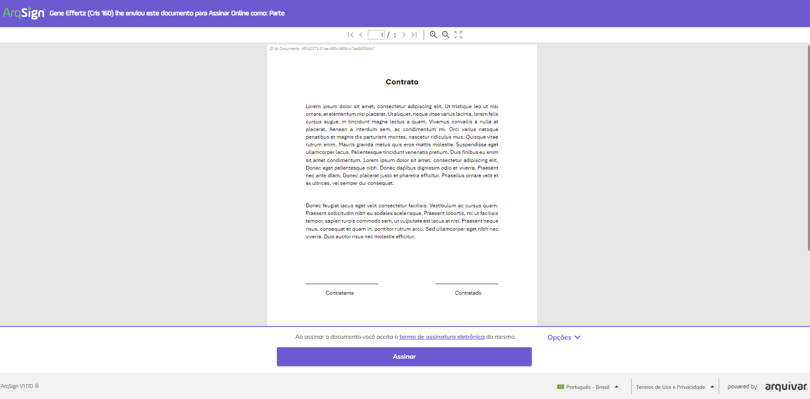<figcaption>
Clique na imagem para ampliar.
</figcaption></figure>



Ocorre quando o responsável recebe uma notificação por WhatsApp, informando que o documento deve ser assinado e disponibilizando o link para acesso ao documento. &#x20;

O usuário responsável pela assinatura receberá uma mensagem por WhatsApp com o link para acesso ao arquivo. Esta mensagem apresentará também o nome do remetente e o prazo para assinatura. Se o destinatário tiver definido uma mensagem personalizada, ela também será exibida nesta notificação.&#x20;

<figure>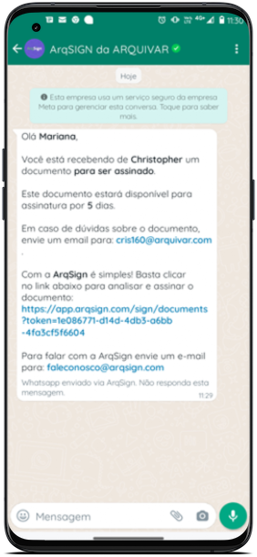<figcaption>
Clique na imagem para ampliar.
</figcaption></figure>

Ao clicar no link ou informar o código, o usuário será direcionado para a tela de assinatura.

<figure>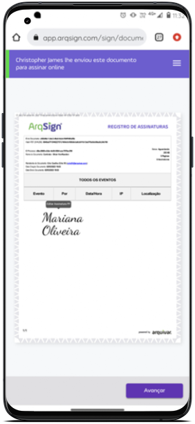<figcaption>
Clique na imagem para ampliar.
</figcaption></figure>

Ao final do processo será exibida uma mensagem de sugestão para que ele crie uma conta de teste grátis.


<mark style="color:orange;">**A criação da conta de teste grátis não é obrigatória.**</mark>&#x20;


<figure>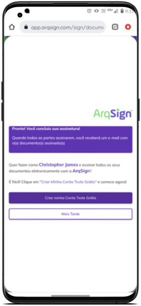<figcaption>
Clique na imagem para ampliar.
</figcaption></figure>

O signatário receberá também uma mensagem por WhatsApp confirmando a conclusão do processo de assinatura.

<figure>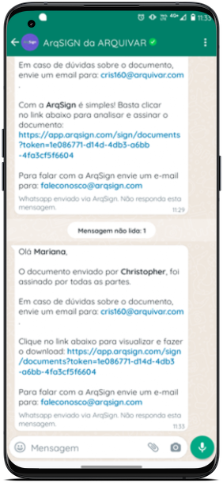<figcaption>
Clique na imagem para ampliar.
</figcaption></figure>



Ocorre quando o responsável pela assinatura acessa diretamente a plataforma e verifica a lista de documentos pendentes de assinatura. &#x20;

Depois de conectado à conta, o usuário deve clicar no menu [Caixa Postal > Caixa de Entrada.](../caixa-postal/caixa-de-entrada.md) Para assinar um documento, é preciso clicar no botão “Assinar” do arquivo desejado.&#x20;

<figure>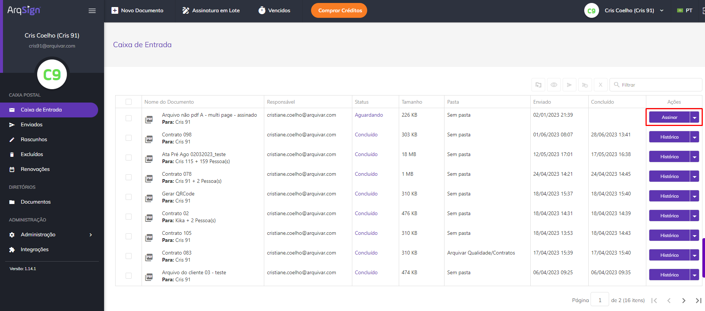<figcaption>
Clique na imagem para ampliar.
</figcaption></figure>



***

## Assinando um documento

## Etapa 1 - Acessando o documento&#x20;

Se o remetente tiver definido um código de segurança para abertura do documento, será solicitado que o signatário informe o código, que deve ter sido recebido anteriormente por e-mail, WhatsApp, SMS ou pelo próprio remetente. Caso não possua o código o usuário deve clicar em “Não Recebi o Código”.&#x20;

<figure>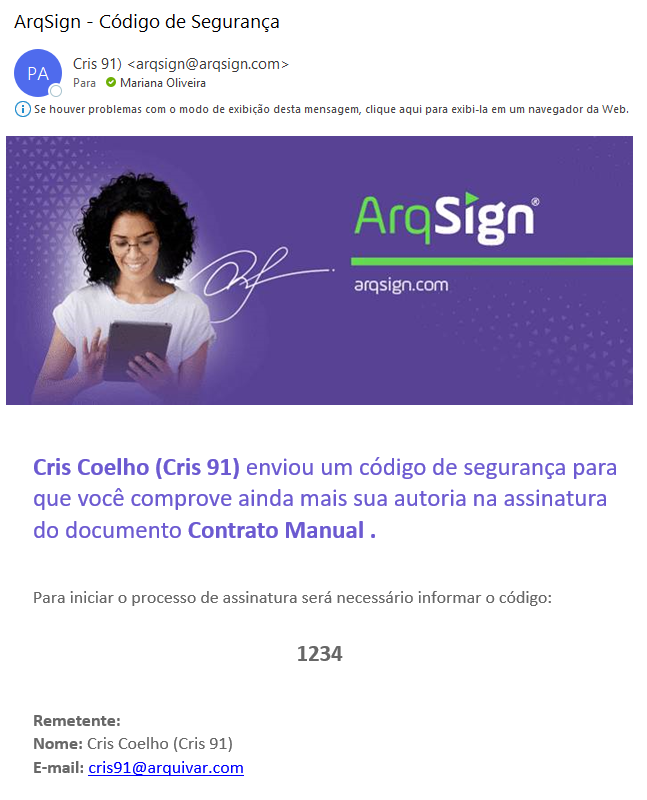<figcaption></figcaption></figure>

<figure>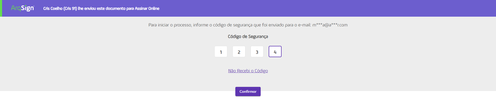<figcaption>
Clique na imagem para ampliar.
</figcaption></figure>

O documento será apresentado na tela para assinatura. Na parte superior da tela serão apresentados os nomes do responsável pelo envio, o nome do documento, a navegação entre páginas e os botões de zoom e visualização do documento em tela cheia.

<figure>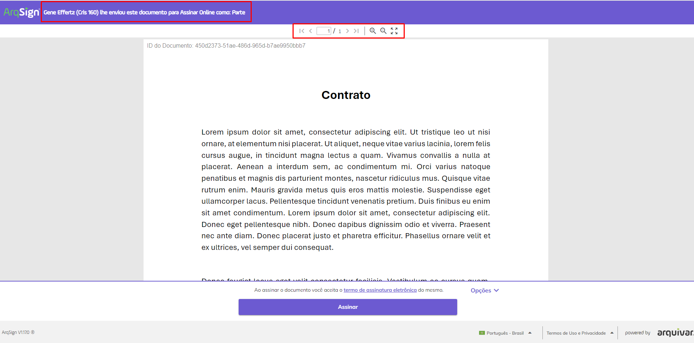<figcaption>
Clique na imagem para ampliar.
</figcaption></figure>

Para o processo que possui **mais de um documento não agrupados**, será apresentada a tela com a listagem dos documentos do processo.

A plataforma lista os documentos do processo conforme a ordem definida ao enviar os documentos para assinatura.

<figure><figcaption>
Clique na imagem para ampliar.
</figcaption></figure>

Ao clicar sobre o link de um documento, o sistema exibe o documento selecionado, apresentando no menu lateral os documentos do processo e sinalizando os documentos lindos e/ou não lidos.

Para o processo que possuir apenas um documento, o sistema não exibirá uma listagem lateral de arquivos e apresentará somente o botão "Assinar" no rodapé da página.

<figure><figcaption>
Clique na imagem para ampliar.
</figcaption></figure>


<mark style="color:blue;">Para processos com um documento, o sistema exibe o botão "Assinar Documento "conforme parâmetro de obrigatoriedade de leitura dos documentos.</mark>

<mark style="color:blue;">Se o processo, com mais de um documento, possui a configuração de "</mark><mark style="color:blue;">**Obrigar Leitura dos Documentos**</mark><mark style="color:blue;">", o sistema habilita o botão "Assinar Documento" somente após a leitura de todos os documentos do processo.</mark>




<figure><figcaption>
Clique na imagem para ampliar.
</figcaption></figure>

Quando o processo **possui obrigatoriedade de leitura** dos documentos, o botão de "**Assinar Documentos**" aparece desabilitado para o usuário assim que ele entra no processo. Neste caso, o ícone de visualização sinaliza os documentos lindos e/ou não lidos para que ele possa passar por todos os arquivos, habilitando ao final da leitura o botão de "Assinar Documentos".

<figure><figcaption>
Clique na imagem para ampliar.
</figcaption></figure>



<figure><figcaption>
Clique na imagem para ampliar.
</figcaption></figure>

Se o processo não possui obrigatoriedade de leitura dos documentos, o botão de "**Assinar Documentos**" já aparece habilitado para o usuário assim que ele entra no processo. Neste caso, o ícone de visualização apenas sinaliza os documentos lindos e/ou não lidos.



Clicando em “Opções”, o signatário poderá executar as seguintes ações:

<figure><figcaption>
Clique na imagem para ampliar.
</figcaption></figure>

#### **Histórico**

Aqui é possível visualizar o histórico do processo de assinatura e seus documentos. Selecione o botão de eventos para visualizar detalhadamente os dados.

Com o botão de eventos posicionado para a esquerda, observamos os dados do processo na tela.

<figure><figcaption>
Clique na imagem para ampliar.
</figcaption></figure>

Com o botão de eventos posicionado para a direita, é possível visualizar os Id's e Hash's dos documentos, no caso de um **processo com mais de um documento não agrupados**.&#x20;

<figure><figcaption>
Clique na imagem para ampliar.
</figcaption></figure>

#### **Recusar Assinatura**

Utilizado quando por algum motivo o signatário não deseja assinar o documento. Neste caso ele deve inserir uma justificativa para a recusa e clicar em “Recusar Assinatura”. Ao recusar a assinatura o processo de assinatura do documento será automaticamente cancelado para todos os envolvidos e aparecerá com o status “Cancelado” para o remetente responsável pelo documento. &#x20;

<figure>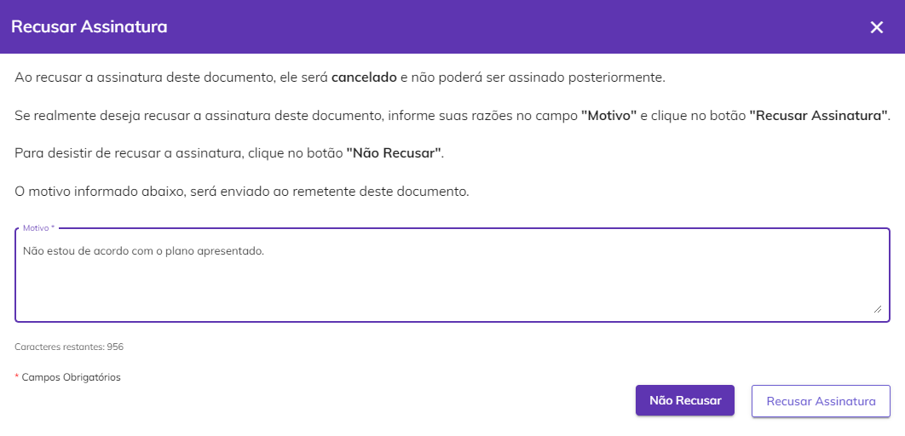<figcaption>
Clique na imagem para ampliar.
</figcaption></figure>

#### **Concluir Mais Tarde**

Utilizado para retornar e concluir a assinatura em outro momento, sempre que selecionada esta opção a plataforma apresentará uma mensagem de validação da ação.

<figure><figcaption></figcaption></figure>

#### **Baixar Arquivo**

A opção que permite fazer o download dos documentos existentes no processo de assinatura. Selecione o(s) arquivo(s) que deseja e clique em "Baixar".

<figure><figcaption>
Clique na imagem para ampliar.
</figcaption></figure>

Nesta fase do processo os documentos ainda não foram assinados, então só é possível baixar os arquivos, sem o registro das assinaturas.

No rodapé da página, temos ainda o "**Termo de assinatura eletrônica**" que pode ser visualizado pelo usuário a a opção de alterar o idioma da plataforma, disponível atualmente em "Inglês - USA", "Espanhol - Espanha" ou "Português - Brasil".

<figure><figcaption>
Clique na imagem para ampliar.
</figcaption></figure>

Ao assinar o documento o sistema registrará o aceite do “Termo de Assinatura Eletrônica” do signatário automaticamente.

Para prosseguir com a assinatura, o signatário deve clicar em “Assinar”.    &#x20;

<figure>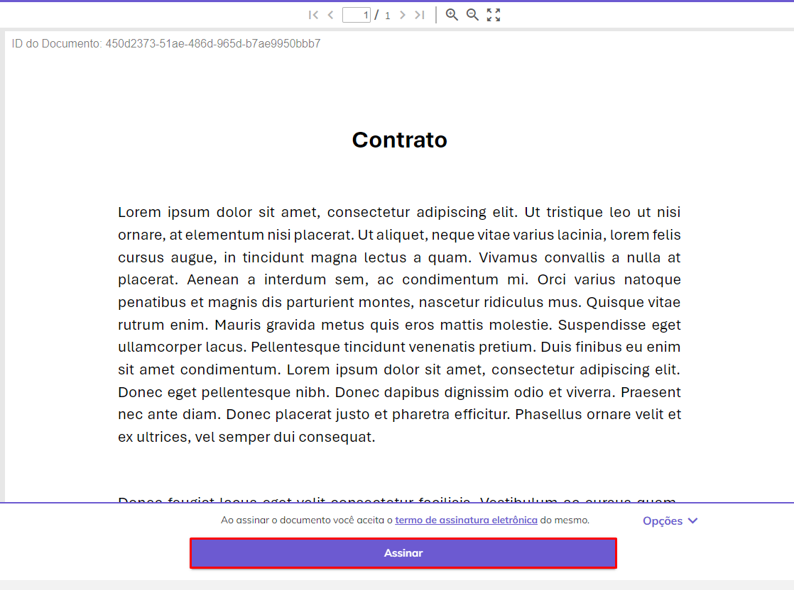<figcaption>
Clique na imagem para ampliar.
</figcaption></figure>

## Etapa 2 - Dados do signatário e Anexos

No próximo item, se houver configuração prévia solicitando que o signatário forneça dados complementares, ele deverá informá-los.

Se também tiver sido solicitado ao signatário anexar arquivos, no campo “Anexos” ele deverá fazer o upload dos documentos pedidos. Depois de concluir, o usuário deve clicar em “Avançar”.

<figure><figcaption>
Clique na imagem para ampliar.
</figcaption></figure>

***

## Etapa 3 - Estilo de Assinatura

O Estilo de Assinatura é a representação visual da assinatura do usuário. Para concluir a assinatura de um documento, o usuário deverá escolher de que forma irá assinar, considerando as configurações realizadas pelo destinatário em [Novo Documento](novo-processo.md#b.-destinatarios). Neste momento o destinatário deverá informar qual a representação visual  deve ser utilizada pelo signatário: "Padrão, Desenho ou Imagem", ou somente "Padrão (Texto)" ou somente "Desenho" ou somente "Imagem".

<figure><figcaption>
Clique na imagem para ampliar.
</figcaption></figure>

* **Padrão:** Neste estilo o usuário deve informar o nome completo e definir o estilo (fonte) como o texto deverá ser apresentado. Para isso deve clicar em “Estilo” e fazer a definição.&#x20;

<figure>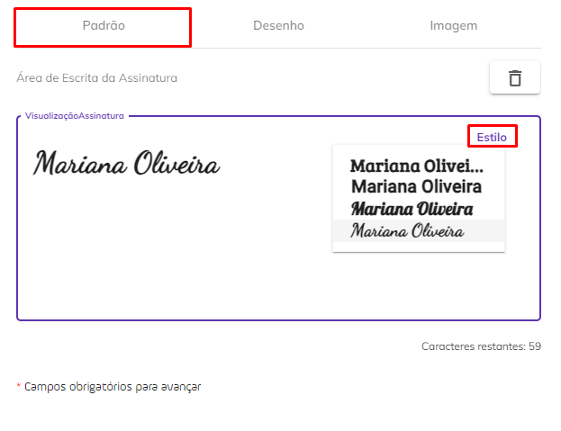<figcaption>
Clique na imagem para ampliar.
</figcaption></figure>

* **Desenho:** Para assinar com um desenho, o usuário deverá, no campo “Área de Desenho da Assinatura” assinar ou rubricar utilizando o mouse. Para corrigir, deve clicar no ícone “Apagar”.&#x20;

<figure>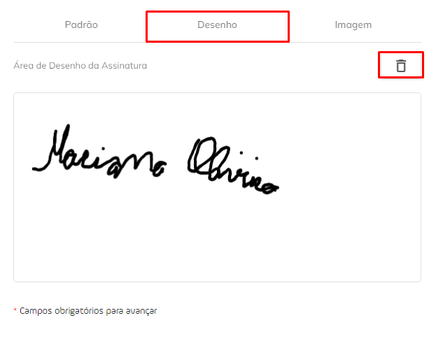<figcaption>
Clique na imagem para ampliar.
</figcaption></figure>

* **Imagem:** Se desejar, o usuário pode fazer o upload de uma imagem que represente sua assinatura.

<figure>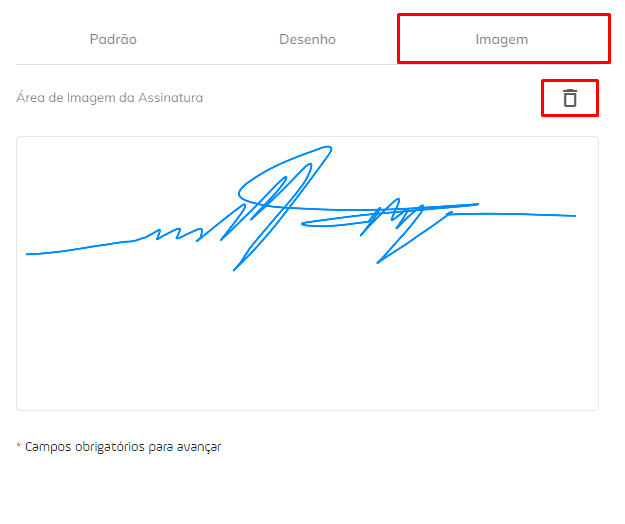<figcaption>
Clique na imagem para ampliar.
</figcaption></figure>

Para concluir o signatário deve clicar em “Concluir”. Se foi solicitado no documento que ele assine como Pessoa Física e Jurídica, será utilizada a mesma assinatura para as duas situações.

<figure>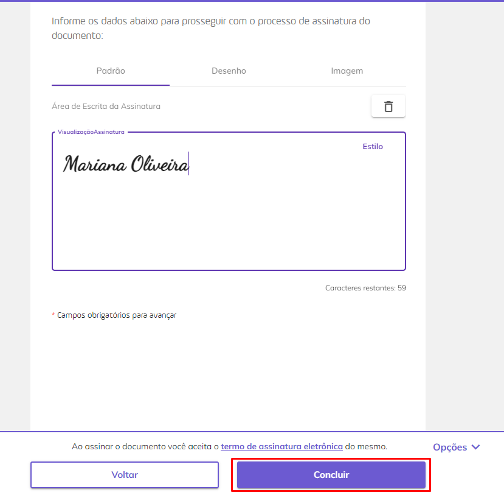<figcaption>
Clique na imagem para ampliar.
</figcaption></figure>

***

## Etapa 4 - Assinando eletronicamente ou com certificado digital


<mark style="color:blue;">**ASSINATURA ELETRÔNICA X ASSINATURA DIGITAL (ICP Brasil e ICP Outros)**</mark>

<mark style="color:blue;">**Assinatura eletrônica**</mark> <mark style="color:blue;"></mark><mark style="color:blue;">é aquela que não precisa de um certificado digital. É mais utilizada para assinar contratos e documentos entre entes privados (B2B, B2C).</mark>&#x20;

<mark style="color:blue;">**Assinatura digital**</mark> <mark style="color:blue;"></mark><mark style="color:blue;">é aquela que precisa de um certificado digital. É mais utilizada para emissão de notas fiscais e para transações com o governo.</mark>&#x20;

<mark style="color:blue;">Na Plataforma Arqsign, ao configurar um fluxo de assinaturas você pode determinar qual tipo de assinatura deverá ser executada por destinatário escolhendo entre:</mark>&#x20;

<mark style="color:blue;">**a) Assinatura eletrônica**</mark> <mark style="color:blue;"></mark><mark style="color:blue;">(a ArqSign produz assinaturas eletrônicas avançadas com validade jurídica de acordo com MP 2.200-2 de 24/08/2001 e Lei 14.063 de 23/11/2020). Sempre que um signatário assina um documento de forma eletrônica a Arqsign aplica um certificado digital próprio da plataforma, capturando o Hash (identificação única) do arquivo, verificando a integridade do arquivo e anexando ao certificado a identificação do signatário.</mark>  &#x20;

<mark style="color:blue;">**b) Assinatura digital – ICP-Brasil ou ICP Outros**</mark> <mark style="color:blue;"></mark><mark style="color:blue;">(A ArqSign produz assinaturas digitais qualificadas de acordo com MP 2.200-2 de 24/08/2001 e Lei 14.063 de 23/11/2020). Quando o usuário já possui um certificado digital e deseja utilizá-lo para realizar a assinatura por meio da ArqSign, este certificado é utilizado para verificar a integridade da assinatura e identificar o usuário como signatário no documento.</mark>&#x20;


Depois de definir o Estilo de Assinatura, será solicitada a assinatura do usuário que pode ser:

### A. Assinatura Eletrônica

Na assinatura eletrônica o usuário informa seus dados de pessoa física ou jurídica e a própria Arquivar certifica a autenticidade e veracidade das informações apresentadas.&#x20;

Se o usuário estiver utilizando uma assinatura eletrônica, será necessário que informe os campos obrigatórios solicitados. Os campos obrigatórios variam de acordo com o documento. O símbolo <mark style="color:red;">**\***</mark> indica que a informação é de preenchimento obrigatório.&#x20;

<figure><figcaption>
Clique na imagem para ampliar.
</figcaption></figure>

### B. Assinatura Digital – ICP Brasil e Outros

### Instalação dos plugins necessários para a utilização dos certificados digitais

Para o uso de assinatura digital será necessário, antes do primeiro uso, a instalação da extensão “ArqSign Certificado Digital” (disponível nas lojas de extensões dos navegadores) e do Arquivar Native Module (disponibilizado durante o processo).

1\. Ao clicar em “Instalar Agora”, será aberta a janela com o link para o download da extensão “ArqSign Certificado Digital”.&#x20;

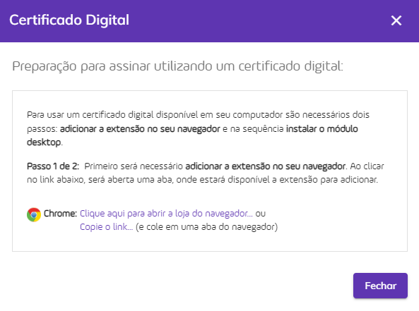

2\. Faça a instalação da extensão de acordo com o navegador que estiver utilizando.&#x20;

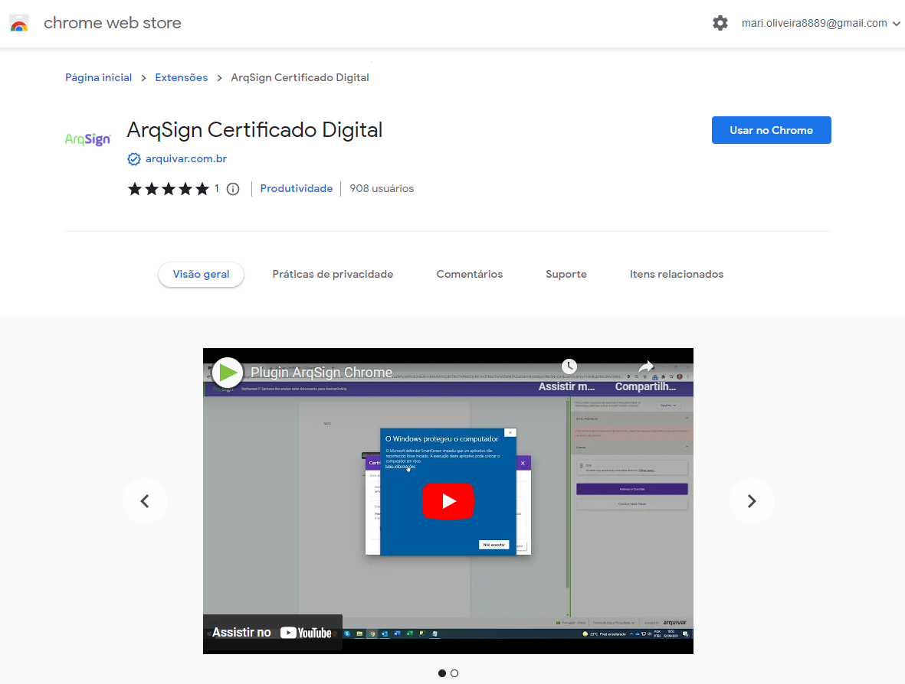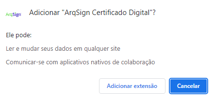

3\. Depois da concluir a primeira instalação, retorne à plataforma ArqSign e prossiga com a instalação do plugin Arquivar Native Moduleclicando em “Clique aqui para fazer o download...”.&#x20;

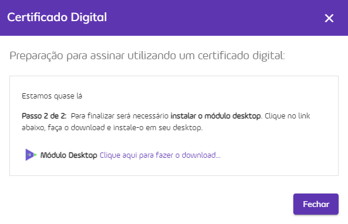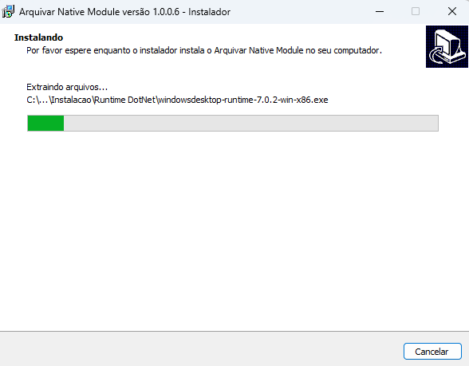

4\.  Depois de concluir a segunda instalação, retorne à plataforma ArqSign. Será exibida uma mensagem de conclusão das instalações.&#x20;

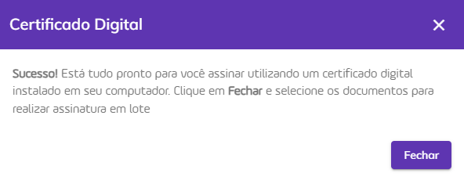

***


#### <mark style="color:orange;">AppNative</mark>

#### <mark style="color:orange;">Devido a uma mudança de tecnologia utilizada na última atualização da plataforma, todos os clientes deverão</mark> <mark style="color:orange;"></mark><mark style="color:orange;">**atualizar manualmente**</mark> <mark style="color:orange;"></mark><mark style="color:orange;">o instalador do</mark> <mark style="color:orange;"></mark><mark style="color:orange;">**AppNative**</mark> <mark style="color:orange;"></mark><mark style="color:orange;">(baixar e instalar), pois, não será possível realizar a atualização de forma automática.</mark>

<mark style="color:orange;">No momento da assinatura, caso o processo de atualização não tenha sido realizado, a plataforma deverá baixar o arquivo de instalação e apresentar uma mensagem para orientação do usuário no processo de instalação.</mark>



### Instalação da Extensão  em diferentes navegadores de internet



1. Para instalar a extensão "ArqSign Certificado Digital" no Google Chrome você irá clicar nos três pontinhos no canto superior esquerdo da tela.&#x20;

<figure><figcaption></figcaption></figure>

2. Em seguida clicará em "Extensões" e depois em "Acessar a Chrome Web Store".

<figure><figcaption></figcaption></figure>

3. Buscar por "ArqSign Certificado Digital".

<figure><figcaption></figcaption></figure>

4. Clicar no resultado da pesquisa.

<figure><figcaption></figcaption></figure>

5. Clicar em "Usar no Chrome".

<figure><figcaption></figcaption></figure>

6. Clicar em "Adicionar extensão"

<figure><figcaption></figcaption></figure>

7. Prontinho, extensão adicionada com sucesso, só precisará fazer isso na primeira vez que assinar com certificado digital, nas próximas a extensão já se manterá instalada em seu navegador.&#x20;



1.  Para instalar a extensão "ArqSign Certificado Digital" no Mozilla Firefox você irá clicar no ícone de pela de quebra-cabeças no canto superior esquerdo da tela.

    <figure><figcaption></figcaption></figure>
2.  Buscar por "ArqSign Certificado Digital".

    <figure><figcaption></figcaption></figure>
3.  Clicar no resultado da pesquisa.

    <figure><figcaption></figcaption></figure>
4.  Clicar em "Adicionar ao Firefox".

    <figure><figcaption></figcaption></figure>
5.  Clicar em "Adicionar"

    <figure><figcaption></figcaption></figure>
6. Prontinho, extensão adicionada com sucesso, só precisará fazer isso na primeira vez que assinar com certificado digital, nas próximas a extensão já se manterá instalada em seu navegador.&#x20;



1.  Para instalar a extensão "ArqSign Certificado Digital" no Microsoft Edge você irá clicar nos três pontinhos no canto superior esquerdo da tela.

    <figure><figcaption></figcaption></figure>
2.  Em seguida clicará em "Extensões".

    <figure><figcaption></figcaption></figure>
3.  Clicar em "Obter extensões do Microsoft Edge".

    <figure><figcaption></figcaption></figure>
4.  Buscar por "ArqSign Certificado Digital".

    <figure><figcaption></figcaption></figure>
5.  Clicar em "Obter".

    <figure><figcaption></figcaption></figure>
6.  Clicar em "Adicionar extensão"

    <figure><figcaption></figcaption></figure>
7. Prontinho, extensão adicionada com sucesso, só precisará fazer isso na primeira vez que assinar com certificado digital, nas próximas a extensão já se manterá instalada em seu navegador.&#x20;



***

<mark style="color:blue;">**Tendo instalado a extensão e o módulo do certificado, o usuário poderá dar sequência ao processo de assinatura.**</mark>

### Assinando com Certificado Digital

Se tiver sido definido que o usuário deverá assinar utilizando um certificado digital (ICP Brasil e ICP outros), será exibida uma lista com todos os certificados instalados na máquina do usuário e na conta da plataforma ArqSign.&#x20;

<figure>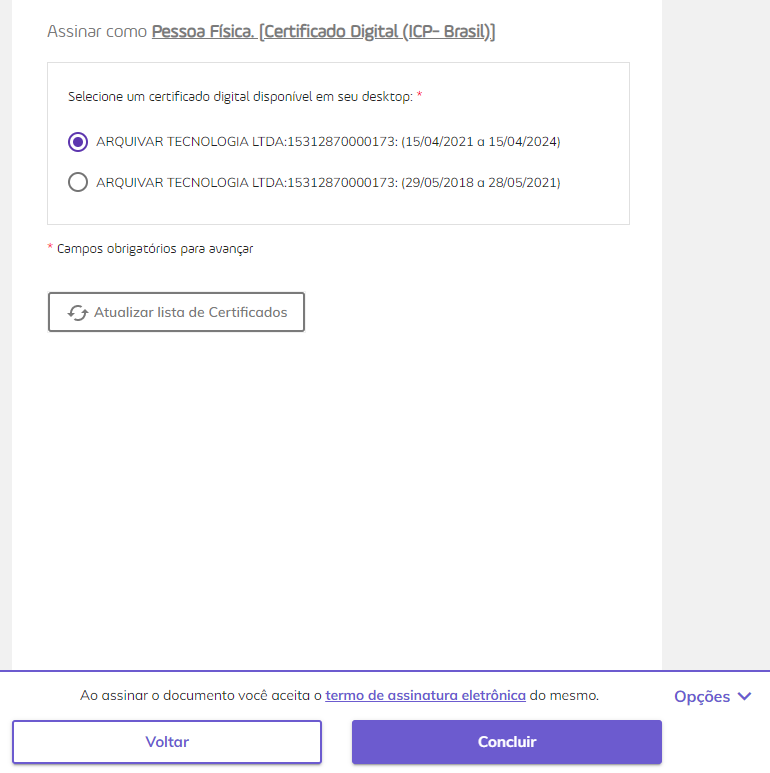<figcaption>
Clique na imagem para ampliar.
</figcaption></figure>

Ele deverá selecionar aquele com o qual irá assinar e informar o código PIN do certificado (se solicitado). Caso ele precise assinar também como Pessoa Jurídica, a assinatura será utilizada nas duas situações.

<figure>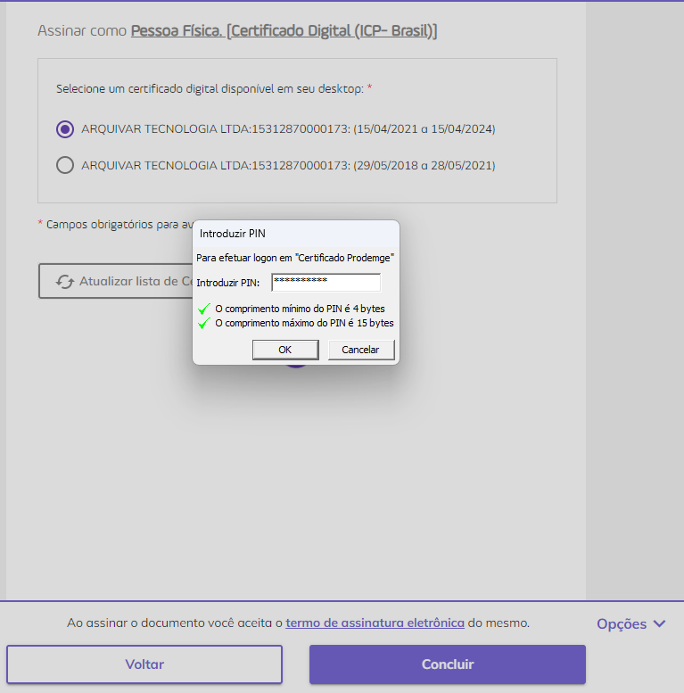<figcaption></figcaption></figure>


<mark style="color:orange;">**Os certificados hospedados na conta da plataforma ArqSign do usuário apresentados aqui deverão ter sido anteriormente importados na tela**</mark> [<mark style="color:blue;">**Meu Perfil > Aba Certificado Digital.**</mark> ](meu-perfil.md)<mark style="color:orange;">**Caso o usuário tenha o certificado digital hospedado na ArqSign, será oferecida a ele a opção de autenticação na plataforma para utilizar o certificado que possui.**</mark>


Para finalizar o processo de assinatura, o signatário deve clicar em “Concluir”. Ele será direcionado para uma tela pop-up, que será diferente conforme a sua situação.&#x20;

Se já tiver uma conta ativa na plataforma de assinatura e **estiver logado**, poderá clicar na opção "voltar para a plataforma" e será direcionado para sua caixa de entrada ArqSign. 

<figure><figcaption>
Clique na imagem para ampliar
</figcaption></figure>

Se já tiver uma conta ativa na plataforma de assinatura, mas **não estiver logado**, poderá clicar na opção "acessar minha conta" e poderá informar suas credenciais para acessar. 

<figure><figcaption>
Clique na imagem para ampliar
</figcaption></figure>

Se o signatário **não tiver uma conta cadastrada** na plataforma, será exibida uma mensagem de sugestão para que seja criada uma [conta de teste grátis](https://manual.arquivar.com/manual-arqsign#criacao-de-conta-teste-gratis), ou para que possa saber mais onde o usuário será direcionada para a página de mais informações no site ArqSign.&#x20;

<figure><figcaption>
Clique na imagem para ampliar
</figcaption></figure>


<mark style="color:orange;">**A criação da conta de teste grátis não é obrigatória.**</mark>


***

## Concluindo a assinatura

Concluído o processo de assinatura, o destinatário recebe a a notificação de conclusão das assinaturas, por e-mail ou WhatsApp, onde a plataforma envia a(s) cópia(s) do(s) Documento(s) assinado(s) e o respectivo Registro de Assinaturas para os destinatários, considerando as configurações da conta (link ou arquivo). Quando houver mais de um arquivo no processo, a plataforma envia um arquivo zip com todos os documentos e seu respectivo registo de assinatura.

<figure><figcaption>
Clique na imagem para ampliar.
</figcaption></figure>

<figure>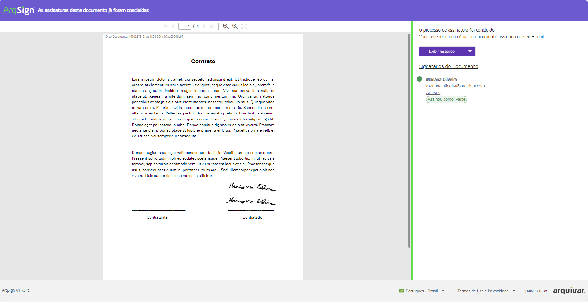<figcaption>
Clique na imagem para ampliar.
</figcaption></figure>

Se o remetente tiver definido que deverá ser gerado um QR Code no Registro de Assinaturas na tela [Configurações Avançadas do cadastro do documento](novo-processo.md#configuracoes-avancadas), esse QR Code será exibido na folha de registro das assinaturas.&#x20;

<figure>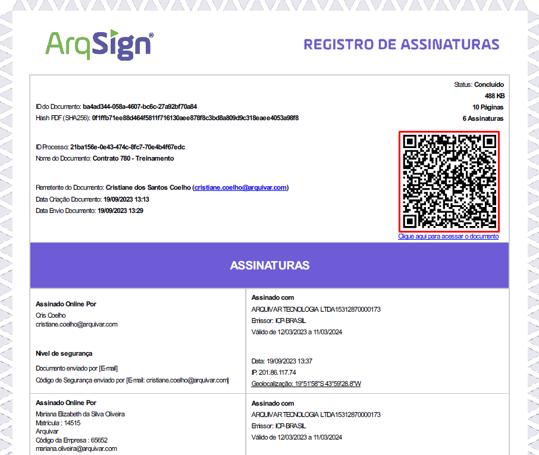<figcaption>
Clique na imagem para ampliar.
</figcaption></figure>

***

## 🗪 Perguntas e Respostas Frequentes

Assinando eletronicamente, não preciso assinar fisicamente?

Ao assinar eletronicamente com a ArqSign, não é necessário imprimir o documento para coletar assinaturas físicas. A assinatura digital garante validade jurídica ao arquivo digital, dispensando cópias em papel.

É seguro assinar um documento eletronicamente?

Tudo dependerá da plataforma escolhida para a realização da assinatura. Com a ArqSign, ferramenta de assinatura eletrônica desenvolvida pela Arquivar, a conformidade com a legislação está garantida através da segurança nos processos, tecnologia empregada e as melhores práticas de segurança presentes no mercado nacional e internacional. Conheça mais sobre a segurança do processo e da tecnologia da Plataforma ArqSign acessando: [https://arquivar.com.br/arqsign-validade-juridica/](https://arquivar.com.br/arqsign-validade-juridica/)&#x20;

Quais são os benefícios e vantagens da assinatura eletrônica?

Os benefícios são diversos, desde assinar um documento em minutos, menor custo com impressões, motoboys, correios, armazenagem, até menos riscos jurídicos, pois evita a falsificação e adulteração. Há também o ganho de produtividade, pois, automatiza o processo, diminui a burocracia e economiza tempo dos signatários. Sem falar da inovação e sustentabilidade.

Como são classificadas as Assinaturas Eletrônicas?

De acordo com a lei nº 14.063, de 23 de setembro de 2020 art. 4º, as assinaturas eletrônicas são classificadas em:&#x20;

**I** – Assinatura eletrônica simples:&#x20;

a) a que permite identificar o seu signatário;

b) a que anexa ou associa dados a outros dados em formato eletrônico do signatário;

**II –** Assinatura eletrônica avançada: a que utiliza certificados não emitidos pela ICP-Brasil ou outro meio de comprovação da autoria, integridade de documentos e aceite entre as partes.&#x20;

**III –** Assinatura eletrônica qualificada: a que utiliza certificado digital ICP-Brasil.&#x20;

Os 3 (três) tipos de assinatura referidos na legislação caracterizam o nível de confiança da assinatura sendo que a assinatura eletrônica qualificada é a que possui nível mais elevado.&#x20;

A Plataforma ArqSign está apta a gerar Assinaturas Avançadas e Qualificadas, cumprindo rigorosamente todos os requisitos legais.&#x20;

Qual a diferença entre assinatura digital e eletrônica?

De forma simples, toda assinatura executada através de um mecanismo eletrônico e que identifica quem a executou é uma assinatura eletrônica. &#x20;

No Brasil culturalmente definimos que uma assinatura executada de forma eletrônica com certificado digital próprio é chamada de assinatura digital e quando executada de forma eletrônica sem certificado digital próprio é chamada de assinatura eletrônica. &#x20;

A assinatura eletrônica é mais utilizada para assinatura entreempresas e clientes, profissionais e clientes ou pacientes etc. &#x20;

A assinatura digital é mais utilizada para assinatura e transações que envolvem órgãos governamentais.&#x20;

O que é assinatura digital?

No Brasil, dizemos que a Assinatura Digital é um tipo de assinatura eletrônica feita utilizando-se um certificado digital ICP-Brasil próprio que é como se fosse uma identidade do mundo virtual.&#x20;

Se diferencia das demais assinaturas eletrônicas por usar criptografia e vincular o certificado digital ao documento eletrônico que está sendo assinado.&#x20;

A tecnologia do Certificado digital dá garantias de integridade do documento e autoria incontestável do signatário sendo a forma de assinatura eletrônica mais confiável.&#x20;

Para fazer uma assinatura digital, você precisa adquirir um Certificado Digital ICP-Brasil e uma plataforma de assinatura eletrônica de confiança.&#x20;

Quais documentos posso assinar eletronicamente (sem certificado digital)?

Juridicamente, entre entes privados, qualquer documento pode ser assinado eletronicamente desde que as partes concordem. Abaixo listamos alguns exemplos de documentos:&#x20;

* Propostas,&#x20;
* Orçamentos,
* Contratos,
* Aditivos,
* Distratos,
* Laudos,&#x20;
* Transações imobiliárias,&#x20;
* Acordos de serviços,&#x20;
* Atas,&#x20;
* Termos de adesão,&#x20;
* Projetos,&#x20;
* Petições,&#x20;
* E vários outros.&#x20;

O que é assinatura eletrônica?

Pode-se definir a assinatura eletrônica como um mecanismo eletrônico, que identifica o signatário (pessoa que está assinando) de um documento, seja ele pessoa física ou jurídica.&#x20;

No Brasil, a assinatura eletrônica está respaldada pela Medida Provisória 2.200-2 de 2001, no Código Civil Brasileiro e nas Instruções Normativas do ITI – Instituto Nacional de Tecnologia da Informação.&#x20;

Importante salientar que no Brasil culturalmente definimos que uma assinatura executada de forma eletrônica com certificado digital é chamada de assinatura digital e quando executada de forma eletrônica sem certificado digital é chamada de assinatura eletrônica.

Como configurar um documento para ser assinado com Certificado digital (assinatura digital) ou sem certificado digital (assinatura eletrônica)?

Na Plataforma ArqSign, ao configurar um processo de assinaturas você pode determinar qual tipo de assinatura deverá ser executada por destinatário escolhendo entre:&#x20;

**a) Assinatura eletrônica** (A ArqSign produz assinaturas eletrônicas avançadas com validade jurídica de acordo com MP 2.200-2 de 24/08/2001 e Lei 14.063 de 23/11/2020);&#x20;

**b) Assinatura com Certificado Digital Pessoal do Tipo ICP-Brasil** (A ArqSign produz assinaturas digitais qualificadas de acordo com MP 2.200-2 de 24/08/2001 e Lei 14.063 de 23/11/2020);&#x20;

**c) Assinatura com Certificado Digital Pessoal Todos os Tipos** (A ArqSign produz assinaturas eletrônicas e digitais através de outros certificados).&#x20;

Para determinar o tipo de assinatura siga o seguinte passo a passo:&#x20;

1. Após fazer o upload do documento e configurações necessárias, siga para a configuração dos destinatários;&#x20;
2. Ao configurar um destinatário, no campo “Tipo de assinatura” escolha uma das opções conforme descrição acima;&#x20;
3. Pronto! Agora é só configurar os demais destinatários e a posição das assinaturas no documento e enviar.

Para saber como assinar um documento com Certificado Digital – ICP-Brasil [clique aqui.](https://arquivar.com.br/faq-assuntos/como-assinar-um-documento-com-certificado-digital-icp-brasil/)&#x20;

Como assinar um documento com Certificado Digital – ICP-Brasil?

Na Plataforma ArqSign, o remetente de documentos pode determinar o tipo de assinatura que o destinatário deverá executar escolhendo entre uma das opções abaixo:&#x20;

**a) Assinatura eletrônica** (A ArqSign produz assinaturas eletrônicas avançadas com validade jurídica de acordo com MP 2.200-2 de 24/08/2001 e Lei 14.063 de 23/11/2020);&#x20;

**b) Assinatura com Certificado Digital Pessoal do Tipo ICP-Brasil** (A ArqSign produz assinaturas digitais qualificadas de acordo com MP 2.200-2 de 24/08/2001 e Lei 14.063 de 23/11/2020);&#x20;

**c) Assinatura com Certificado Digital Pessoal Todos os Tipos** (A ArqSign produz assinaturas eletrônicas e digitais por meio de outros certificados).&#x20;

Se você recebeu um documento para assinar via Plataforma ArqSign e precisa assinar com Certificado Digital pela primeira vez, siga os seguintes passos:&#x20;

* Abra o documento, leia e se aceitar, clique em Assinar;&#x20;
* Execute a assinatura no formato de sua preferência e clique em Avançar;&#x20;
* Ao clicar em “Avançar”, você será informando que a assinatura solicitada deverá ser executada com certificado digital;&#x20;
* Selecione qual certificado será utilizado para assinar o documento através das opções:&#x20;

1\) Certificados que foram inseridos na ArqSign e estão salvos na plataforma e&#x20;

2\) Certificados salvos no computador de quem está assinando o documento.&#x20;

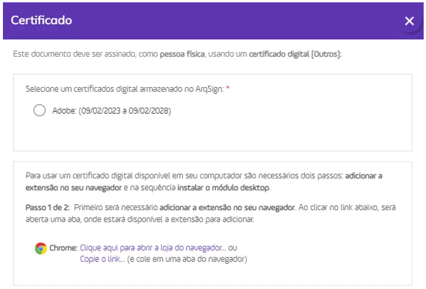

* Para assinatura com Certificado inserido na Plataforma, clique na opção indicada;&#x20;
*   Para assinatura com Certificado digital instalado em sua máquina você deverá seguir os passos indicados para:&#x20;

    1\) Adicionar a extensão ArqSign para seu navegador;&#x20;

    2\) Instalar o módulo desktop;&#x20;
* Insira a senha do Certificado Digital e clique em Avançar.&#x20;

O passo a passo para adicionar a extensão ao seu navegador e o módulo desktop pode ser acessado abaixo:&#x20;

* [Como adicionar extensão ArqSign no navegador Chrome](https://arquivar.com.br/faq-assuntos/como-adicionar-extensao-arqsign-certificado-digital-no-navegador-chrome/).
* [Como adicionar extensão ArqSign no navegador Edge](https://arquivar.com.br/faq-assuntos/como-adicionar-extensao-arqsign-certificado-digital-no-navegador-edge/).
* [Como adicionar extensão ArqSign no navegador FireFox](https://arquivar.com.br/faq-assuntos/como-adicionar-extensao-arqsign-no-navegador-firefox/).
* [Como instalar módulo desktop.](https://arquivar.com.br/faq-assuntos/como-instalar-modulo-desktop/)

Como adicionar extensão ArqSign Certificado Digital no navegador Edge?

1. Quando um signatário de um documento que exige um certificado digital, seja ICP-Brasil ou outro qualquer, aplicar sua representação visual e clicar no botão Avançar, será exibida uma mensagem informando que para assinar o documento com Certificado Digital instalado no computador é necessário adicionar a extensão no seu navegador e na sequência instalar o módulo desktop. O processo é simples. Basta clicar no link exibido e seguir o passo a passo:&#x20;
2. No Microsoft Edge, ao clicar no link disponível, pode acontecer o bloqueio de pop-up.&#x20;
3. Caso isto aconteça, deve-se clicar no ícone de bloqueio de pop-ups, ao lado do URL da página.&#x20;
4. Ao clicar no ícone, deve-se permitir pop-ups para a página da ArqSign.&#x20;
5. Após o desbloqueio dos pop-ups, deve-se clicar no link disponível novamente. Ao clicar no link, duas ações serão executadas ao mesmo tempo, a primeira é o download do instalador do Módulo Desktop. Deve-se aguardar o download ser concluído e seguir os passos do Tutorial Instalação Módulo Desktop. A segunda é a abertura de uma aba da Microsoft Store com o plugin da ArqSign.
6. Ao clicar no botão Obter, será aberta uma notificação para a confirmação da adição da extensão no navegador.&#x20;
7. Ao clicar em Adicionar extensão, aparecerá uma notificação informando que a extensão foi adicionada ao navegador. Após isto, a aba do Microsoft Store pode ser fechada.&#x20;
8. Após a adição do plugin no navegador, caso o Módulo Desktop ainda não tenha sido instalado, a aplicação ainda indicará um link para download dele.&#x20;
9. Com as duas instalações concluídas, a modal será atualizada, listando os certificados salvos no computador do usuário.&#x20;
10. No Windows, ao clicar no botão Concluir, pode ser solicitada a permissão para que o plugin acesse os certificados, neste ponto, deve-se clicar em "Permitir" para liberar a utilização dos certificados digitais.

Caso a extensão e o módulo desktop já tenham sido instalados essa ação não será requerida novamente.&#x20;

Caso o signatário tenha Certificados Digitais salvos na plataforma ArqSign, eles serão exibidos. Para utilizá-los basta selecionar e seguir os próximos passos não necessitando da instalação da extensão e módulo.

Como adicionar extensão ArqSign Certificado Digital no navegador Chrome?

Quando um signatário de um documento que exige um certificado digital, seja ICP-Brasil ou outro qualquer, aplicar sua representação visual e clicar no botão Avançar, será exibida uma mensagem informando que para assinar o documento com Certificado Digital instalado no computador é necessário adicionar a extensão no seu navegador e na sequência instalar o módulo desktop. O processo é simples. Basta clicar no link exibido e seguir o passo a passo abaixo para efetuar essas configurações:&#x20;

1. Clique no link indicado para abrir a loja no navegador;&#x20;
2. A extensão ArqSign Certificado Digital será exibida;&#x20;
3. Clique em “Usar no Chrome”;
4. Ao clicar no botão Usar no Chrome, será aberta uma notificação para a confirmação da adição da extensão no navegador. Clique em adicionar extensão;
5. Ao clicar em Adicionar extensão, aparecerá uma notificação informando que a extensão foi adicionada ao navegador. Após isto, a aba do Chrome Web Store pode ser fechada.
6. Após a adição do plugin no navegador, caso o Módulo Desktop ainda não tenha sido instalado, a aplicação ainda indicará um link para download dele;
7. No caso de o Módulo Desktop não ter sido instalado ainda, um pop-up aparecerá com uma opção para instalação ou atualização do Módulo Desktop em seu computador.
8. Clique no link indicado para fazer o download;
9. Localize o arquivo instalador do módulo baixado e execute-o para instalação;
10. Ao executar a instalação do Módulo Desktop, o Microsoft defender SmartScreen, a princípio, impede a instalação do módulo, pelo fato do módulo não ser um aplicativo presente na Microsoft Store. Para dar sequência na instalação deve-se clicar em Mais informações;
11. Após clicar em Mais informações, deve-se clicar no botão Executar assim mesmo;
12. Clique em Instalar;
13. Após finalizar a instalação, clique em concluir
14. O pop-up será atualizado e solicitará que você escolha o certificado digital que deseja utilizar;
15. Escolha o certificado e siga com a assinatura;
16. No Windows, ao clicar no botão Concluir, pode ser solicitada a permissão para que o plugin acesse os certificados. Clique em “Permitir “para liberar a utilização dos certificados digitais.

Caso a extensão e o módulo desktop já tenham sido instalados essa ação não será requerida novamente.

Caso o signatário tenha Certificados Digitais salvos na plataforma ArqSign, eles serão exibidos. Para utilizá-los basta selecionar e seguir os próximos passos não necessitando da instalação da extensão e módulo.

Como adicionar a extensão ArqSign no navegador FireFox?

Quando um signatário de um documento que exige um certificado digital, seja ICP-Brasil ou outro qualquer, aplicar sua representação visual e clicar no botão Avançar, será exibida uma mensagem informando que para assinar o documento com Certificado Digital instalado no computador é necessário adicionar a extensão no seu navegador e na sequência instalar o módulo desktop. O processo é simples. Basta clicar no link exibido e seguir o passo a passo abaixo para efetuar essas configurações:

1. Ao clicar no link, duas ações serão executadas ao mesmo tempo, a primeira é o download do instalador do Módulo Desktop (No Firefox é solicitada uma confirmação para iniciar o download). Deve-se aguardar o download ser concluído e seguir os passos do Tutorial Instalação Módulo Desktop.&#x20;
2. A outra ação é a abertura de uma nova aba no navegador, na Firefox Browser Add-ons, com o plugin da ArqSign.&#x20;
3. Ao clicar no botão Adicionar ao Firefox, será aberta uma notificação para a confirmação da adição da extensão no navegador.&#x20;
4. Ao clicar em Adicionar, aparecerá uma notificação informando que a extensão foi adicionada ao navegador. Após isto, a aba do Firefox Browser Add-ons pode ser fechada.&#x20;
5. Após a adição do plugin no navegador, caso o Módulo Desktop ainda não tenha sido instalado, a aplicação ainda indicará um link para download do mesmo.&#x20;
6. Com as duas instalações concluídas, a modal será atualizada, listando os certificados salvos no computador do usuário.&#x20;
7. No Windows, ao clicar no botão Concluir, pode ser solicitada a permissão para que o plugin acesse os certificados, neste ponto, deve-se clicar em Permitir para liberar a utilização dos certificados digitais.

Caso a extensão e o módulo desktop já tenham sido instalados essa ação não será requerida novamente.&#x20;

Caso o signatário tenha Certificados Digitais salvos na plataforma ArqSign, eles serão exibidos. Para utilizá-los basta selecionar e seguir os próximos passos não necessitando da instalação da extensão e módulo.&#x20;

Vou adquirir ou já adquiriu um Certificado ICP-Brasil. Ainda assim preciso ter um plano ArqSign?

O ideal é que além do Certificado ICP-Brasil que é como se fosse a sua identidade virtual você também tenha uma plataforma de assinatura eletrônica como a ArqSign.&#x20;

Desta forma, você pode assinar documentos utilizando o seu certificado ICP-Brasil e solicitar aos demais signatários que assinem com ICP-Brasil ou sem ICP-Brasil.&#x20;

Você ainda conta com as seguintes funcionalidades ArqSign:&#x20;

* Controle do vencimento, renovação e reajuste documentos;&#x20;
* Diretórios e definição de acesso para gestão de documentos;&#x20;
* Usuários ilimitados;&#x20;
* Armazenagem de Termo de aceite para assinatura eletrônica;&#x20;
* Controle do fluxo de assinatura;&#x20;
* Integração com outros softwares;&#x20;
* Envio por WhatsApp e SMS.

Devo utilizar um certificado digital ICP-BRASIL sempre que for assinar um documento de forma eletrônica?

Não. Para assinar documentos entre entes privados como por exemplo documentos entre empresas e pessoas físicas, empresas e empresas, clínicas e pacientes, pode-se utilizar a assinatura eletrônica que é a assinatura virtual sem o certificado digital ICP-BRASIL.

Certificado digital é a mesma coisa que assinatura digital?

Não, são coisas distintas, apesar de estarem interligadas.&#x20;

Enquanto o certificado digital é o equivalente ao documento de identidade CPF ou CNPJ, a assinatura digital, é o equivalente à sua assinatura física com reconhecimento em cartório.&#x20;

Por estar diretamente ligada ao certificado digital, a assinatura digital possui autenticidade, integridade, confiabilidade e não repúdio.&#x20;

A assinatura digital pode perder validade se for feita qualquer alteração no documento digital.

O que é certificado digital?

O certificado digital é uma identidade virtual, como um documento de CPF ou CNPJ, usada para comprovar a sua identidade eletronicamente. Ele permite que uma assinatura realizada por meio eletrônico, seja identificada inequivocamente como sua. O documento é protegido por um sistema de duas chaves criptográficas, uma privada e outra pública, que são únicas para cada certificado. Uma decifra a outra e isso permite a identificação.&#x20;

Para adquirir um certificado digital é preciso buscar por uma Agência ou Autoridade certificadora. Os custos para a emissão do documento serão informados pela própria instituição. A ArqSign não é uma Agência ou Autoridade certificadora e sim uma Plataforma de assinar documentos com ou sem o certificado digital.&#x20;

Quais documentos posso assinar eletronicamente (sem certificado digital)?

Juridicamente, entre entes privados, qualquer documento pode ser assinado eletronicamente desde que as partes concordem. Abaixo listamos alguns exemplos de documentos:

* Propostas,&#x20;
* Orçamentos,
* Contratos,
* Aditivos,
* Distratos,
* Laudos,&#x20;
* Transações imobiliárias,&#x20;
* Acordos de serviços,&#x20;
* Atas,&#x20;
* Termos de adesão,&#x20;
* Projetos,&#x20;
* Petições,&#x20;
* E vários outros.&#x20;

Como importar/fazer upload do meu Certificado ICP-Brasil Tipo A1 para plataforma?

1. Acesse a sua conta na Plataforma ArqSign.
2. Clique no Menu Perfil que fica no canto superior direito da Plataforma.
3. Clique na aba Certificado digital.
4. Clique no botão +
5. Escolha o arquivo do Certificado ICP-Brasil tipo A1 com extensão P12 ou PFX.
6. Insira um nome de identificação para o Certificado.
7. Insira a senha do Certificado.
8. Quando você for assinar um documento com um Certificado ICP-Brasil, basta escolher esse certificado e colocar sua a senha.

Como assinar documentos pela plataforma ArqSign?

Se você recebeu documento(s) para assinatura, clique no link de acesso ao(s) documento(s) disponível na mensagem que recebeu ou se você tem uma conta ArqSign pode acessar o processo através de sua Caixa de entrada clicando em Assinar. &#x20;

1. O(s) documento(s) será(ão) exibido(s) para leitura.&#x20;
2. Após a leitura, clique em Assinar.&#x20;
3. Caso solicitado, preencha seus dados como Nome e documento. &#x20;
4. Caso solicitado, anexe documento(s).&#x20;
5. Aplique a representação visual de sua assinatura com um dos estilos de assinatura: Padrão (seu nome escrito), Desenho (assinatura manuscrita) ou Imagem (upload da imagem/foto de sua assinatura). &#x20;
6. Clique em Concluir&#x20;

[Clique aqui e confira como realizar a assinatura de documentos por meio da plataforma ArqSign.](assinatura-de-documentos.md)

Como habilitar / desabilitar a geração de QRCode no Registro de Assinaturas para acesso ao documento assinado?

Para padronizar a configuração de geração de QRCode no Registro de assinaturas para uma conta, você deverá ser um usuário com perfil Administrador Global ou Administrador da Conta e seguir os seguintes passos:

* Acesse: Administração > Conta > Configurações > Processos;
* Clique em “Editar”;
* Em “Configurações sobre a Disponibilização do Documento Assinado aos destinatários” habilite ou desabilite a geração de QRCode no Registro de assinaturas conforme sua preferência;
* Clique em Salvar.

Essa alteração repercute para conta.

Caso necessário, um usuário com qualquer perfil pode alterar a configuração padrão desta funcionalidade apenas para um determinado fluxo. Para isso, basta seguir os seguintes passos:

* Clicar em “Novo Processo”;
* Fazer o upload de um novo documento;
* Clicar em “Configurações Avançadas”;
* Habilitar ou desabilitar a geração de QRCode de acesso do documento no Registro de Assinaturas;
* Clicar em “Aplicar”.

Como enviar um Processo para assinatura para um contato salvo na plataforma ArqSign?

Para enviar um Processo para assinatura para um contato salvo na Plataforma ArqSign no seu usuário ou compartilhado por outro usuário, siga os seguintes passos:

1. Clique em “Novo Processo”, insira o documento e execute as configurações necessárias relativas ao Processo;
2. Na parte de configuração dos Destinatários, clique no botão
3. A Plataforma exibirá um Grid de consulta com todos os contatos do usuário logado que estão relacionados com a conta logada, ordenados alfabeticamente pela coluna nome e na sequência todos os contatos dos outros usuários ativos da conta logada, que tenham sido marcados para serem compartilhados com todos os usuários da conta, ordenados alfabeticamente pela coluna nome.
4. Escolha o(s) destinatário(s) e clique em “Adicionar Destinatários”.
5. Configure o Tipo de Assinatura Eletrônica para cada destinatário;
6. Configure token de segurança ou mensagem privada para cada destinatário se for o caso e siga os próximos passos para envio do Processo para assinatura.

Como configurar assinatura com documento estrangeiro?

Para configurar o Processo solicitando assinatura com um documento estrangeiro, siga os seguintes passos:

1. Depois de fazer o upload do documento;
2. Inserir os destinatários e clicar em ‘avançar”;
3. Na tela “configurar campos” você irá configurar a coleta de assinaturas dos destinatários;
4. Selecione o destinatário no topo da tela;
5. No canto direito, selecione o tipo de assinatura para Pessoa física;
6. Logo abaixo, há a configuração de “Informações complementares de assinatura”;
7. Selecione o check box “Nome do Signatário”;
8. Selecione o check box “Documento do Signatário”;
9. Na caixa “Documento”, escolha “outro”;
10. Na caixa abaixo especifique o documento que deseja solicitar e se quiser configure nas demais caixas os tipos de caracteres válidos e a quantidade de caracteres para validação.

Como assinar um Processo com Certificado Digital – ICP-Brasil?

Na Plataforma ArqSign, o remetente de Processos pode determinar o tipo de assinatura que o destinatário deverá executar escolhendo entre uma das opções abaixo:&#x20;

**a) Assinatura eletrônica** (A ArqSign produz assinaturas eletrônicas avançadas com validade jurídica de acordo com MP 2.200-2 de 24/08/2001 e Lei 14.063 de 23/11/2020);&#x20;

**b) Assinatura com Certificado Digital Pessoal do Tipo ICP-Brasil** (A ArqSign produz assinaturas digitais qualificadas de acordo com MP 2.200-2 de 24/08/2001 e Lei 14.063 de 23/11/2020);&#x20;

**c) Assinatura com Certificado Digital Pessoal Todos os Tipos** (A ArqSign produz assinaturas eletrônicas e digitais através de outros certificados).&#x20;

Se você recebeu um documento para assinar via Plataforma ArqSign e precisa assinar com Certificado Digital pela primeira vez, siga os seguintes passos:&#x20;

* Abra o documento, leia e se aceitar, clique em Assinar;&#x20;
* Execute a assinatura no formato de sua preferência e clique em Avançar;&#x20;
* Ao clicar em “Avançar”, você será informando que a assinatura solicitada deverá ser executada com certificado digital;&#x20;
* Selecione qual certificado será utilizado para assinar o documento através das opções:&#x20;

1\) Certificados que foram inseridos na ArqSign e estão salvos na nuvem e&#x20;

2\) Certificados salvos no computador de quem está assinando o documento.&#x20;

.png>)

* Para assinatura com Certificado inserido na Plataforma, clique na opção indicada;&#x20;
* Para assinatura com Certificado digital instalado em sua máquina você deverá seguir os passos indicados para:&#x20;

1. Adicionar a extensão ArqSign para seu navegador;&#x20;
2. Instalar o módulo desktop;&#x20;

* Insira a senha do Certificado Digital e clique em Avançar&#x20;

O passo a passo para adicionar a extensão ao seu navegador e o módulo desktop podem ser acessados abaixo:&#x20;

* [Como adicionar extensão ArqSign no navegador Chrome](https://arquivar.com.br/faq-assuntos/como-adicionar-extensao-arqsign-certificado-digital-no-navegador-chrome/).&#x20;
* [Como adicionar extensão ArqSign no navegador Edge](https://arquivar.com.br/faq-assuntos/como-adicionar-extensao-arqsign-certificado-digital-no-navegador-edge/).&#x20;
* [Como adicionar extensão ArqSign no navegador FireFox](https://arquivar.com.br/faq-assuntos/como-adicionar-extensao-arqsign-no-navegador-firefox/).&#x20;
* [Como instalar módulo desktop.](https://arquivar.com.br/faq-assuntos/como-instalar-modulo-desktop/)

Como instalar o módulo desktop?

1\) Ao executar a instalação do Módulo Desktop, o Microsoft defender SmartScreen, a princípio, impede a instalação do módulo, pelo fato do módulo não ser um aplicativo presente na Microsoft Store. Para dar sequência na instalação deve-se clicar em Mais informações.

2\) Após clicar em Mais informações, deve-se clicar no botão Executar assim mesmo.

3\) Após isto, deve-se seguir o processo de instalação e clicar no botão Concluir, ao término da instalação, e o Módulo Desktop já estará ativo no computador.

Como adicionar a extensão ArqSign no navegador FireFox?

Quando um signatário de um Processo que exige um certificado digital, seja ICP-Brasil ou outro qualquer, aplicar sua representação visual e clicar no botão Avançar, será exibida uma mensagem informando que para assinar o documento com Certificado Digital instalado no computador é necessário adicionar a extensão no seu navegador e na sequência instalar o módulo desktop. O processo é simples. Basta clicar no link exibido e seguir o passo a passo abaixo para efetuar essas

1. Ao clicar no link, duas ações serão executadas ao mesmo tempo, a primeira é o download do instalador do Módulo Desktop (No Firefox é solicitada uma confirmação para iniciar o download). Deve-se aguardar o download ser concluído e seguir os passos do Tutorial Instalação Módulo Desktop.
2. A outra ação é a abertura de uma nova aba no navegador, na Firefox Browser Add-ons, com o plugin da ArqSign.
3. Ao clicar no botão Adicionar ao Firefox, será aberta uma notificação para a confirmação da adição da extensão no navegador.
4. Ao clicar em Adicionar, aparecerá uma notificação informando que a extensão foi adicionada ao navegador. Após isto, a aba do Firefox Browser Add-ons pode ser fechada.
5. Após a adição do plugin no navegador, caso o Módulo Desktop ainda não tenha sido instalado, a aplicação ainda indicará um link para download do mesmo.
6. Com as duas instalações concluídas, a modal será atualizada, listando os certificados salvos no computador do usuário.
7. No Windows, ao clicar no botão Concluir, pode ser solicitada a permissão para que o plugin acesse os certificados, neste ponto, deve-se clicar em Permitir para liberar a utilização dos certificados digitais.

Caso a extensão e o módulo desktop já tenham sido instalados essa ação não será requerida novamente.

Caso o signatário tenha Certificados Digitais salvos na plataforma ArqSign, eles serão exibidos. Para utilizá-los basta selecionar e seguir os próximos passos não necessitando da instalação da extensão e módulo.

Como adicionar a extensão ArqSign Certificado Digital no navegador Edge?

Quando um signatário de um Processo que exige um certificado digital, seja ICP-Brasil ou outro qualquer, aplicar sua representação visual e clicar no botão Avançar, será exibida uma mensagem informando que para assinar o documento com Certificado Digital instalado no computador é necessário adicionar a extensão no seu navegador e na sequência instalar o módulo desktop. O processo é simples. Basta clicar no link exibido e seguir o passo a passo:

1. No Microsoft Edge, ao clicar no link disponível, pode acontecer o bloqueio de pop-up.
2. Caso isto aconteça, deve-se clicar no ícone de bloqueio de pop-ups, ao lado do URL da página.
3. Ao clicar no ícone, deve-se permitir pop-ups para a página da ArqSign.
4. Após o desbloqueio dos pop-ups, deve-se clicar no link disponível novamente. Ao clicar no link, duas ações serão executadas ao mesmo tempo, a primeira é o download do instalador do Módulo Desktop. Deve-se aguardar o download ser concluído e seguir os passos do Tutorial Instalação Módulo Desktop. A segunda é a abertura de uma aba da Microsoft Store com o plugin da ArqSign.
5. Ao clicar no botão Obter, será aberta uma notificação para a confirmação da adição da extensão no navegador.
6. Ao clicar em Adicionar extensão, aparecerá uma notificação informando que a extensão foi adicionada ao navegador. Após isto, a aba do Microsoft Store pode ser fechada.
7. Após a adição do plugin no navegador, caso o Módulo Desktop ainda não tenha sido instalado, a aplicação ainda indicará um link para download dele.
8. Com as duas instalações concluídas, a modal será atualizada, listando os certificados salvos no computador do usuário.
9. No Windows, ao clicar no botão Concluir, pode ser solicitada a permissão para que o plugin acesse os certificados, neste ponto, deve-se clicar em Permitir para liberar a utilização dos certificados digitais.

Caso a extensão e o módulo desktop já tenham sido instalados essa ação não será requerida novamente.

Caso o signatário tenha Certificados Digitais salvos na plataforma ArqSign, eles serão exibidos. Para utilizá-los basta selecionar e seguir os próximos passos não necessitando da instalação da extensão e módulo.

Como adicionar a extensão ArqSign Certificado Digital no navegador Chrome?

Quando um signatário de um Processo que exige um certificado digital, seja ICP-Brasil ou outro qualquer, aplicar sua representação visual e clicar no botão Avançar, será exibida uma mensagem informando que para assinar o documento com Certificado Digital instalado no computador é necessário adicionar a extensão no seu navegador e na sequência instalar o módulo desktop. O processo é simples. Basta clicar no link exibido e seguir o passo a passo abaixo para efetuar essas configurações:

1. Clique no link indicado para abrir a loja no navegador;
2. A extensão ArqSign Certificado Digital será exibida;
3. Clique em “Usar no Chrome”;
4. Ao clicar no botão Usar no Chrome, será aberta uma notificação para a confirmação da adição da extensão no navegador. Clique em adicionar extensão;
5. Ao clicar em Adicionar extensão, aparecerá uma notificação informando que a extensão foi adicionada ao navegador. Após isto, a aba do Chrome Web Store pode ser fechada.
6. Após a adição do plugin no navegador, caso o Módulo Desktop ainda não tenha sido instalado, a aplicação ainda indicará um link para download dele;
7. No caso de o Módulo Desktop não ter sido instalado ainda, um pop-up aparecerá com uma opção para instalação ou atualização do Módulo Desktop em seu computador.
8. Clique no link indicado para fazer o download;
9. Localize o arquivo instalador do módulo baixado e execute-o para instalação;
10. Ao executar a instalação do Módulo Desktop, o Microsoft defender SmartScreen, a princípio, impede a instalação do módulo, pelo fato do módulo não ser um aplicativo presente na Microsoft Store. Para dar sequência na instalação deve-se clicar em Mais informações;
11. Após clicar em Mais informações, deve-se clicar no botão Executar assim mesmo;
12. Clique em Instalar;
13. Após finalizar a instalação, clique em concluir
14. O pop-up será atualizado e solicitará que você escolha o certificado digital que deseja utilizar;
15. Escolha o certificado e siga com a assinatura;
16. No Windows, ao clicar no botão Concluir, pode ser solicitada a permissão para que o plugin acesse os certificados. Clique em “Permitir “para liberar a utilização dos certificados digitais.

Caso a extensão e o módulo desktop já tenham sido instalados essa ação não será requerida novamente.

Caso o signatário tenha Certificados Digitais salvos na plataforma ArqSign, eles serão exibidos. Para utilizá-los basta selecionar e seguir os próximos passos não necessitando da instalação da extensão e módulo.

Como assinar um documento na Plataforma ArqSign quando a solicitação para assinatura é enviada por WhatsApp?

Se um Processo foi enviado para sua assinatura pela Plataforma ArqSign por WhatsApp, você receberá uma mensagem com o nome do remetente que pode ser aberta no aplicativo do seu celular ou WhatsApp Web.&#x20;

Caso seja a primeira vez que você interage com o remetente pelo WhatsApp, vá ao final da mensagem e adicione aos seus contatos para habilitar todos os links da mensagem.&#x20;

Clique no link presente na mensagem e você terá acesso ao documento para leitura.&#x20;

Após a leitura, basta clicar em Assinar. Preencha os dados se solicitado. Anexe documentos se solicitado. Aplique sua representação visual e clique em Concluir.&#x20;

Se você não tiver uma conta ArqSign, será convidado a criar uma conta para armazenar esse e outros Processos assinados através da plataforma e ainda testar grátis por 15 dias.&#x20;

Quando todos os destinatários assinarem, todos receberão um e-mail ou WhatsApp com o documento assinado por todas as partes.&#x20;

Além disso, todos os destinatários que tiverem uma Conta ArqSign grátis ou paga, receberão uma cópia na caixa de entrada da aplicação e poderão fazer a gestão deste Processo na plataforma.

Como assinar um Processo na Plataforma ArqSign quando a solicitação para assinatura é enviada por e-mail?

Ao receber um Processo por e-mail solicitando sua assinatura, ele conterá o nome do remetente e no título terá o nome do Processo a ser assinado. Caso não localize o e-mail em sua caixa de entrada, verifique na Caixa de Spam ou promoções.&#x20;

Abra o e-mail. (Lembrando que a plataforma pode ser acessada de qualquer dispositivo – computador, tablet ou celular)&#x20;

Clique em “Assinar Documento” e você terá acesso ao documento para leitura.&#x20;

Após a leitura, basta clicar em Assinar. Preencha os dados se solicitado. Anexe documentos se solicitado. Aplique sua representação visual e clique em Concluir.&#x20;

Se você não tiver uma conta ArqSign, será convidado a criar uma conta para armazenar esse e outros Processos assinados através da plataforma e ainda testar grátis por 15 dias.&#x20;

Quando todos os destinatários assinarem, todos receberão um e-mail ou WhatsApp com o documento assinado por todas as partes.&#x20;

Além disso, todos os destinatários que tiverem uma Conta ArqSign grátis ou paga, receberão uma cópia na caixa de entrada da aplicação e poderão fazer a gestão deste Processo na plataforma.&#x20;

Como recusar a assinatura de um Processo?

1. Abra o arquivo que recebeu para assinatura;&#x20;
2. No canto superior direito clique em Assinar ou Opções;&#x20;
3. Clique em Recusar assinatura;&#x20;
4. Informe o motivo de recusa – Essa informação ficará disponível para o remetente ao abrir o arquivo e através de notificação por e-mail;&#x20;
5. Clique em Recusar assinatura.&#x20;
6. O remetente receberá o retorno através de uma notificação por e-mail ou poderá acessar quando abrir o Processo e clicar sobre o seu nome.
7. O fluxo é automaticamente cancelado quando há uma recusa para assinatura.
8. Analise o motivo de recusa, faça as alterações no documento se necessário e crie um novo fluxo para assinatura.

O que é signatário?

Signatário é uma pessoa física ou jurídica que participa do processo de assinatura (assina um documento). O signatário não precisa ter conta na Plataforma ArqSign para assinar.

O que fazer quando signatário informa que não recebeu WhatsApp com link para assinatura?

Quando um dos signatários informa que não recebeu o WhatsApp com o link para assinatura, verifique os seguintes itens antes de reenviar ou abrir um chamado:

1. Confira se você digitou o número do WhatsApp corretamente;
   1. Caso o número que você digitou esteja errado, você pode corrigi-lo e enviar novamente através do Menu Enviados > Reenviar;
2. Peça ao signatário para conferir se ele está com acesso à internet móvel ou Wi-Fi;
3. Peça ao cliente para entrar no WhatsApp e verificar se não recebeu nova mensagem, pois, pode ser apenas um problema de configuração de recebimento de notificações;
4. Caso o problema não seja resolvido com nenhuma das opções acima, pode ser que a mensagem enviada tenha sido bloqueada pelo próprio WhatsApp porque o signatário não está com o aplicativo atualizado. Para atualizar o aplicativo o signatário deve acessar a loja de aplicativos e clicar em Atualizar ([https://faq.whatsapp.com/5481509731946576/?helpref=search\&query=mensagem…](https://faq.whatsapp.com/5481509731946576/?helpref=search\&query=mensagem%20n%C3%A3%C2%A3o%20recebida\&search_session_id=cb86af1005f8183efe4a18d785336191\&sr=2));
5. Se ainda assim não houve a atualização, você pode enviar o link de atualização de Serviços do WhatsApp para o signatário atualizar: Link: [https://wa.me/tos/20210210](https://wa.me/tos/20210210). O signatário deve abrir o link no WhatsApp e aceitar os termos.
6. Após o signatário atualizar o aplicativo e/ou os Termos de Serviços do WhatsApp, faça o reenvio do Processo através da Plataforma ArqSign clicando em Enviados -> Reenviar.
7. Caso mesmo assim o signatário não receba a mensagem de WhatsApp, entre contato conosco e forneça as informações abaixo para analisarmos o que pode ter acontecido.

Informações necessárias:

* Nome
* Empresa
* WhatsApp
* Nome do Processo enviado
* Data do envio
* Signatário

O que fazer quando signatário informa que não recebeu e-mail com link para assinatura?

Quando um dos signatários informa que não recebeu o e-mail com o link para assinatura, verifique os seguintes itens antes de reenviar ou abrir um chamado:

1. Confira se você digitou o endereço de e-mail corretamente;
2. Confira se o cliente está com acesso à internet;
3. Se você tiver enviado o link para uma caixa de e-mail gratuita, solicite ao signatário para conferir a caixa de **SPAM, Lixo eletrônico ou Promoções**, pois, estes servidores podem fazer uma classificação errônea de nossos e-mails e enviá-los para essas caixas;
4. Se você enviou o link para uma pessoa ou empresa que tenha antivírus ou firewall instalados na máquina ou servidor, solicite que ele verifique **se o e-mail com o link** **não foi bloqueado pelo sistema de segurança**;
5. Se você fez todas estas análises e não localizou nenhum problema, tente reenviar o Processo através da Plataforma ArqSign e verifique novamente nas pastas acima mencionadas;
6. Caso mesmo assim o signatário não receba o e-mail, entre contato conosco e forneça as informações abaixo para analisarmos o que pode ter acontecido.

Informações necessárias:

* Nome
* Empresa
* E-mail
* Nome do Processo enviado
* Data do envio
* Signatário

Como solicitar assinatura em tablet?

Para que um cliente assine um Processo no tablet de um estabelecimento, basta seguir os seguintes passos:&#x20;

1. Criar um e-mail genérico para ser utilizado no envio dos Processos a serem assinados no tablet como por exemplo: assinadoreletronicodedocumentos@nomedoestabelecimento.com.br;
2. Criar um usuário para o e-mail acima;
3. Logar na plataforma ArqSign com o usuário;
4. Enviar Processo para assinatura do cliente e solicitar as seguintes autenticações:
5. Nome
6. Documento
7. Anexar Foto com documento
8. Habilitar a captura de geolocalização no tablet do estabelecimento

Ao assinar o Processo, a pessoa vai inserir, nome, documento e fazer uma Selfie com documento (se possível mostrando a placa do estabelecimento).&#x20;

As seguintes informações serão inseridas/anexadas ao Processo:&#x20;

Autenticações:&#x20;

* Nome
* Documento
* Selfie com documento
* Geolocalização (estabelecimento)

Por que na ArqSign, a folha com o Registro de Assinaturas não vem no final do documento?

O ato de inserir uma página mutável (que vai sendo alterada a cada assinatura) ao final do arquivo que está sendo assinado pelas partes, caracteriza uma alteração do documento, o que vai totalmente contra o processo que garante a integridade e viola as normas técnicas de assinatura com certificado digital. &#x20;

Portanto, o processo seguro da ArqSign não permite a inserção de uma página ao final do arquivo assinado, porque isso corromperia os certificados que foram inseridos durante o processo de assinatura de cada signatário.&#x20;

Como faço para inserir rubrica em todas as páginas do documento?

Não é necessário inserir rubrica ao assinar digitalmente com a ArqSign. A assinatura digital aplica uma camada de segurança ao documento inteiro, garantindo sua integridade e autenticidade e aceite total sem a necessidade de rubricas em cada página.

Não rubricar as páginas de um documento assinado eletronicamente é inclusive uma recomendação do Instituto Nacional de Tecnologia da Informação – órgão do governo que regulamenta a assinatura eletrônica no Brasil. Saiba mais em: [validar.iti.gov.br/guia.html ](https://validar.iti.gov.br/guia.html)

Qual o limite de pessoas para assinar?

Não há limite de signatários ou pessoas para assinar.

Esse tipo de serviço já está homologado pela LGPD?

O objetivo da ArqSign é proteger os direitos de seus clientes, assegurando total segurança aos seus dados. Todas as informações coletadas ou processadas pela ArqSign seguem estritamente as disposições legais da Lei Geral de Proteção de Dados (LGPD).

Como fica um documento assinado por meio da Plataforma ArqSign?

No Painel de Assinaturas do Adobe Reader é possível verificar:&#x20;

1. A Arquivar como certificadora do processo de assinatura, no início da trilha de assinatura;&#x20;
2. Um certificado digital identificando cada ação de assinatura (no exemplo abaixo temos 2 signatários).&#x20;
3. A Arquivar finalizando o fluxo de assinatura e bloqueando o arquivo para impossibilitar alterações.&#x20;

.png>)

.png>)

Qual o tipo de criptografia é utilizado na Plataforma ArqSign?

Para garantir a segurança dos dados que estão sendo trafegados entre Cliente e Servidor, os [dados são criptografados](https://arquivar.com.br/politica-de-privacidade/) por meio de certificado SSL de SHA256.&#x20;

Utilizamos criptografia de comunicações e processos de operação – protocolos de transporte padrão da indústria entre os dispositivos do usuário e os datacenters da Microsoft Azure, bem como dentro dos próprios datacenters.&#x20;

Para dados em repouso, nosso Servidor, o Azure oferece uma ampla gama de recursos de criptografia até AES-256; &#x20;

* Proteção de redes – infraestrutura necessária para conectar máquinas virtuais com segurança umas às outras e para conectar datacenters locais às VMs do Azure. O Azure bloqueia tráfego não autorizado para datacenters da Microsoft ou dentro deles, usando diversas tecnologias. A Rede Virtual do Azure estende-se à sua rede local para a nuvem por meio de VPN site a site; &#x20;
* Gerenciamento de ameaças – Microsoft Antimalware para serviços de nuvem e máquinas virtuais. A Microsoft também emprega detecção de intrusão, prevenção de ataques DDoS (ataque de negação de serviço distribuído), testes de penetração regulares e ferramentas de análises de dados e aprendizado de máquina para ajudar a atenuar as ameaças contra a plataforma Azure. &#x20;

Qual a base de normas é referência para o processo de assinatura da Plataforma ArqSign?

A plataforma ArqSign está baseada nos [REQUISITOS DAS POLÍTICAS DE ASSINATURA DIGITAL NA ICP-BRASIL do ITI (Instituto Nacional de Tecnologia da Informação)](https://www.gov.br/iti/pt-br/central-de-conteudo/doc-icp-15-03-requisitos-minimos-para-politicas-de-assinatura-pdf).&#x20;

Este documento estabelece os requisitos a serem obrigatoriamente observados pelas entidades criadoras de Políticas de Assinatura Digital no âmbito da Infraestrutura de Chaves Públicas Brasileira (ICP-Brasil), em conformidade com a estrutura proposta pelos padrões ETSI TR 102 272 \[1] e ETSI TR 102.038 \[2].&#x20;

Qual a diferença entre a assinatura ArqSign e a assinatura de outras plataformas do mercado?

A ArqSign garante que o arquivo assinado por todos os participantes do fluxo seja sempre o mesmo através de seu processo exclusivo de assinatura!&#x20;

Sempre que um signatário assina um documento sem seu próprio Certificado Digital, a ArqSign aplica um Certificado Digital da plataforma, capturando o _Hash_ (identificação única) do arquivo, verifica a integridade do arquivo e anexa ao Certificado a identificação do signatário.&#x20;

Quando o usuário já possui um certificado digital e deseja utilizá-lo para realizar a assinatura através da ArqSign, utilizamos este certificado para verificar a integridade e identificá-lo como signatário no processo. &#x20;

Aplicar um certificado digital ao processo para cada ato de assinatura é o único meio possível de assegurar o nível de segurança da assinatura avançada ou qualificada descritas na Lei nº 14.063, de 23 de setembro de 2020.

Quais são os itens de autenticação disponíveis na plataforma?

A ArqSign garante uma ampla variedade de tecnologias de autenticação, dentre as quais se encontram:&#x20;

* Certificados digitais ICP-Brasil ou de padrão internacional;
* Nome(s) do(s) signatário(s);
* Documentos cadastrais do signatário (CPF, CNPJ ou outro);
* Endereços de e-mail;
* Endereço(s) de IP do(s) signatário(s);
* Captura de geolocalização do signatário (se habilitado no equipamento);
* Termo de aceite para assinatura eletrônica.
* Código de acesso;
* Conta ArqSign;
* Representação visual da assinatura;
* Data e hora da assinatura;
* Histórico de movimentação (ou seja, quem enviou, visualizou, assinou etc.);
* Histórico de autenticação;
* Status de conclusão.

Qual legislação regulamenta a assinatura eletrônica no Brasil? 

A medida provisória MP 2.200-2 de 2001 é a primeira e principal lei brasileira que regula a assinatura eletrônica.&#x20;

Este amparo está presente no artigo 10 e requer o cumprimento de 3 requisitos para validade jurídica da assinatura eletrônica, conforme detalhamento abaixo:&#x20;

1. Primeiro requisito da MP 2002-2 para validade jurídica da assinatura eletrônica: Comprovação da autoria das assinaturas. No processo da plataforma ArqSign, todos os dados coletados a respeito de cada pessoa que assina o documento são registrados nas propriedades do arquivo comprovando a autoria de cada assinatura.&#x20;
2. Segundo requisito da MP 2002-2 para validade jurídica da assinatura eletrônica: Comprovação da integridade do documento. A Plataforma ArqSign é a única do mercado que aplica um certificado digital para a assinatura de cada pessoa mesmo que ela não tenha certificado digital. Esse processo permite a comprovação da integridade do documento entre as assinaturas e ao final do processo.&#x20;

Esse tipo de serviço já está homologado pela LGPD?

O objetivo da ArqSign é proteger os direitos de seus clientes, assegurando total segurança aos seus dados. Todas as informações coletadas ou processadas pela ArqSign seguem estritamente as disposições legais da Lei Geral de Proteção de Dados (LGPD).

É preciso autenticar um documento assinado eletronicamente?

Não é necessário. Basta conferir se o documento está válido.&#x20;

Você pode verificar a validade jurídica de um documento assinado eletronicamente através do Instituto Nacional de Tecnologia da Informação ou através do Adobe.&#x20;

Para isso, siga o passo a passo descrito no link [https://arquivar.com.br/arqsign-validacao-iti-e-adobe/](https://arquivar.com.br/arqsign-validacao-iti-e-adobe/).&#x20;

O que é o Registro de Assinaturas?

O registro de assinatura é um documento gerado automaticamente pela Plataforma ArqSign.&#x20;

Ele permite verificar os pontos de autenticação utilizados para assinar um documento, tais como informações pessoais dos assinantes envolvidos, IP da máquina, Geolocalização e data e hora da assinatura. &#x20;

Como verificar validade jurídica de um documento assinado de forma eletrônica?

Você pode verificar a validade jurídica de um documento assinado eletronicamente através do Instituto Nacional de Tecnologia da Informação ou através do Adobe.&#x20;

Para isso, siga o passo a passo descrito no link [https://arquivar.com.br/arqsign-validacao-iti-e-adobe/](https://arquivar.com.br/arqsign-validacao-iti-e-adobe/).

Assinatura eletrônica tem validade jurídica?

A Medida Provisória nº 2.200-2/2001 criou a Infraestrutura de Chaves Públicas Brasileira (ICP-Brasil) e determinou os critérios para garantir validade jurídica. &#x20;

Esses critérios estão descritos no artigo 10, § 2º da referida MP e são:&#x20;

* Garantia de integridade do documento;&#x20;
* Garantia de autoria da assinatura;&#x20;
* Aceite para assinatura eletrônica de todas as partes.&#x20;

Caso o Certificado digital utilizado para assinar um documento tenha expirado, isso afeta a validade dos documentos que eu tenha assinado anteriormente com este certificado?

Não, desde que as assinaturas tenham sido geradas durante o período de vigência do certificado digital. A tecnologia da plataforma ArqSIGN não permite a assinatura de um documento usando certificados vencidos. A aplicação realiza uma validação automática para garantir que o certificado digital ICP-Brasil está vigente no momento da assinatura.

É possível imprimir um documento assinado eletronicamente via ArqSign?

Sim. É possível. Basta baixar o documento assinado e o Registro de assinaturas e imprimi-los. **Um ponto de atenção:** a verificação da validade jurídica deste documento só pode ser feita de forma digital já que a assinatura foi feita de forma digital. Se você configurou a sua conta para gerar o Registro de assinaturas com QR Code, você pode acessar o documento digital através da leitura do QR Code que estará no Registro de assinaturas e fazer a validação jurídica do documento através do Adobe Reader ou Portal ITI como está indicado no rodapé do Registro de assinaturas.

<strong>Qual o padrão de assinatura digital utilizado pela ArqSign?</strong>

A ArqSign utiliza o padrão PAdES (PDF _Advanced Electronic Signatures_), ou “Assinaturas Eletrônicas Avançadas em PDF”, desenvolvido pelo ETSI (_European Telecommunications Standards Institute_). Amplamente reconhecido, inclusive pela ICP-Brasil, o PAdES assegura a validade jurídica de assinaturas eletrônicas em documentos PDF.

Esse padrão aberto permite a criação e validação de assinaturas de forma padronizada, sendo compatíveis com diversos softwares, dependendo de ferramentas específicas. Um diferencial do PAdES é a inclusão de elementos visuais, como imagens e dados do usuário, aproximando a assinatura eletrônica de um manual de assinatura.

Recomendado exclusivamente para PDFs, o PAdES simplifica a assinatura, o compartilhamento e a visualização de arquivos. Contudo, pode não ser ideal para sistemas personalizados.

