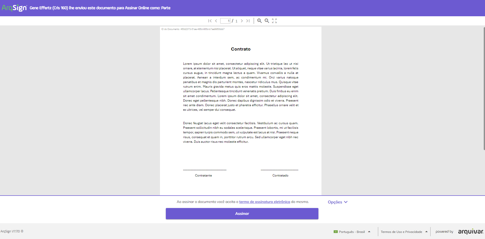
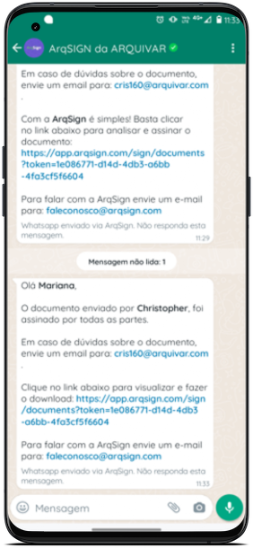
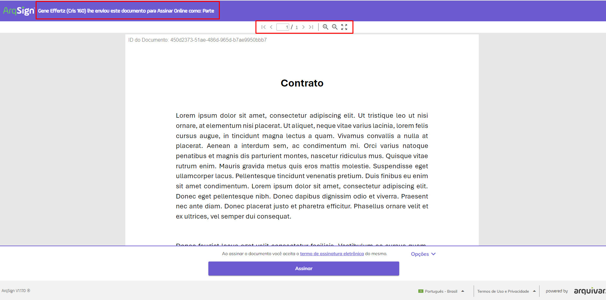
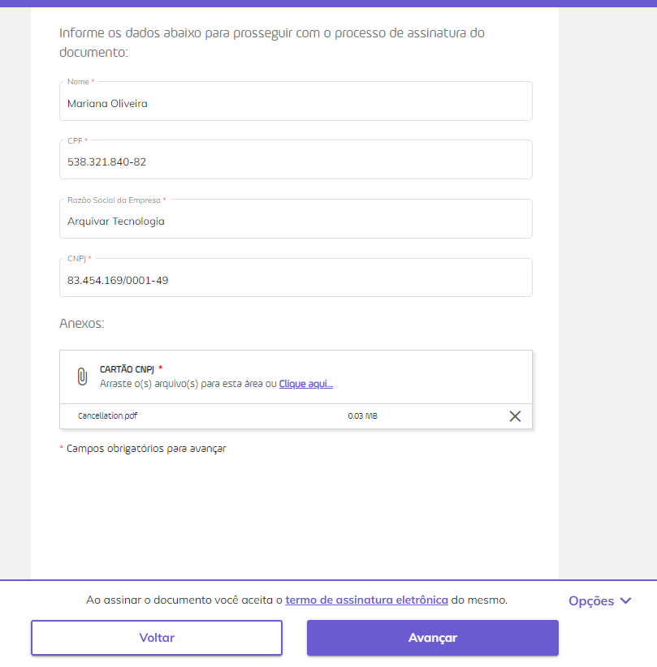

# ✍️ Assinatura de Documentos


<mark style="color:red;">Devido a uma mudança de tecnologia utilizada na última atualização da plataforma, todos os clientes deverão</mark> <mark style="color:red;"></mark><mark style="color:red;">**atualizar manualmente**</mark> <mark style="color:red;"></mark><mark style="color:red;">o instalador do</mark> <mark style="color:red;"></mark><mark style="color:red;">**AppNative**</mark> <mark style="color:red;"></mark><mark style="color:red;">(baixar e instalar), pois, não será possível realizar atualização automática.</mark>

<mark style="color:red;">No momento da assinatura, caso o processo de atualização não tenha sido realizado, a plataforma apresentará uma mensagem para orientação do usuário quanto a atualização.</mark>


O processo de assinatura eletrônica de documentos pode ser realizado por três caminhos:



Ocorre quando o responsável recebe uma notificação por e-mail, informando que o documento deve ser assinado e disponibilizando o link para acesso ao documento ou aos documentos do processo de assinatura.

O usuário responsável pela assinatura receberá uma notificação por e-mail com o link para acesso ao(s) arquivo(s). Este e-mail apresentará também o nome do remetente e o prazo para assinatura. Se o destinatário tiver definido uma mensagem personalizada, ela também será exibida nesta notificação.&#x20;

<figure><figcaption>
Clique na imagem para ampliar.
</figcaption></figure>

Ao clicar no link ou informar o código, o usuário será direcionado para a tela de assinatura.

<figure><figcaption>
Clique na imagem para ampliar.
</figcaption></figure>



Ocorre quando o responsável recebe uma notificação por WhatsApp, informando que o documento deve ser assinado e disponibilizando o link para acesso ao documento. &#x20;

O usuário responsável pela assinatura receberá uma mensagem por WhatsApp com o link para acesso ao arquivo. Esta mensagem apresentará também o nome do remetente e o prazo para assinatura. Se o destinatário tiver definido uma mensagem personalizada, ela também será exibida nesta notificação.&#x20;

<figure><figcaption>
Clique na imagem para ampliar.
</figcaption></figure>

Ao clicar no link ou informar o código, o usuário será direcionado para a tela de assinatura.

<figure><figcaption>
Clique na imagem para ampliar.
</figcaption></figure>

Ao final do processo será exibida uma mensagem de sugestão para que ele crie uma conta de teste grátis.


<mark style="color:orange;">**A criação da conta de teste grátis não é obrigatória.**</mark>&#x20;


<figure><figcaption>
Clique na imagem para ampliar.
</figcaption></figure>

O signatário receberá também uma mensagem por WhatsApp confirmando a conclusão do processo de assinatura.

<figure><figcaption>
Clique na imagem para ampliar.
</figcaption></figure>



Ocorre quando o responsável pela assinatura acessa diretamente a plataforma e verifica a lista de documentos pendentes de assinatura. &#x20;

Depois de conectado à conta, o usuário deve clicar no menu [Caixa Postal > Caixa de Entrada.](../caixa-postal/caixa-de-entrada.md) Para assinar um documento, é preciso clicar no botão “Assinar” do arquivo desejado.&#x20;

<figure><figcaption>
Clique na imagem para ampliar.
</figcaption></figure>



***

## Assinando um documento

## Etapa 1 - Acessando o documento&#x20;

Se o remetente tiver definido um código de segurança para abertura do documento, será solicitado que o signatário informe o código, que deve ter sido recebido anteriormente por e-mail, WhatsApp, SMS ou pelo próprio remetente. Caso não possua o código o usuário deve clicar em “Não Recebi o Código”.&#x20;

<figure><figcaption></figcaption></figure>

<figure><figcaption>
Clique na imagem para ampliar.
</figcaption></figure>

O documento será apresentado na tela para assinatura. Na parte superior da tela serão apresentados os nomes do responsável pelo envio, o nome do documento, a navegação entre páginas e os botões de zoom e visualização do documento em tela cheia.

<figure><figcaption>
Clique na imagem para ampliar.
</figcaption></figure>

Para o processo que possui **mais de um documento não agrupados**, será apresentada a tela com a listagem dos documentos do processo.

A plataforma lista os documentos do processo conforme a ordem definida ao enviar os documentos para assinatura.

<figure><figcaption>
Clique na imagem para ampliar.
</figcaption></figure>

Ao clicar sobre o link de um documento, o sistema exibe o documento selecionado, apresentando no menu lateral os documentos do processo e sinalizando os documentos lindos e/ou não lidos.

Para o processo que possuir apenas um documento, o sistema não exibirá uma listagem lateral de arquivos e apresentará somente o botão "Assinar" no rodapé da página.

<figure><figcaption>
Clique na imagem para ampliar.
</figcaption></figure>


<mark style="color:blue;">Para processos com um documento, o sistema exibe o botão "Assinar Documento "conforme parâmetro de obrigatoriedade de leitura dos documentos.</mark>

<mark style="color:blue;">Se o processo, com mais de um documento, possui a configuração de "</mark><mark style="color:blue;">**Obrigar Leitura dos Documentos**</mark><mark style="color:blue;">", o sistema habilita o botão "Assinar Documento" somente após a leitura de todos os documentos do processo.</mark>




<figure><figcaption>
Clique na imagem para ampliar.
</figcaption></figure>

Quando o processo **possui obrigatoriedade de leitura** dos documentos, o botão de "**Assinar Documentos**" aparece desabilitado para o usuário assim que ele entra no processo. Neste caso, o ícone de visualização sinaliza os documentos lindos e/ou não lidos para que ele possa passar por todos os arquivos, habilitando ao final da leitura o botão de "Assinar Documentos".

<figure><figcaption>
Clique na imagem para ampliar.
</figcaption></figure>



<figure><figcaption>
Clique na imagem para ampliar.
</figcaption></figure>

Se o processo não possui obrigatoriedade de leitura dos documentos, o botão de "**Assinar Documentos**" já aparece habilitado para o usuário assim que ele entra no processo. Neste caso, o ícone de visualização apenas sinaliza os documentos lindos e/ou não lidos.



Clicando em “Opções”, o signatário poderá executar as seguintes ações:

<figure><figcaption>
Clique na imagem para ampliar.
</figcaption></figure>

#### **Histórico**

Aqui é possível visualizar o histórico do processo de assinatura e seus documentos. Selecione o botão de eventos para visualizar detalhadamente os dados.

Com o botão de eventos posicionado para a esquerda, observamos os dados do processo na tela.

<figure><figcaption>
Clique na imagem para ampliar.
</figcaption></figure>

Com o botão de eventos posicionado para a direita, é possível visualizar os Id's e Hash's dos documentos, no caso de um **processo com mais de um documento não agrupados**.&#x20;

<figure><figcaption>
Clique na imagem para ampliar.
</figcaption></figure>

#### **Recusar Assinatura**

Utilizado quando por algum motivo o signatário não deseja assinar o documento. Neste caso ele deve inserir uma justificativa para a recusa e clicar em “Recusar Assinatura”. Ao recusar a assinatura o processo de assinatura do documento será automaticamente cancelado para todos os envolvidos e aparecerá com o status “Cancelado” para o remetente responsável pelo documento. &#x20;

<figure><figcaption>
Clique na imagem para ampliar.
</figcaption></figure>

#### **Concluir Mais Tarde**

Utilizado para retornar e concluir a assinatura em outro momento, sempre que selecionada esta opção a plataforma apresentará uma mensagem de validação da ação.

<figure><figcaption></figcaption></figure>

#### **Baixar Arquivo**

A opção que permite fazer o download dos documentos existentes no processo de assinatura. Selecione o(s) arquivo(s) que deseja e clique em "Baixar".

<figure><figcaption>
Clique na imagem para ampliar.
</figcaption></figure>

Nesta fase do processo os documentos ainda não foram assinados, então só é possível baixar os arquivos, sem o registro das assinaturas.

No rodapé da página, temos ainda o "**Termo de assinatura eletrônica**" que pode ser visualizado pelo usuário a a opção de alterar o idioma da plataforma, disponível atualmente em "Inglês - USA", "Espanhol - Espanha" ou "Português - Brasil".

<figure><figcaption>
Clique na imagem para ampliar.
</figcaption></figure>

Ao assinar o documento o sistema registrará o aceite do “Termo de Assinatura Eletrônica” do signatário automaticamente.

Para prosseguir com a assinatura, o signatário deve clicar em “Assinar”.    &#x20;

<figure><figcaption>
Clique na imagem para ampliar.
</figcaption></figure>

## Etapa 2 - Dados do signatário e Anexos

No próximo item, se houver configuração prévia solicitando que o signatário forneça dados complementares, ele deverá informá-los.

Se também tiver sido solicitado ao signatário anexar arquivos, no campo “Anexos” ele deverá fazer o upload dos documentos pedidos. Depois de concluir, o usuário deve clicar em “Avançar”.

<figure><figcaption>
Clique na imagem para ampliar.
</figcaption></figure>

***

## Etapa 3 - Estilo de Assinatura

O Estilo de Assinatura é a representação visual da assinatura do usuário. Para concluir a assinatura de um documento, o usuário deverá escolher de que forma irá assinar, considerando as configurações realizadas pelo destinatário em [Novo Documento](novo-documento.md#b.-destinatarios). Neste momento o destinatário deverá informar qual a representação visual  deve ser utilizada pelo signatário: "Padrão, Desenho ou Imagem", ou somente "Padrão (Texto)" ou somente "Desenho" ou somente "Imagem".

<figure><figcaption>
Clique na imagem para ampliar.
</figcaption></figure>

* **Padrão:** Neste estilo o usuário deve informar o nome completo e definir o estilo (fonte) como o texto deverá ser apresentado. Para isso deve clicar em “Estilo” e fazer a definição.&#x20;

<figure><figcaption>
Clique na imagem para ampliar.
</figcaption></figure>

* **Desenho:** Para assinar com um desenho, o usuário deverá, no campo “Área de Desenho da Assinatura” assinar ou rubricar utilizando o mouse. Para corrigir, deve clicar no ícone “Apagar”.&#x20;

<figure><figcaption>
Clique na imagem para ampliar.
</figcaption></figure>

* **Imagem:** Se desejar, o usuário pode fazer o upload de uma imagem que represente sua assinatura.

<figure><figcaption>
Clique na imagem para ampliar.
</figcaption></figure>

Para concluir o signatário deve clicar em “Concluir”. Se foi solicitado no documento que ele assine como Pessoa Física e Jurídica, será utilizada a mesma assinatura para as duas situações.

<figure><figcaption>
Clique na imagem para ampliar.
</figcaption></figure>

***

## Etapa 4 - Assinando eletronicamente ou com certificado digital


<mark style="color:blue;">**ASSINATURA ELETRÔNICA X ASSINATURA DIGITAL (ICP Brasil e ICP Outros)**</mark>

<mark style="color:blue;">**Assinatura eletrônica**</mark> <mark style="color:blue;"></mark><mark style="color:blue;">é aquela que não precisa de um certificado digital. É mais utilizada para assinar contratos e documentos entre entes privados (B2B, B2C).</mark>&#x20;

<mark style="color:blue;">**Assinatura digital**</mark> <mark style="color:blue;"></mark><mark style="color:blue;">é aquela que precisa de um certificado digital. É mais utilizada para emissão de notas fiscais e para transações com o governo.</mark>&#x20;

<mark style="color:blue;">Na Plataforma Arqsign, ao configurar um fluxo de assinaturas você pode determinar qual tipo de assinatura deverá ser executada por destinatário escolhendo entre:</mark>&#x20;

<mark style="color:blue;">**a) Assinatura eletrônica**</mark> <mark style="color:blue;"></mark><mark style="color:blue;">(a ArqSign produz assinaturas eletrônicas avançadas com validade jurídica de acordo com MP 2.200-2 de 24/08/2001 e Lei 14.063 de 23/11/2020). Sempre que um signatário assina um documento de forma eletrônica a Arqsign aplica um certificado digital próprio da plataforma, capturando o Hash (identificação única) do arquivo, verificando a integridade do arquivo e anexando ao certificado a identificação do signatário.</mark>  &#x20;

<mark style="color:blue;">**b) Assinatura digital – ICP-Brasil ou ICP Outros**</mark> <mark style="color:blue;"></mark><mark style="color:blue;">(A ArqSign produz assinaturas digitais qualificadas de acordo com MP 2.200-2 de 24/08/2001 e Lei 14.063 de 23/11/2020). Quando o usuário já possui um certificado digital e deseja utilizá-lo para realizar a assinatura por meio da ArqSign, este certificado é utilizado para verificar a integridade da assinatura e identificar o usuário como signatário no documento.</mark>&#x20;


Depois de definir o Estilo de Assinatura, será solicitada a assinatura do usuário que pode ser:

### A. Assinatura Eletrônica

Na assinatura eletrônica o usuário informa seus dados de pessoa física ou jurídica e a própria Arquivar certifica a autenticidade e veracidade das informações apresentadas.&#x20;

Se o usuário estiver utilizando uma assinatura eletrônica, será necessário que informe os campos obrigatórios solicitados. Os campos obrigatórios variam de acordo com o documento. O símbolo <mark style="color:red;">**\***</mark> indica que a informação é de preenchimento obrigatório.&#x20;

<figure><figcaption>
Clique na imagem para ampliar.
</figcaption></figure>

### B. Assinatura Digital – ICP Brasil e Outros

Se tiver sido definido que o usuário deverá assinar utilizando um certificado digital (ICP Brasil e ICP outros), será exibida uma lista com todos os certificados instalados na máquina do usuário e na conta da plataforma ArqSign.&#x20;

<figure><figcaption>
Clique na imagem para ampliar.
</figcaption></figure>

Ele deverá selecionar aquele com o qual irá assinar e informar o código PIN do certificado (se solicitado). Caso ele precise assinar também como Pessoa Jurídica, a assinatura será utilizada nas duas situações.

<figure><figcaption></figcaption></figure>


<mark style="color:orange;">**Os certificados hospedados na conta da plataforma ArqSign do usuário apresentados aqui deverão ter sido anteriormente importados na tela**</mark> [<mark style="color:blue;">**Meu Perfil > Aba Certificado Digital.**</mark> ](meu-perfil.md)<mark style="color:orange;">**Caso o usuário tenha o certificado digital hospedado na ArqSign, será oferecida a ele a opção de autenticação na plataforma para utilizar o certificado que possui.**</mark>


### Instalação dos plugins necessários para a utilização dos certificados digitais

Caso ainda não tenha feito, ao assinar um documento pela primeira vez utilizando um certificado digital será solicitado ao usuário que instale a extensão “ArqSign Certificado Digital” (disponível nas lojas de extensões dos navegadores) e do Arquivar Native Module (disponibilizado durante o processo).

1\. Ao clicar em “Instalar Agora”, será aberta a janela com o link para o download da extensão “ArqSign Certificado Digital”.&#x20;

2\. Faça a instalação da extensão de acordo com o navegador que estiver utilizando.&#x20;

3\. Depois da concluir a primeira instalação, retorne à plataforma ArqSign e prossiga com a instalação do plugin Arquivar Native Moduleclicando em “Clique aqui para fazer o download...”.&#x20;

4\.  Depois de concluir a segunda instalação, retorne à plataforma ArqSign. Será exibida uma mensagem de conclusão das instalações.&#x20;


#### <mark style="color:orange;">AppNative</mark>

<mark style="color:orange;">Devido a uma mudança de tecnologia utilizada na última atualização da plataforma, todos os clientes deverão</mark> <mark style="color:orange;"></mark><mark style="color:orange;">**atualizar manualmente**</mark> <mark style="color:orange;"></mark><mark style="color:orange;">o instalador do</mark> <mark style="color:orange;"></mark><mark style="color:orange;">**AppNative**</mark> <mark style="color:orange;"></mark><mark style="color:orange;">(baixar e instalar), pois, não será possível realizar a atualização de forma automática.</mark>

<mark style="color:orange;">No momento da assinatura, caso o processo de atualização não tenha sido realizado, a plataforma deverá baixar o arquivo de instalação e apresentar uma mensagem para orientação do usuário no processo de instalação.</mark>



### Instalação da Extensão  em diferentes navegadores de internet



1. Para instalar a extensão "ArqSign Certificado Digital" no Google Chrome você irá clicar nos três pontinhos no canto superior esquerdo da tela.&#x20;

<figure><figcaption></figcaption></figure>

2. Em seguida clicará em "Extensões" e depois em "Acessar a Chrome Web Store".

<figure><figcaption></figcaption></figure>

3. Buscar por "ArqSign Certificado Digital".

<figure><figcaption></figcaption></figure>

4. Clicar no resultado da pesquisa.

<figure><figcaption></figcaption></figure>

5. Clicar em "Usar no Chrome".

<figure><figcaption></figcaption></figure>

6. Clicar em "Adicionar extensão"

<figure><figcaption></figcaption></figure>

7. Prontinho, extensão adicionada com sucesso, só precisará fazer isso na primeira vez que assinar com certificado digital, nas próximas a extensão já se manterá instalada em seu navegador.&#x20;



1.  Para instalar a extensão "ArqSign Certificado Digital" no Mozilla Firefox você irá clicar no ícone de pela de quebra-cabeças no canto superior esquerdo da tela.

    <figure><figcaption></figcaption></figure>
2.  Buscar por "ArqSign Certificado Digital".

    <figure><figcaption></figcaption></figure>
3.  Clicar no resultado da pesquisa.

    <figure><figcaption></figcaption></figure>
4.  Clicar em "Adicionar ao Firefox".

    <figure><figcaption></figcaption></figure>
5.  Clicar em "Adicionar"

    <figure><figcaption></figcaption></figure>
6. Prontinho, extensão adicionada com sucesso, só precisará fazer isso na primeira vez que assinar com certificado digital, nas próximas a extensão já se manterá instalada em seu navegador.&#x20;



1.  Para instalar a extensão "ArqSign Certificado Digital" no Microsoft Edge você irá clicar nos três pontinhos no canto superior esquerdo da tela.

    <figure><figcaption></figcaption></figure>
2.  Em seguida clicará em "Extensões".

    <figure><figcaption></figcaption></figure>
3.  Clicar em "Obter extensões do Microsoft Edge".

    <figure><figcaption></figcaption></figure>
4.  Buscar por "ArqSign Certificado Digital".

    <figure><figcaption></figcaption></figure>
5.  Clicar em "Obter".

    <figure><figcaption></figcaption></figure>
6.  Clicar em "Adicionar extensão"

    <figure><figcaption></figcaption></figure>
7. Prontinho, extensão adicionada com sucesso, só precisará fazer isso na primeira vez que assinar com certificado digital, nas próximas a extensão já se manterá instalada em seu navegador.&#x20;



Para finalizar o processo de assinatura, o signatário deve clicar em “Concluir”. Ele será direcionado para uma tela pop-up, que será diferente conforme a sua situação.&#x20;

Se já tiver uma conta ativa na plataforma de assinatura e **estiver logado**, poderá clicar na opção "voltar para a plataforma" e será direcionado para sua caixa de entrada ArqSign. 

<figure><figcaption>
Clique na imagem para ampliar
</figcaption></figure>

Se já tiver uma conta ativa na plataforma de assinatura, mas **não estiver logado**, poderá clicar na opção "acessar minha conta" e poderá informar suas credenciais para acessar. 

<figure><figcaption>
Clique na imagem para ampliar
</figcaption></figure>

Se o signatário **não tiver uma conta cadastrada** na plataforma, será exibida uma mensagem de sugestão para que seja criada uma [conta de teste grátis](https://manual.arquivar.com/manual-arqsign#criacao-de-conta-teste-gratis), ou para que possa saber mais onde o usuário será direcionada para a página de mais informações no site ArqSign.&#x20;

<figure><figcaption>
Clique na imagem para ampliar
</figcaption></figure>


<mark style="color:orange;">**A criação da conta de teste grátis não é obrigatória.**</mark>


***

## Concluindo a assinatura

Concluído o processo de assinatura, o destinatário recebe a a notificação de conclusão das assinaturas, por e-mail ou WhatsApp, onde a plataforma envia a(s) cópia(s) do(s) Documento(s) assinado(s) e o respectivo Registro de Assinaturas para os destinatários, considerando as configurações da conta (link ou arquivo). Quando houver mais de um arquivo no processo, a plataforma envia um arquivo zip com todos os documentos e seu respectivo registo de assinatura.

<figure><figcaption>
Clique na imagem para ampliar.
</figcaption></figure>

<figure><figcaption>
Clique na imagem para ampliar.
</figcaption></figure>

Se o remetente tiver definido que deverá ser gerado um QR Code no Registro de Assinaturas na tela [Configurações Avançadas do cadastro do documento](novo-documento.md#configuracoes-avancadas), esse QR Code será exibido na folha de registro das assinaturas.&#x20;

<figure><figcaption>
Clique na imagem para ampliar.
</figcaption></figure>

***
