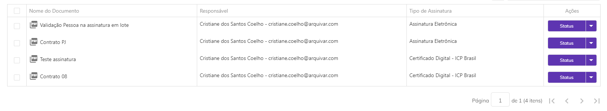
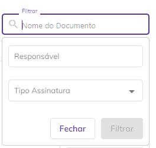
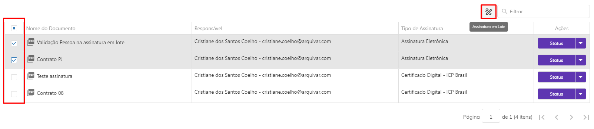
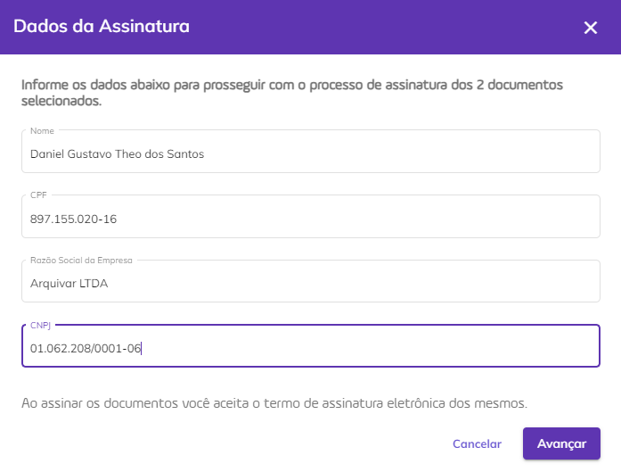
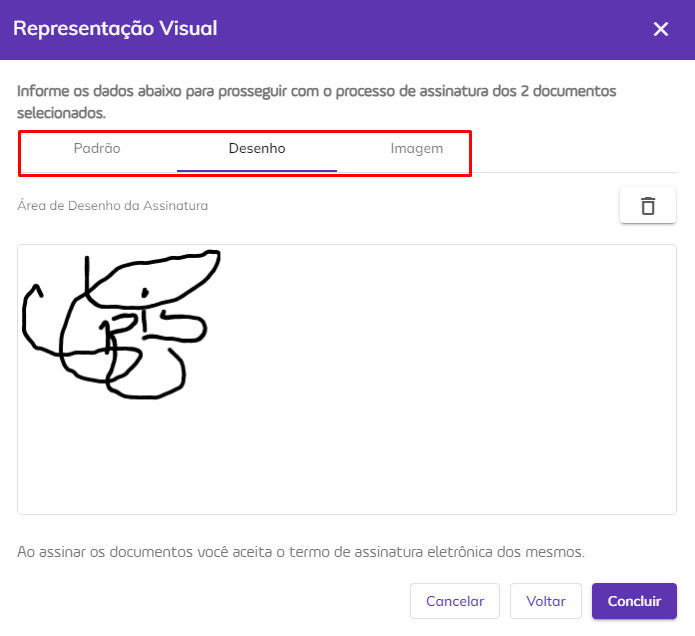
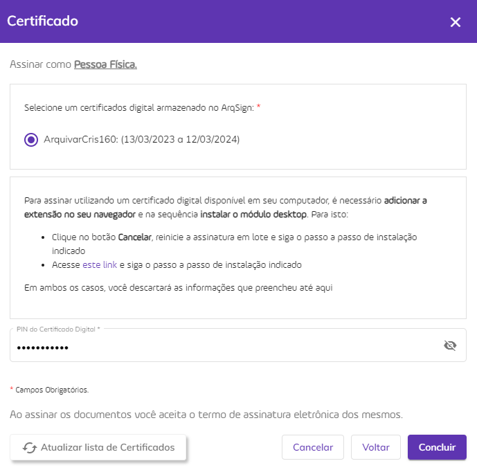
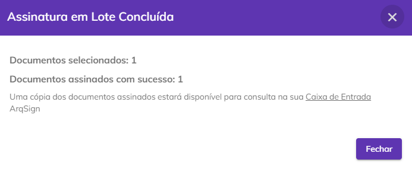
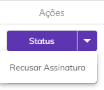
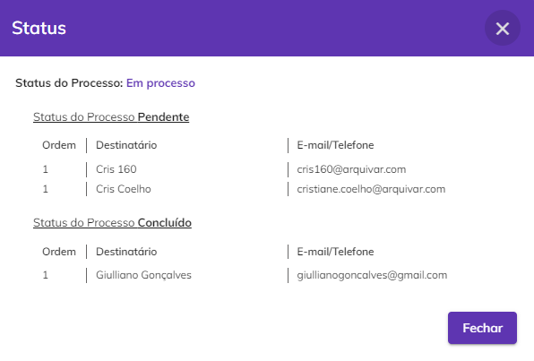
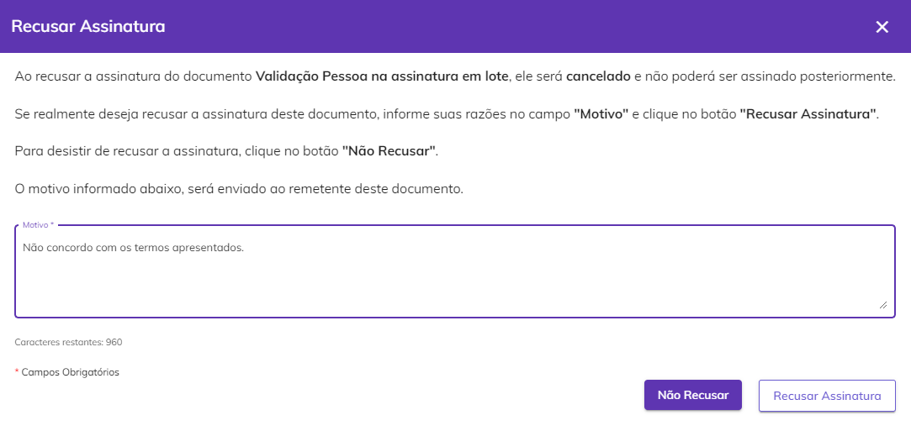

# 🖊️ Assinatura em Lote

O processo de assinatura em lote permite que o usuário assine mais de um documento de uma só vez. A assinatura em lote só está disponível para usuários que possuem conta cadastrada na plataforma e estiverem autenticados. Nesta tela, serão apresentados até 100 documentos por página, isso vai depender da quantidade de documentos pendentes de assinatura. 


<mark style="color:red;">Documentos que exigem as configurações:</mark>

<mark style="color:red;">**• Código de segurança**</mark>

<mark style="color:red;">**• Obrigatoriedade leitura dos documentos**</mark>

<mark style="color:red;">**• Estilo de Assinatura predefinido**</mark>

<mark style="color:red;">**• Preenchimento ou Validação dos dados de assinatura**</mark>

<mark style="color:red;">**• Solicitação para anexar documentos**</mark>

<mark style="color:red;">**Não são listados**</mark> <mark style="color:red;"></mark><mark style="color:red;">para assinatura em lote. Para assiná-los, o usuário deverá acessar sua</mark> [<mark style="color:blue;">**Caixa de Entrada**</mark>](../caixa-postal/caixa-de-entrada.md) <mark style="color:red;">e assiná-los individualmente.</mark>


<figure><figcaption>
Clique na imagem para ampliar.
</figcaption></figure>

***

## Colunas da tela principal – Assinatura em Lote

<figure><figcaption>
Clique na imagem para ampliar.
</figcaption></figure>

**Coluna Nome do Documento:** Nesta coluna é exibido o nome do documento.&#x20;

**Coluna Responsável:** esta coluna são apresentados o nome e e-mail de quem enviou o documento (remetente).  &#x20;

**Coluna Tipo de Assinatura:** Nesta coluna é exibido o tipo de assinatura exigido para a assinatura do documento, que pode ser [Assinatura Eletrônica](assinatura-de-documentos.md#a.-assinatura-eletronica) ou [Assinatura via Certificado Digital – ICP Brasil ou Outros Certificados Digitais](assinatura-de-documentos.md#b.-assinatura-digital-icp-brasil-e-outros).

**Coluna Ações:** Esta coluna exibe botões de ação sobre o documento. Será sempre exibida nesse botão a ação prioritária de execução, de acordo com o perfil do usuário e status do documento. &#x20;

**Barra de Filtro:** É possível localizar um ou mais documentos utilizando-se os filtros disponíveis para busca. Na tela Assinatura em Lote a busca pode ser feita pelo nome do documento, pelo nome do responsável ou pelo tipo de assinatura que deverá ser utilizada.&#x20;

<figure><figcaption>
Clique na imagem para ampliar.
</figcaption></figure>

***

## Assinando documentos em lote 

1\. Na lista de documentos pendentes, selecione aqueles que deseja assinar e clique no ícone “Assinatura em Lote”. &#x20;

<figure><figcaption>
Clique na imagem para ampliar.
</figcaption></figure>

2\. Será apresentada a tela de “Dados da Assinatura”. Preencha os dados solicitados e clique em “Avançar”. O símbolo \* indica que a informação é de preenchimento obrigatório.&#x20;


<mark style="color:orange;">**Nesta tela, serão solicitadas todas as informações definidas como necessárias para assinatura de todos os documentos selecionados na lista.**</mark>  



<mark style="color:blue;">**EXEMPLO:**</mark> <mark style="color:blue;"></mark><mark style="color:blue;">Se em um documento for definido que a assinatura é de pessoa física, nesta tela será solicitada o CPF do assinante; se em outro for definido que a assinatura é de pessoa jurídica, nesta tela será solicitado também o CNPJ, e assim por diante, até que todas as obrigatoriedades sejam realizadas.</mark> 


<figure><figcaption>
Clique na imagem para ampliar.
</figcaption></figure>

3\. O próximo passo será definir o [Estilo de Assinatura](novo-documento.md#b.-destinatarios), que pode ser um padrão, um desenho ou uma imagem. Depois de escolhido, clique em “Concluir”. &#x20;

<figure><figcaption>
Clique na imagem para ampliar.
</figcaption></figure>

4\. Se for determinado o uso de certificado digital, você pode utilizar um certificado que esteja armazenado na Plataforma ArqSign ou um que não esteja armazenado na plataforma. Para assinatura feita por meio de um que não esteja armazenado, caso ainda não tenha feito, será solicitado ao usuário que instale a extensão “ArqSign Certificado Digital” no browser e o aplicativo Arquivar Native Module em sua máquina, necessários para a utilização dos certificados digitais.&#x20;

Depois de instalados, serão exibidos todos os certificados digitais instalados na máquina e hospedados na conta do ArqSign para que o usuário escolha aquele que deseja utilizar para a assinatura e informe o código PIN (se solicitado). &#x20;

Caso não tenha instalado ainda a Extensão ArqSign Certificado Digital e o Arquivar Native Module, pode verificar o passo-a-passo para assinatura clicando nos links abaixo:

* [Instalação dos plugins necessários para a utilização dos certificados digitais](assinatura-de-documentos.md#instalacao-dos-plugins-necessarios-para-a-utilizacao-dos-certificados-digitais)
* [Instalando a Extensão em diferentes navegadores de internet](assinatura-de-documentos.md#instalacao-da-extensao-em-diferentes-navegadores-de-internet)

<figure><figcaption>
Clique na imagem para ampliar.
</figcaption></figure>

5\. Será exibido o informativo do processo de assinatura e contador de assinaturas concluídas. Dessa forma o usuário poderá acompanhar as assinaturas até que todas tenham sido concluídas. &#x20;


<mark style="color:blue;">Conforme a quantidade de documentos enviados em lote, o usuário poderá deixar o aplicativo ArqSign trabalhando em segundo plano e seguir com suas atividades rotineiras. Não é necessário acompanhar o processo de execução das assinaturas até o encerramento, mas é necessário manter o login.</mark> 


6\. Finalizada a assinatura do lote, é apresentada a mensagem de conclusão ao usuário. Clique em “Fechar” para concluir. A lista de documentos pendentes de assinatura será atualizada exibindo somente os documentos que deverão ser novamente enviados para os signatários. &#x20;


<mark style="color:orange;">**Caso ocorram falhas durante o processo de assinatura em um ou mais documentos selecionados no lote, a plataforma concluirá a assinatura dos documentos que estiverem no padrão, reportará a informação dos que foram assinados e das falhas encontradas e manterá como pendentes os documentos em que não foi possível concluir a assinatura.**</mark> 



<mark style="color:blue;">**EXEMPLO:**</mark> <mark style="color:blue;"></mark><mark style="color:blue;">Alguns dos motivos para possíveis falhas são mais de um usuário assinar o documento ao mesmo tempo, queda de conexão da internet no momento da assinatura, acesso interrompido, entre outros.</mark>


<figure><figcaption>
Clique na imagem para ampliar.
</figcaption></figure>

***

## Ações individuais – Assinatura em Lote

<figure><figcaption>
Clique na imagem para ampliar.
</figcaption></figure>

#### **Status**

Clicando neste botão é exibido o status no qual aquele documento se encontra, que pode ser “Aguardando” (nenhum participante assinou o documento até o momento) ou “Em processo” (um ou mais participantes já assinaram o documento, mas ainda faltam assinaturas). Além do status são mostradas as seguintes informações sobre os signatários: ordem de assinatura determinada, nome e e-mail/telefone e se já concluiu ou não a assinatura.&#x20;

<figure><figcaption>
Clique na imagem para ampliar.
</figcaption></figure>

#### **Recusar Assinatura**

Utilizado quando por algum motivo o signatário não deseja assinar o documento. Neste caso ele deve inserir uma justificativa para a recusa e clicar em “Recusar Assinatura”. &#x20;

<figure><figcaption>
Clique na imagem para ampliar.
</figcaption></figure>
