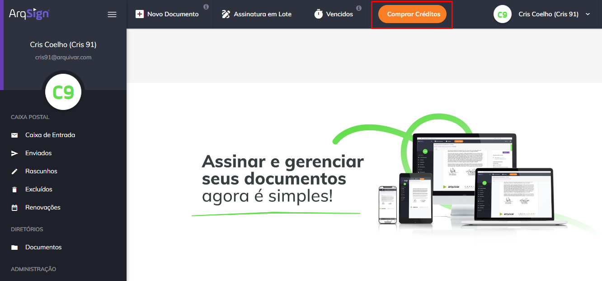
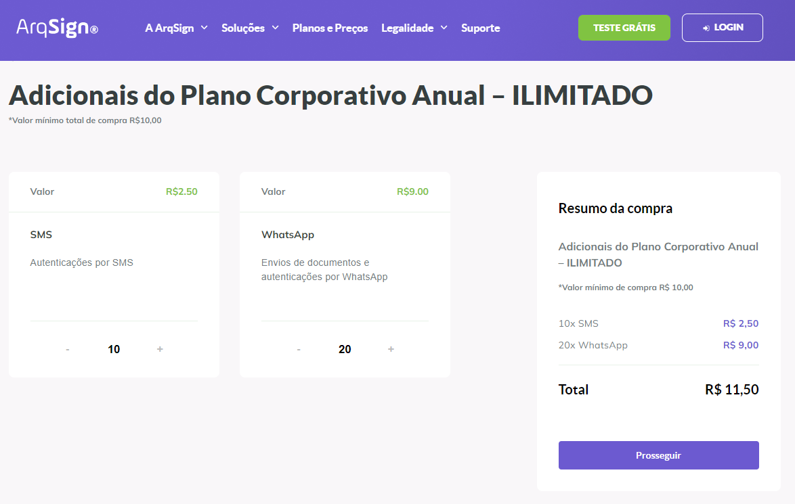
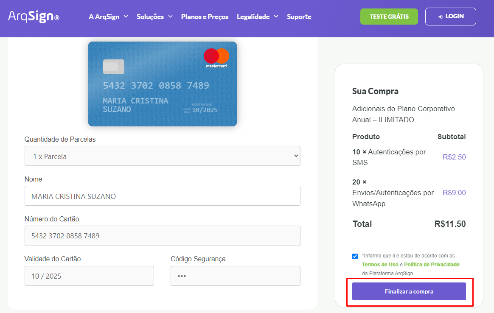

# 💳 Comprar Créditos

O botão “Comprar Crédito” será exibido para todos os usuários com plano vigente (conta grátis ou paga). Se o usuário consumir todo o pacote de envios de seu plano, ele deverá comprar créditos extras para continuar enviando documentos.&#x20;

<figure><figcaption>
Clique na imagem para ampliar.
</figcaption></figure>

O usuário pode adquirir créditos extras para envio de documentos via e-mail e WhatsApp e crédito para disparo de códigos de segurança via SMS.&#x20;


<mark style="color:orange;">**Os créditos extras possuem validade de seis meses para consumo.**</mark>&#x20;


1\. Ao clicar em “Comprar Créditos” o usuário será direcionado para a tela de finalização de compra. Ele deverá informar a quantidade de créditos que deseja adquirir de cada tipo (e-mail, WhatsApp e SMS) e clicar em “Prosseguir”. &#x20;


<mark style="color:orange;">**Se a conta do usuário tiver envio de e-mails ilimitado, só será possível adquirir créditos extras de envio de documentos via WhatsApp e de códigos de segurança via SMS.**</mark> &#x20;


<figure><figcaption>
Clique na imagem para ampliar.
</figcaption></figure>

2\. Para finalizar a compra, o usuário deverá inserir as informações para faturamento e pagamento e clicar em “Finalizar a compra”. &#x20;

<figure><figcaption>
Clique na imagem para ampliar.
</figcaption></figure>

3\. Após a conclusão da compra, se a conta for compartilhada com outros usuários, todos os usuários com perfil de administrador global da conta receberão uma notificação por e-mail sobre a aquisição dos créditos extras.
