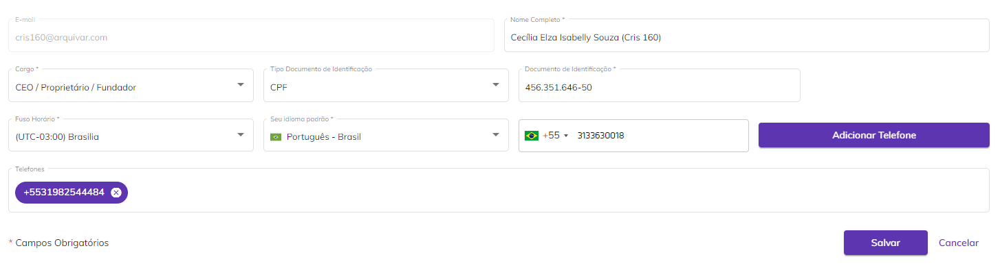
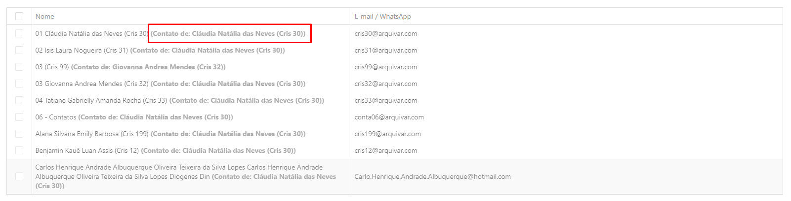
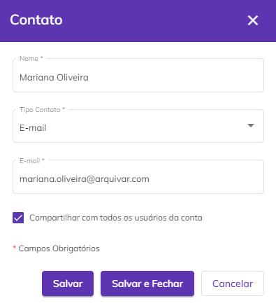
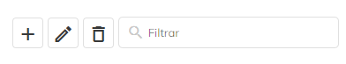
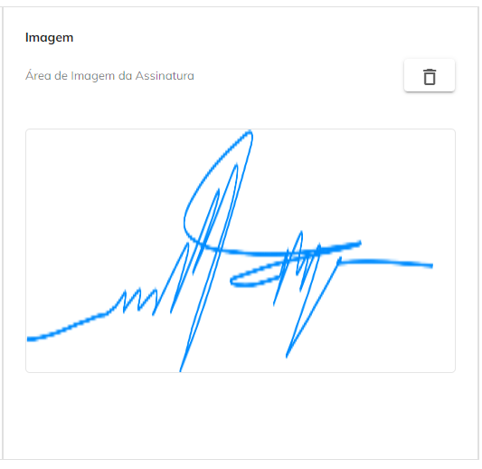
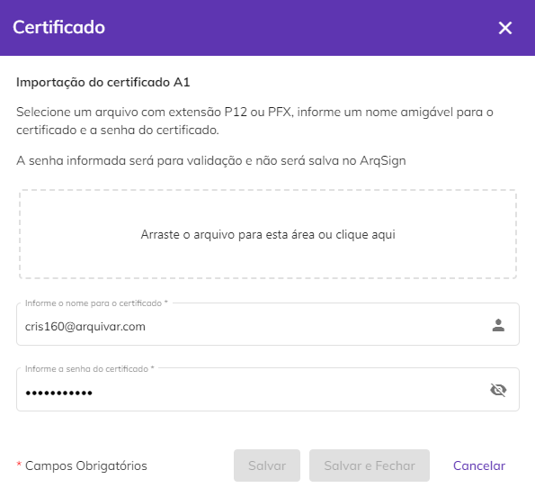
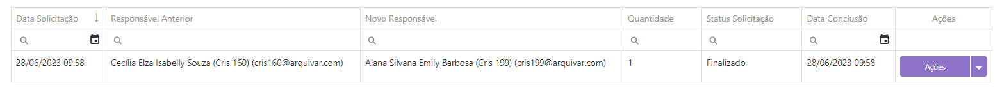
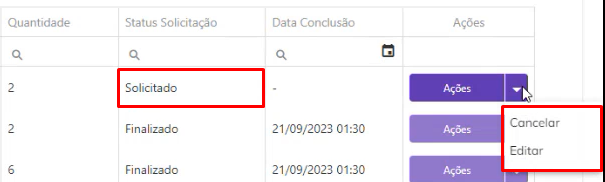

# 👤 Meu Perfil

No menu Meu Perfil são apresentadas as informações do usuário autenticado. &#x20;

<figure><figcaption>
Clique na imagem para ampliar.
</figcaption></figure>

***

## Aba Meus Dados&#x20;

Na aba Meus Dados são apresentadas as informações de cadastro do usuário. É possível editar os dados clicando-se no botão “Editar”.&#x20;

<figure><figcaption>
Clique na imagem para ampliar.
</figcaption></figure>

**Foto do perfil:** Para inserir ou editar a foto de perfil, clique sobre a imagem e selecione a opção “Upload Nova Imagem”. Selecione a foto desejada e clique em “Salvar”. Para excluir a foto de perfil, basta clicar na foto e selecionar a opção “Excluir Imagem Atual”.&#x20;

<figure><figcaption>
Clique na imagem para ampliar.
</figcaption></figure>

**E-mail:** O e-mail apresentado neste campo é o mesmo utilizado no momento do cadastro da conta do usuário na plataforma e não pode ser alterado. &#x20;

Caso queira utilizar outro e-mail como "Remetente de documentos", crie outro usuário para este outro e-mail. Na Plataforma ArqSign os usuários são ilimitados.

**Nome Completo:** Apresenta o nome completo do usuário. O nome cadastrado neste campo aparece como o remetente de documentos deste usuário nos e-mails e mensagens de WhatsApp.

**Cargo:** O usuário pode informar neste campo o cargo que ocupa na empresa em que trabalha.&#x20;

**Tipo Documento de Identificação:** Neste campo o usuário deve escolher um documento de identificação que pode ser CPF, CNH, RG ou outro documento. &#x20;

**Documento de Identificação:** Neste campo o usuário deve informar o número do documento escolhido no campo “Tipo Documento de Identificação”.&#x20;

**Fuso Horário:** Neste campo o usuário pode escolher o fuso horário que deseja que a plataforma considere. Essa configuração é útil para as parametrizações que envolvam agendamentos, por exemplo.&#x20;

**Seu idioma padrão:** O usuário pode escolher o idioma padrão em que deseja que a interface da plataforma seja apresentada entre “Português – Brasil”. “Inglês – EUA” e “Espanhol – Espanha”.&#x20;

**Telefone:** Neste campo o usuário deve informar seu número de telefone de contato e clicar em “Adicionar Telefone”. Os números inseridos aqui serão apresentados logo abaixo, no campo “Telefones”.&#x20;

<figure><figcaption>
Clique na imagem para ampliar.
</figcaption></figure>

***

## Aba Meus Contatos&#x20;

Na aba Meus Contatos o usuário pode cadastrar informações de destinatários para envio de documentos. &#x20;

**Salvar os destinatários de um documento enviado para assinatura em minha lista de contatos:** Ao deixar marcada essa opção, sempre que o usuário enviar um documento para assinatura para um destinatário que ainda não estiver incluso na lista de contatos, as informações de contato desse destinatário serão automaticamente salvas e ele passará a fazer parte da lista.&#x20;

<figure><figcaption>
Clique na imagem para ampliar.
</figcaption></figure>

**Coluna Nome:** Nesta coluna é apresentado o nome do contato da mesma forma que foi cadastrado na lista ou como foi informado durante o envio de um documento.  Caso o contato tenha sido compartilhado com o usuário por outro membro da conta, será exibido o nome do contato seguido da informação de quem o cadastrou.&#x20;

**Coluna E-mail / WhatsApp:** Nesta coluna é apresentado o nome ou e-mail do contato informado no cadastro ou durante o envio de um documento.  &#x20;

<figure><figcaption>
Clique na imagem para ampliar.
</figcaption></figure>

**Ícone Adicionar Contato:** Para adicionar um novo contato, clique no ícone “Adicionar Contato” e informe o nome e e-mail ou número de WhatsApp do contato. Ao selecionar a opção “Compartilhar com todos os usuários da conta” o contato cadastrado será salvo na lista de contatos de todos os usuários que fazem parte da conta. Para concluir, clique em “Salvar”.&#x20;

<figure><figcaption>
Clique na imagem para ampliar.
</figcaption></figure>

**Ícone Editar Contato:** Para editar as informações de um contato, selecione o destinatário desejado marcando a caixa de seleção do lado esquerdo e clique no ícone “Editar Contato”. &#x20;

**Ícone Excluir Contato(s):** Para excluir um ou mais contatos, selecione os desejados marcando a caixa de seleção do lado esquerdo e clique no ícone “Excluir Contato(s)”.  &#x20;


<mark style="color:orange;">**Só é possível editar ou excluir contatos que tenham sido cadastrados pelo próprio usuário.**</mark> &#x20;


**Barra de Pesquisa:** É possível localizar um contato específico utilizando os filtros de e-mail ou WhatsApp para busca.&#x20;

<figure><figcaption>
Clique na imagem para ampliar.
</figcaption></figure>

***

## Mensagem Padrão

Na aba Mensagem Padrão o usuário poderá criar várias mensagens específicas para selecionar no momento de enviar um documento para assinatura.

<figure><figcaption>
Clique na imagem para ampliar.
</figcaption></figure>

**Adicionar:** Clique em Adicionar "+", para incluir uma nova mensagem.&#x20;

<figure><figcaption>
Clique na imagem para ampliar.
</figcaption></figure>

Preencha os campos apresentados na tela, atente-se ao limite de caracteres permitidos no preenchimento de cada um dos campos. Clique salvar.

<figure><figcaption>
Clique na imagem
</figcaption></figure>

A mensagem padrão criada será apresentada ao signatário conforme imagem, observe a área em destaque, nela encontra-se o texto previamente cadastrado na plataforma.

<figure><figcaption>
Clique na imagem para ampliar.
</figcaption></figure>

Quando o destinatário não definir uma mensagem padrão da sua lista a plataforma deverá considerar o padrão do sistema. Observe na área em destaque o informativo do documento recebido consideranto o nome dos arquivos anexados ao processo.

Repita o processo até adicionar todas as mensagens que deseja manter como padrão.


<mark style="color:blue;">A lista de mensagens padrão não pode ser compartilhada entre usuários, ou seja, cada usuário poderá visualizar e/ou selecionar apenas as mensagens criadas por ele.</mark>&#x20;


**Editar:** Selecione na lista a mensagem que deseja alterar assim o sistema habilitará a opção de Editar.

**Excluir:** Seleciona lista a mensagem que deseja excluir.

**Filtrar:** Utilize para buscar uma mensagem padrão específica na lista disponível.

***

## Aba Estilo de Assinatura&#x20;

Na aba Estilo de Assinatura o usuário deve definir representação visual de sua assinatura. O usuário pode cadastrar três tipos de Estilo de Assinatura clicando em “Editar”.&#x20;

<figure><figcaption>
Clique na imagem para ampliar.
</figcaption></figure>

**Estilo Padrão:** Neste estilo de assinatura, o usuário deve informar o nome completo e definir o estilo de fonte para o texto. Para isso deve clicar em “Estilo” e fazer a definição. Para apagar, deve clicar no ícone de lixeira.

<figure><figcaption>
Clique na imagem para ampliar.
</figcaption></figure>

**Estilo Desenho:** Para assinar com um desenho, o usuário deverá, no campo “Área de Desenho da Assinatura” desenhar sua assinatura utilizando o mouse ou o dedo caso esteja utilizando um celular ou tablet. Para corrigir, deve clicar no ícone de lixeira.

<figure><figcaption></figcaption></figure>

**Estilo Imagem:** Se desejar, o usuário pode fazer o upload da imagem que represente sua assinatura. Para apagar, deve clicar no ícone de lixeira.

<figure><figcaption></figcaption></figure>

Os estilos de assinatura para as representações visuais cadastradas aqui serão exibidos para o usuário sempre que ele for [assinar um documento](assinatura-de-documentos.md). Para concluir a inclusão de um dos Estilos de Assinatura, selecione-o e clique em “Aplicar”.

***

## Aba Certificado Digital&#x20;

Na aba Certificado Digital devem ser cadastrados os certificados digitais do tipo A1 que serão utilizados por ele para a assinatura de documentos. &#x20;

Na tela principal são apresentadas as informações de todos os certificados cadastrados pelo usuário.  &#x20;

<figure><figcaption></figcaption></figure>


<mark style="color:blue;">Certificados digitais do tipo A1 armazenam a assinatura do usuário na própria máquina do usuário e possuem senha para acesso. Ao importar um certificado digital A1, ele ficará hospedado na plataforma ArqSign (nuvem), podendo ser utilizado ao realizar a assinatura em qualquer dispositivo ou computador.</mark>&#x20;


Para realizar o upload de um certificado, o usuário deve clicar no ícone “Novo”, fazer a importação do arquivo do certificado, definir um nome e informar sua senha do certificado.

<figure><figcaption>
Clique na imagem para ampliar.
</figcaption></figure>

***

## Aba Solicitações&#x20;

No menu Solicitações são apresentadas todas as solicitações de transferência de documento realizadas pelo usuário. Sempre que nos menus [Documentos](../diretorios/documentos/), [Caixa de Entrada](../caixa-postal/caixa-de-entrada.md) e [Enviados](../caixa-postal/enviados.md) o usuário transferir a propriedade de um documento de sua autoria para outro usuário, esta solicitação será exibida aqui. &#x20;

Aqui constarão também as solicitações de transferência de propriedade de documento devido à [inativação de usuários da conta](../administracao/administracao/usuarios.md#acoes-da-tela-usuarios).&#x20;

Se foi solicitada a transferência de apenas um documento, ela é feita instantaneamente, mas se a solicitação de transferência for em lote, pode demorar até 24 horas para ser executada. &#x20;

<figure><figcaption>
Clique na imagem para ampliar.
</figcaption></figure>

**Data Solicitação:** Nesta coluna é apresentada a data em que o usuário solicitou a transferência dos documentos.&#x20;

**Responsável Anterior:** Nome do usuário que solicitou a transferência de propriedade do documento.&#x20;

**Novo Responsável:** Nomo do usuário que será o novo proprietário do documento.&#x20;

**Quantidade:** Quantidade de documentos que serão transferidos para o novo responsável. &#x20;

**Status Solicitação:** O status de uma solicitação de transferência pode ser “Finalizado” (a transferência foi concluída), “Em processo” (a transferência está sendo processada e deve ocorrem em até 24 horas após o momento da solicitação) ou “Solicitado” (foi agendada uma data futura para que a transferência ocorra).&#x20;

**Data Conclusão:** Data de conclusão da transferência de propriedade.&#x20;

<figure><figcaption>
Clique na imagem para ampliar.
</figcaption></figure>

**Ações:** Se o status da solicitação for “Finalizado” ou “Em processo” não será possível executar nenhuma ação em relação a ela. Se o status ainda for “Solicitado”, será possível executar duas ações em relação à solicitação: &#x20;

* _Cancelar:_ Cancela a transferência de propriedade. &#x20;
* _Editar:_ Altera o usuário definido como novo proprietário do documento.

<figure><figcaption>
Clique na imagem para ampliar.
</figcaption></figure>
