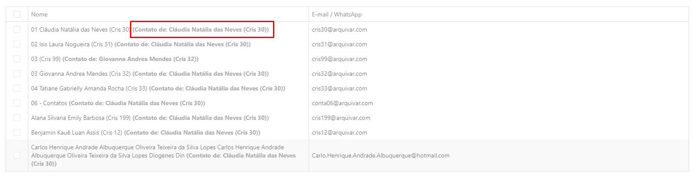
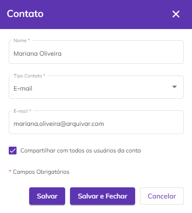
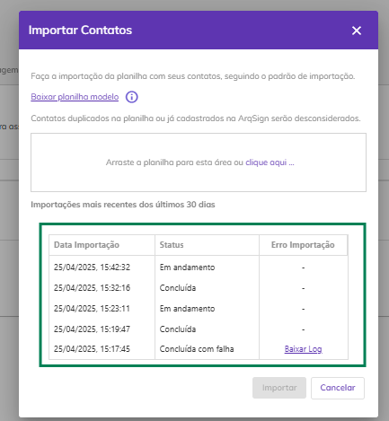
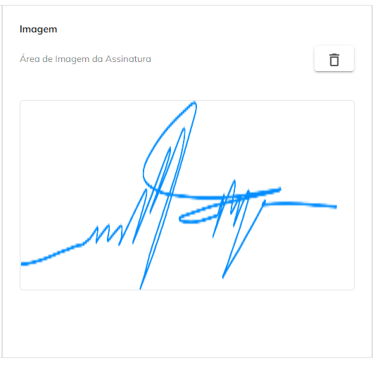
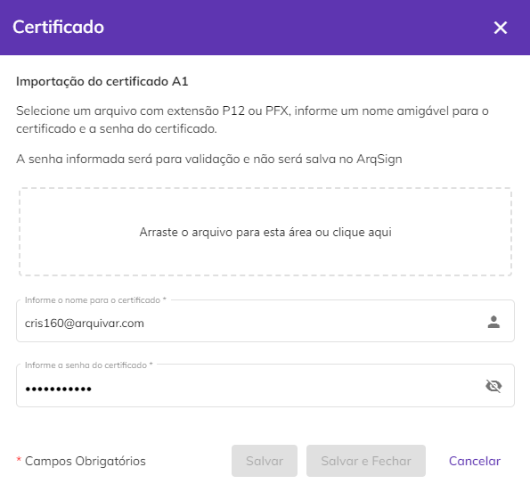
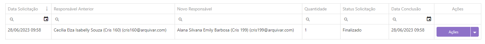
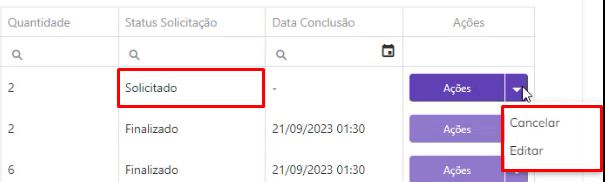

# 👤 Meu Perfil

No menu Meu Perfil são apresentadas as informações do usuário autenticado. &#x20;

<figure><figcaption>
Clique na imagem para ampliar.
</figcaption></figure>

***

## Aba Meus Dados&#x20;

Na aba Meus Dados são apresentadas as informações de cadastro do usuário. É possível editar os dados clicando-se no botão “Editar”.&#x20;

<figure><figcaption>
Clique na imagem para ampliar
</figcaption></figure>

**Foto do perfil:** Para inserir ou editar a foto de perfil, clique sobre a imagem e selecione a opção “Upload Nova Imagem”. Selecione a foto desejada e clique em “Salvar”. Para excluir a foto de perfil, basta clicar na foto e selecionar a opção “Excluir Imagem Atual”.&#x20;

<figure><figcaption>
Clique na imagem para ampliar.
</figcaption></figure>

**E-mail:** O e-mail apresentado neste campo é o mesmo utilizado no momento do cadastro da conta do usuário na plataforma e não pode ser alterado. &#x20;

Caso queira utilizar outro e-mail como "Remetente de processos", crie outro [usuário](../administracao/administracao/usuarios.md) para este outro e-mail. Na Plataforma ArqSign os usuários são ilimitados.

**Nome Completo:** Apresenta o nome completo do usuário. O nome cadastrado neste campo aparece como o remetente de processos deste usuário nos e-mails e mensagens de WhatsApp.

**Cargo:** O usuário pode informar neste campo o cargo que ocupa na empresa em que trabalha.&#x20;

**Tipo Documento de Identificação:** Neste campo o usuário deve escolher um documento de identificação que pode ser CPF, CNH, RG ou outro documento. &#x20;

**Documento de Identificação:** Neste campo o usuário deve informar o número do documento escolhido no campo “Tipo Documento de Identificação”.&#x20;

**Fuso Horário:** Neste campo o usuário pode escolher o fuso horário que deseja que a plataforma considere. Essa configuração é útil para as parametrizações que envolvam agendamentos, por exemplo.&#x20;

**Seu idioma padrão:** O usuário pode escolher o idioma padrão em que deseja que a interface da plataforma seja apresentada entre “Português – Brasil”. “Inglês – EUA” e “Espanhol – Espanha”.&#x20;

**Telefone:** Neste campo o usuário deve informar seu número de telefone de contato e clicar em “Adicionar Telefone”. Os números inseridos aqui serão apresentados logo abaixo, no campo “Telefones”.&#x20;

<figure><figcaption>
Clique na imagem para ampliar
</figcaption></figure>

***

## Aba Meus Contatos&#x20;

Na aba Meus Contatos o usuário pode cadastrar informações de destinatários para envio de processos. &#x20;

**Salvar os destinatários de um processo enviado para assinatura em minha lista de contatos:** Ao deixar marcada essa opção, sempre que o usuário enviar um processo para assinatura para um destinatário que ainda não estiver incluso na lista de contatos, as informações de contato desse destinatário serão automaticamente salvas e ele passará a fazer parte da lista.&#x20;

<figure><figcaption>
Clique na imagem para ampliar.
</figcaption></figure>

**Coluna Nome:** Nesta coluna é apresentado o nome do contato da mesma forma que foi cadastrado na lista ou como foi informado durante o envio de um processo.  Caso o contato tenha sido compartilhado com o usuário por outro membro da conta, será exibido o nome do contato seguido da informação de quem o cadastrou.&#x20;

**Coluna E-mail / WhatsApp:** Nesta coluna é apresentado o nome ou e-mail do contato informado no cadastro ou durante o envio de um processo.  &#x20;

<figure><figcaption>
Clique na imagem para ampliar.
</figcaption></figure>

**Ícone Adicionar Contato:** Para adicionar um novo contato manualmente, clique no ícone “Adicionar Contato” e informe o nome e e-mail ou número de WhatsApp do contato. Ao selecionar a opção “Compartilhar com todos os usuários da conta” o contato cadastrado será salvo na lista de contatos de todos os usuários que fazem parte da conta. Para concluir, clique em “Salvar”.&#x20;

<figure><figcaption>
Clique na imagem para ampliar.
</figcaption></figure>

**Ícone Editar Contato:** Para editar as informações de um contato, selecione o destinatário desejado marcando a caixa de seleção do lado esquerdo e clique no ícone “Editar Contato”. &#x20;

**Ícone Excluir Contato(s):** Para excluir um ou mais contatos, selecione os desejados marcando a caixa de seleção do lado esquerdo e clique no ícone “Excluir Contato(s)”.  &#x20;


<mark style="color:orange;">**Só é possível editar ou excluir contatos que tenham sido cadastrados pelo próprio usuário.**</mark> &#x20;


**Barra de Pesquisa:** É possível localizar um contato específico utilizando os filtros de e-mail ou WhatsApp para busca.&#x20;

<figure><figcaption></figcaption></figure>

#### Importação de Contatos

Além da opção de adicionar novos contatos manualmente, o sistema também permite a importação de dados por meio de um arquivo no formato CSV. Para isso:

* Acesse **Meu perfil** no menu superior.
* Clique na aba **Meus contatos**.
* Clique no ícone de **importação** exibido ao lado da lista de contatos.

<figure><figcaption></figcaption></figure>

Será aberta uma janela para realizar o upload do arquivo CSV.

<figure><figcaption></figcaption></figure>

#### **Planilha modelo**

Clique em **Baixar planilha modelo** para fazer o download de um arquivo CSV em branco.\
Este é o modelo que deve ser utilizado para a importação.

Preencha o arquivo conforme as orientações:

* **Campo "Compartilhado"**: Preencha com **1** para indicar "Sim" ou **0** para indicar "Não". Qualquer valor diferente será considerado como "0".
* **Campo "Telefone"**: Deve ser informado no padrão internacional, com **DDI + DDD + número**. Exemplo: `553198766871`.
* **Campos "E-mail" e "Telefone" preenchidos**: Caso ambos sejam preenchidos, o contato será importado duas vezes. Para importar apenas uma vez, preencha apenas um dos campos.

<figure><figcaption>
Clique na imagem para ampliar.
</figcaption></figure>

#### Importação e logs

Caso o arquivo contenha erros em algum campo, apenas os registros válidos serão importados. Será gerado um **LOG de falhas** (conforme marcação verde a seguir) que poderá ser baixado para correção do arquivo e nova tentativa de importação.

<figure><figcaption></figcaption></figure>

Registros já existentes na lista não serão duplicados.

A importação pode levar alguns segundos ou minutos, dependendo do tamanho do arquivo.\
O usuário pode fechar a tela e consultar os dados posteriormente.

***

## Mensagem Padrão

Na aba Mensagem Padrão o usuário poderá criar várias mensagens específicas para selecionar no momento de enviar um processo para assinatura.

<figure><figcaption>
Clique na imagem para ampliar.
</figcaption></figure>

**Adicionar:** Clique em Adicionar "+", para incluir uma nova mensagem.&#x20;

<figure><figcaption>
Clique na imagem para ampliar.
</figcaption></figure>

Preencha os campos apresentados na tela, atente-se ao limite de caracteres permitidos no preenchimento de cada um dos campos. Clique salvar.

<figure><figcaption>
Clique na imagem
</figcaption></figure>

A mensagem padrão criada será apresentada ao signatário conforme imagem, observe a área em destaque, nela encontra-se o texto previamente cadastrado na plataforma.

<figure><figcaption>
Clique na imagem para ampliar.
</figcaption></figure>

Quando o destinatário não definir uma mensagem padrão da sua lista a plataforma deverá considerar o padrão do sistema. Observe na área em destaque o informativo do processo recebido considerando o nome dos arquivos anexados ao processo.

Repita o processo até adicionar todas as mensagens que deseja manter como padrão.

Em caso de mensagens enviadas através do WhatsApp, a mensagem padrão terá um formato diferente, ela será exibida da seguinte forma:

<figure><figcaption>
Clique na imagem para ampliar
</figcaption></figure>


<mark style="color:blue;">A lista de mensagens padrão não pode ser compartilhada entre usuários, ou seja, cada usuário poderá visualizar e/ou selecionar apenas as mensagens criadas por ele.</mark>&#x20;


**Editar:** Selecione na lista a mensagem que deseja alterar assim o sistema habilitará a opção de Editar.

**Excluir:** Seleciona lista a mensagem que deseja excluir.

**Filtrar:** Utilize para buscar uma mensagem padrão específica na lista disponível.

***

## Aba Estilo de Assinatura&#x20;

Na aba Estilo de Assinatura o usuário deve definir representação visual de sua assinatura. O usuário pode cadastrar três tipos de Estilo de Assinatura clicando em “Editar”.&#x20;

<figure><figcaption>
Clique na imagem para ampliar.
</figcaption></figure>

**Estilo Padrão:** Neste estilo de assinatura, o usuário deve informar o nome completo e definir o estilo de fonte para o texto. Para isso deve clicar em “Estilo” e fazer a definição. Para apagar, deve clicar no ícone de lixeira.

<figure><figcaption>
Clique na imagem para ampliar.
</figcaption></figure>

**Estilo Desenho:** Para assinar com um desenho, o usuário deverá, no campo “Área de Desenho da Assinatura” desenhar sua assinatura utilizando o mouse ou o dedo caso esteja utilizando um celular ou tablet. Para corrigir, deve clicar no ícone de lixeira.

<figure><figcaption></figcaption></figure>

**Estilo Imagem:** Se desejar, o usuário pode fazer o upload da imagem que represente sua assinatura. Para apagar, deve clicar no ícone de lixeira.

<figure><figcaption></figcaption></figure>

Os estilos de assinatura para as representações visuais cadastradas aqui serão exibidos para o usuário sempre que ele for [assinar um documento](assinatura-de-documentos.md). Para concluir a inclusão de um dos Estilos de Assinatura, selecione-o e clique em “Aplicar”.

***

## Aba Certificado Digital&#x20;

Na aba Certificado Digital devem ser cadastrados os certificados digitais do tipo A1 que serão utilizados por ele para a assinatura de processos. &#x20;

Na tela principal são apresentadas as informações de todos os certificados cadastrados pelo usuário.  &#x20;

<figure><figcaption></figcaption></figure>


<mark style="color:blue;">Certificados digitais do tipo A1 armazenam a assinatura do usuário na própria máquina do usuário e possuem senha para acesso. Ao importar um certificado digital A1, ele ficará hospedado na plataforma ArqSign (nuvem), podendo ser utilizado ao realizar a assinatura em qualquer dispositivo ou computador.</mark>&#x20;


Para realizar o upload de um certificado, o usuário deve clicar no ícone “Novo”, fazer a importação do arquivo do certificado, definir um nome e informar sua senha do certificado.

<figure><figcaption>
Clique na imagem para ampliar.
</figcaption></figure>

***

## Aba Solicitações&#x20;

No menu Solicitações são apresentadas todas as solicitações de transferência de processo realizadas pelo usuário. Sempre que nos menus [Pastas](../processos/documentos/), [Caixa de Entrada](../caixa-postal/caixa-de-entrada.md) e [Enviados](../caixa-postal/enviados.md) o usuário transferir a propriedade de um processo de sua autoria para outro usuário, esta solicitação será exibida aqui. &#x20;

Aqui constarão também as solicitações de transferência de propriedade de processo devido à [inativação de usuários da conta](../administracao/administracao/usuarios.md#acoes-da-tela-usuarios).&#x20;

Se foi solicitada a transferência de apenas um processo, ela é feita instantaneamente, mas se a solicitação de transferência for em lote, pode demorar até 24 horas para ser executada. &#x20;

<figure><figcaption>
Clique na imagem para ampliar.
</figcaption></figure>

**Data Solicitação:** Nesta coluna é apresentada a data em que o usuário solicitou a transferência dos processos.&#x20;

**Responsável Anterior:** Nome do usuário que solicitou a transferência de propriedade do processo.&#x20;

**Novo Responsável:** Nomo do usuário que será o novo proprietário do processo.&#x20;

**Quantidade:** Quantidade de processos que serão transferidos para o novo responsável. &#x20;

**Status Solicitação:** O status de uma solicitação de transferência pode ser “Finalizado” (a transferência foi concluída), “Em processo” (a transferência está sendo processada e deve ocorrem em até 24 horas após o momento da solicitação) ou “Solicitado” (foi agendada uma data futura para que a transferência ocorra).&#x20;

**Data Conclusão:** Data de conclusão da transferência de propriedade.&#x20;

<figure><figcaption>
Clique na imagem para ampliar.
</figcaption></figure>

**Ações:** Se o status da solicitação for “Finalizado” ou “Em processo” não será possível executar nenhuma ação em relação a ela. Se o status ainda for “Solicitado”, será possível executar duas ações em relação à solicitação: &#x20;

* _Cancelar:_ Cancela a transferência de propriedade. &#x20;
* _Editar:_ Altera o usuário definido como novo proprietário do processo.

<figure><figcaption>
Clique na imagem para ampliar.
</figcaption></figure>

## 🗪 Perguntas e Respostas Frequentes

Como salvar contatos na plataforma ArqSign?

Você pode salvar contatos na Plataforma ArqSign de duas formas.&#x20;

_Primeira forma:_&#x20;

Ao cadastrar um destinatário, mantenha o Checkbox “Salvar este destinatário em minha lista de contatos” marcado.&#x20;

_Segunda forma:_&#x20;

1. Acesse o menu “Meu Perfil”&#x20;
2. Acesse a opção “Meus contatos”&#x20;
3. Para inserir um contato, clique no botão +, insira os dados, escolha se quer compartilhar o contato com todos os usuários da conta e clique em Salvar.&#x20;
4. Para que que todos os contatos para os quais você enviar um Processo para assinatura a partir de agora sejam automaticamente salvos, habilite o botão “Salvar os destinatários de um Processo enviado para assinatura em minha lista de contatos”.&#x20;

O Nome e o E-mail/WhatsApp do(s) destinatário(s) será(ão) salvo(s) como contato(s) do usuário na conta. Os contatos terão relação com a conta em que o usuário está logado. Ou seja, quando este usuário logar em outra conta, os contatos serão diferentes.&#x20;

_Regras:_&#x20;

Não é permitido cadastrar contato com o mesmo E-mail de um contato já cadastrado que:&#x20;

– Seja contado do usuário logado na conta, em questão.&#x20;

– Esteja relacionado a outros usuários ativos da conta logada e que estejam sendo compartilhado na conta.&#x20;

Somente é permitido cadastrar contato do tipo e-mail com um e-mail válido.&#x20;

Não é permitido cadastrar contato com mesmo Telefone de um contato já cadastrado que:&#x20;

– Seja contado do usuário logado na conta, em questão.&#x20;

– Esteja relacionado a outros usuários ativos da conta logada e que estejam sendo compartilhado na conta.&#x20;

Somente é permitido cadastrar contato do WhatsApp com um número de telefone válido.&#x20;

O campo “Compartilhar com todos os usuários da conta.” é de preenchimento opcional para o usuário informar se o contato que está sendo criado será compartilhado, ou não, com outros contatos da conta. &#x20;

Para entender melhor, [clique aqui ](https://www.youtube.com/watch?v=b73Cu1HCaWA)e assista ao vídeo explicativo.

Como compartilhar um contato salvo na plataforma ArqSign com outros usuários da conta?

No Menu “Meu perfil” opção “Meus contatos”, selecione o contato.

O sistema exibe os dados do registro no modo de visualização e os respectivos botões de ação conforme a permissão do usuário em questão.

As opções de ação exibidas poderão ser:

– Para contatos do usuário logado na conta logada: Novo, Editar e Cancelar.

– Para contatos compartilhados por outros usuários ativos na conta logada: Novo e Cancelar.

Para compartilhar um contato, escolha a opção “Editar”, marque a opção de compartilhamento e clique em Salvar.

Como excluir um contato salvo na plataforma ArqSign?

No Menu “Meu perfil” opção “Meus contatos”, selecione o contato.

O sistema exibe os dados do registro no modo de visualização e os respectivos botões de ação conforme a permissão do usuário em questão.

As opções de ação exibidas poderão ser:

– Para contatos do usuário logado na conta logada: Novo, Editar e Cancelar.

– Para contatos compartilhados por outros usuários ativos na conta logada: Novo e Cancelar.

Para excluir um contato, escolha a opção “Excluir” e confirme a exclusão.

Como editar um contato salvo na plataforma ArqSign?

No Menu “Meu perfil” opção “Meus contatos”, selecione o contato.

O sistema exibe os dados do registro no modo de visualização e os respectivos botões de ação conforme a permissão do usuário em questão.

As opções de ação exibidas poderão ser:

– Para contatos do usuário logado na conta logada: Novo, Editar e Cancelar.

– Para contatos compartilhados por outros usuários ativos na conta logada: Novo e Cancelar.

Para editar um contato, escolha a opção “Editar”, faça a edição e clique em Salvar.

Como configurar seu perfil?

1. Acesse a plataforma de Assinatura e configure a sua Assinatura Eletrônica.
2. Depois de logado, clique sobre o seu nome no canto superior direito.
3. Clique em “Meu Perfil”.

.png>)

**Aba “Meus Dados”**

1\. Certifique-se que seus dados estejam todos atualizados. Caso deseje alterar algo, clique em “Editar” para habilitar os campos de edição.

.png>)

**Aba “Meus Contatos”**

Nesta aba é possível manter uma lista com os contatos mais usados na plataforma.

1\. Nesta aba é possível “Salvar os destinatários de um documento enviado para assinatura em minha lista de contatos”.

2\. Clicando no ícone “+” é possível adicionar contatos. Ao clicar nesta opção é habilitada uma tela destinada ao cadastro de um novo contato para incluir na lista. Informados os dados do contato, clique “Salvar” ou “Salvar e Fechar”.

.png>)

**Ícones – Aba “Meus Contatos”**

.png>)

**Importação - Aba "Meus Contatos"**

Além da opção de adicionar novos contatos manualmente, o sistema também permite a importação de dados por meio de um arquivo no formato CSV. .png>)

1. Ao clicar no ícone de importação, clique em **Baixar planilha modelo** para fazer o download de um arquivo CSV em branco.&#x20;
2. Este é o modelo que deve ser utilizado para a importação.
3. Preencha o arquivo conforme as orientações:
   * **Campo "Compartilhado"**: Preencha com **1** para indicar "Sim" ou **0** para indicar "Não". Qualquer valor diferente será considerado como "0".
   * **Campo "Telefone"**: Deve ser informado no padrão internacional, com **DDI + DDD + número**. Exemplo: `553198766871`.
   * **Campos "E-mail" e "Telefone" preenchidos**: Caso ambos sejam preenchidos, o contato será importado duas vezes. Para importar apenas uma vez, preencha apenas um dos campos.

**Aba “Estilo de Assinatura”**

1\. Nesta aba realize o cadastro das assinaturas que usará nos processos de assinatura de documentos. Clique em “Editar” para habilitar os campos.

2\. Passe pelas três opções existentes. Logo após concluir, clique em “Salvar”.

.png>)

**Aba “Certificado Digital”**

1\. Nesta aba é possível carregar certificados digitais na nuvem, armazenando na Plataforma ArqSign. Estes certificados armazenados serão listados no momento em que o usuário logado estiver assinando um documento com o tipo de assinatura Certificado Digital (ICP).

.png>)

**Aba “Solicitações”**

1\. Na aba Solicitações o usuário pode consultar as solicitações de transferência de proprietário do Processo. Por exemplo, se na caixa de entrada o usuário alterar o proprietário do Processo, a movimentação ficará registrada na aba “Solicitações”.

.png>)

Como alterar o Nome do Remetente/Usuário?

Depois que um usuário é criado, ele mesmo pode alterar os dados abaixo do seu perfil:

.png>)

Essa alteração vai refletir nas notificações de solicitação de assinatura que o usuário envia.

.png>)

Os passos para alteração são:&#x20;

1. Acesse no canto superior direito da plataforma o menu com o seu nome de usuário atual;&#x20;
2. Clique em “Meu Perfil”;&#x20;
3. Na aba “Meus dados” clique em “Editar”;&#x20;
4. Insira o nome desejado no campo "Nome completo" - O nome inserido neste campo será exibido como remetente no envio dos documentos. A plataforma utilizará apenas o primeiro e o último nome. Se for necessário exibir o nome completo como remetente do e-mail, conecte os nomes utilizando um _underline_ ( \_ )
5. Clique em “Salvar”.&#x20;

Como consultar o andamento das solicitações de transferência de Processos?

Para consultar o andamento das solicitações de transferência de Processos, siga os seguintes passos:&#x20;

Acesse o Menu “Meu perfil” -> “Solicitações”;&#x20;

A Plataforma lista as solicitações de transferência de Processos do usuário logado ordenadas pela data da solicitação decrescente (solicitação mais recente no topo).&#x20;

Através do botão de “Ações” você poderá visualizar solicitações com status “Solicitado” ou “Erro”, “Cancelar” e “Editar” a solicitação de transferência de Processos.&#x20;

Como configurar a representação visual de sua assinatura?

No canto superior direito clique sobre sua foto ou espaço para foto;

Clique em Meu perfil;

Clique em Estilo assinatura;

Clique em editar;

Configure a representação visual de sua assinatura para os estilos:

* Padrão – Digitação de sua assinatura;
* Desenho – Desenho de sua assinatura;
* Imagem – Upload de imagem com sua assinatura.

Clique em Salvar.

Sempre que você for assinar um Processo os estilos salvos serão exibidos para sua escolha.

[Clique aqui](https://youtu.be/5PogsaN_qmk) e assista ao vídeo com o passo a passo.

Como importar/fazer upload do meu Certificado ICP-Brasil Tipo A1 para plataforma?

1. Acesse a sua conta na Plataforma ArqSign.
2. Clique no Menu Perfil que fica no canto superior direito da Plataforma.
3. Clique na aba Certificado digital.
4. Clique no botão +
5. Escolha o arquivo do Certificado ICP-Brasil tipo A1 com extensão P12 ou PFX.
6. Insira um nome de identificação para o Certificado.
7. Insira a senha do Certificado.
8. Quando você for assinar um documento com um Certificado ICP-Brasil, basta escolher esse certificado e colocar sua a senha.

