# ➕ Novo Documento

Na tela Novo Documento o usuário poderá cadastrar um ou mais documentos que será(ão) enviado(s) a signatários para assinatura.

## Etapa 1: Adicionar Documentos e Destinatários

### A. Adicionar Documentos (Upload de arquivos)

Para incluir os documentos que deverão ser assinados, arraste os arquivos desejados até o campo de inclusão dos documentos ou selecione-os para upload a partir de um diretório do seu dispositivo.&#x20;

<figure>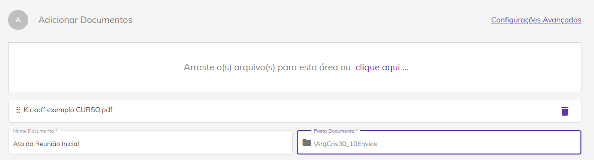<figcaption>
Clique na imagem para ampliar.
</figcaption></figure>

Podem ser incluídos mais de um arquivo no mesmo processo de assinatura. Neste caso, a opção **"Agrupar os arquivos em um único documento"** ficará disponível e poderá ser marcada ou desmarcada.&#x20;

Quando esse campo estiver **marcado**, a ArqSign exibe os **arquivos agrupados** na área de listagem, onde é permitido alterar a ordem dos documentos, clicando e arrastando-os para a posição desejada. Neste caso não é permitido alterar o nome de cada um dos arquivos, apenas o nome do processo.

<figure><figcaption>
Clique na imagem para ampliar.
</figcaption></figure>

Para remover um arquivo, clique no ícone da lixeira disponível para cada um dos arquivos na tela.

Quando este campo estiver **desmarcado**, a ArqSign exibe os **arquivos desagrupados** na área de listagem, permitindo que sejam alterados a ordem e o nome dos arquivos.&#x20;

<figure><figcaption>
Clique na imagem para ampliar.
</figcaption></figure>


<mark style="color:orange;">**São permitidos arquivos das seguintes extensões:**</mark>

<mark style="color:orange;">**Documento: .doc, .docx, .pdf, .txt.**</mark>

<mark style="color:orange;">**Imagem: .jpg, .jpeg, .png, .tif, .tiff**</mark>&#x20;

<mark style="color:orange;">**Apresentação: .ppt, .pptx**</mark>&#x20;

<mark style="color:orange;">**Planilha: .csv, .xls, .xlsx**</mark>

<mark style="color:orange;">**Poderão ser enviados até 50 arquivos por processo, considerando as seguintes condições:**</mark>

> <mark style="color:orange;">**Cada arquivo pode ter até 35Mb ou até 2000 páginas, não podendo ultrapassar 100Mb no total.**</mark>
>
> <mark style="color:orange;">**Exemplos:**</mark>
>
> > * <mark style="color:orange;">**Um usuário que adicionar dois arquivos de 35Mb e um arquivo de 30Mb, terá consumido a capacidade máxima do limite de "peso" de arquivos e não poderá adicionar mais documentos.**</mark>&#x20;
> > * <mark style="color:orange;">**Um usuário que adicionar 50 arquivos de 1Mb, embora tenha consumido apenas metade do limite de "peso", consumiu todo o limite que quantidade e não poderá adicionar mais documentos.**</mark>


<figure><figcaption>
Clique na imagem para ampliar.
</figcaption></figure>

No campo “**Nome do Processo de Assinatura**”, é possível editar o nome do processo que contempla os arquivos agrupados, altere conforme necessidade.


Ao editar o nome, não poderão ser utilizados caracteres especiais <mark style="background-color:blue;">**( @ : \* " < > | / ? \ )**</mark>. Caso seja utilizado, a plataforma não seguirá o andamento do processo.


No campo “**Pasta Documento**” selecione a pasta na qual o documento será hospedado. As pastas nas quais os documentos poderão ser armazenados deverão ser criadas no menu [Diretórios > Documentos.](../diretorios/documentos/) Por padrão uma pasta com o nome do usuário é criada e deve ser selecionada caso não exista nenhuma outra.

<figure>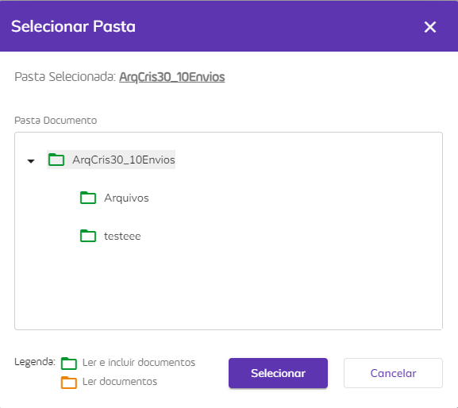<figcaption>
Clique na imagem para ampliar.
</figcaption></figure>

Por último, para agendar a renovação dos documentos  que estão sendo cadastrados de forma automática, selecione o _checkbox_ do campo “**Agendar renovação \_\_\_ meses após a conclusão das assinaturas**” informando a quantidade de meses em que deseja ser avisado sobre a renovação do processo. Assim que as assinaturas do primeiro envio forem concluídas, o sistema passará a contar o prazo determinado e quando o período de renovação for atingido, o responsável pelos  documentos  (remetente) receberá uma notificação informando que os  documentos do processo estão aptos a serem renovados .

<figure><figcaption>
Clique na imagem para ampliar.
</figcaption></figure>

### **Configurações Avançadas**

As configurações avançadas são configurações relativas ao documento. Pode-se ajustá-las tanto para todos os documentos, ou seja, deixar um padrão configurado para todas as vezes em que for necessário solicitar assinaturas, ou configurar opções relativas a apenas um documento pontualmente. Para acessar a lista completa das opções que podem ser configuradas nos documentos, acesse o menu [Administração > Conta > Configurações](../administracao/administracao/conta.md#aba-configuracoes). Conheça a seguir todas as opções gerais configuráveis:

* **Tempo para expiração do documento após o envio:** Neste campo o usuário deve informar o prazo (em dias) de expiração do documento, ou seja, o limite para que os destinatários o assinem.


<mark style="color:orange;">Caso esse campo não seja alterado, será preenchido com o valor padrão. O valor padrão do sistema é de 120 dias, mas esse valor pode ser alterado no menu</mark> [<mark style="color:orange;">**Administração > Conta > Configurações.**</mark>](../administracao/administracao/conta.md#aba-configuracoes)


* **Aviso antes da expiração:** Neste campo deve ser informado o prazo (em dias) em que o sistema deverá enviar aos destinatários que ainda não assinaram um aviso sobre a expiração do documento.&#x20;
* **Ativar lembretes:** Ao ativar essa opção o sistema enviará aos destinatários lembretes para que realizem a assinatura do documento. Esses lembretes serão enviados apenas para os signatários que ainda não assinaram o documento. Por padrão essa opção estará marcada.
* **Enviar lembretes aos destinatários a cada:** Neste campo deve ser informado de quanto em quanto tempo (em dias) o sistema deverá enviar os lembretes de assinatura aos destinatários que ainda não assinaram.
* **Obrigar o signatário a ler os documentos antes de assinar:** Essa configuração obriga a leitura dos documentos do processo.  Esta informação virá marcada ou desmarcada, conforme a configuração da conta.
* **Gerar QRCode de acesso do documento no Registro de Assinaturas:** Ao ativar essa opção será gerado um QRCode no documento de registro de assinaturas. Por padrão essa opção estará desmarcada.

Ao direcionar o _mouse_ sobre a opção de "Configurações avançadas", é apresentado um _Tooltip_ com uma prévia das configurações realizadas.

<figure><figcaption>
Clique na imagem para ampliar.
</figcaption></figure>

Já para editar pontualmente as configurações de um determinado arquivo, clique em Configurações Avançadas, conforme imagem abaixo.&#x20;

<figure><figcaption>
Clique na imagem para ampliar.
</figcaption></figure>

<figure><figcaption>
Clique na imagem para ampliar.
</figcaption></figure>

### B. Destinatários

No campo “Destinatários” preencha os campos relativos aos signatários que receberão o documento e participarão do processo de assinatura. É preciso realizar as configurações descritas a seguir para cada um dos destinatários.

<figure><figcaption>
Clique na imagem para ampliar.
</figcaption></figure>

É possível adicionar um destinatário salvo a partir lista de contatos salva, clicando no ícone “**Adicionar destinatário a partir dos meus contatos**”.&#x20;


<mark style="color:blue;">**Importante**</mark><mark style="color:blue;">: a lista de contatos deve ser criada anteriormente no menu</mark> [<mark style="color:blue;">Meu Perfil.</mark>](meu-perfil.md)


<figure>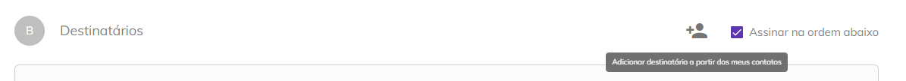<figcaption>
Clique na imagem para ampliar.
</figcaption></figure>

Ao clicar neste botão é exibida a lista. Para adicionar os destinatários desejados, selecione-os clicando no _checkbox_ ao lado do nome e clique em “Adicionar Destinatários”.

<figure>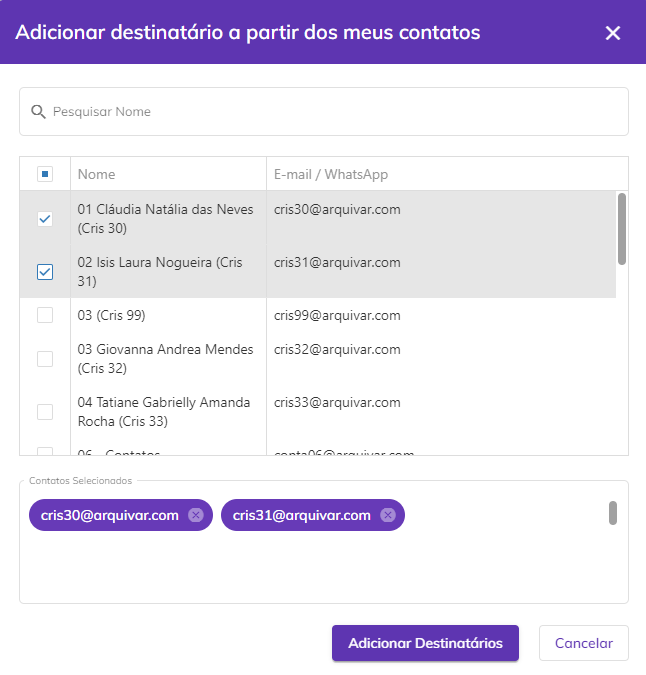<figcaption>
Clique na imagem para ampliar.
</figcaption></figure>

Ao marcar o _checkbox_ “**Assinar na ordem abaixo**” o documento será enviado aos destinatários na ordem definida no campo “**Ordem**” que aparecerá na parte superior de “Dados do Destinatário”. Ao definir essa opção um usuário só receberá o documento quando o anterior concluir sua ação de assinatura.&#x20;


<mark style="color:orange;">**Caso o usuário anterior tenha tido apenas ação de visualização, o próximo signatário receberá o documento quando o último signatário anterior a ele concluir a assinatura.**</mark>&#x20;


<figure>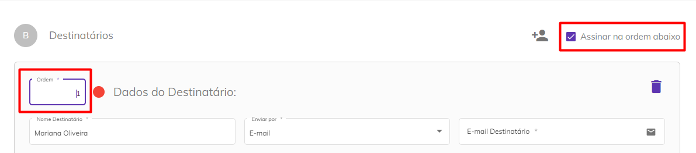<figcaption>
Clique na imagem para ampliar.
</figcaption></figure>

**Nome Destinatário:** Informe o nome do destinatário.

**Enviar por:** Selecione se o documento será enviado por e-mail ou Whatsapp para o destinatário.


<mark style="color:orange;">**A opção de envio por Whatsapp só será exibida se a conta do usuário tiver créditos de mensagens de WhatsApp.**</mark>


Dependendo da opção escolhida anteriormente, informe o e-mail ou número de telefone do destinatário para envio do documento.

<figure>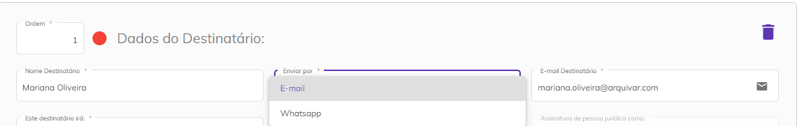<figcaption>
Clique na imagem para ampliar.
</figcaption></figure>

**Este destinatário irá:** Informe se o destinatário irá assinar o documento online como Pessoa Física, Jurídica ou ambas, ou se irá somente receber uma cópia do documento no fim do processo de assinaturas.

<figure>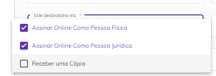<figcaption>
Clique na imagem para ampliar.
</figcaption></figure>

Caso tenha sido determinado que o destinatário irá assinar como pessoa física ou jurídica é preciso definir seu papel de signatário no processo. Selecione entre um ou mais papéis listados ou adicione um “Papel do Signatário” personalizado clicando em “Adicionar papel”.

<figure><figcaption></figcaption></figure>

Os papéis do signatário apresentados aqui são anteriormente criados no menu [Administração > Conta > Aba Configurações > Papel do Signatário](../administracao/administracao/conta.md#papel-do-signatario). Por padrão a plataforma apresenta os papéis “Contratada”, “Contratante”, “Fiador” e “Locatário”, mas é possível editar ou excluir esses papéis, além de criar outros se necessário.

<figure><figcaption></figcaption></figure>

**Tipo de Assinatura:** Selecione se o destinatário deverá utilizar assinatura eletrônica ou um certificado digital para assinar o documento.

<figure>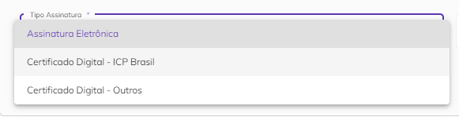<figcaption>
Clique na imagem para ampliar.
</figcaption></figure>


<mark style="color:blue;">**ASSINATURA ELETRÔNICA X ASSINATURA DIGITAL (ICP Brasil e ICP Outros)**</mark>

<mark style="color:blue;">**Assinatura eletrônica**</mark> <mark style="color:blue;"></mark><mark style="color:blue;">é aquela que não precisa de um certificado digital. É mais utilizada para assinar contratos e documentos entre entes privados (B2B, B2C).</mark>&#x20;

<mark style="color:blue;">**Assinatura digital**</mark> <mark style="color:blue;"></mark><mark style="color:blue;">é aquela que precisa de um certificado digital. É mais utilizada para emissão de notas fiscais e para transações com o governo.</mark>&#x20;

<mark style="color:blue;">Na Plataforma Arqsign, ao configurar um fluxo de assinaturas você pode determinar qual tipo de assinatura deverá ser executada por destinatário escolhendo entre:</mark>&#x20;

<mark style="color:blue;">**a) Assinatura eletrônica**</mark> <mark style="color:blue;"></mark><mark style="color:blue;">(a ArqSign produz assinaturas eletrônicas avançadas com validade jurídica de acordo com MP 2.200-2 de 24/08/2001 e Lei 14.063 de 23/11/2020). Sempre que um signatário assina um documento de forma eletrônica a Arqsign aplica um certificado digital próprio da plataforma, capturando o Hash (identificação única) do arquivo, verificando a integridade do arquivo e anexando ao certificado a identificação do signatário.</mark>  &#x20;

<mark style="color:blue;">**b) Assinatura digital – ICP-Brasil ou Outros**</mark> <mark style="color:blue;"></mark><mark style="color:blue;">(A ArqSign produz assinaturas digitais qualificadas de acordo com MP 2.200-2 de 24/08/2001 e Lei 14.063 de 23/11/2020). Quando o usuário já possui um certificado digital e deseja utilizá-lo para realizar a assinatura por meio da ArqSign, este certificado é utilizado para verificar a integridade da assinatura e identificar o usuário como signatário no documento.</mark>&#x20;


**Representação Visual Assinatura:** Selecione qual deve ser a representação visual utilizada pelo destinatário no momento da assinatura. Ao optar pela primeira opção (Padrão, Desenho ou Imagem), ele poderá utilizar qualquer uma das representação, no caso das demais opções a utilização ficará restrita a representação selecionada neste momento.

<figure><figcaption>
Clique na imagem para ampliar.
</figcaption></figure>

Ao marcar a opção **“Salvar este destinatário em minha lista de contatos”** os dados informados do destinatário serão salvos automaticamente na lista de contatos do usuário.

<figure>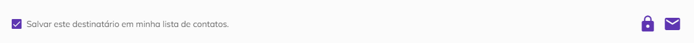<figcaption>
Clique na imagem para ampliar.
</figcaption></figure>

**Ícone “Código de Segurança”:** Ao clicar neste ícone será criado um código numérico que será enviado ao destinatário para que ele consiga acessar o documento. O código pode ser gerado automaticamente pelo sistema ou informado manualmente pelo usuário.

<figure>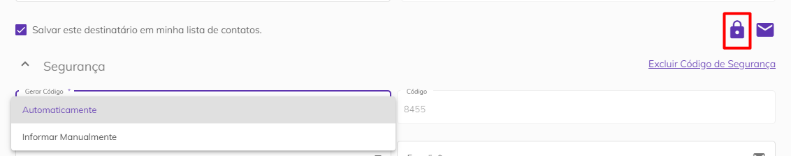<figcaption>
Clique na imagem para ampliar.
</figcaption></figure>

Depois de gerar o código escolha se ele será enviado por e-mail, Whatsapp ou SMS e informe o e-mail ou telefone para envio. Também é possível não enviar o código, deixando a cargo do usuário informá-lo ao destinatário da forma que preferir. Para excluir o código criado, basta clicar em “Excluir Código de Segurança”.

<figure>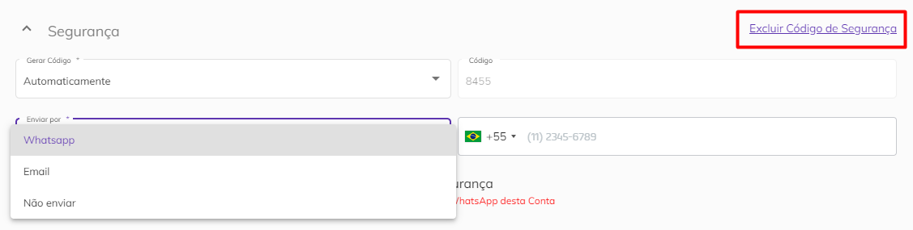<figcaption>
Clique na imagem para ampliar.
</figcaption></figure>

Se selecionada a opção de envio por Whatsapp é possível permitir que o destinatário solicite o reenvio do código, marcando a _checkbox_ “**Permitir que este destinatário possa solicitar reenvio do código de segurança**”.


<mark style="color:orange;">**Cada reenvio do código de segurança solicitado pelo destinatário irá consumir um crédito de WhatsApp da conta do usuário que está enviando o documento.**</mark>


<figure>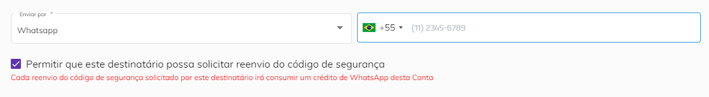<figcaption>
Clique na imagem para ampliar.
</figcaption></figure>

**Ícone Mensagem Privada:** Ao clicar neste ícone será possível inserir uma mensagem que será enviada ao destinatário junto com o documento. Para isso, preencha os campos “Assunto” e “Mensagem”. Caso deseje excluir a mensagem, clique em “**Excluir Mensagem Privada**”.

<figure>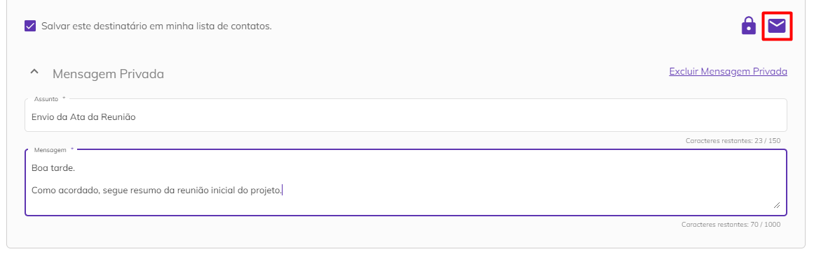<figcaption>
Clique na imagem para ampliar.
</figcaption></figure>

Os itens **Código de** **Segurança** e de **Mensagem privada** são expansíveis e quando recolhidos contam com o ícone de edição, sinalizando ao usuário que podem ser alterados.&#x20;

<figure><figcaption>
Clique na imagem para ampliar.
</figcaption></figure>

Para inserir outros destinatários clique no botão “Adicionar Novo Destinatário”. Se desejar incluir a si mesmo como destinatário, clique em “**Me adicionar como destinatário**”. Os campos de nome e e-mail serão preenchidos automaticamente com as informações cadastradas no seu perfil de usuário e o campo “Enviar por” será preenchido com a opção “E-mail”.

<figure>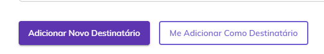<figcaption>
Clique na imagem para ampliar.
</figcaption></figure>

### C. Mensagem Padrão

No campo “Mensagem Padrão” pode-se manter a mensagem padrão criada pela plataforma ou selecionar na lista sua mensagem padrão, criada no ["Meu Perfil"](meu-perfil.md#mensagem-padrao), que será enviada a todos os destinatários, preenchendo-se os campos “Assunto” e “Mensagem”.


<mark style="color:orange;">**No caso de destinatários que tiverem os campos de Mensagem Personalizada preenchidos será enviada a mensagem informada em substituição à mensagem padrão.**</mark>


<figure>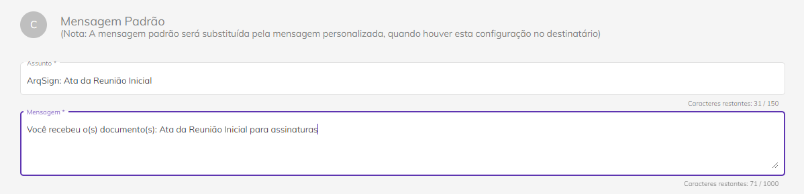<figcaption>
Clique na imagem para ampliar.
</figcaption></figure>

Depois de concluir essas configurações, clique em “Avançar” para seguir para a próxima etapa, “Concluir Mais Tarde” para salvar o fluxo como rascunho ou “Descartar” para cancelar o cadastro.

<figure>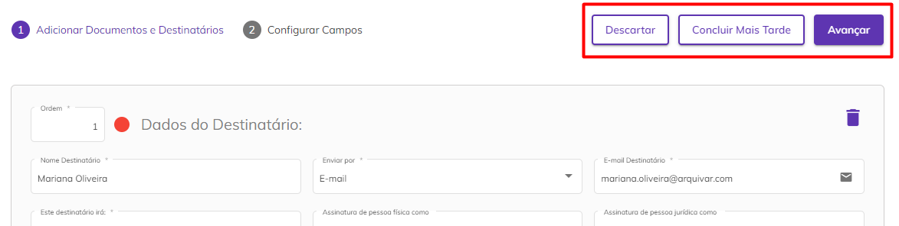<figcaption>
Clique na imagem para ampliar.
</figcaption></figure>

***

## Etapa 2: Configurar Campos

Na próxima etapa serão exibidos os documentos que foram inseridos na etapa anterior em formato PDF e deverão ser configurados os campos de assinatura, informações de preenchimento e anexos.

#### Processo com um documento ou mais documentos agrupados

Quando o processo possui um ou mais documentos **agrupados**, o sistema exibe o nome do processo.

<figure><figcaption>
Clique na imagem para ampliar.
</figcaption></figure>

#### Processo com mais de um documento não agrupados

Quando o processo possui um ou mais documentos **não agrupados**, o sistema exibe:

* Na parte superior da tela, o **nome do documento** que está sendo exibido;
* No canto esquerdo da tela, a **lista de documentos do processo** ordenados conforme a configuração de ordem definida na [Etapa 01](novo-documento.md#etapa-1-adicionar-documentos-e-destinatarios), sinalizando se o documento está sendo visualizado ou não. Ao clicar sobre o documento, o sistema o exibirá na tela.&#x20;

<figure><figcaption>
Clique na imagem para ampliar.
</figcaption></figure>

### Campos de Assinatura

#### Representação da assinatura

Ao clicar no documento, o sistema exibe a modal de configuração da representação visual listando os signatários pendentes de configuração da representação da assinatura ordenados alfabeticamente ou conforme a ordem de assinatura definida na [etapa 01.](novo-documento.md#etapa-1-adicionar-documentos-e-destinatarios)

Para cada documento listado, o sistema exibe a(s) respectiva(s) representação(ões) para cada signatário(s) conforme o tipo de assinatura definida na [etapa 01](novo-documento.md#etapa-1-adicionar-documentos-e-destinatarios) (campo "Este Destinatário irá"), possibilitando ao usuário configurar a representação para cada signatário(s) com ação de assinar online em cada documento.

<figure><figcaption>
Clique na imagem para ampliar.
</figcaption></figure>

Ao incluir a configuração da representação visual, a aplicação exibe a representação no documento na posição que o usuário inseriu, possibilitando o ajustar o tamanho e/ou excluir a representação da assinatura que está inserida no documento.



Se na [Etapa 1](novo-documento.md#b.-destinatarios) tiver sido definido que o destinatário irá assinar como pessoa física e jurídica, serão exibidos dois quadros com o nome do destinatário na mesma cor.  Os quadros de cada um dos destinatários serão exibidos em cores diferentes para sinalizar visualmente onde cada um deverá assinar.&#x20;

#### Modal de representação visual de assinatura para processo com um documento ou mais  documentos agrupados

Quando o processo possui um documento ou mais de um documento agrupado, o sistema lista as representações dos destinatários, conforme o tipo de pessoa (PF e/ou PJ) exibindo uma barra de rolagem na modal.

<figure><figcaption>
Clique na imagem para ampliar.
</figcaption></figure>

#### Modal de representação visual de assinatura para processo com mais de um documento não agrupados

Quando o processo possui **mais de um documento**, o sistema exibe um **"carrossel"**, permitindo a navegação entre os documentos e os signatários.

<figure><figcaption>
Clique na imagem para ampliar.
</figcaption></figure>

<figure><figcaption>
Clique na imagem para ampliar.
</figcaption></figure>

Ao concluir a configuração da assinatura de todos os signatários no documento, o sistema sinaliza o documento como configuração da representação concluída, marcando o _checked_ para verde no canto esquerdo da tela.

Ao concluir a configuração da assinatura do signatário em todos os documentos, o sistema sinaliza este signatário como configuração da representação concluída, marcando o _checked_ para verde na frente do nome de cada signatário.

<figure><figcaption>
Clique na imagem para ampliar.
</figcaption></figure>

### Dados de assinatura e anexos

No canto direito superior da tela, é exibido o campo **"Configurações para"**, onde é apresentado o nome do destinatário que está selecionado para configuração. Cada destinatário possui uma cor atribuída automaticamente pela plataforma, e ao lado desse ícone, aparece um símbolo de "_checked"_, que muda de cor, aparece em verde, para sinalizar que as **Informações Complementares de Assinatura** foram incluídas ou permanece em cinza quando não incluídas.&#x20;

<figure><figcaption>
Clique na imagem para ampliar.
</figcaption></figure>

Se não houver ordem de assinaturas configurada na [Etapa 1](novo-documento.md#etapa-1-adicionar-documentos-e-destinatarios), o item "**Configurações para**" mostra a lista dos signatários ordenados alfabeticamente. Já se houver ordem de assinaturas configurada, a lista dos signatários estará agrupada por ordem de assinaturas e ordenados alfabeticamente.&#x20;

<figure><figcaption>
Clique na imagem para ampliar.
</figcaption></figure>

### **Envio Simplificado**

Caso o usuário não deseje inserir as assinaturas manualmente no documento, pode-se selecionar a opção **Envio Simplificado.**

<figure><figcaption>
Clique na imagem para ampliar.
</figcaption></figure>

O **Envio Simplificado** permite ao usuário que envie o processo sem o ajuste manual da posição da assinatura, desta forma a plataforma insere uma página de forma automática ao final do documento,  com as representações das assinaturas, considerando as configurações definidas anteriormente na inserção dos documentos e as seguintes regras:&#x20;


* **Se o campo "Agrupar os arquivos em único documento" da** [**Etapa 1**](novo-documento.md#etapa-1-adicionar-documentos-e-destinatarios) **estiver desmarcado:**&#x20;

A plataforma **insere uma página ao final de cada documento** com a posição da assinatura de cada destinatário com ação de Assinar Online, conforme o tipo de assinatura de cada um (Pessoa Física e/ou Pessoa Jurídica) configurada no campo "Este Destinatário irá".

* **Se o campo "Agrupar os arquivos em único documento" da** [**Etapa 1** ](novo-documento.md#etapa-1-adicionar-documentos-e-destinatarios)**estiver marcado:**&#x20;

A plataforma **insere uma página ao final do documento** com a posição da assinatura de cada destinatário com ação de Assinar Online, conforme o tipo de assinatura de cada um (Pessoa Física e/ou Pessoa Jurídica) configurada no campo "Este Destinatário irá".



<mark style="color:red;">Caso o usuário tenha optado anteriormente pela opção de</mark> <mark style="color:red;"></mark><mark style="color:red;">**configurar a assinatura manualmente**</mark> <mark style="color:red;"></mark><mark style="color:red;">em algum documento do processo, o sistema exibe uma mensagem de confirmação de envio simplificado. Ao confirmar, os campos inseridos manualmente serão excluídos e todas as assinaturas serão posicionadas na página automática gerada pela plataforma.</mark>&#x20;


<figure><figcaption>
Clique na imagem para ampliar.
</figcaption></figure>

### Informações Complementares de Assinatura

O campo "**Configurações para**" exibe o nome dos destinatários selecionados para configuração com ícone da cor definido pela plataforma para o destinatário, sinalizando se a configuração dos dados complementares e/ou anexos foi incluída ou não.&#x20;

<figure><figcaption>
Clique na imagem para ampliar.
</figcaption></figure>

<figure><figcaption>
Clique na imagem para ampliar.
</figcaption></figure>


<mark style="color:blue;">• Se</mark> <mark style="color:blue;"></mark><mark style="color:blue;">**não houver**</mark> <mark style="color:blue;"></mark><mark style="color:blue;">ordem de assinaturas configurada, a plataforma lista os signatários ordenados alfabeticamente.</mark>

<mark style="color:blue;">• Se</mark> <mark style="color:blue;"></mark><mark style="color:blue;">**houver**</mark> <mark style="color:blue;"></mark><mark style="color:blue;">ordem de assinaturas configurada, a plataforma lista os signatários agrupados por ordem de assinaturas e alfabeticamente.</mark>


Dependendo do tipo de assinatura definido para o destinatário na [Etapa 1](novo-documento.md#b.-destinatarios) serão exibidos os campos “**Informações Complementares de Assinatura**”. Esses campos só serão exibidos se na [Etapa 1 no campo “Tipo de Assinatura”](novo-documento.md#b.-destinatarios) tiver sido escolhida a opção “Assinatura Eletrônica”.

Se a assinatura for como Pessoa Física, é possível exigir do destinatário dados como nome e documento, marcando a opção “Nome da Pessoa Física” preenchimento obrigatório e selecionando um dos documentos da lista “Documento da Pessoa Física”.&#x20;

<figure><figcaption>
Clique na imagem para ampliar.
</figcaption></figure>

Para exigir um documento selecione a opção desejada entre CPF, CNH, RG ou outros.&#x20;

<figure><figcaption>
Clique na imagem para ampliar.
</figcaption></figure>

Após selecionar o tipo de documento que será exigido do destinatário na assinatura, informe o número do documento. No momento da assinatura, o destinatário deverá informar exatamente o número definido neste momento se selecionada a opção **"Preenchimento Obrigatório".** Ao selecionar a opção **"Usar o valor informado no campo para validar o CPF preenchido pelo signatário durante a assinatura",** automaticamente o campo será de preenchimento obrigatório e será validado pela plataforma para prosseguimento da assinatura.

No momento da assinatura, se o destinatário utilizar um número diferente do informado pelo remetente na configuração, será apresentado o seguinte erro na tela:

<figure><figcaption>
Clique na imagem para ampliar.
</figcaption></figure>


<mark style="color:orange;">Processos configurados com essa validação de preenchimento de campo não são listados para</mark> <mark style="color:orange;"></mark><mark style="color:orange;">**"Assinatura em Lote".**</mark> <mark style="color:orange;"></mark><mark style="color:orange;">Os documentos destes processos estarão disponíveis para assinatura na</mark> <mark style="color:orange;"></mark><mark style="color:orange;">**"Caixa de Entrada".**</mark>


Se selecionada essa última opção "outros" será preciso informar o nome do documento, se é do tipo texto ou numérico e a quantidade de caracteres. &#x20;

<figure>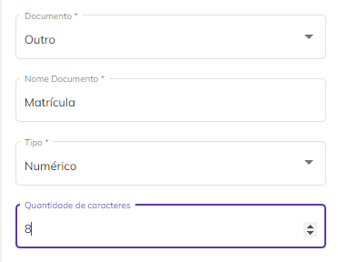<figcaption>
Clique na imagem para ampliar.
</figcaption></figure>

Se a assinatura for como Pessoa Jurídica, é possível exigir do destinatário a razão social da empresa e algum documento, marcando as opções “Razão Social da Pessoa Jurídica” e “Documento da Pessoa Jurídica” como de preenchimento obrigatório.

<figure><figcaption>
Clique na imagem para ampliar.
</figcaption></figure>

Após selecionar o tipo de documento que será exigido do destinatário na assinatura, informe o número do documento. No momento da assinatura, o destinatário deverá informar exatamente o número definido neste momento se selecionada a opção **"Preenchimento Obrigatório".** Ao selecionar a opção **"Usar o valor informado no campo para validar o CNPJ preenchido pelo signatário durante a assinatura",** automaticamente o campo será de preenchimento obrigatório e será validado pela plataforma para prosseguimento da assinatura.

No momento da assinatura, se o destinatário utilizar um número diferente do informado pelo remetente na configuração, será apresentado o seguinte erro na tela:

<figure><figcaption>
Clique na imagem para ampliar.
</figcaption></figure>


<mark style="color:orange;">Processos configurados com essa validação de preenchimento de campo não são listados para</mark> <mark style="color:orange;"></mark><mark style="color:orange;">**"Assinatura em Lote".**</mark> <mark style="color:orange;"></mark><mark style="color:orange;">Os documentos destes processos estarão disponíveis para assinatura na</mark> <mark style="color:orange;"></mark><mark style="color:orange;">**"Caixa de Entrada".**</mark>


Para exigir um documento selecione a opção desejada entre CNPJ ou outros. Se selecionada essa a opção "outros", será preciso informar o nome do documento, se é do tipo texto ou numérico e a quantidade de caracteres. &#x20;

<figure><figcaption></figcaption></figure>

### Anexos

No campo “Anexos” do lado esquerdo da tela serão exibidas configurações que permitirão aos destinatários anexar outros arquivos ao documento no momento da assinatura. Para isso, marque a opção “**Solicitar anexar documentos**”.

Informe o nome do anexo que será solicitado e defina se será de preenchimento obrigatório e se todos os destinatários participantes do fluxo de assinatura poderão visualizar o arquivo anexado pelo destinatário.

É possível solicitar mais de um anexo, clicando no ícone **“Adicionar”.**

<figure>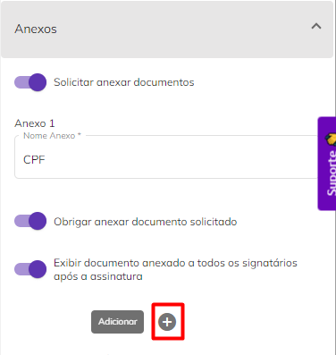<figcaption>
Clique na imagem para ampliar.
</figcaption></figure>

Clicando em “Descartar”, o fluxo será excluído. Clicando em “Concluir Mais Tarde” o fluxo será salvo na pasta de Rascunhos. Para editar o documento ou os destinatários, clique em “Voltar Etapa Anterior”. Finalizada a configuração da Etapa 2, clique em “Enviar” para enviar o documento para assinatura dos destinatários.

<figure>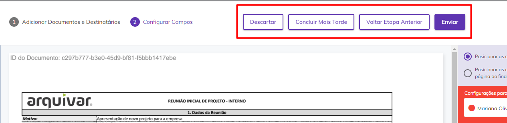<figcaption>
Clique na imagem para ampliar.
</figcaption></figure>
