# ➕ Novo Processo

Na tela Novo Processo o usuário poderá cadastrar um ou mais documentos que será(ão) enviado(s) a signatários para assinatura.

## Etapa 1: Adicionar Documentos e Destinatários

### A. Adicionar Documentos (Upload de arquivos)

Para incluir os documentos que deverão ser assinados, arraste os arquivos desejados até o campo de inclusão dos documentos ou selecione-os para upload a partir de um diretório do seu dispositivo.&#x20;

<figure><figcaption>
Clique na imagem para ampliar.
</figcaption></figure>

Podem ser incluídos mais de um arquivo no mesmo processo de assinatura. Neste caso, a opção **"Agrupar os arquivos em um único documento"** ficará disponível e poderá ser marcada ou desmarcada.&#x20;

Quando esse campo estiver **marcado**, a ArqSign exibe os **arquivos agrupados** na área de listagem, onde é permitido alterar a ordem dos documentos, clicando e arrastando-os para a posição desejada. Neste caso não é permitido alterar o nome de cada um dos arquivos, apenas o nome do processo.

<figure><figcaption>
Clique na imagem para ampliar.
</figcaption></figure>

Para remover um arquivo, clique no ícone da lixeira disponível para cada um dos arquivos na tela.

Quando este campo estiver **desmarcado**, a ArqSign exibe os **arquivos desagrupados** na área de listagem, permitindo que sejam alterados a ordem e o nome dos arquivos.&#x20;

<figure><figcaption></figcaption></figure>


<mark style="color:orange;">**São permitidos arquivos das seguintes extensões:**</mark>

<mark style="color:orange;">**Documento: .doc, .docx, .pdf, .txt.**</mark>

<mark style="color:orange;">**Imagem: .jpg, .jpeg, .png, .tif, .tiff**</mark>&#x20;

<mark style="color:orange;">**Apresentação: .ppt, .pptx**</mark>&#x20;

<mark style="color:orange;">**Planilha: .csv, .xls, .xlsx**</mark>

<mark style="color:orange;">**Poderão ser enviados até 25 arquivos por processo, considerando as seguintes condições:**</mark>

> <mark style="color:orange;">**Cada arquivo pode ter até 35Mb ou até 2000 páginas, não podendo ultrapassar 100Mb no total.**</mark>
>
> <mark style="color:orange;">**Exemplos:**</mark>
>
> > * <mark style="color:orange;">**Um usuário que adicionar dois arquivos de 35Mb e um arquivo de 30Mb, terá consumido a capacidade máxima do limite de "peso" de arquivos e não poderá adicionar mais documentos.**</mark>&#x20;
> > * <mark style="color:orange;">**Um usuário que adicionar 25 arquivos de 2Mb, embora tenha consumido apenas metade do limite de "peso", consumiu todo o limite que quantidade e não poderá adicionar mais documentos.**</mark>


<figure><figcaption>
Clique na imagem para ampliar.
</figcaption></figure>

No campo “**Nome do Processo de Assinatura**”, é possível editar o nome do processo que contempla os arquivos agrupados, altere conforme necessidade.


Ao editar o nome, não poderão ser utilizados caracteres especiais <mark style="background-color:blue;">**( @ : \* " < > | / ? \ )**</mark>. Caso seja utilizado, a plataforma não seguirá o andamento do processo.


No campo “**Pasta Processo**” selecione a pasta na qual os  documentos serão hospedados. As pastas nas quais os processos poderão ser armazenados deverão ser criadas no menu [Processos>Pastas.](../processos/documentos/) Por padrão uma pasta com o nome do usuário é criada e deve ser selecionada caso não exista nenhuma outra.

<figure><figcaption></figcaption></figure>

Por último, para agendar a renovação dos processos que estão sendo cadastrados de forma automática, selecione o _checkbox_ do campo “**Agendar renovação \_\_\_ meses após a conclusão das assinaturas**” informando a quantidade de meses em que deseja ser avisado sobre a renovação do processo. Assim que as assinaturas do primeiro envio forem concluídas, o sistema passará a contar o prazo determinado e quando o período de renovação for atingido, o responsável pelo processo (remetente) receberá uma notificação informando que os  documentos do processo estão aptos a serem renovados .

<figure><figcaption></figcaption></figure>

### **Configurações Avançadas**

As configurações avançadas são configurações relativas ao processo. Pode-se ajustá-las tanto para todos os processos, ou seja, deixar um padrão configurado para todas as vezes em que for necessário solicitar assinaturas, ou configurar opções relativas a apenas um processo pontualmente. Para acessar a lista completa das opções que podem ser configuradas nos processos, acesse o menu [Administração > Conta > Configurações](../administracao/administracao/conta.md#aba-configuracoes). Conheça a seguir todas as opções gerais configuráveis:

* **Tempo para expiração do processo após o envio:** Neste campo o usuário deve informar o prazo (em dias) de expiração do processo, ou seja, o limite para que os destinatários o assinem.


<mark style="color:orange;">Caso esse campo não seja alterado, será preenchido com o valor padrão. O valor padrão do sistema é de 120 dias, mas esse valor pode ser alterado no menu</mark> [<mark style="color:orange;">**Administração > Conta > Configurações.**</mark>](../administracao/administracao/conta.md#aba-configuracoes)


* **Aviso antes da expiração:** Neste campo deve ser informado o prazo (em dias) em que o sistema deverá enviar aos destinatários que ainda não assinaram um aviso sobre a expiração do processo.&#x20;
* **Ativar lembretes:** Ao ativar essa opção o sistema enviará aos destinatários lembretes para que realizem a assinatura do processo. Esses lembretes serão enviados apenas para os signatários que ainda não assinaram o processo. Por padrão essa opção estará marcada.
* **Enviar lembretes aos destinatários a cada:** Neste campo deve ser informado de quanto em quanto tempo (em dias) o sistema deverá enviar os lembretes de assinatura aos destinatários que ainda não assinaram.
* **Exigir que os signatários leiam os documentos antes de assiná-los:** Essa configuração obriga a leitura dos documentos do processo.  Esta informação virá marcada ou desmarcada, conforme a configuração da conta.
* **Gerar QRCode de acesso do documento no Registro de Assinaturas:** Ao ativar essa opção será gerado um QRCode no documento de registro de assinaturas. Por padrão essa opção estará desmarcada.

Ao direcionar o _mouse_ sobre a opção de "Configurações avançadas", é apresentado um _Tooltip_ com uma prévia das configurações realizadas.

<figure><figcaption></figcaption></figure>

Já para editar pontualmente as configurações de um determinado arquivo, clique em Configurações Avançadas, conforme imagem abaixo.&#x20;

<figure><figcaption>
Clique na imagem para ampliar.
</figcaption></figure>

<figure><figcaption>
Clique na imagem para ampliar.
</figcaption></figure>

### B. Destinatários

No campo “Destinatários” preencha os campos relativos aos signatários que receberão o documento e participarão do processo de assinatura. É preciso realizar as configurações descritas a seguir para cada um dos destinatários.

<figure><figcaption>
Clique na imagem para ampliar.
</figcaption></figure>

É possível adicionar um destinatário salvo a partir lista de contatos salva, clicando no ícone “**Adicionar destinatário a partir dos meus contatos**”.&#x20;


<mark style="color:blue;">**Importante**</mark><mark style="color:blue;">: a lista de contatos deve ser criada anteriormente no menu</mark> [<mark style="color:blue;">Meu Perfil.</mark>](meu-perfil.md)


<figure>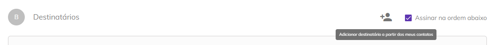<figcaption>
Clique na imagem para ampliar.
</figcaption></figure>

Ao clicar neste botão é exibida a lista. Para adicionar os destinatários desejados, selecione-os clicando no _checkbox_ ao lado do nome e clique em “Adicionar Destinatários”.

Utilizando a barra de pesquisa é possível filtrar os destinatários por nome, e-mail ou WhatsApp.

<figure><figcaption></figcaption></figure>

Ao marcar o _checkbox_ “**Assinar na ordem abaixo**” o processo será enviado aos destinatários na ordem definida no campo “**Ordem**” que aparecerá na parte superior de “Dados do Destinatário”. Ao definir essa opção um usuário só receberá o processo quando o anterior concluir sua ação de assinatura.&#x20;


<mark style="color:orange;">**Caso o usuário anterior tenha tido apenas ação de visualização, o próximo signatário receberá o documento quando o último signatário anterior a ele concluir a assinatura.**</mark>&#x20;


<figure>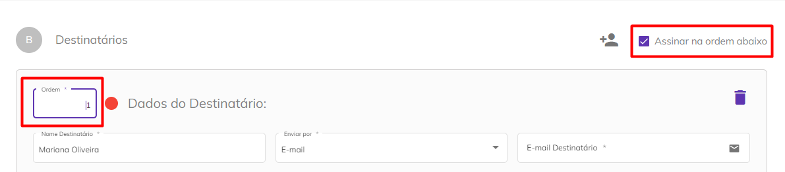<figcaption>
Clique na imagem para ampliar.
</figcaption></figure>

**Nome Destinatário:** Informe o nome do destinatário.

**Enviar por:** Selecione se o processo será enviado por e-mail ou WhatsApp para o destinatário.


<mark style="color:orange;">**A opção de envio por WhatsApp só será exibida se a conta do usuário tiver créditos de mensagens de WhatsApp.**</mark>


Dependendo da opção escolhida anteriormente, informe o e-mail ou número de telefone do destinatário para envio do processo.

<figure>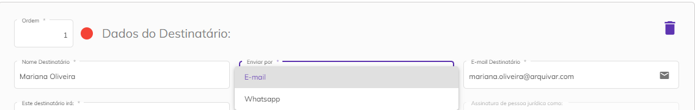<figcaption>
Clique na imagem para ampliar.
</figcaption></figure>

**Este destinatário irá:** Informe se o destinatário irá assinar o processo online como Pessoa Física, Jurídica ou ambas, ou se irá somente receber uma cópia do documento no fim do processo de assinaturas.

<figure>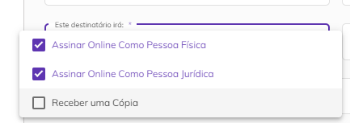<figcaption>
Clique na imagem para ampliar.
</figcaption></figure>

Caso tenha sido determinado que o destinatário irá assinar como pessoa física ou jurídica é preciso definir seu papel de signatário no processo. Selecione entre um ou mais papéis listados ou adicione um “Papel do Signatário” personalizado clicando em “Adicionar papel”.

<figure><figcaption></figcaption></figure>

Os papéis do signatário apresentados aqui são anteriormente criados no menu [Administração > Conta > Aba Configurações > Papel do Signatário](../administracao/administracao/conta.md#papel-do-signatario). Por padrão a plataforma apresenta os papéis “Contratada”, “Contratante”, “Fiador” e “Locatário”, mas é possível editar ou excluir esses papéis, além de criar outros se necessário.

<figure><figcaption></figcaption></figure>

**Tipo de Assinatura:** Selecione se o destinatário deverá utilizar assinatura eletrônica ou um certificado digital para assinar o processo.

<figure>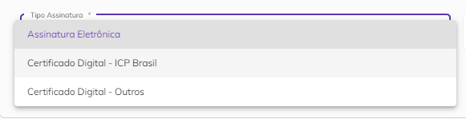<figcaption>
Clique na imagem para ampliar.
</figcaption></figure>


<mark style="color:blue;">**ASSINATURA ELETRÔNICA X ASSINATURA DIGITAL (ICP Brasil e ICP Outros)**</mark>

<mark style="color:blue;">**Assinatura eletrônica**</mark> <mark style="color:blue;"></mark><mark style="color:blue;">é aquela que não precisa de um certificado digital. É mais utilizada para assinar contratos e documentos entre entes privados (B2B, B2C).</mark>&#x20;

<mark style="color:blue;">**Assinatura digital**</mark> <mark style="color:blue;"></mark><mark style="color:blue;">é aquela que precisa de um certificado digital. É mais utilizada para emissão de notas fiscais e para transações com o governo.</mark>&#x20;

<mark style="color:blue;">Na Plataforma Arqsign, ao configurar um fluxo de assinaturas você pode determinar qual tipo de assinatura deverá ser executada por destinatário escolhendo entre:</mark>&#x20;

<mark style="color:blue;">**a) Assinatura eletrônica**</mark> <mark style="color:blue;"></mark><mark style="color:blue;">(a ArqSign produz assinaturas eletrônicas avançadas com validade jurídica de acordo com MP 2.200-2 de 24/08/2001 e Lei 14.063 de 23/11/2020). Sempre que um signatário assina um documento de forma eletrônica a Arqsign aplica um certificado digital próprio da plataforma, capturando o Hash (identificação única) do arquivo, verificando a integridade do arquivo e anexando ao certificado a identificação do signatário.</mark>  &#x20;

<mark style="color:blue;">**b) Assinatura digital – ICP-Brasil ou Outros**</mark> <mark style="color:blue;"></mark><mark style="color:blue;">(A ArqSign produz assinaturas digitais qualificadas de acordo com MP 2.200-2 de 24/08/2001 e Lei 14.063 de 23/11/2020). Quando o usuário já possui um certificado digital e deseja utilizá-lo para realizar a assinatura por meio da ArqSign, este certificado é utilizado para verificar a integridade da assinatura e identificar o usuário como signatário no documento.</mark>&#x20;


**Representação Visual Assinatura:** Selecione qual deve ser a representação visual utilizada pelo destinatário no momento da assinatura. Ao optar pela primeira opção (Padrão, Desenho ou Imagem), ele poderá utilizar qualquer uma das representação, no caso das demais opções a utilização ficará restrita a representação selecionada neste momento.

<figure><figcaption>
Clique na imagem para ampliar.
</figcaption></figure>

Ao marcar a opção **“Salvar este destinatário em minha lista de contatos”** os dados informados do destinatário serão salvos automaticamente na lista de contatos do usuário.

<figure>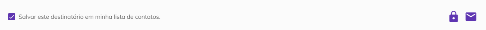<figcaption>
Clique na imagem para ampliar.
</figcaption></figure>

**Ícone “Código de Segurança”:** Ao clicar neste ícone será criado um código numérico que será enviado ao destinatário para que ele consiga acessar o processo. O código pode ser gerado automaticamente pelo sistema ou informado manualmente pelo usuário.

<figure>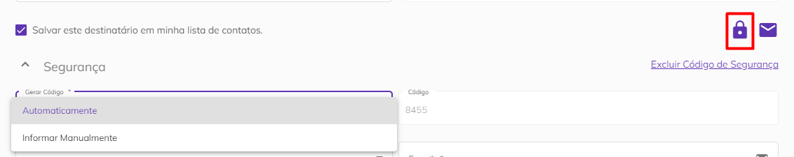<figcaption>
Clique na imagem para ampliar.
</figcaption></figure>

Depois de gerar o código escolha se ele será enviado por e-mail, Whatsapp ou SMS e informe o e-mail ou telefone para envio. Também é possível não enviar o código, deixando a cargo do usuário informá-lo ao destinatário da forma que preferir. Para excluir o código criado, basta clicar em “Excluir Código de Segurança”.

<figure>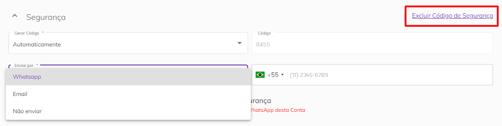<figcaption>
Clique na imagem para ampliar.
</figcaption></figure>

Se selecionada a opção de envio por WhatsApp é possível permitir que o destinatário solicite o reenvio do código, marcando a _checkbox_ “**Permitir que este destinatário possa solicitar reenvio do código de segurança**”.


<mark style="color:orange;">**Cada reenvio do código de segurança solicitado pelo destinatário irá consumir um crédito de WhatsApp da conta do usuário que está enviando o documento.**</mark>


<figure>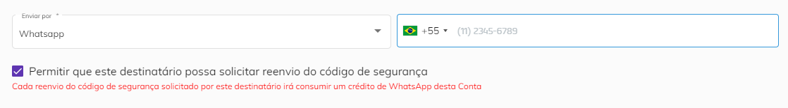<figcaption>
Clique na imagem para ampliar.
</figcaption></figure>

**Ícone Mensagem Privada:** Ao clicar neste ícone será possível inserir uma mensagem que será enviada ao destinatário junto com o processo. Para isso, preencha os campos “Assunto” e “Mensagem”. Caso deseje excluir a mensagem, clique em “**Excluir Mensagem Privada**”.

<figure>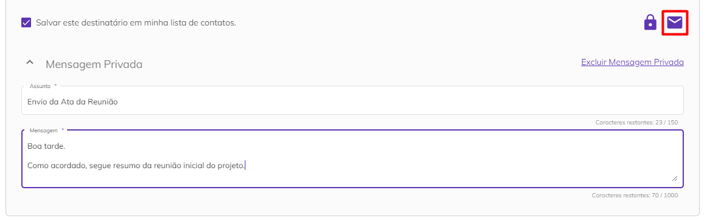<figcaption>
Clique na imagem para ampliar.
</figcaption></figure>

Os itens **Código de** **Segurança** e de **Mensagem privada** são expansíveis e quando recolhidos contam com o ícone de edição, sinalizando ao usuário que podem ser alterados.&#x20;

<figure><figcaption>
Clique na imagem para ampliar.
</figcaption></figure>

Para inserir outros destinatários clique no botão “Adicionar Novo Destinatário”. Se desejar incluir a si mesmo como destinatário, clique em “**Me adicionar como destinatário**”. Os campos de nome e e-mail serão preenchidos automaticamente com as informações cadastradas no seu perfil de usuário e o campo “Enviar por” será preenchido com a opção “E-mail”.

<figure>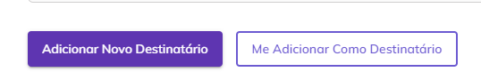<figcaption>
Clique na imagem para ampliar.
</figcaption></figure>

### C. Mensagem Padrão

No campo “Mensagem Padrão” pode-se manter a mensagem padrão criada pela plataforma ou selecionar na lista sua mensagem padrão, criada no ["Meu Perfil"](meu-perfil.md#mensagem-padrao), que será enviada a todos os destinatários, preenchendo-se os campos “Assunto” e “Mensagem”.


<mark style="color:orange;">**No caso de destinatários que tiverem os campos de Mensagem Personalizada preenchidos será enviada a mensagem informada em substituição à mensagem padrão.**</mark>


<figure>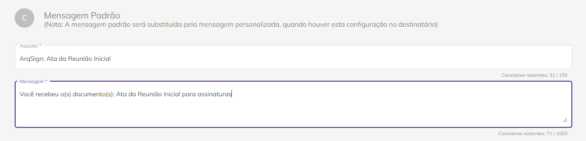<figcaption>
Clique na imagem para ampliar.
</figcaption></figure>

Depois de concluir essas configurações, clique em “Avançar” para seguir para a próxima etapa, “Concluir Mais Tarde” para salvar o fluxo como rascunho ou “Descartar” para cancelar o cadastro.

<figure>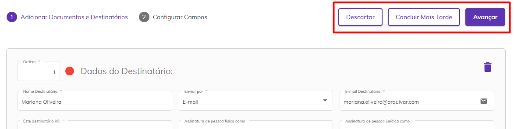<figcaption>
Clique na imagem para ampliar.
</figcaption></figure>

***

## Etapa 2: Configurar Campos

Na próxima etapa serão exibidos os documentos que foram inseridos na etapa anterior em formato PDF e deverão ser configurados os campos de assinatura, informações de preenchimento e anexos.

#### Processo com um documento ou mais documentos agrupados

Quando o processo possui um ou mais documentos **agrupados**, o sistema exibe o nome do processo.

<figure><figcaption></figcaption></figure>

#### Processo com mais de um documento não agrupados

Quando o processo possui um ou mais documentos **não agrupados**, o sistema exibe:

* Na parte superior da tela, o **nome do documento** que está sendo exibido;
* No canto esquerdo da tela, a **lista de documentos do processo** ordenados conforme a configuração de ordem definida na [Etapa 01](novo-processo.md#etapa-1-adicionar-documentos-e-destinatarios), sinalizando se o documento está sendo visualizado ou não. Ao clicar sobre o documento, o sistema o exibirá na tela.&#x20;

<figure><figcaption></figcaption></figure>

### Campos de Assinatura

#### Representação da assinatura

Ao clicar no documento, o sistema exibe a modal de configuração da representação visual listando os signatários pendentes de configuração da representação da assinatura ordenados alfabeticamente ou conforme a ordem de assinatura definida na [etapa 01.](novo-processo.md#etapa-1-adicionar-documentos-e-destinatarios)

Para cada documento listado, o sistema exibe a(s) respectiva(s) representação(ões) para cada signatário(s) conforme o tipo de assinatura definida na [etapa 01](novo-processo.md#etapa-1-adicionar-documentos-e-destinatarios) (campo "Este Destinatário irá"), possibilitando ao usuário configurar a representação para cada signatário(s) com ação de assinar online em cada documento.

<figure><figcaption>
Clique na imagem para ampliar.
</figcaption></figure>

Ao incluir a configuração da representação visual, a aplicação exibe a representação no documento na posição que o usuário inseriu, possibilitando o ajustar o tamanho e/ou excluir a representação da assinatura que está inserida no documento.



Se na [Etapa 1](novo-processo.md#b.-destinatarios) tiver sido definido que o destinatário irá assinar como pessoa física e jurídica, serão exibidos dois quadros com o nome do destinatário na mesma cor.  Os quadros de cada um dos destinatários serão exibidos em cores diferentes para sinalizar visualmente onde cada um deverá assinar.&#x20;

#### Modal de representação visual de assinatura para processo com um documento ou mais  documentos agrupados

Quando o processo possui um documento ou mais de um documento agrupado, o sistema lista as representações dos destinatários, conforme o tipo de pessoa (PF e/ou PJ) exibindo uma barra de rolagem na modal.

<figure><figcaption>
Clique na imagem para ampliar.
</figcaption></figure>

#### Modal de representação visual de assinatura para processo com mais de um documento não agrupados

Quando o processo possui **mais de um documento**, o sistema exibe um **"carrossel"**, permitindo a navegação entre os documentos e os signatários.

<figure><figcaption>
Clique na imagem para ampliar.
</figcaption></figure>

<figure><figcaption>
Clique na imagem para ampliar.
</figcaption></figure>

Ao concluir a configuração da assinatura de todos os signatários no documento, o sistema sinaliza o documento como configuração da representação concluída, marcando o _checked_ para verde no canto esquerdo da tela.

Ao concluir a configuração da assinatura do signatário em todos os documentos, o sistema sinaliza este signatário como configuração da representação concluída, marcando o _checked_ para verde na frente do nome de cada signatário.

<figure><figcaption>
Clique na imagem para ampliar.
</figcaption></figure>

### Dados de assinatura e anexos

No canto direito superior da tela, é exibido o campo **"Configurações para"**, onde é apresentado o nome do destinatário que está selecionado para configuração. Cada destinatário possui uma cor atribuída automaticamente pela plataforma, e ao lado desse ícone, aparece um símbolo de "_checked"_, que muda de cor, aparece em verde, para sinalizar que as **Informações Complementares de Assinatura** foram incluídas ou permanece em cinza quando não incluídas.&#x20;

<figure><figcaption>
Clique na imagem para ampliar.
</figcaption></figure>

Se não houver ordem de assinaturas configurada na [Etapa 1](novo-processo.md#etapa-1-adicionar-documentos-e-destinatarios), o item "**Configurações para**" mostra a lista dos signatários ordenados alfabeticamente. Já se houver ordem de assinaturas configurada, a lista dos signatários estará agrupada por ordem de assinaturas e ordenados alfabeticamente.&#x20;

<figure><figcaption>
Clique na imagem para ampliar.
</figcaption></figure>

### **Envio Simplificado**

Caso o usuário não deseje inserir as assinaturas manualmente no documento, pode-se selecionar a opção **Envio Simplificado.**

<figure><figcaption>
Clique na imagem para ampliar.
</figcaption></figure>

O **Envio Simplificado** permite ao usuário que envie o processo sem o ajuste manual da posição da assinatura, desta forma a plataforma insere uma página de forma automática ao final do documento,  com as representações das assinaturas, considerando as configurações definidas anteriormente na inserção dos documentos e as seguintes regras:&#x20;


* **Se o campo "Agrupar os arquivos em único documento" da** [**Etapa 1**](novo-processo.md#etapa-1-adicionar-documentos-e-destinatarios) **estiver desmarcado:**&#x20;

A plataforma **insere uma página ao final de cada documento** com a posição da assinatura de cada destinatário com ação de Assinar Online, conforme o tipo de assinatura de cada um (Pessoa Física e/ou Pessoa Jurídica) configurada no campo "Este Destinatário irá".

* **Se o campo "Agrupar os arquivos em único documento" da** [**Etapa 1** ](novo-processo.md#etapa-1-adicionar-documentos-e-destinatarios)**estiver marcado:**&#x20;

A plataforma **insere uma página ao final do documento** com a posição da assinatura de cada destinatário com ação de Assinar Online, conforme o tipo de assinatura de cada um (Pessoa Física e/ou Pessoa Jurídica) configurada no campo "Este Destinatário irá".



<mark style="color:red;">Caso o usuário tenha optado anteriormente pela opção de</mark> <mark style="color:red;"></mark><mark style="color:red;">**configurar a assinatura manualmente**</mark> <mark style="color:red;"></mark><mark style="color:red;">em algum documento do processo, o sistema exibe uma mensagem de confirmação de envio simplificado. Ao confirmar, os campos inseridos manualmente serão excluídos e todas as assinaturas serão posicionadas na página automática gerada pela plataforma.</mark>&#x20;


<figure><figcaption>
Clique na imagem para ampliar.
</figcaption></figure>

### Informações Complementares de Assinatura

O campo "**Configurações para**" exibe o nome dos destinatários selecionados para configuração com ícone da cor definido pela plataforma para o destinatário, sinalizando se a configuração dos dados complementares e/ou anexos foi incluída ou não.&#x20;

<figure><figcaption>
Clique na imagem para ampliar.
</figcaption></figure>

<figure><figcaption>
Clique na imagem para ampliar.
</figcaption></figure>


<mark style="color:blue;">• Se</mark> <mark style="color:blue;"></mark><mark style="color:blue;">**não houver**</mark> <mark style="color:blue;"></mark><mark style="color:blue;">ordem de assinaturas configurada, a plataforma lista os signatários ordenados alfabeticamente.</mark>

<mark style="color:blue;">• Se</mark> <mark style="color:blue;"></mark><mark style="color:blue;">**houver**</mark> <mark style="color:blue;"></mark><mark style="color:blue;">ordem de assinaturas configurada, a plataforma lista os signatários agrupados por ordem de assinaturas e alfabeticamente.</mark>


Dependendo do tipo de assinatura definido para o destinatário na [Etapa 1](novo-processo.md#b.-destinatarios) serão exibidos os campos “**Informações Complementares de Assinatura**”. Esses campos só serão exibidos se na [Etapa 1 no campo “Tipo de Assinatura”](novo-processo.md#b.-destinatarios) tiver sido escolhida a opção “Assinatura Eletrônica”.

Se a assinatura for como Pessoa Física, é possível exigir do destinatário dados como nome e documento, marcando a opção “Nome da Pessoa Física” preenchimento obrigatório e selecionando um dos documentos da lista “Documento da Pessoa Física”.&#x20;

<figure><figcaption></figcaption></figure>

Para exigir um documento selecione a opção desejada entre CPF, CNH, RG ou outros.&#x20;

<figure><figcaption></figcaption></figure>

Após selecionar o tipo de documento que será exigido do destinatário na assinatura, informe o número do documento. No momento da assinatura, o destinatário deverá informar exatamente o número definido neste momento se selecionada a opção **"Preenchimento Obrigatório".** Ao selecionar a opção **"Usar o valor informado no campo para validar o CPF preenchido pelo signatário durante a assinatura",** automaticamente o campo será de preenchimento obrigatório e será validado pela plataforma para prosseguimento da assinatura.

No momento da assinatura, se o destinatário utilizar um número diferente do informado pelo remetente na configuração, será apresentado o seguinte erro na tela:

<figure><figcaption>
Clique na imagem para ampliar.
</figcaption></figure>


<mark style="color:orange;">Processos configurados com essa validação de preenchimento de campo não são listados para</mark> <mark style="color:orange;"></mark><mark style="color:orange;">**"Assinatura em Lote".**</mark> <mark style="color:orange;"></mark><mark style="color:orange;">Os documentos destes processos estarão disponíveis para assinatura na</mark> <mark style="color:orange;"></mark><mark style="color:orange;">**"Caixa de Entrada".**</mark>


Se selecionada essa última opção "outros" será preciso informar o nome do documento, se é do tipo texto ou numérico e a quantidade de caracteres. &#x20;

<figure>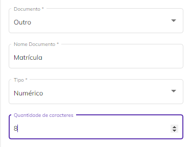<figcaption>
Clique na imagem para ampliar.
</figcaption></figure>

Se a assinatura for como Pessoa Jurídica, é possível exigir do destinatário a razão social da empresa e algum documento, marcando as opções “Razão Social da Pessoa Jurídica” e “Documento da Pessoa Jurídica” como de preenchimento obrigatório.

<figure><figcaption>
Clique na imagem para ampliar.
</figcaption></figure>

Após selecionar o tipo de documento que será exigido do destinatário na assinatura, informe o número do documento. No momento da assinatura, o destinatário deverá informar exatamente o número definido neste momento se selecionada a opção **"Preenchimento Obrigatório".** Ao selecionar a opção **"Usar o valor informado no campo para validar o CNPJ preenchido pelo signatário durante a assinatura",** automaticamente o campo será de preenchimento obrigatório e será validado pela plataforma para prosseguimento da assinatura.

No momento da assinatura, se o destinatário utilizar um número diferente do informado pelo remetente na configuração, será apresentado o seguinte erro na tela:

<figure><figcaption>
Clique na imagem para ampliar.
</figcaption></figure>


<mark style="color:orange;">Processos configurados com essa validação de preenchimento de campo não são listados para</mark> <mark style="color:orange;"></mark><mark style="color:orange;">**"Assinatura em Lote".**</mark> <mark style="color:orange;"></mark><mark style="color:orange;">Os documentos destes processos estarão disponíveis para assinatura na</mark> <mark style="color:orange;"></mark><mark style="color:orange;">**"Caixa de Entrada".**</mark>


Para exigir um documento selecione a opção desejada entre CNPJ ou outros. Se selecionada essa a opção "outros", será preciso informar o nome do documento, se é do tipo texto ou numérico e a quantidade de caracteres. &#x20;

<figure><figcaption></figcaption></figure>

### Anexos

No campo “Anexos” do lado esquerdo da tela serão exibidas configurações que permitirão aos destinatários anexar outros arquivos ao documento no momento da assinatura. Para isso, marque a opção “**Solicitar anexar documentos**”.

Informe o nome do anexo que será solicitado e defina se será de preenchimento obrigatório e se todos os destinatários participantes do processo de assinatura poderão visualizar o arquivo anexado pelo destinatário.

É possível solicitar mais de um anexo, clicando no ícone **“Adicionar”.**

<figure>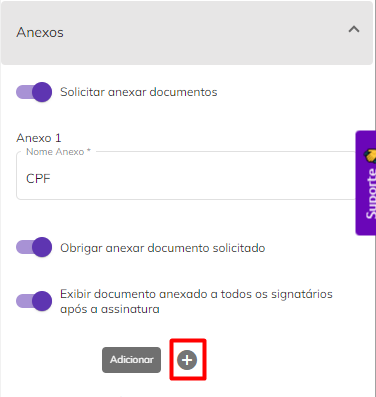<figcaption>
Clique na imagem para ampliar.
</figcaption></figure>

Clicando em “Descartar”, o processo será excluído. Clicando em “Concluir Mais Tarde” o processo será salvo na pasta de Rascunhos. Para editar o documento ou os destinatários, clique em “Voltar Etapa Anterior”. Finalizada a configuração da Etapa 2, clique em “Enviar” para enviar o processo para assinatura dos destinatários.

<figure>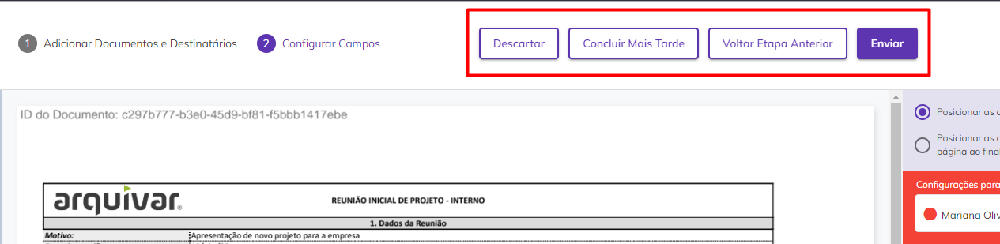<figcaption>
Clique na imagem para ampliar.
</figcaption></figure>

## 🗪 Perguntas e Respostas Frequentes

Como consultar se um documento eletrônico ou digital tem validade jurídica?

Para verificar se um documento eletrônico ou digital tem validade jurídica conforme os requisitos do ITI, basta seguir os passos abaixo:

1. Acesse o endereço: [https://validar.iti.gov.br/](https://validar.iti.gov.br/);
2. Clique em “Escolher Arquivo” e faça o upload do arquivo que você quer validar;
3. Concorde com os termos de uso e política de privacidade do Portal Validar ITI;
4. Clique em Validar.

Caso o arquivo não contenha nenhuma assinatura aplicada ou contenha assinatura não reconhecida ou corrompida a seguinte mensagem é apresentada: “Você submeteu um documento sem assinatura reconhecível ou com assinatura corrompida”.

Caso o arquivo contenha assinatura válida a seguinte mensagem é apresentada: “Documento com assinaturas válidas”. Um relatório será apresentado com o detalhamento de cada assinatura e sua validade.

Como configurar uma mensagem privada?

* Clique em ‘Novo Processo’

- Selecione o documento que deseja encaminhar e informe os dados do signatário como nome, e-mail etc.

* Abaixo dessas informações haverá um símbolo de ‘mensagem’ , onde ao clicar abrirá uma aba de mensagem privada.

- Na aba de mensagem privada é possível informar o assunto e a mensagem que deseja enviar somente para o signatário selecionado. Os demais signatários receberão a mensagem padrão.

Como configurar o token de segurança?

* Clique em ‘Novo Processo’

- Selecione o documento que deseja encaminhar e informe os dados do signatário como nome, e-mail etc.

* Abaixo dessas informações haverá um símbolo de um ‘cadeado’, onde ao clicar abrirá uma aba de segurança.

- Na aba de segurança é possível gerar o código ‘Automaticamente ou Manual’ e informar o e-mail, SMS, Whatsapp ou nenhum meio em que deseja encaminhar o token.

* Após essas configurações o token de segurança será enviado através do meio selecionado quando o signatário clicar para acessar o documento ou se você não selecionou nenhum meio você poderá informar para o signatário.

Como solicitar anexos e selfie?

Clique em ‘Novo Processo’.&#x20;

Selecione o documento que deseja encaminhar, configure os destinatários e avance.&#x20;

Configure o campo de assinatura do destinatário.&#x20;

No canto direito, caso deseje, solicite as informações complementares como Nome e Documento e se necessário habilite o preenchimento obrigatório.&#x20;

Se deseja solicitar Anexos como imagem de documentos ou selfie, habilite para solicitar que o signatário anexe um documento.&#x20;

Informe o documento que deseja que o signatário anexe e se deseja que o anexo seja obrigatório para a conclusão do processo de assinatura.&#x20;

Você também pode configurar a permissão para que todos os signatários acessem o anexo ou não.&#x20;

Quando o destinatário receber o documento para assinar ele deverá proceder da seguinte forma:&#x20;

Assinar o documento e preencher dados solicitados;&#x20;

Clicar na solicitação de Selfie;&#x20;

Acessar a câmera do celular ou computador;&#x20;

Fazer a foto conforme solicitado;&#x20;

Escolher a foto como anexo;&#x20;

Concluir a assinatura.&#x20;

Como inserir um destinatário em cópia ou como observador em um Processo?

Na Plataforma ArqSign é possível colocar uma pessoa em cópia ou como observador em um Processo. Desta forma, ao final do processo de assinatura, essa pessoa ou pessoas receberão o documento assinado.

Para fazer esta configuração proceda da seguinte forma:

1. Clique em “Novo Processo”;
2. Faça o upload do documento a ser assinado e as devidas configurações para o Processo;
3. Em “Destinatários” configure o campo “Este destinatário irá” como “Receber uma cópia”;
4. Prossiga com as demais configurações.

Como configurar um Processo para ser assinado com certificado digital (assinatura digital) ou sem certificado digital (assinatura eletrônica)?

Na Plataforma ArqSign, ao configurar um Processo de assinaturas você pode determinar qual tipo de assinatura deverá ser executada por destinatário escolhendo entre:&#x20;

**a) Assinatura eletrônica** (A ArqSign produz assinaturas eletrônicas avançadas com validade jurídica de acordo com MP 2.200-2 de 24/08/2001 e Lei 14.063 de 23/11/2020);&#x20;

**b) Assinatura com Certificado digital do tipo ICP-Brasil** (A ArqSign produz assinaturas digitais qualificadas de acordo com MP 2.200-2 de 24/08/2001 e Lei 14.063 de 23/11/2020);&#x20;

**c) Assinatura com Certificado digital Pessoal Todos os tipos** (A ArqSign produz assinaturas eletrônicas e digitais através de outros certificados).&#x20;

Para determinar o tipo de assinatura siga o seguinte passo a passo:&#x20;

Após fazer o upload do documento e configurações necessárias para o Processo, siga para a configuração dos destinatários;&#x20;

Ao configurar um destinatário, no campo “Tipo de assinatura” escolha uma das opções conforme descrição acima;&#x20;

Pronto! Agora é só configurar os demais destinatários e a posição de assinatura no documento e enviar.&#x20;

Como configurar a assinatura para Pessoa Física/CPF ou Pessoa Jurídica/CNPJ?

Na plataforma ArqSign, você pode escolher se o Processo será assinado por uma Pessoa física ou jurídica.

Para isso, o remetente deve escolher o tipo de assinatura durante o processo de configuração do fluxo conforme abaixo:

1. Faça o Upload do documento e suas configurações se necessário;
2. Insira o destinatário
3. No Campo “Este destinatário irá:” marque as opções de como o destinatário atuará:

* Assinar Online como Pessoa Física
* Assinar Online como Pessoa Jurídica
* Receber uma cópia

Um destinatário pode assinar durante o mesmo processo como Pessoa Física e Jurídica.

Ao finalizar a configuração dos destinatários clique em Avançar

Se você for posicionar as assinaturas, deverá posicionar a assinatura de Pessoa Física e Jurídica para o destinatário que você configurou para assinar com estes dois tipos de assinatura.

Caso você escolha a opção de posicionamento automático de assinaturas, a própria plataforma vai posicionar todas as assinaturas automaticamente.&#x20;

Como configurar uma ordem / sequência para as assinaturas?

A plataforma ArqSign permite inserir uma sequência para assinatura de Processos.&#x20;

Para acessar a funcionalidade habilite a opção” Assinar na ordem abaixo” durante a configuração dos destinatários.&#x20;

Insira os destinatários na ordem em que deseja as assinaturas.&#x20;

Observe que aparece um campo chamado “Ordem” e que as pessoas deverão assinar o Processo de acordo com essa ordem, sendo que o próximo e-mail só chegará após o anterior realizar a assinatura.

Caso queira que duas pessoas recebam o e-mail simultaneamente, utilize o mesmo número para elas.

Como editar um documento após o envio do Processo?

Por segurança, não é possível editar um documento após o envio.

Como agendar uma renovação, vencimento de Processo ou controle de reajuste?

Você pode fazer esse agendamento durante a criação ou após a conclusão de um Processo de assinatura. Veja o passo a passo a seguir:&#x20;

Durante a criação de um Processo:&#x20;

1. Clique em Novo Processo;
2. Selecione o Checkbox Agendar renovação;
3. Defina o prazo em meses após a finalização das assinaturas;
4. Finalize a criação do Processo. &#x20;

Após a conclusão de um Processo:&#x20;

1. Clique em Enviados;
2. Selecione Processo concluído;
3. Clique em Histórico;
4. Clique em Alterar Renovação;&#x20;
5. Defina o prazo em meses após a finalização das assinaturas;
6. Clique em Alterar.&#x20;

Quando chegar a data definida para vencimento do Processo (para renovação ou reajuste) a plataforma ArqSign enviará um e-mail ao proprietário do Processo informando que o documento está pronto para renovação, reajuste etc.

[Clique aqui](https://youtu.be/v1DGlnU4rLs) e assista ao vídeo com o passo a passo.

Quais tipos de arquivo (extensões) são permitidos?

Manualmente você pode fazer upload das seguintes extensões: doc; .docx; .xlsx; .xls; .pptx; .ppt; .pdf; .png; .jpeg; .jpg.&#x20;

Através da API de integração você pode enviar arquivos em PDF.&#x20;

Qual o limite de tamanho para documentos?

Selecione e faça o upload de arquivos de até 35MB.&#x20;

Você pode enviar mais de um arquivo de uma vez desde que o tamanho total da soma dos arquivos não ultrapasse 100MB ou 25 arquivos. Ao enviar mais de um arquivo você pode agrupá-los em um único arquivo ou não.

Como enviar um Processo para assinatura?

Acesse a plataforma ArqSign e clique no botão de ‘’Novo Processo’’.&#x20;

Selecione e faça o upload de arquivos de até 35MB.&#x20;

Você pode enviar mais de um arquivo de uma vez desde o tamanho total da soma dos arquivos não ultrapasse 25 documentos e 100MB. Podem ser incluídos mais de um arquivo no mesmo processo de assinatura. Neste caso, a opção "Agrupar os arquivos em um único documento" ficará disponível e poderá ser marcada ou desmarcada.&#x20;

Quando esse campo estiver marcado, a ArqSign exibe os arquivos agrupados na área de listagem, onde é permitido alterar a ordem dos documentos, clicando e arrastando-os para a posição desejada. Neste caso não é permitido alterar o nome de cada um dos arquivos, apenas o nome do processo.&#x20;

Para remover um arquivo, clique no ícone da lixeira disponível para cada um dos arquivos na tela.&#x20;

Quando este campo estiver desmarcado, a ArqSign exibe os arquivos desagrupados na área de listagem, permitindo que sejam alterados a ordem e o nome dos arquivos.&#x20;

No campo “Nome do Processo de Assinatura”, é possível editar o nome do processo que contempla os arquivos agrupados, altere conforme necessidade.&#x20;

No campo “Pasta Processo” selecione a pasta na qual o Processo será hospedado. As pastas nas quais os Processos poderão ser armazenados deverão ser criadas no menu Processos> Pastas. Por padrão uma pasta com o nome do usuário é criada e deve ser selecionada caso não exista nenhuma outra.&#x20;

Por último, para agendar a renovação dos Processos que estão sendo cadastrados de forma automática, selecione o checkbox do campo “Agendar renovação \_\_\_ meses após a conclusão das assinaturas” informando a quantidade de meses em que deseja ser avisado sobre a renovação do processo. Assim que as assinaturas do primeiro envio forem concluídas, o sistema passará a contar o prazo determinado e quando o período de renovação for atingido, o responsável pelos Processos (remetente) receberá uma notificação informando que os Processos estão aptos a serem renovados .&#x20;

Configure os destinatários, defina o tipo de envio, por e-mail ou WhatsApp, configure as assinaturas (uma por signatário) e clique em enviar.

Caso você mesmo seja um signatário, você pode assinar o Processo após o envio através da Caixa de entrada da sua conta. Basta clicar em assinar e seguir o passo a passo da pergunta “Como assinar um Processo?” [Clique aqui](https://youtu.be/nEuvJHxZnto) e assista ao passo a passo.

Onde ficam armazenados os dados e documentos inseridos na Plataforma ArqSign?

Os dados e documentos são armazenados no datacenter Microsoft Azure, líder mundial em estabelecer requisitos de privacidade e de segurança. &#x20;

O Microsoft Azure cumpre uma ampla variedade de normas de conformidade internacionais e específicas do setor, como o GDPR (Regulamento Geral sobre a Proteção de Dados), a ISO 27001, o HIPAA, o FedRAMP, a SOC 1 e SOC 2, bem como normas específicas de certos países, incluindo o IRAP da Austrália, o G-Cloud do Reino Unido e o MTCS de Cingapura. Rigorosas auditorias de terceiros, tais como aquelas realizadas pelo British Standards Institute, confirmam a adesão do Azure aos rígidos controles de segurança exigidos por tais normas.&#x20;

A Microsoft aproveitou sua experiência na criação de proteções de software corporativo e na execução de alguns dos maiores serviços online do mundo a fim de criar tecnologias e práticas de segurança robustas. Elas ajudam a garantir que a infraestrutura do Azure seja resistente a ataques, protege o acesso do usuário ao ambiente do Azure e ajuda a manter os dados do cliente seguros por meio de comunicações criptografadas e pelo gerenciamento de ameaças e práticas de atenuação, incluindo testes de penetração regulares.&#x20;

[Clique aqui](https://youtu.be/yKNeahEQY8g) e assista ao vídeo explicativo.

