# ⏱️ Vencidos

No menu Vencidos são apresentados todos os documentos enviados pelo usuário para assinatura, mas que não foram concluídos dentro do prazo estipulado no campo “**Tempo para expiração do documento após o envio**”, na tela [Novo Documento > Adicionar Documentos e Destinatários > Configurações Avançadas.](novo-documento.md#configuracoes-avancadas)&#x20;

<figure>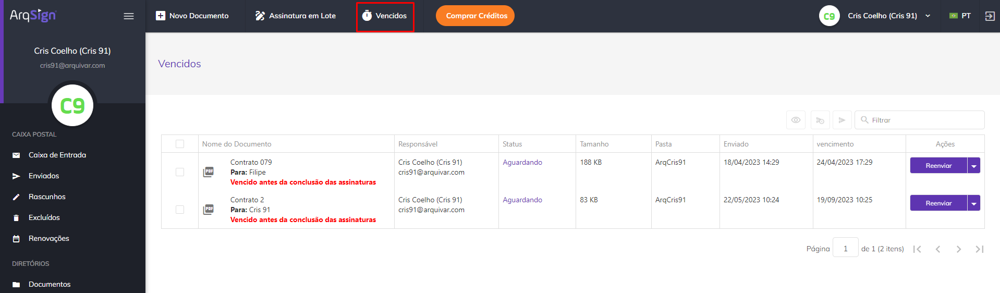<figcaption>
Clique na imagem para ampliar.
</figcaption></figure>

***

## Colunas da tela principal - Vencidos&#x20;

<figure>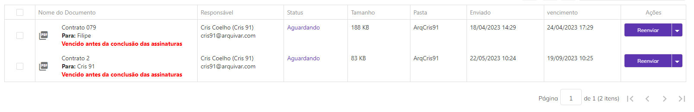<figcaption>
Clique na imagem para ampliar.
</figcaption></figure>

**Coluna Nome do documento:** Nesta coluna são exibidos o nome do documento e o nome do signatário. Se houver mais de um signatário será mostrado o nome do primeiro e a quantidade de outras pessoas que deverão assinar. Todos os documentos listados exibirão a mensagem “Vencido antes da conclusão das assinaturas”. &#x20;

<figure>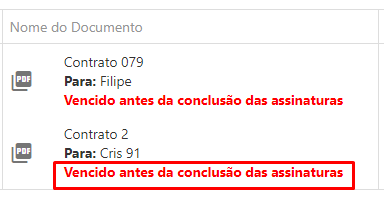<figcaption>
Clique na imagem para ampliar.
</figcaption></figure>

**Coluna Responsável:** Nesta coluna são apresentados o nome e e-mail de quem enviou o documento (remetente). Na tela Vencidos sempre será exibido o nome do próprio usuário. &#x20;

**Coluna Status:** Os documentos listados na tela Vencidos sempre terão o status “Aguardando” (nenhum participante assinou o documento até o momento) ou “Em processo” (um ou mais participantes já assinaram o documento, mas ainda faltam assinaturas). Ao passar o mouse sobre o status são exibidas informações sobre quais signatários ainda estão com assinatura pendente e quais já concluíram, além dos dados desses signatários.&#x20;

<figure>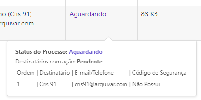<figcaption>
Clique na imagem para ampliar.
</figcaption></figure>

**Coluna Tamanho:** Nesta coluna é exibido o tamanho do arquivo do documento.  &#x20;

**Coluna Pasta:** Nesta coluna é exibida a pasta do diretório onde o documento está armazenado.&#x20;

**Coluna Enviado:** Informações sobre a data e hora em que o documento foi enviado.&#x20;

**Coluna Vencimento:** Informações sobre a data e hora em que o documento expirou.&#x20;

**Coluna Ações:** Esta coluna exibe botões de ação sobre o documento. Esses botões serão exibidos de acordo com o perfil do usuário. Será sempre exibida nesse botão a ação prioritária de execução, de acordo com o perfil do usuário e status do documento.&#x20;

**Barra de Filtro:** É possível localizar um ou mais documentos utilizando-se os filtros disponíveis para busca. A busca pode ser feita pelo nome do documento, nome dos signatários, status, pasta na qual o documento está armazenado ou data de vencimento do documento. &#x20;

<figure>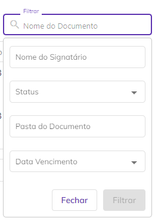<figcaption>
Clique na imagem para ampliar.
</figcaption></figure>

***

## Ações individuais – Vencidos&#x20;

<figure><figcaption>
Clique na imagem para ampliar.
</figcaption></figure>

#### **Reenviar**

Ao clicar neste botão serão exibidas as informações de ordem de envio para os destinatários, e-mail ou telefone para onde o documento foi enviado, código de segurança para acesso ao documento (se houver) e ícone “Editar”, que permite a edição das informações do destinatário. Ao reenviar um documento ele deixa de ser exibido na tela Vencidos porque o prazo de expiração é renovado. &#x20;

<figure>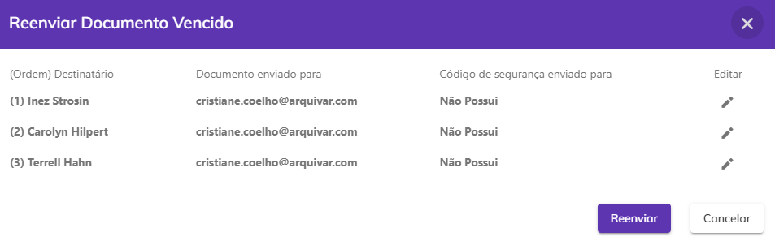<figcaption>
Clique na imagem para ampliar.
</figcaption></figure>

#### **Alterar Pasta**

Esta opção só será exibida se o usuário tiver acesso à conta na qual o documento está armazenado. Ao clicar nesta opção ele poderá alterar a pasta do diretório onde o documento está armazenado. &#x20;

<figure>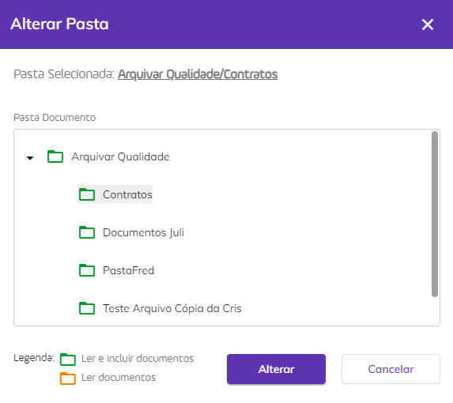<figcaption>
Clique na imagem para ampliar.
</figcaption></figure>

#### **Alterar Proprietário**

Ao clicar nesta opção ele poderá alterar o proprietário do documento. Ao executar essa ação não será possível realizar outras atividades de gestão do documento.&#x20;


<mark style="color:orange;">**Só podem ser selecionados como novo proprietários usuários cadastrados na mesma conta do responsável.**</mark> &#x20;


<figure>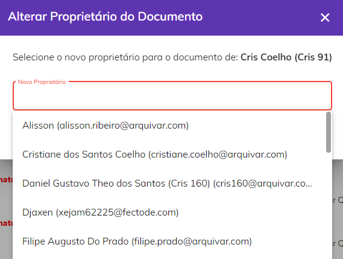<figcaption></figcaption></figure>

#### **Baixar Arquivo**

&#x20;Quando processo possuir um documento ou é um compartilhamento de apenas um documento do processo, **o sistema faz **_**download**_ do documento do **processo e do registro de assinaturas** em uma pasta.zip.

A pasta zip é nomeada com o nome do processo e o arquivo de registro de assinatura é nomeado como **NomeDocumento\_Registro** de assinatura.

<figure><figcaption>
Clique na imagem para ampliar.
</figcaption></figure>

Quando o processo **possuir mais de um documento**, o sistema exibe modal com os documentos do processo para o usuário selecionar quais documentos deseja baixar. Caso seja um compartilhamento, deve-se listar apenas os documentos que foram compartilhados.

<figure><figcaption>
Clique na imagem para ampliar.
</figcaption></figure>

O Registro de Assinaturas exibe todas as informações sobre as assinaturas eletrônicas e digitais realizadas durante o processo, como nome dos signatários, data e hora da assinatura, localização, IP de onde foi realizada, dados dos certificados digitais utilizados etc.

<figure><figcaption>
Clique na imagem para ampliar.
</figcaption></figure>

<figure><figcaption>
Clique na imagem para ampliar.
</figcaption></figure>

#### **Cancelar**

Ao clicar nesta opção o documento é cancelado e o processo de assinaturas é interrompido.&#x20;

<figure>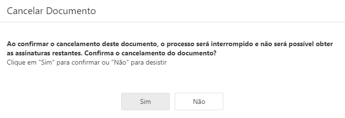<figcaption>
Clique na imagem para ampliar.
</figcaption></figure>

#### **Histórico**

Utilizado para visualizar informações sobre o documento e o histórico dos eventos relacionados a ele. Também é possível fazer o download dos arquivos originais do processo, antes das assinaturas concluídas.&#x20;

Com o botão de eventos posicionado para a direita, observamos os dados do processo na tela.

<figure><figcaption>
Clique na imagem para ampliar.
</figcaption></figure>

Com o botão de eventos posicionado para a esquerda, é possível visualizar os Id's e Hash's dos documentos, no caso de um **processo com mais de um documento não agrupados**.

<figure><figcaption>
Clique na imagem para ampliar.
</figcaption></figure>

***

## Ações em lote – Vencidos

É possível selecionar mais de um documento marcando-se os checkbox ao lado do nome do arquivo e executar ações em lote.&#x20;

<figure>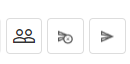<figcaption>
Clique na imagem para ampliar.
</figcaption></figure>

#### **Alterar Proprietário**

Ao clicar nesta opção será possível alterar o proprietário do documento. Ao executar essa ação não será possível realizar outras atividades de gestão do documento.  &#x20;


<mark style="color:orange;">**Só podem ser selecionados como novo proprietários usuários cadastrados na mesma conta do responsável.**</mark>&#x20;


<figure>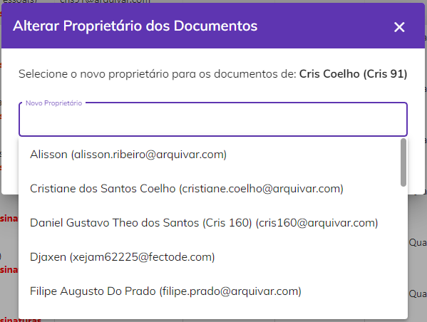<figcaption>
Clique na imagem para ampliar.
</figcaption></figure>

#### **Cancelar Envio**

Ao clicar neste ícone será possível cancelar o envio dos documentos selecionados, interrompendo os processos de assinatura.&#x20;

<figure>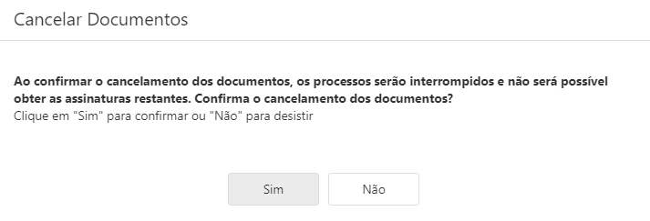<figcaption>
Clique na imagem para ampliar.
</figcaption></figure>

#### **Reenviar**

Ao clicar neste ícone será possível reenviar os documentos selecionados para os destinatários que ainda não assinaram. Ao reenviar um documento ele deixa de ser exibido na tela Vencidos porque o prazo de expiração é renovado.&#x20;

<figure>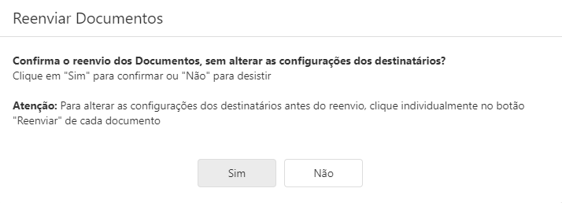<figcaption>
Clique na imagem para ampliar.
</figcaption></figure>
