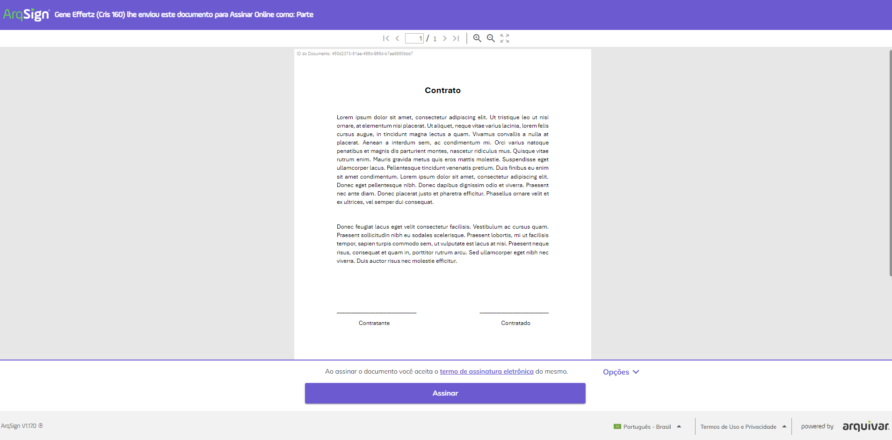
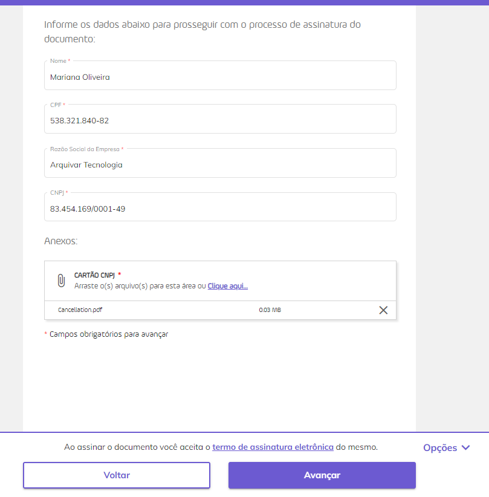

# ▫️ Janeiro | 2024

Mudança do cabeçalho e rodapé da tela de assinatura

A visualização da tela de assinatura foi alterada. Agora, os nomes do responsável pelo envio e do documento são exibidos na parte superior da tela de assinatura. Também foi incluída na parte superior a navegação entre páginas e os botões de zoom e visualização do documento em tela cheia.

O botão de assinatura passou a ser exibido na parte inferior da tela, junto com as opções de ação (Registro de Assinaturas, Exibir Histórico, Recusar Assinatura, Concluir Mais Tarde e Baixar Arquivo).

Agora, o signatário não precisa mais marcar o termo de aceite de assinatura eletrônica. Ao assinar o documento o sistema registrará o aceite automaticamente.  &#x20;

Os detalhes dessas alterações estão na página [Assinatura de Documentos](../menu-superior/assinatura-de-documentos.md).

Mudança da exibição do fluxo de assinatura

As etapas para a conclusão do processo de assinatura são exibidas uma a uma, dando a opção de o usuário navegar entre as etapas utilizando os botões “Voltar” e “Avançar”, mostrados na parte inferior da tela. &#x20;

As telas de escolha da representação visual e de inserção de dados e anexos do signatário passaram a ser exibidas durante o fluxo de assinatura, como etapas a serem cumpridas para avanço.

Não será preciso que o signatário clique em uma parte do documento para plotar sua assinatura. Assim que ele escolher a representação visual sua assinatura será inserida no local determinado pelo responsável pelo envio do documento.

A tela de escolha do certificado digital que será utilizado para assinatura também passou a ser exibida durante o fluxo, como uma etapa a ser cumprida para avanço. Caso o usuário tenha o certificado digital hospedado na ArqSign, será oferecida a ele a opção de autenticação na plataforma para utilizar o certificado que possui.

Além disso, a sugestão de login para acesso à plataforma ou para criação de uma conta teste grátis passou a ser exibida para o usuário no final do processo de assinatura do documento.

Os detalhes dessas alterações estão na página [Assinatura de Documentos](../menu-superior/assinatura-de-documentos.md).

