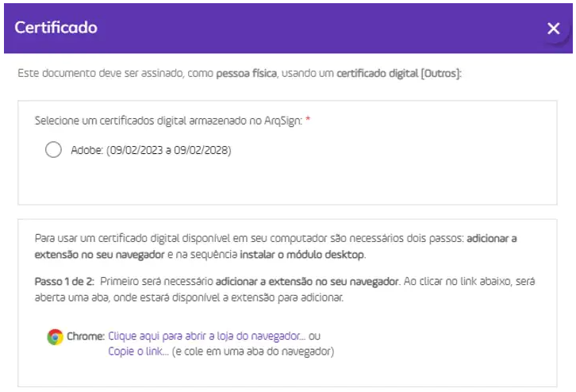

# 🟪 Certificado Digital

Como configurar um documento para ser assinado com Certificado digital (assinatura digital) ou sem certificado digital (assinatura eletrônica)?

Na Plataforma Arqsign, ao configurar um fluxo de assinaturas você pode determinar qual tipo de assinatura deverá ser executada por destinatário escolhendo entre:&#x20;

**a) Assinatura eletrônica** (A ArqSign produz assinaturas eletrônicas avançadas com validade jurídica de acordo com MP 2.200-2 de 24/08/2001 e Lei 14.063 de 23/11/2020);&#x20;

**b) Assinatura com Certificado Digital Pessoal do Tipo ICP-Brasil** (A ArqSign produz assinaturas digitais qualificadas de acordo com MP 2.200-2 de 24/08/2001 e Lei 14.063 de 23/11/2020);&#x20;

**c) Assinatura com Certificado Digital Pessoal Todos os Tipos** (A ArqSign produz assinaturas eletrônicas e digitais através de outros certificados).&#x20;

Para determinar o tipo de assinatura siga o seguinte passo a passo:&#x20;

1. Após fazer o upload do documento e configurações necessárias, siga para a configuração dos destinatários;&#x20;
2. Ao configurar um destinatário, no campo “Tipo de assinatura” escolha uma das opções conforme descrição acima;&#x20;
3. Pronto! Agora é só configurar os demais destinatários e a posição de assinatura no documento e enviar.

Para saber como assinar um documento com Certificado Digital – ICP-Brasil [clique aqui.](https://arquivar.com.br/faq-assuntos/como-assinar-um-documento-com-certificado-digital-icp-brasil/)&#x20;

Como assinar um documento com Certificado Digital – ICP-Brasil?

Na Plataforma ArqSign, o remetente de documentos pode determinar o tipo de assinatura que o destinatário deverá executar escolhendo entre uma das opções abaixo:&#x20;

**a) Assinatura eletrônica** (A ArqSign produz assinaturas eletrônicas avançadas com validade jurídica de acordo com MP 2.200-2 de 24/08/2001 e Lei 14.063 de 23/11/2020);&#x20;

**b) Assinatura com Certificado Digital Pessoal do Tipo ICP-Brasil** (A ArqSign produz assinaturas digitais qualificadas de acordo com MP 2.200-2 de 24/08/2001 e Lei 14.063 de 23/11/2020);&#x20;

**c) Assinatura com Certificado Digital Pessoal Todos os Tipos** (A ArqSign produz assinaturas eletrônicas e digitais por meio de outros certificados).&#x20;

Se você recebeu um documento para assinar via Plataforma ArqSign e precisa assinar com Certificado Digital pela primeira vez, siga os seguintes passos:&#x20;

* Abra o documento, leia e se aceitar, clique em Assinar;&#x20;
* Execute a assinatura no formato de sua preferência e clique em Avançar;&#x20;
* Ao clicar em “Avançar”, você será informando que a assinatura solicitada deverá ser executada com certificado digital;&#x20;
* Selecione qual certificado será utilizado para assinar o documento através das opções:&#x20;

1\) Certificados que foram inseridos na ArqSign e estão salvos na nuvem e&#x20;

2\) Certificados salvos no computador de quem está assinando o documento.&#x20;

* Para assinatura com Certificado inserido na Plataforma, clique na opção indicada;&#x20;
*   Para assinatura com Certificado digital instalado em sua máquina você deverá seguir os passos indicados para:&#x20;

    1\) Adicionar a extensão ArqSign para seu navegador;&#x20;

    2\) Instalar o módulo desktop;&#x20;
* Insira a senha do Certificado Digital e clique em Avançar.&#x20;

O passo a passo para adicionar a extensão ao seu navegador e o módulo desktop podem ser acessados abaixo:&#x20;

* [Como adicionar extensão ArqSign no navegador Chrome](https://arquivar.com.br/faq-assuntos/como-adicionar-extensao-arqsign-certificado-digital-no-navegador-chrome/).
* [Como adicionar extensão ArqSign no navegador Edge](https://arquivar.com.br/faq-assuntos/como-adicionar-extensao-arqsign-certificado-digital-no-navegador-edge/).
* [Como adicionar extensão ArqSign no navegador FireFox](https://arquivar.com.br/faq-assuntos/como-adicionar-extensao-arqsign-no-navegador-firefox/).
* [Como instalar módulo desktop.](https://arquivar.com.br/faq-assuntos/como-instalar-modulo-desktop/)

Como adicionar extensão ArqSign Certificado Digital no navegador Edge?

1. Quando um signatário de um documento que exige um certificado digital, seja ICP-Brasil ou outro qualquer, aplicar sua representação visual e clicar no botão Avançar, será exibida uma mensagem informando que para assinar o documento com Certificado Digital instalado no computador é necessário adicionar a extensão no seu navegador e na sequência instalar o módulo desktop. O processo é simples. Basta clicar no link exibido e seguir o passo a passo:&#x20;
2. No Microsoft Edge, ao clicar no link disponível, pode acontecer o bloqueio de pop-up.&#x20;
3. Caso isto aconteça, deve-se clicar no ícone de bloqueio de pop-ups, ao lado do URL da página.&#x20;
4. Ao clicar no ícone, deve-se permitir pop-ups para a página da ArqSign.&#x20;
5. Após o desbloqueio dos pop-ups, deve-se clicar no link disponível novamente. Ao clicar no link, duas ações serão executadas ao mesmo tempo, a primeira é o download do instalador do Módulo Desktop. Deve-se aguardar o download ser concluído e seguir os passos do Tutorial Instalação Módulo Desktop. A segunda é a abertura de uma aba da Microsoft Store com o plugin da ArqSign.
6. Ao clicar no botão Obter, será aberta uma notificação para a confirmação da adição da extensão no navegador.&#x20;
7. Ao clicar em Adicionar extensão, aparecerá uma notificação informando que a extensão foi adicionada ao navegador. Após isto, a aba do Microsoft Store pode ser fechada.&#x20;
8. Após a adição do plugin no navegador, caso o Módulo Desktop ainda não tenha sido instalado, a aplicação ainda indicará um link para download dele.&#x20;
9. Com as duas instalações concluídas, a modal será atualizada, listando os certificados salvos no computador do usuário.&#x20;
10. No Windows, ao clicar no botão Concluir, pode ser solicitada a permissão para que o plugin acesse os certificados, neste ponto, deve-se clicar em Permitir para liberar a utilização dos certificados digitais.

Caso a extensão e o módulo desktop já tenham sido instalados essa ação não será requerida novamente.&#x20;

Caso o signatário tenha Certificados Digitais salvos na plataforma ArqSign, eles serão exibidos. Para utilizá-los basta selecionar e seguir os próximos passos não necessitando da instalação da extensão e módulo.

Como adicionar extensão ArqSign Certificado Digital no navegador Chrome?

Quando um signatário de um documento que exige um certificado digital, seja ICP-Brasil ou outro qualquer, aplicar sua representação visual e clicar no botão Avançar, será exibida uma mensagem informando que para assinar o documento com Certificado Digital instalado no computador é necessário adicionar a extensão no seu navegador e na sequência instalar o módulo desktop. O processo é simples. Basta clicar no link exibido e seguir o passo a passo abaixo para efetuar essas configurações:&#x20;

1. Clique no link indicado para abrir a loja no navegador;&#x20;
2. A extensão ArqSign Certificado Digital será exibida;&#x20;
3. Clique em “Usar no Chrome”;
4. Ao clicar no botão Usar no Chrome, será aberta uma notificação para a confirmação da adição da extensão no navegador. Clique em adicionar extensão;
5. Ao clicar em Adicionar extensão, aparecerá uma notificação informando que a extensão foi adicionada ao navegador. Após isto, a aba do Chrome Web Store pode ser fechada.
6. Após a adição do plugin no navegador, caso o Módulo Desktop ainda não tenha sido instalado, a aplicação ainda indicará um link para download dele;
7. No caso de o Módulo Desktop não ter sido instalado ainda, um pop-up aparecerá com uma opção para instalação ou atualização do Módulo Desktop em seu computador.
8. Clique no link indicado para fazer o download;
9. Localize o arquivo instalador do módulo baixado e execute-o para instalação;
10. Ao executar a instalação do Módulo Desktop, o Microsoft defender SmartScreen, a princípio, impede a instalação do módulo, pelo fato do módulo não ser um aplicativo presente na Microsoft Store. Para dar sequência na instalação deve-se clicar em Mais informações;
11. Após clicar em Mais informações, deve-se clicar no botão Executar assim mesmo;
12. Clique em Instalar;
13. Após finalizar a instalação, clique em concluir
14. O pop-up será atualizado e solicitará que você escolha o certificado digital que deseja utilizar;
15. Escolha o certificado e siga com a assinatura;
16. No Windows, ao clicar no botão Concluir, pode ser solicitada a permissão para que o plugin acesse os certificados. Clique em “Permitir “para liberar a utilização dos certificados digitais.

Caso a extensão e o módulo desktop já tenham sido instalados essa ação não será requerida novamente.

Caso o signatário tenha Certificados Digitais salvos na plataforma ArqSign, eles serão exibidos. Para utilizá-los basta selecionar e seguir os próximos passos não necessitando da instalação da extensão e módulo.

Como adicionar a extensão ArqSign no navegador FireFox?

Quando um signatário de um documento que exige um certificado digital, seja ICP-Brasil ou outro qualquer, aplicar sua representação visual e clicar no botão Avançar, será exibida uma mensagem informando que para assinar o documento com Certificado Digital instalado no computador é necessário adicionar a extensão no seu navegador e na sequência instalar o módulo desktop. O processo é simples. Basta clicar no link exibido e seguir o passo a passo abaixo para efetuar essas configurações:

1. Ao clicar no link, duas ações serão executadas ao mesmo tempo, a primeira é o download do instalador do Módulo Desktop (No Firefox é solicitada uma confirmação para iniciar o download). Deve-se aguardar o download ser concluído e seguir os passos do Tutorial Instalação Módulo Desktop.&#x20;
2. A outra ação é a abertura de uma nova aba no navegador, na Firefox Browser Add-ons, com o plugin da ArqSign.&#x20;
3. Ao clicar no botão Adicionar ao Firefox, será aberta uma notificação para a confirmação da adição da extensão no navegador.&#x20;
4. Ao clicar em Adicionar, aparecerá uma notificação informando que a extensão foi adicionada ao navegador. Após isto, a aba do Firefox Browser Add-ons pode ser fechada.&#x20;
5. Após a adição do plugin no navegador, caso o Módulo Desktop ainda não tenha sido instalado, a aplicação ainda indicará um link para download do mesmo.&#x20;
6. Com as duas instalações concluídas, a modal será atualizada, listando os certificados salvos no computador do usuário.&#x20;
7. No Windows, ao clicar no botão Concluir, pode ser solicitada a permissão para que o plugin acesse os certificados, neste ponto, deve-se clicar em Permitir para liberar a utilização dos certificados digitais.

Caso a extensão e o módulo desktop já tenham sido instalados essa ação não será requerida novamente.&#x20;

Caso o signatário tenha Certificados Digitais salvos na plataforma ArqSign, eles serão exibidos. Para utilizá-los basta selecionar e seguir os próximos passos não necessitando da instalação da extensão e módulo.&#x20;

Vou adquirir ou já adquiriu um Certificado ICP-Brasil. Ainda assim preciso ter um plano ArqSign?

O ideal é que além do Certificado ICP-Brasil que é como se fosse a sua identidade virtual você também tenha uma plataforma de assinatura eletrônica como a ArqSign.&#x20;

Desta forma, você pode assinar documentos utilizando o seu certificado ICP-Brasil e solicitar aos demais signatários que assinem com ICP-Brasil ou sem ICP-Brasil.&#x20;

Você ainda conta com as seguintes funcionalidades ArqSign:&#x20;

* Controle do vencimento, renovação e reajuste documentos;&#x20;
* Diretórios e definição de acesso para gestão de documentos;&#x20;
* Usuários ilimitados;&#x20;
* Armazenagem de Termo de aceite para assinatura eletrônica;&#x20;
* Controle do fluxo de assinatura;&#x20;
* Integração com outros softwares;&#x20;
* Envio por WhatsApp e SMS.

Devo utilizar um certificado digital ICP-BRASIL sempre que for assinar um documento de forma eletrônica?

Não. Para assinar documentos entre entes privados como por exemplo documentos entre empresas e pessoas físicas, empresas e empresas, clínicas e pacientes, pode-se utilizar a assinatura eletrônica que é a assinatura virtual sem o certificado digital ICP-BRASIL.

Certificado digital é a mesma coisa que assinatura digital?

Não, são coisas distintas, apesar de estarem interligadas.&#x20;

Enquanto o certificado digital é o equivalente ao documento de identidade CPF ou CNPJ, a assinatura digital, é o equivalente à sua assinatura física com reconhecimento em cartório.&#x20;

Por estar diretamente ligada ao certificado digital, a assinatura digital possui autenticidade, integridade, confiabilidade e não repúdio.&#x20;

A assinatura digital pode perder validade se for feita qualquer alteração no documento digital.&#x20;

O que é certificado digital?

O certificado digital é uma identidade virtual, como um documento de CPF ou CNPJ, usada para comprovar a sua identidade eletronicamente. Ele permite que uma assinatura realizada por meio eletrônico, seja identificada inequivocamente como sua. O documento é protegido por um sistema de duas chaves criptográficas, uma privada e outra pública, que são únicas para cada certificado. Uma decifra a outra e isso permite a identificação.&#x20;

Para adquirir um certificado digital é preciso buscar por uma Agência ou Autoridade certificadora. Os custos para a emissão do documento serão informados pela própria instituição. A ArqSign não é uma Agência ou Autoridade certificadora e sim uma Plataforma de assinar documentos com ou sem o certificado digital.&#x20;

Quais documentos posso assinar eletronicamente (sem certificado digital)?

Juridicamente, entre entes privados, qualquer documento pode ser assinado eletronicamente desde que as partes concordem. Abaixo listamos alguns exemplos de documentos:

* Propostas,&#x20;
* Orçamentos,
* Contratos,
* Aditivos,
* Distratos,
* Laudos,&#x20;
* Transações imobiliárias,&#x20;
* Acordos de serviços,&#x20;
* Atas,&#x20;
* Termos de adesão,&#x20;
* Projetos,&#x20;
* Petições,&#x20;
* E vários outros.&#x20;

Como importar/fazer upload do meu Certificado ICP-Brasil Tipo A1 para plataforma?

1. Acesse a sua conta na Plataforma ArqSign.
2. Clique no Menu Perfil que fica no canto superior direito da Plataforma.
3. Clique na aba Certificado digital.
4. Clique no botão +
5. Escolha o arquivo do Certificado ICP-Brasil tipo A1 com extensão P12 ou PFX.
6. Insira um nome de identificação para o Certificado.
7. Insira a senha do Certificado.
8. Quando você for assinar um documento com um Certificado ICP-Brasil, basta escolher esse certificado e colocar sua a senha.

