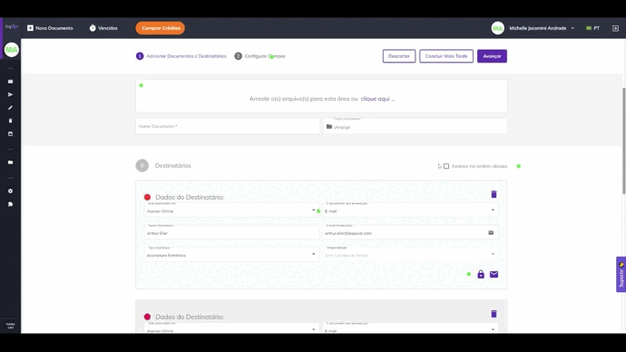

# 🟪 Como Usar

Conheça a plataforma ArqSign

**Conhecendo a Plataforma**

Acesse a plataforma de Assinatura e configure a sua Assinatura Eletrônica.

Do lado esquerdo da tela temos todos os menus disponíveis, separados por grupos: Caixa Postal, Diretórios e Administração. É importante destacar que esses menus serão apresentados conforme nível de permissão de cada usuário. Clique na imagem para ampliar.

.png>)

**CAIXA POSTAL:** Neste grupo estão concentrados os menus referentes ao processo de tramitação dos documentos. Clique na imagem para ampliar.

.png>)

**DIRETÓRIOS:** Neste grupo temos o menu Documentos. Ele é considerado um repositório de armazenamento dos documentos tramitados pela plataforma, ou seja, aqui são encontrados todos os documentos com processo de assinatura concluído. Clique na imagem para ampliar.

.png>)

**ADMINISTRAÇÃO:** Neste grupo temos as configurações de conta, usuários e grupo de usuários.

.png>)

Assinando documentos em lote pelo celular

1\. O processo de assinatura em lote também pode ser realizado diretamente pelo celular, e ocorre da mesma forma como na plataforma.

2\. A opção de “Assinatura em Lote” é apresentada, assim como a lista de documentos pendentes de assinatura para seleção. Feita a seleção dos documentos, clique no ícone “Assinatura em Lote”.

.png>)

3. Preencha os dados solicitados.

.png>)

4. Defina a representação visual (Estilo de Assinatura).

.png>)

5. Acompanhe o progresso das assinaturas.

.png>)

6. Será apresentado o informativo do processo concluído.

.png>)

7. Concluído o processo de assinatura por todos os responsáveis, o documento final pode ser consultado no ArqGED, pois ele será mantido no fluxo.

Como assinar documentos pela plataforma ArqSign?

Se você recebeu um documento para assinatura, clique no link de acesso ao documento disponível na mensagem que recebeu ou se você tem uma conta ArqSign pode acessar o documento através de sua Caixa de entrada clicando em Assinar. &#x20;

1. O documento será exibido para leitura.&#x20;
2. Após a leitura, clique em Assinar.&#x20;
3. Caso solicitado, preencha seus dados como Nome e documento. &#x20;
4. Caso solicitado, anexe documento.&#x20;
5. Aplique a representação visual de sua assinatura com um dos estilos de assinatura: Padrão (seu nome escrito), Desenho (assinatura manuscrita) ou Imagem (upload da imagem/foto de sua assinatura). &#x20;
6. Clique em Concluir&#x20;

[Clique aqui e confira como realizar a assinatura de documentos por meio da plataforma ArqSign.](../menu-superior/assinatura-de-documentos.md)

Como assinar documentos em lote?

[Clique aqui e confira como realizar a assinatura de documentos em lote por meio da plataforma ArqSign.](../menu-superior/assinatura-em-lote.md)

Como configurar seu perfil?

1. Acesse a plataforma de Assinatura e configure a sua Assinatura Eletrônica.
2. Depois de logado, clique sobre o seu nome no canto superior direito.
3. Clique em “Meu Perfil”.

.png>)

**Aba “Meus Dados”**

1\. Certifique-se que seus dados estejam todos atualizados. Caso deseje alterar algo, clique em “Editar” para habilitar os campos de edição.

.png>)

**Aba “Meus Contatos”**

Nesta aba é possível manter uma lista com os contatos mais usados na plataforma.

1\. Nesta aba é possível “Salvar os destinatários de um documento enviado para assinatura em minha lista de contatos”.

2\. Clicando no ícone “+” é possível adicionar contatos. Ao clicar nesta opção é habilitada uma tela destinada ao cadastro de um novo contato para incluir na lista. Informados os dados do contato, clique “Salvar” ou “Salvar e Fechar”.

.png>)

**Ícones – Aba “Meus Contatos”**

.png>)

**Aba “Estilo de Assinatura”**

1\. Nesta aba realize o cadastro das assinaturas que usará nos processos de assinatura de documentos. Clique em “Editar” para habilitar os campos.

2\. Passe pelas três opções existentes. Logo após concluir, clique em “Salvar”.

.png>)

**Aba “Certificado Digital”**

1\. Nesta aba é possível carregar certificados digitais na nuvem, armazenando na Plataforma ArqSign. Estes certificados armazenados serão listados no momento em que o usuário logado estiver assinando um documento com o tipo de assinatura Certificado Digital (ICP).

.png>)

**Aba “Solicitações”**

1\. Na aba Solicitações o usuário pode consultar as solicitações de transferência de proprietário do documento. Por exemplo, se na caixa de entrada o usuário alterar o proprietário do documento, a movimentação ficará registrada na aba “Solicitações”.

.png>)

Como habilitar / desabilitar a geração de QRCode no Registro de Assinaturas para acesso ao documento assinado?

Para padronizar a configuração de geração de QRCode no Registro de assinaturas para uma conta, você deverá ser um usuário com perfil Administrador Global ou Administrador da Conta e seguir os seguintes passos:

* Acesse: Administração > Conta > Configurações > Documentos;
* Clique em “Editar”;
* Em “Configurações sobre a Disponibilização do Documento Assinado aos destinatários” habilite ou desabilite a geração de QRCode no Registro de assinaturas conforme sua preferência;
* Clique em Salvar.

Essa alteração repercute para conta.

Caso necessário, um usuário com qualquer perfil pode alterar a configuração padrão desta funcionalidade apenas para um determinado fluxo. Para isso, basta seguir os seguintes passos:

* Clicar em “Novo Documento”;
* Fazer o upload de um novo documento;
* Clicar em “Configurações Avançadas”;
* Habilitar ou desabilitar a geração de QRCode de acesso do documento no Registro de Assinaturas;
* Clicar em “Aplicar”.

Como compartilhar um contato salvo na plataforma ArqSign com outros usuários da conta?

No Menu “Meu perfil” opção “Meus contatos”, selecione o contato.

O sistema exibe os dados do registro no modo de visualização e os respectivos botões de ação conforme a permissão do usuário em questão.

As opções de ação exibidas poderão ser:

– Para contatos do usuário logado na conta logada: Novo, Editar e Cancelar.

– Para contatos compartilhados por outros usuários ativos na conta logada: Novo e Cancelar.

Para compartilhar um contato, escolha a opção “Editar”, marque a opção de compartilhamento e clique em Salvar.

Como excluir um contato salvo na plataforma Arqsign?

No Menu “Meu perfil” opção “Meus contatos”, selecione o contato.

O sistema exibe os dados do registro no modo de visualização e os respectivos botões de ação conforme a permissão do usuário em questão.

As opções de ação exibidas poderão ser:

– Para contatos do usuário logado na conta logada: Novo, Editar e Cancelar.

– Para contatos compartilhados por outros usuários ativos na conta logada: Novo e Cancelar.

Para excluir um contato, escolha a opção “Excluir” e confirme a exclusão.

Como editar um contato salvo na plataforma ArqSign?

No Menu “Meu perfil” opção “Meus contatos”, selecione o contato.

O sistema exibe os dados do registro no modo de visualização e os respectivos botões de ação conforme a permissão do usuário em questão.

As opções de ação exibidas poderão ser:

– Para contatos do usuário logado na conta logada: Novo, Editar e Cancelar.

– Para contatos compartilhados por outros usuários ativos na conta logada: Novo e Cancelar.

Para editar um contato, escolha a opção “Editar”, faça a edição e clique em Salvar.

Como enviar um documento para assinatura para um contato salvo na plataforma ArqSign?

Para enviar um documento para assinatura para um contato salvo na Plataforma ArqSign no seu usuário ou compartilhado por outro usuário, siga os seguintes passos:

1. Clique em “Novo Documento”, insira o documento e execute as configurações necessárias relativas ao documento;
2. Na parte de configuração dos Destinatários, clique no botão
3. A Plataforma exibirá um Grid de consulta com todos os contatos do usuário logado que estão relacionados com a conta logada, ordenados alfabeticamente pela coluna nome e na sequência todos os contatos dos outros usuários ativos da conta logada, que tenham sido marcados para serem compartilhados com todos os usuários da conta, ordenados alfabeticamente pela coluna nome.
4. Escolha o(s) destinatário(s) e clique em “Adicionar Destinatários”.
5. Configure o Tipo de Assinatura Eletrônica para cada destinatário;
6. Configure token de segurança ou mensagem privada para cada destinatário se for o caso e siga os próximos passos para envio do documento para assinatura.

Como salvar contatos na plataforma ArqSign?

Você pode salvar contatos na Plataforma ArqSign de duas formas.&#x20;

_Primeira forma:_&#x20;

Ao cadastrar um destinatário, mantenha o Checkbox “Salvar este destinatário em minha lista de contatos” marcado.&#x20;

_Segunda forma:_&#x20;

1. Acesse o menu “Meu Perfil”&#x20;
2. Acesse a opção “Meus contatos”&#x20;
3. Para inserir um contato, clique no botão +, insira os dados, escolha se quer compartilhar o contato com todos os usuários da conta e clique em Salvar.&#x20;
4. Para que que todos os contatos para os quais você enviar um documento para assinatura a partir de agora sejam automaticamente salvos, habilite o botão “Salvar os destinatários de um documento enviado para assinatura em minha lista de contatos”.&#x20;

O Nome e o E-mail/WhatsApp do(s) destinatário(s) será(ão) salvo(s) como contato(s) do usuário na conta. Os contatos terão relação com a conta em que o usuário está logado. Ou seja, quando este usuário logar em outra conta, os contatos serão diferentes.&#x20;

_Regras:_&#x20;

Não é permitido cadastrar contato com o mesmo E-mail de um contato já cadastrado que:&#x20;

– Seja contado do usuário logado na conta, em questão.&#x20;

– Esteja relacionado a outros usuários ativos da conta logada e que estejam sendo compartilhado na conta.&#x20;

Somente é permitido cadastrar contato do tipo e-mail com um e-mail válido.&#x20;

Não é permitido cadastrar contato com mesmo Telefone de um contato já cadastrado que:&#x20;

– Seja contado do usuário logado na conta, em questão.&#x20;

– Esteja relacionado a outros usuários ativos da conta logada e que estejam sendo compartilhado na conta.&#x20;

Somente é permitido cadastrar contato do WhatsApp com um número de telefone válido.&#x20;

O campo “Compartilhar com todos os usuários da conta.” é de preenchimento opcional para o usuário informar se o contato que está sendo criado será compartilhado, ou não, com outros contatos da conta. &#x20;

Para entender melhor, [clique aqui ](https://www.youtube.com/watch?v=b73Cu1HCaWA)e assista ao vídeo explicativo.

Como verificar a validade de um documento impresso assinado na plataforma ArqSign, por meio do QRCode?

Se você tem um documento impresso que foi assinado através da plataforma ArqSign e precisa verificar sua validade, existem alguns itens de segurança que você pode verificar conforme abaixo:

1. Localize nas páginas do documento assinado através da Plataforma ArqSign uma marca d’água com o “**ID do documento”** no canto superior esquerdo;
2. Confirme que o “**ID do documento**” é o mesmo em todas as páginas e no Registro de Assinaturas.
3. Toda vez que um documento é assinado através da Plataforma ArqSign, um arquivo com o nome de “Registro de Assinaturas” é gerado. O “Registro de Assinaturas” contém:

a) A identificação do documento a que pertence, ou seja, o “**ID do documento**”;

b) O **Hash** do documento (comprovação de integridade do documento);

c) Informações sobre o **Remetente, data de criação e envio**;

d) **Status** do documento, **tamanho**, **quantidade de páginas e assinaturas**;

e) **QRCode** que dá **acesso ao documento na Plataforma ArqSign**\*;

f) **Link** que dá **acesso ao documento na Plataforma ArqSign**\*;

g) **Detalhamento de todas as assinaturas contendo:**

I. Nome

II. E-mail

III. Documento

IV. Nível de segurança

V. Certificado ICP-Brasil utilizado

VI. Data e hora

VII. IP do dispositivo

VIII. Geolocalização

h) Trilha de auditoria percorrida por cada participante do Fluxo de assinaturas detalhada através dos eventos:

I. Lido – por qual signatário, data e hora, IP e Geolocalização

II. Assinatura Online – por qual signatário, data e hora, IP e Geolocalização.

4\. Caso você queira verificar a validade jurídica do documento no Portal ITI ou Adobe, acesse o documento através do QRCode.

\*Ao acessar o documento na Plataforma ArqSign via **QRCode ou link,** você poderá:

* Baixar o documento e o “Registro de Assinaturas”;
* Exibir o histórico (trilha de auditoria);
* Exibir o Termo de aceite para assinatura eletrônica;
* Verificar os detalhes das assinaturas.

Como pesquisar um documento na plataforma ArqSign?

Localizar um documento na Plataforma ArqSign é super prático, basta seguir as instruções abaixo:&#x20;

Primeiro, encontre a Caixa onde o documento está localizado. Todas as caixas (Caixa de entrada, Enviados, Rascunhos, Excluídos, Renovações) têm a funcionalidade de pesquisa, que aparece como “Filtrar”. &#x20;

Clique no campo “Filtrar”. &#x20;

As opções de pesquisa serão exibidas. &#x20;

Insira as informações de pesquisa nos campos desejados, como o nome do signatário, status, pasta do documento ou data de conclusão. &#x20;

Clique em “Filtrar”. &#x20;

Todos os documentos correspondentes às informações inseridas nos filtros serão exibidos. &#x20;

Para cancelar o filtro, basta clicar no “X” que aparece no canto direito do campo “Filtrar”. &#x20;

Vi como é fácil? Agora você pode localizar seus documentos na Plataforma ArqSign de forma rápida e eficiente! &#x20;

Personalização da plataforma ArqSign com as cores e logomarca do cliente

Na plataforma ArqSign, as notificações (e-mails e mensagens de WhatsApp) para os remetentes e destinatários podem ter os seguintes layouts:&#x20;

1. Layout Padrão da Plataforma ArqSign ou&#x20;
2. Layout com suas cores e logomarca.&#x20;

Os itens disponíveis para personalização são:&#x20;

* Cabeçalho&#x20;
* Cor do texto superior&#x20;
* Cor do botão do e-mail ou mensagem de WhatsApp&#x20;

Para personalizar as notificações da Plataforma ArqSign, basta que o Administrador da conta acesse: Administração > Conta > Configurações > Outros e seguir os seguintes passos:&#x20;

1. No canto inferior direito clique em editar;&#x20;
2. Em “Notificações Personalizas”, altere para Ativado;&#x20;
3. Em “Notificações por E-mail”, execute as seguintes etapas:&#x20;

* insira uma imagem para o cabeçalho das mensagens com as dimensões descritas no campo;&#x20;
* escolha a cor de destaque para o texto do e-mail.&#x20;

&#x20;     4\. Em “Notificações por WhatsApp”, execute a seguinte etapa:&#x20;

* Insira uma imagem para cabeçalho das mensagens com as dimensões descritas no campo.&#x20;

&#x20;     5\. Se quiser visualizar as notificações com as mudanças que você fez clique em “Visualizar Notificação”;&#x20;

&#x20;     6\. Quando todos os ajustes estiverem ok, clique em “Salvar”.&#x20;

.png>)

Notificação padrão:

.png>)

Exemplo de notificação personalizada simulação:

.png>)

Como configurar uma mensagem privada?

1. Clique em ‘Novo Documento’
2. Selecione o documento que deseja encaminhar e informe os dados do signatário como nome, e-mail etc.
3. Abaixo dessas informações haverá um símbolo de ‘mensagem’ , onde ao clicar abrirá uma aba de mensagem privada.
4. Na aba de mensagem privada é possível informar o assunto e a mensagem que deseja enviar somente para o signatário selecionado. Os demais signatários receberão a mensagem padrão.

Como configurar o token de segurança?

1. Clique em ‘Novo Documento’
2. Selecione o documento que deseja encaminhar e informe os dados do signatário como nome, e-mail etc.
3. Abaixo dessas informações haverá um símbolo de um ‘cadeado’, onde ao clicar abrirá uma aba de segurança.
4. Na aba de segurança é possível gerar o código ‘Automaticamente ou Manual’ e informar o e-mail, SMS, Whatsapp ou nenhum meio em que deseja encaminhar o token.
5. Após essas configurações o token de segurança será enviado através do meio selecionado quando o signatário clicar para acessar o documento ou se você não selecionou nenhum meio você poderá informar para o signatário.

Como solicitar anexos e selfie?

Clique em ‘Novo Documento’.&#x20;

Selecione o documento que deseja encaminhar, configure os destinatários e avance.&#x20;

Configure o campo de assinatura do destinatário.&#x20;

No canto direito, caso deseje, solicite as informações complementares como Nome e Documento e se necessário habilite o preenchimento obrigatório.&#x20;

Se deseja solicitar Anexos como imagem de documentos ou selfie, habilite para solicitar que o signatário anexe um documento.&#x20;

Informe o documento que deseja que o signatário anexe e se deseja que o anexo seja obrigatório para a conclusão do processo de assinatura daquele documento.&#x20;

Você também pode configurar a permissão para que todos os signatários acessem o anexo ou não.&#x20;

Quando o destinatário receber o documento para assinar ele deverá proceder da seguinte forma:&#x20;

Assinar o documento e preencher dados solicitados;&#x20;

Clicar na solicitação de Selfie;&#x20;

Acessar a câmera do celular ou computador;&#x20;

Fazer a foto conforme solicitado;&#x20;

Escolher a foto como anexo;&#x20;

Concluir a assinatura.&#x20;

Como acessar os anexos de um documento?

1. Localize o documento que deseja visualizar o anexo.
2. Clique duas vezes sobre o documento.
3. No canto direito, junto aos signatários dos documentos, é possível realizar o download do anexo.

Como configurar assinatura com documento estrangeiro?

Para configurar assinatura solicitando um documento estrangeiro, siga os seguintes passos:

1. Depois de fazer o upload do documento;
2. Inserir os destinatários e clicar em ‘avançar”;
3. Na tela “configurar campos” você irá configurar a coleta de assinaturas dos destinatários;
4. Selecione o destinatário no topo da tela;
5. No canto direito, selecione o tipo de assinatura para Pessoa física;
6. Logo abaixo, há a configuração de “Informações complementares de assinatura”;
7. Selecione o check box “Nome do Signatário”;
8. Selecione o check box “Documento do Signatário”;
9. Na caixa “Documento”, escolha “outro”;
10. Na caixa abaixo especifique o documento que deseja solicitar e se quiser configure nas demais caixas os tipos de caracteres válidos e a quantidade de caracteres para validação.

Como inserir um destinatário em cópia ou como observador em um fluxo?

Na Plataforma ArqSign é possível colocar uma pessoa em cópia ou como observador em um fluxo. Desta forma, ao final do processo de assinatura, essa pessoa ou pessoas receberão o documento assinado.

Para fazer esta configuração proceda da seguinte forma:

1. Clique em “Novo documento”;
2. Faça o upload do documento a ser assinado e as devidas configurações para o documento;
3. Em “Destinatários” configure o campo “Este destinatário irá” como “Receber uma cópia”;
4. Prossiga com as demais configurações.

Como alterar o cartão de crédito para faturamento e compra na plataforma ArqSign?

Você pode alterar o seu cartão de crédito para faturamento e compras na Plataforma ArqSign, seguindo o seguinte passo a passo:

1\) Vá até o menu “Administração”;

2\) Clique em “Conta”;

3\) Clique em “Faturamento e Uso”;

4\) Clique em “Alterar a forma de pagamento”.

Como configurar um documento para ser assinado com certificado digital (assinatura digital) ou sem certificado digital (assinatura eletrônica)?

Na Plataforma Arqsign, ao configurar um fluxo de assinaturas você pode determinar qual tipo de assinatura deverá ser executada por destinatário escolhendo entre:&#x20;

**a) Assinatura eletrônica** (A ArqSign produz assinaturas eletrônicas avançadas com validade jurídica de acordo com MP 2.200-2 de 24/08/2001 e Lei 14.063 de 23/11/2020);&#x20;

**b) Assinatura com Certificado digital do tipo ICP-Brasil** (A ArqSign produz assinaturas digitais qualificadas de acordo com MP 2.200-2 de 24/08/2001 e Lei 14.063 de 23/11/2020);&#x20;

**c) Assinatura com Certificado digital Pessoal Todos os tipos** (A ArqSign produz assinaturas eletrônicas e digitais através de outros certificados).&#x20;

Para determinar o tipo de assinatura siga o seguinte passo a passo:&#x20;

Após fazer o upload do documento e configurações necessárias para o documento, siga para a configuração dos destinatários;&#x20;

Ao configurar um destinatário, no campo “Tipo de assinatura” escolha uma das opções conforme descrição acima;&#x20;

Pronto! Agora é só configurar os demais destinatários e a posição de assinatura no documento e enviar.&#x20;

Como assinar um documento com Certificado Digital – ICP-Brasil?

Na Plataforma ArqSign, o remetente de documentos pode determinar o tipo de assinatura que o destinatário deverá executar escolhendo entre uma das opções abaixo:&#x20;

**a) Assinatura eletrônica** (A ArqSign produz assinaturas eletrônicas avançadas com validade jurídica de acordo com MP 2.200-2 de 24/08/2001 e Lei 14.063 de 23/11/2020);&#x20;

**b) Assinatura com Certificado Digital Pessoal do Tipo ICP-Brasil** (A ArqSign produz assinaturas digitais qualificadas de acordo com MP 2.200-2 de 24/08/2001 e Lei 14.063 de 23/11/2020);&#x20;

**c) Assinatura com Certificado Digital Pessoal Todos os Tipos** (A ArqSign produz assinaturas eletrônicas e digitais através de outros certificados).&#x20;

Se você recebeu um documento para assinar via Plataforma ArqSign e precisa assinar com Certificado Digital pela primeira vez, siga os seguintes passos:&#x20;

* Abra o documento, leia e se aceitar, clique em Assinar;&#x20;
* Execute a assinatura no formato de sua preferência e clique em Avançar;&#x20;
* Ao clicar em “Avançar”, você será informando que a assinatura solicitada deverá ser executada com certificado digital;&#x20;
* Selecione qual certificado será utilizado para assinar o documento através das opções:&#x20;

1\) Certificados que foram inseridos na ArqSign e estão salvos na nuvem e&#x20;

2\) Certificados salvos no computador de quem está assinando o documento.&#x20;

.png>)

* Para assinatura com Certificado inserido na Plataforma, clique na opção indicada;&#x20;
* Para assinatura com Certificado digital instalado em sua máquina você deverá seguir os passos indicados para:&#x20;

1. Adicionar a extensão ArqSign para seu navegador;&#x20;
2. Instalar o módulo desktop;&#x20;

* Insira a senha do Certificado Digital e clique em Avançar&#x20;

O passo a passo para adicionar a extensão ao seu navegador e o módulo desktop podem ser acessados abaixo:&#x20;

* [Como adicionar extensão ArqSign no navegador Chrome](https://arquivar.com.br/faq-assuntos/como-adicionar-extensao-arqsign-certificado-digital-no-navegador-chrome/).&#x20;
* [Como adicionar extensão ArqSign no navegador Edge](https://arquivar.com.br/faq-assuntos/como-adicionar-extensao-arqsign-certificado-digital-no-navegador-edge/).&#x20;
* [Como adicionar extensão ArqSign no navegador FireFox](https://arquivar.com.br/faq-assuntos/como-adicionar-extensao-arqsign-no-navegador-firefox/).&#x20;
* [Como instalar módulo desktop.](https://arquivar.com.br/faq-assuntos/como-instalar-modulo-desktop/)

Como instalar o módulo desktop?

1\) Ao executar a instalação do Módulo Desktop, o Microsoft defender SmartScreen, a princípio, impede a instalação do módulo, pelo fato do módulo não ser um aplicativo presente na Microsoft Store. Para dar sequência na instalação deve-se clicar em Mais informações.

2\) Após clicar em Mais informações, deve-se clicar no botão Executar assim mesmo.

3\) Após isto, deve-se seguir o processo de instalação e clicar no botão Concluir, ao término da instalação, e o Módulo Desktop já estará ativo no computador.

Como adicionar a extensão ArqSign no navegador FireFox?

Quando um signatário de um documento que exige um certificado digital, seja ICP-Brasil ou outro qualquer, aplicar sua representação visual e clicar no botão Avançar, será exibida uma mensagem informando que para assinar o documento com Certificado Digital instalado no computador é necessário adicionar a extensão no seu navegador e na sequência instalar o módulo desktop. O processo é simples. Basta clicar no link exibido e seguir o passo a passo abaixo para efetuar essas

1. Ao clicar no link, duas ações serão executadas ao mesmo tempo, a primeira é o download do instalador do Módulo Desktop (No Firefox é solicitada uma confirmação para iniciar o download). Deve-se aguardar o download ser concluído e seguir os passos do Tutorial Instalação Módulo Desktop.
2. A outra ação é a abertura de uma nova aba no navegador, na Firefox Browser Add-ons, com o plugin da ArqSign.
3. Ao clicar no botão Adicionar ao Firefox, será aberta uma notificação para a confirmação da adição da extensão no navegador.
4. Ao clicar em Adicionar, aparecerá uma notificação informando que a extensão foi adicionada ao navegador. Após isto, a aba do Firefox Browser Add-ons pode ser fechada.
5. Após a adição do plugin no navegador, caso o Módulo Desktop ainda não tenha sido instalado, a aplicação ainda indicará um link para download do mesmo.
6. Com as duas instalações concluídas, a modal será atualizada, listando os certificados salvos no computador do usuário.
7. No Windows, ao clicar no botão Concluir, pode ser solicitada a permissão para que o plugin acesse os certificados, neste ponto, deve-se clicar em Permitir para liberar a utilização dos certificados digitais.

Caso a extensão e o módulo desktop já tenham sido instalados essa ação não será requerida novamente.

Caso o signatário tenha Certificados Digitais salvos na plataforma ArqSign, eles serão exibidos. Para utilizá-los basta selecionar e seguir os próximos passos não necessitando da instalação da extensão e módulo.

Como adicionar a extensão ArqSign Certificado Digital no navegador Edge?

Quando um signatário de um documento que exige um certificado digital, seja ICP-Brasil ou outro qualquer, aplicar sua representação visual e clicar no botão Avançar, será exibida uma mensagem informando que para assinar o documento com Certificado Digital instalado no computador é necessário adicionar a extensão no seu navegador e na sequência instalar o módulo desktop. O processo é simples. Basta clicar no link exibido e seguir o passo a passo:

1. No Microsoft Edge, ao clicar no link disponível, pode acontecer o bloqueio de pop-up.
2. Caso isto aconteça, deve-se clicar no ícone de bloqueio de pop-ups, ao lado do URL da página.
3. Ao clicar no ícone, deve-se permitir pop-ups para a página da ArqSign.
4. Após o desbloqueio dos pop-ups, deve-se clicar no link disponível novamente. Ao clicar no link, duas ações serão executadas ao mesmo tempo, a primeira é o download do instalador do Módulo Desktop. Deve-se aguardar o download ser concluído e seguir os passos do Tutorial Instalação Módulo Desktop. A segunda é a abertura de uma aba da Microsoft Store com o plugin da ArqSign.
5. Ao clicar no botão Obter, será aberta uma notificação para a confirmação da adição da extensão no navegador.
6. Ao clicar em Adicionar extensão, aparecerá uma notificação informando que a extensão foi adicionada ao navegador. Após isto, a aba do Microsoft Store pode ser fechada.
7. Após a adição do plugin no navegador, caso o Módulo Desktop ainda não tenha sido instalado, a aplicação ainda indicará um link para download dele.
8. Com as duas instalações concluídas, a modal será atualizada, listando os certificados salvos no computador do usuário.
9. No Windows, ao clicar no botão Concluir, pode ser solicitada a permissão para que o plugin acesse os certificados, neste ponto, deve-se clicar em Permitir para liberar a utilização dos certificados digitais.

Caso a extensão e o módulo desktop já tenham sido instalados essa ação não será requerida novamente.

Caso o signatário tenha Certificados Digitais salvos na plataforma ArqSign, eles serão exibidos. Para utilizá-los basta selecionar e seguir os próximos passos não necessitando da instalação da extensão e módulo.

Como adicionar a extensão ArqSign Certificado Digital no navegador Chrome?

Quando um signatário de um documento que exige um certificado digital, seja ICP-Brasil ou outro qualquer, aplicar sua representação visual e clicar no botão Avançar, será exibida uma mensagem informando que para assinar o documento com Certificado Digital instalado no computador é necessário adicionar a extensão no seu navegador e na sequência instalar o módulo desktop. O processo é simples. Basta clicar no link exibido e seguir o passo a passo abaixo para efetuar essas configurações:

1. Clique no link indicado para abrir a loja no navegador;
2. A extensão ArqSign Certificado Digital será exibida;
3. Clique em “Usar no Chrome”;
4. Ao clicar no botão Usar no Chrome, será aberta uma notificação para a confirmação da adição da extensão no navegador. Clique em adicionar extensão;
5. Ao clicar em Adicionar extensão, aparecerá uma notificação informando que a extensão foi adicionada ao navegador. Após isto, a aba do Chrome Web Store pode ser fechada.
6. Após a adição do plugin no navegador, caso o Módulo Desktop ainda não tenha sido instalado, a aplicação ainda indicará um link para download dele;
7. No caso de o Módulo Desktop não ter sido instalado ainda, um pop-up aparecerá com uma opção para instalação ou atualização do Módulo Desktop em seu computador.
8. Clique no link indicado para fazer o download;
9. Localize o arquivo instalador do módulo baixado e execute-o para instalação;
10. Ao executar a instalação do Módulo Desktop, o Microsoft defender SmartScreen, a princípio, impede a instalação do módulo, pelo fato do módulo não ser um aplicativo presente na Microsoft Store. Para dar sequência na instalação deve-se clicar em Mais informações;
11. Após clicar em Mais informações, deve-se clicar no botão Executar assim mesmo;
12. Clique em Instalar;
13. Após finalizar a instalação, clique em concluir
14. O pop-up será atualizado e solicitará que você escolha o certificado digital que deseja utilizar;
15. Escolha o certificado e siga com a assinatura;
16. No Windows, ao clicar no botão Concluir, pode ser solicitada a permissão para que o plugin acesse os certificados. Clique em “Permitir “para liberar a utilização dos certificados digitais.

Caso a extensão e o módulo desktop já tenham sido instalados essa ação não será requerida novamente.

Caso o signatário tenha Certificados Digitais salvos na plataforma ArqSign, eles serão exibidos. Para utilizá-los basta selecionar e seguir os próximos passos não necessitando da instalação da extensão e módulo.

Como compartilhar um documento assinado pela Plataforma ArqSign?

* Faça o login em sua conta ArqSign pelo link: [https://app.arqsign.com/auth/login](https://app.arqsign.com/auth/login);
* Clique em ‘Enviados’;
* Localize o documento que deseja compartilhar;
* Essa opção permite que o usuário crie um link de acesso a um ou mais documentos do processo que poderá ser compartilhado com outras pessoas que não sejam participantes do processo de assinatura. Esse link pode ter prazo de validade determinado ou indeterminado e o usuário pode definir se deseja permitir que as pessoas que acessarem visualizem também os anexos enviados pelos signatários.
* Quando o processo com mais de um documento não agrupados não possui compartilhamento de documentos, o sistema abre a modal para o usuário selecionar os documentos do processo que deseja compartilhar.
* Quando o processo com mais de um documento possui compartilhamento de documentos, o sistema abre a modal com os links já compartilhados.
* Ao expandir as ações do link de compartilhamento, é possível visualizar a tela de compartilhamento novamente ou e excluir o compartilhamento realizado.
* Ao compartilhar os documentos do processo, o usuário tem a possibilidade de enviá-los por e-mail clicando no botão "Enviar Link por e-mail".
* Adicione no campo indicado todos os e-mails que devem receber a documentação compartilhada.

Como alterar o Nome do Remetente/Usuário?

Depois que um usuário é criado, ele mesmo pode alterar os dados abaixo do seu perfil:

.png>)

Essa alteração vai refletir nas notificações de solicitação de assinatura que o usuário envia.

.png>)

Os passos para alteração são:&#x20;

1. Acesse no canto superior direito da plataforma o menu com o seu nome de usuário atual;&#x20;
2. Clique em “Meu Perfil”;&#x20;
3. Na aba “Meus dados” clique em “Editar”;&#x20;
4. Insira o nome desejado no campo "Nome completo" - O nome inserido neste campo será exibido como remetente no envio dos documentos. A plataforma utilizará apenas o primeiro e o último nome. Se for necessário exibir o nome completo como remetente do e-mail, conecte os nomes utilizando um _underline_ ( \_ )
5. Clique em “Salvar”.&#x20;

Como configurar a assinatura para Pessoa Física/CPF ou Pessoa Jurídica/CNPJ?

Na plataforma ArqSign, você pode escolher se o documento será assinado por uma Pessoa física ou jurídica.

Para isso, o remetente deve escolher o tipo de assinatura durante o processo de configuração do fluxo conforme abaixo:

1. Faça o Upload do documento e suas configurações se necessário;
2. Insira o destinatário
3. No Campo “Este destinatário irá:” marque as opções de como o destinatário atuará:

* Assinar Online como Pessoa Física
* Assinar Online como Pessoa Jurídica
* Receber uma cópia

Um destinatário por assinar durante o mesmo processo como Pessoa Física e Jurídica.

Ao finalizar a configuração dos destinatários clique em Avançar

Se você for posicionar as assinaturas, deverá posicionar a assinatura de Pessoa Física e Jurídica para o destinatário que você configurou para assinar com estes dois tipos de assinatura.

Caso você escolha a opção de posicionamento automático de assinaturas, a própria plataforma vai posicionar todas as assinaturas automaticamente.&#x20;

Como assinar um documento na Plataforma ArqSign quando a solicitação para assinatura é enviada por WhatsApp?

Se um documento foi enviado para sua assinatura pela Plataforma ArqSign por WhatsApp, você receberá uma mensagem com o nome do remetente que pode ser aberta no aplicativo do seu celular ou WhatsApp Web.&#x20;

Caso seja a primeira vez que você interage com o remetente pelo WhatsApp, vá ao final da mensagem e adicione aos seus contatos para habilitar todos os links da mensagem.&#x20;

Clique no link presente na mensagem e você terá acesso ao documento para leitura.&#x20;

Após a leitura, basta clicar em Assinar. Preencha os dados se solicitado. Anexe documentos se solicitado. Aplique sua representação visual e clique em Concluir.&#x20;

Se você não tiver uma conta ArqSign, será convidado a criar uma conta para armazenar esse e outros documentos assinados através da plataforma e ainda testar grátis por 15 dias.&#x20;

Quando todos os destinatários assinarem, todos receberão um e-mail ou WhatsApp com o documento assinado por todas as partes.&#x20;

Além disso, todos os destinatários que tiverem uma Conta ArqSign grátis ou paga, receberão uma cópia na caixa de entrada da aplicação e poderão fazer a gestão deste documento na plataforma.

Como assinar um documento na Plataforma ArqSign quando a solicitação para assinatura é enviada por e-mail?

Ao receber um documento por e-mail solicitando sua assinatura, ele conterá o nome do remetente e no título terá o nome do documento a ser assinado. Caso não localize o e-mail em sua caixa de entrada, verifique na Caixa de Spam ou promoções.&#x20;

Abra o e-mail. (Lembrando que a plataforma pode ser acessada de qualquer dispositivo – computador, tablet ou celular)&#x20;

Clique em “Assinar Documento” e você terá acesso ao documento para leitura.&#x20;

Após a leitura, basta clicar em Assinar. Preencha os dados se solicitado. Anexe documentos se solicitado. Aplique sua representação visual e clique em Concluir.&#x20;

Se você não tiver uma conta ArqSign, será convidado a criar uma conta para armazenar esse e outros documentos assinados através da plataforma e ainda testar grátis por 15 dias.&#x20;

Quando todos os destinatários assinarem, todos receberão um e-mail ou WhatsApp com o documento assinado por todas as partes.&#x20;

Além disso, todos os destinatários que tiverem uma Conta Arqsign grátis ou paga, receberão uma cópia na caixa de entrada da aplicação e poderão fazer a gestão deste documento na plataforma.&#x20;

Como consultar o andamento das solicitações de transferência de documentos?

Para consultar o andamento das solicitações de transferência de documentos, siga os seguintes passos:&#x20;

Acesse o Menu “Meu perfil” -> “Solicitações”;&#x20;

A Plataforma lista as solicitações de transferência de documentos do usuário logado ordenadas pela data da solicitação decrescente (solicitação mais recente no topo).&#x20;

Através do botão de “Ações” você poderá visualizar solicitações com status “Solicitado” ou “Erro”, “Cancelar” e “Editar” a solicitação de transferência de documentos.&#x20;

Como inativar um usuário e alterar a propriedade de seus documentos?

Ao inativar um usuário, pode ser necessário alterar a propriedade dos documentos deste usuário para que outra pessoa siga com a gestão dos documentos.&#x20;

Você poderá executar esta ação se for Administrador Global.&#x20;

Para isso siga os seguintes passos:&#x20;

1. Acesse o menu “Administração” -> Usuários;&#x20;
2. Selecione o usuário que deseja inativar;&#x20;
3. Clique em Ações;&#x20;
4. Clique em inativar;&#x20;
5. Se o usuário que está sendo inativado não possuir solicitação de transferência de documentos com status “Solicitado” ou “Em Processo” e tiver enviado algum documento que esteja com status “Aguardando” ou “Em Processo” ou “Concluído” o sistema apresentará mensagem informando que o usuário que está sendo inativado possui documentos como proprietário, solicitando a confirmação de alterar a propriedade dos documentos do usuário, em questão;&#x20;
6. Escolha a opção “Transferir”;&#x20;
7. Selecione um novo proprietário;&#x20;
8. Selecione quais documentos devem ser transferidos;&#x20;
9. Clique em Alterar;&#x20;
10. A transferência será executada em até 24 horas;&#x20;
11. Para consultar o andamento das solicitações de transferências acesse: “Meu perfil”-> “Solicitações”.&#x20;

Como alterar o proprietário de um fluxo ou documento?

Se você é o remetente de um fluxo com status “Aguardando”, “Em processo” ou “Concluído”, pode alterar o proprietário para outro usuário ativo da conta. Desta forma, as notificações automáticas referentes ao fluxo passarão a ser enviadas para o novo proprietário.

Para executar esta alteração siga o seguinte passo a passo:&#x20;

**Opção 1:**&#x20;

1. Localize o fluxo no menu Enviados;&#x20;
2. Clique na caixa suspensa localizada no canto direito;&#x20;
3. Clique em Alterar proprietário;&#x20;
4. Informe o novo proprietário e salve.

Caso seja transferido apenas um documento o processo será realizado instantaneamente;&#x20;

Para dois documentos ou mais é necessário um prazo de 24h para a conclusão da solicitação de transferência. &#x20;

**Opção 2:**&#x20;

1. Ao inativar um usuário que possui documentos em sua conta é possível realizar a transferência desses documentos para um novo usuário responsável.&#x20;
2. Quando clicar em ‘Inativar’ um bloco de confirmação irá aparecer;&#x20;
3. No bloco confirme que deseja transferir os documentos;&#x20;
4. Selecione o novo proprietário;&#x20;
5. E os documentos que deseja transferir por status: ‘Todos’ ou ‘Em assinatura ou com renovação agendada’;&#x20;
6. &#x20;Clique em ‘Alterar’;&#x20;
7. O usuário será inativado e os documentos serão transferidos em 24h;&#x20;
8. Ao inativar um usuário sem documentos na conta, não é necessário realizar esse procedimento;&#x20;
9. A transferência de documento só pode ser executada para um usuário ativo.&#x20;
10. Para consultar o andamento das solicitações de transferências acesse: “Meu perfil” –> “Solicitações”.&#x20;

Caso você queira  transferir a propriedade dos documentos de um usuário que foi inativado, verifique o passo a passo em “Como inativar um usuário e alterar a propriedade de seus documentos?”&#x20;

Como consultar o motivo de recusa para assinatura de documento?

Você pode verificar o motivo de recusa de assinatura de um documento através da notificação enviada para o remetente e quando abrir o documento.&#x20;

Para acessar o motivo de recusa ao abrir o documento siga os seguintes passos:&#x20;

1. Abra o arquivo com o fluxo de assinatura “recusada”. Ele estará com o status Cancelado”;
2. Clique sobre o signatário e verifique o motivo de recusa.&#x20;

Como recusar a assinatura de um documento?

1. Abra o arquivo que recebeu para assinatura;&#x20;
2. No canto superior direito clique em Assinar ou Opções;&#x20;
3. Clique em Recusar assinatura;&#x20;
4. Informe o motivo de recusa – Essa informação ficará disponível para o remetente ao abrir o arquivo e através de notificação por e-mail;&#x20;
5. Clique em Recusar assinatura.&#x20;
6. O remetente receberá o retorno através de uma notificação por e-mail ou poderá acessar quando abrir o documento e clicar sobre o seu nome.
7. &#x20;O fluxo é automaticamente cancelado quando há uma recusa para assinatura.
8. Analise o motivo de recusa, faça as alterações no documento se necessário e crie um novo fluxo para assinatura.

Como verificar o versionamento dos documentos salvos na plataforma?

A cada renovação de documento através da ferramenta de renovação da Plataforma ArqSign, é feito um vínculo dos novos documentos aos anteriores.

Para acessar este recurso siga os seguintes passos:

1. Menu “Enviados”.
2. Localize o fluxo que você deseja consultar.
3. No botão “Histórico”, clique no drop down.
4. Escolha a opção “Versionamento”.

Analise as informações.

Como ativar fluxo de renovação de documento automaticamente?

Caso você tenha agendado a renovação de um documento, assim que atingido o prazo para renovação, você pode acionar a renovação automática que um novo fluxo será criado com as mesmas configurações de signatários que o original.

1. Clique em Renovações;
2. Selecione Fluxo concluído;
3. Clique em Renovar – A Plataforma automaticamente gera um novo fluxo com todos os signatários do fluxo original;
4. Faça upload do arquivo para renovação. O novo arquivo fica vinculado ao(s) arquivo(s) anterior(es) criando um versionamento de documentos.
5. Revise os signatários.
6. Configure as representações visuais;
7. Envie e Pronto!

Como alterar a renovação, vencimento de documento ou controle de reajuste?

Após a conclusão de um fluxo de assinatura:

1. Clique em Enviados;
2. Selecione Fluxo concluído;
3. Clique em Histórico;
4. Clique em Alterar Renovação;
5. Defina o novo prazo em meses após a finalização das assinaturas;
6. Clique em Alterar.

Quando chegar a data definida para vencimento do documento, renovação ou reajuste, a plataforma ArqSign enviará um e-mail ao proprietário do fluxo informando que o documento está pronto para renovação, reajuste etc.

Como funciona o acesso à uma conta?

Na ArqSign, você pode ter acesso a mais de uma conta com o mesmo e-mail.

**Exemplo:** Vamos supor que você seja advogado de um escritório. Você pode ter uma conta teste grátis pessoal com um e-mail e com o mesmo e-mail ter um usuário na Conta do Escritório e outro usuário na conta de um cliente para consultar documentos do cliente. Para ter acesso à conta de terceiros, os Administradores Globais da conta precisam lhe convidar. O acesso pode ser bloqueado a qualquer momento pelo Administrador Global.

O que é um usuário?

Usuário é a pessoa que utiliza a Plataforma ArqSign para enviar, acompanhar fluxo, coletar assinaturas, acessar e gerir documentos. Um usuário tem que estar atrelado à uma conta ou quando ele também tem que assinar um documento ele se torna um signatário.

Na plataforma ArqSign um usuário pode ter os seguintes Perfis:

a) Remetente de Documentos – Usuário sem permissão de acesso às funcionalidades de gestão da plataforma. Seu acesso é focado no envio e gestão de seus documentos.

b) Administrador Global – Usuários com permissão de acesso a todas as funcionalidades da plataforma inclusive gestão de pastas e usuários.

O que é signatário?

Signatário é uma pessoa física ou jurídica que participa do processo de assinatura (assina um documento). O signatário não precisa ter conta na Plataforma ArqSign para assinar.

O que fazer quando signatário informa que não recebeu WhatsApp com link para assinatura?

Quando um dos signatários informa que não recebeu o WhatsApp com o link para assinatura, verifique os seguintes itens antes de reenviar ou abrir um chamado:

1. Confira se você digitou o número do WhatsApp corretamente;
2. Caso o número que você digitou esteja errado, você pode corrigi-lo e enviar novamente através do Menu Enviados > Reenviar;
3. Peça ao signatário para conferir se ele está com acesso à internet móvel ou Wi-Fi;
4. Peça ao cliente para entrar no WhatsApp e verificar se não recebeu nova mensagem, pois, pode ser apenas um problema de configuração de recebimento de notificações;
5. Caso o problema não seja resolvido com nenhuma das opções acima, pode ser que a mensagem enviada tenha sido bloqueada pelo próprio WhatsApp porque o signatário não está com o aplicativo atualizado. Para atualizar o aplicativo o signatário deve acessar a loja de aplicativos e clicar em Atualizar ([https://faq.whatsapp.com/5481509731946576/?helpref=search\&query=mensagem…](https://faq.whatsapp.com/5481509731946576/?helpref=search\&query=mensagem%20n%C3%A3%C2%A3o%20recebida\&search_session_id=cb86af1005f8183efe4a18d785336191\&sr=2));
6. Se ainda assim não houve a atualização, você pode enviar o link de atualização de Serviços do WhatsApp para o signatário atualizar: Link: [https://wa.me/tos/20210210](https://wa.me/tos/20210210). O signatário deve abrir o link no WhatsApp e aceitar os termos.
7. Após o signatário atualizar o aplicativo e/ou os Termos de Serviços do WhatsApp, faça o reenvio do fluxo através da Plataforma ArqSign clicando em Enviados -> Reenviar.
8. Caso mesmo assim o signatário não receba a mensagem de WhatsApp, entre contato conosco e forneça as informações abaixo para analisarmos o que pode ter acontecido.

Informações necessárias:

* Nome
* Empresa
* WhatsApp
* Nome do documento enviado
* Data do envio
* Signatário

O que fazer quando signatário informa que não recebeu e-mail com link para assinatura?

Quando um dos signatários informa que não recebeu o e-mail com o link para assinatura, verifique os seguintes itens antes de reenviar ou abrir um chamado:

1. Confira se você digitou o endereço de e-mail corretamente;
2. Confira se o cliente está com acesso à internet;
3. Se você tiver enviado o link para uma caixa de e-mail gratuita, solicite ao signatário para conferir a caixa de **SPAM, Lixo eletrônico ou Promoções**, pois, estes servidores podem fazer uma classificação errônea de nossos e-mails e enviá-los para essas caixas;
4. Se você enviou o link para uma pessoa ou empresa que tenha antivírus ou firewall instalados na máquina ou servidor, solicite que ele verifique **se o e-mail com o link** **não foi bloqueado pelo sistema de segurança**;
5. Se você fez todas estas análises e não localizou nenhum problema, tente reenviar o fluxo através da Plataforma ArqSign e verifique novamente nas pastas acima mencionadas;
6. Caso mesmo assim o signatário não receba o e-mail, entre contato conosco e forneça as informações abaixo para analisarmos o que pode ter acontecido.

Informações necessárias:

* Nome
* Empresa
* E-mail
* Nome do documento enviado
* Data do envio
* Signatário

Como configurar uma ordem / sequência para as assinaturas?

A plataforma ArqSign permite inserir uma sequência para assinatura de documentos.&#x20;

Para acessar a funcionalidade habilite a opção” Assinar na ordem abaixo” durante a configuração dos destinatários.&#x20;

Insira os destinatários na ordem em que deseja as assinaturas.&#x20;

Observe que aparece um campo chamado “Ordem” e que as pessoas deverão assinar o documento de acordo com essa ordem, sendo que o próximo e-mail só chegará após o anterior assinar o documento.

Caso queira que duas pessoas recebam o e-mail simultaneamente, utilize o mesmo número para elas.

Como editar um documento após o envio?

Por segurança, não é possível editar um documento após o envio.

Como solicitar assinatura em tablet?

Para que um cliente assine um documento no tablet de um estabelecimento, basta seguir os seguintes passos:&#x20;

1. Criar um e-mail genérico para ser utilizado no envio dos documentos a serem assinados no tablet como por exemplo: assinadoreletrônicodedocumentos@nomedoestabelecimento.com.br;
2. Criar um usuário para o e-mail acima;
3. Logar na plataforma ArqSign com o usuário;
4. Enviar documento para assinatura do cliente e solicitar as seguintes autenticações:
5. Nome
6. Documento
7. Anexar Foto com documento
8. Habilitar a captura de geolocalização no tablet do estabelecimento

Ao assinar o documento, a pessoa vai inserir, nome, documento e fazer uma Selfie com documento se possível mostrando a placa do estabelecimento.&#x20;

As seguintes informações serão inseridas/anexadas ao documento:&#x20;

Autenticações:&#x20;

* Nome
* Documento
* Selfie com documento
* Geolocalização (estabelecimento)

Por que na ArqSign, a folha com o Registro de Assinaturas não vem no final do documento?

O ato de inserir uma página mutável (que vai sendo alterada a cada assinatura) ao final do arquivo que está sendo assinado pelas partes, caracteriza uma alteração do documento, o que vai totalmente contra o processo que garante a integridade e viola as normas técnicas de assinatura com certificado digital. &#x20;

Portanto, o processo seguro da ArqSign não permite a inserção de uma página ao final do arquivo assinado, porque isso corromperia os certificados que foram inseridos durante o processo de assinatura de cada signatário.&#x20;

Como faço para inserir rubrica em todas as páginas do documento?

Não é necessário inserir rubrica ao assinar digitalmente com a ArqSign. A assinatura digital aplica uma camada de segurança ao documento inteiro, garantindo sua integridade e autenticidade e aceite total sem a necessidade de rubricas em cada página.

Não rubricar as páginas de um documento assinado eletronicamente é inclusive uma recomendação do Instituto Nacional de Tecnologia da Informação – órgão do governo que regulamenta a assinatura eletrônica no Brasil. Saiba mais em: [validar.iti.gov.br/guia.html ](https://validar.iti.gov.br/guia.html)

Meu documento assinado fica salvo ou preciso baixá-lo?

Caso você tenha uma conta ArqSign, o seu arquivo ficará salvo na plataforma, com segurança e rastreabilidade. Sempre que houver demanda de consulta do documento ou você poderá realizar o download do arquivo, compartilhá-lo externamente, entre inúmeras outras possibilidades que a ArqSign oferece para o seu negócio.&#x20;

Se você não tem uma conta ArqSign, não se preocupe. Quando todas as assinaturas são concluídas, uma via do arquivo assinado é enviada para todos os destinatários.

Como configurar a sua assinatura, representação visual de sua assinatura?

No canto superior direito clique sobre sua foto ou espaço para foto;

Clique em Meu perfil;

Clique em Estilo assinatura;

Clique em editar;

Configure a representação visual de sua assinatura para os estilos:

* Padrão – Digitação de sua assinatura;
* Desenho – Desenho de sua assinatura;
* Imagem – Upload de imagem com sua assinatura.

Clique em Salvar.

Sempre que você for assinar um documento os estilos salvos serão exibidos para sua escolha.

[Clique aqui](https://youtu.be/5PogsaN_qmk) e assista ao vídeo com o passo a passo.

Como personalizar as configurações para Processo de Assinatura, Disponibilidade do link para documento assinado, lembretes e notificações da plataforma?

Você pode personalizar as configurações padronizadas para fluxos e processos e se precisar ajustar lembretes e notificações durante a criação de um fluxo.&#x20;

Para personalizar as configurações padronizadas siga o passo a passo:&#x20;

1. Acesse o menu de Administração > Conta > Configurações;&#x20;
2. Clique em Editar;&#x20;
3. Faça os ajustes conforme sua necessidade;&#x20;
4. Clique em Salvar.&#x20;

Entenda em detalhes cada um dos itens personalizáveis:&#x20;

* Configurações sobre o Processo de assinatura.
* Tempo padrão em dias para expiração do documento a partir da data de envio.&#x20;
* Tempo padrão em dias para aviso antes da expiração.
* Habilitar, desabilitar e definir periodicidade de lembretes para assinatura aos signatários pendentes.&#x20;
* Configurações de disponibilidade do link para o documento assinado.
* Configure o tempo padrão para expiração do link de acesso ao documento após a assinatura.&#x20;
* Habilite, desabilite a opção de anexar arquivo menor que 20MB ao e-mail enviado na finalização das assinaturas.&#x20;
* Configurações sobre lembretes para vencimento, renovação, reajuste.
* Configure a recorrência de lembretes para vencimento, renovação, reajuste de documentos, fluxos.&#x20;
* Em Outros, configure notificações em relação à conta.
* Notificação para percentual de uso dos itens da conta.&#x20;
* Notificação para lembrete de vencimento da assinatura.&#x20;

Como habilitar e desabilitar a renovação automática do plano?

Durante a vigência do plano o cliente pode habilitar ou desabilitar a renovação automática do plano. Para isso acesse: [Administração > Conta > Faturamento e Uso > Renovação Automática](../administracao/administracao/conta.md#aba-faturamento-e-uso).&#x20;

Como verificar plano, vencimento, renovação automática e consumo?

Acesse o menu de [Administração > Conta > Faturamento e Uso](../administracao/administracao/conta.md#aba-faturamento-e-uso).&#x20;

Consulte o plano contratado, período do plano, data de assinatura, data de vencimento, renovação automática, itens consumidos e disponíveis, período de renovação e Histórico de compras.&#x20;

Como cancelar um documento ou fluxo enviado?

O cancelamento de um documento ou fluxo pode ser feito enquanto ele ainda não foi concluído. Para isso siga o seguinte passo a passo:&#x20;

1. Acesse o menu de Enviados;
2. Localize o documento, fluxo que deseja cancelar;
3. Clique em Histórico;
4. Clique em Cancelar;
5. Confirme o cancelamento clicando em Sim.

Como editar, corrigir ou alterar o e-mail do signatário?

1. Acesse a caixa de enviados;
2. Localize o documento, fluxo que deseja editar, corrigir ou alterar o e-mail do signatário;&#x20;
3. Clique sobre o botão de Reenviar;
4. Clique em Editar;
5. Faça a alteração necessária;
6. Clique em Reenviar. &#x20;

Quando a data limite para assinatura do documento, fluxo estiver vencida, o reenvio é feito para todos os signatários pendentes de assinatura na ordem atual.&#x20;

Se a data limite para assinatura do documento, fluxo não estiver vencida o usuário poderá editar e reenviar o documento para um ou mais signatários pendentes de assinatura na ordem atual.&#x20;

[Clique aqui](https://youtu.be/1IMOZE11RaQ) e assista ao vídeo com o passo a passo.

Como reenviar um documento ou fluxo?

1. Acesse a caixa de enviados;&#x20;
2. Localize o fluxo ou documento que deseja reenviar;
3. Clique sobre o botão de Reenviar;
4. Clique sobre o botão Reenviar novamente.&#x20;

Um novo envio será feito somente para os signatários que ainda não assinaram o documento.&#x20;

[Clique aqui ](https://youtu.be/K11hU-ZOWnk)e assista ao vídeo com o passo a passo.

Como comprar créditos de envios via e-mail ou WhatsApp e SMS?

1. Clique em Comprar Créditos;
2. Ajuste a quantidade de créditos que deseja adquirir para cada item disponível em seu plano (Envios via e-mail, WhatsApp ou SMS);
3. Clique em prosseguir;
4. Insira ou confirme os dados de pagamento;
5. Clique em Finalizar compra.&#x20;

É necessário realizar compras de no mínimo R$10,00 reais e os créditos adquiridos têm validade de 06 meses.&#x20;

Como agendar uma renovação, vencimento de documento ou controle de reajuste?

Você pode fazer esse agendamento durante a criação de um fluxo de assinatura ou após a conclusão do fluxo. Veja o passo a passo a seguir:&#x20;

Durante a criação de um fluxo de assinatura:&#x20;

1. Clique em Novo Documento;
2. Selecione o Checkbox Agendar renovação;
3. Defina o prazo em meses após a finalização das assinaturas;
4. Finalize a criação do fluxo. &#x20;

Após a conclusão de um fluxo de assinatura:&#x20;

1. Clique em Enviados;
2. Selecione Fluxo concluído;
3. Clique em Histórico;
4. Clique em Alterar Renovação;&#x20;
5. Defina o prazo em meses após a finalização das assinaturas;
6. Clique em Alterar.&#x20;

Quando chegar a data definida para vencimento do documento, renovação ou reajuste a plataforma ArqSign enviará um e-mail ao proprietário do fluxo informando que o documento está pronto para renovação, reajuste etc.

[Clique aqui](https://youtu.be/v1DGlnU4rLs) e assista ao vídeo com o passo a passo.

Como cadastrar um usuário?

Acesse o menu de [Administração > Usuários](../administracao/administracao/usuarios.md) e clique no botão com sinal de +.

Insira o e-mail do novo usuário;

Defina o perfil do usuário escolhendo entre:

a) Administrador Global (acesso a todas as funcionalidades – envio, recebimento, assinatura de documentos, criação e definição de acesso para usuários e diretórios, compra de adicionais, alteração de plano)

ou

b) Remetente de Documentos (apenas envia e assina documentos).

Clique em Salvar.

Ao incluir o usuário, será enviado uma mensagem de confirmação no e-mail informado para conclusão do cadastro.

Ao criar um usuário com o perfil Remetente de documentos, o ideal é já definir a que grupo de usuários esse usuário pertence. Saiba mais sobre Grupo de Usuários [clicando aqui.](../administracao/administracao/grupo-de-usuarios.md)

Como importar/fazer upload do meu Certificado ICP-Brasil Tipo A1 para plataforma?

1. Acesse a sua conta na Plataforma ArqSign.
2. Clique no Menu Perfil que fica no canto superior direito da Plataforma.
3. Clique na aba Certificado digital.
4. Clique no botão +
5. Escolha o arquivo do Certificado ICP-Brasil tipo A1 com extensão P12 ou PFX.
6. Insira um nome de identificação para o Certificado.
7. Insira a senha do Certificado.
8. Quando você for assinar um documento com um Certificado ICP-Brasil, basta escolher esse certificado e colocar sua a senha.

Um usuário pode ver os fluxos de outro usuário?

Os usuários com o perfil Remetente de documentos visualizam apenas os documentos dos fluxos que criou.&#x20;

Para que esse perfil de usuário possa ter acesso compartilhado aos documentos de outros usuários, deve ser utilizada a funcionalidade de diretórios. &#x20;

Caso queira conhecer a funcionalidade de Diretórios, [clique aqui](../diretorios/documentos/).

Como personalizar o Termo de Aceite para assinatura eletrônica?

A funcionalidade Termo de Aceite para assinatura eletrônica, formaliza e registra o histórico de aceite dos signatários para assinatura no formato eletrônico o que é um pré-requisito legal para a validade jurídica da assinatura. Você pode utilizar a nossa sugestão de Termo de Aceite ou personalizar o seu. Para personalizar siga os seguintes passos:&#x20;

1. Clique em [Administração > Conta > Termo de Aceite](../administracao/administracao/conta.md#aba-termo-de-aceite);&#x20;
2. Clique em editar e personalize o seu termo;&#x20;
3. Clique em publicar.

[Clique aqui](https://youtu.be/MBJB6RW7y7E) e assista ao passo a passo.

Qual o limite de pessoas para assinar?

Não há limite de signatários ou pessoas para assinar.

Quais tipos de arquivo (extensões) são permitidos?

Manualmente você pode fazer upload das seguintes extensões: doc; .docx; .xlsx; .xls; .pptx; .ppt; .pdf; .png; .jpeg; .jpg.&#x20;

Através da API de integração você pode enviar arquivos em PDF.&#x20;

Qual o limite de tamanho para documentos?

Selecione e faça o upload de arquivos de até 35MB.&#x20;

Você pode enviar mais de um arquivo de uma vez desde que o tamanho total da soma dos arquivos não ultrapasse 100MB ou 25 arquivos. Ao enviar mais de um arquivo você pode agrupá-los em um único arquivo ou não.

Como enviar um documento para assinatura?

Acesse a plataforma ArqSign e clique no botão de ‘’Novo Documento’’.&#x20;

Selecione e faça o upload de arquivos de até 35MB.&#x20;

Você pode enviar mais de um arquivo de uma vez desde o tamanho total da soma dos arquivos não ultrapasse 25 documentos e 100MB. Podem ser incluídos mais de um arquivo no mesmo processo de assinatura. Neste caso, a opção "Agrupar os arquivos em um único documento" ficará disponível e poderá ser marcada ou desmarcada.&#x20;

Quando esse campo estiver marcado, a ArqSign exibe os arquivos agrupados na área de listagem, onde é permitido alterar a ordem dos documentos, clicando e arrastando-os para a posição desejada. Neste caso não é permitido alterar o nome de cada um dos arquivos, apenas o nome do processo.&#x20;

Para remover um arquivo, clique no ícone da lixeira disponível para cada um dos arquivos na tela.&#x20;

Quando este campo estiver desmarcado, a ArqSign exibe os arquivos desagrupados na área de listagem, permitindo que sejam alterados a ordem e o nome dos arquivos.&#x20;

No campo “Nome do Processo de Assinatura”, é possível editar o nome do processo que contempla os arquivos agrupados, altere conforme necessidade.&#x20;

No campo “Pasta Documento” selecione a pasta na qual o documento será hospedado. As pastas nas quais os documentos poderão ser armazenados deverão ser criadas no menu Diretórios > Documentos. Por padrão uma pasta com o nome do usuário é criada e deve ser selecionada caso não exista nenhuma outra.&#x20;

Por último, para agendar a renovação dos documentos que estão sendo cadastrados de forma automática, selecione o checkbox do campo “Agendar renovação \_\_\_ meses após a conclusão das assinaturas” informando a quantidade de meses em que deseja ser avisado sobre a renovação do processo. Assim que as assinaturas do primeiro envio forem concluídas, o sistema passará a contar o prazo determinado e quando o período de renovação for atingido, o responsável pelos documentos (remetente) receberá uma notificação informando que os documentos do processo estão aptos a serem renovados .&#x20;

Configure os destinatários, defina o tipo de envio, por e-mail ou WhatsApp, configure as assinaturas (uma por signatário) e clique em enviar.

Caso você mesmo seja um signatário, você pode assinar o documento após o envio através da Caixa de entrada da sua conta. Basta clicar em assinar e seguir o passo a passo da pergunta “Como assinar um documento?” [Clique aqui](https://youtu.be/nEuvJHxZnto) e assista ao passo a passo.

